# Kiro Multi-Agent Game Studio

用 AI Agent 模擬一整個遊戲開發團隊。你對 Producer 說「我要一把發光的劍」，它就會拆解任務、指引對應的 Specialist Agent 接手（設計規格、3D 建模、程式邏輯、測試），最後匯入 Unity —— 目標是全程由 Agent 協作完成。

**適用場景**：可作為 PM 向團隊或投資人提案的架構藍圖，也適合個人遊戲開發者 / 小型獨立工作室（1-10 人）直接拿來用。

> 📌 **本文件同時包含「架構願景」與「目前實際進度」**。願景章節描述完整設計；每個章節內會用 ✅ / ⚠️ / ⬜ 標註目前哪些部分真的能跑、哪些是規劃中。想知道現在能做什麼，直接看下一節「目前專案實際狀態」。

---

## 目前專案實際狀態

這是本專案「現在打開 Kiro 就能用」的內容，不是願景，是已經寫進 `.kiro/` 的實際檔案。

### 核心設計：Producer + 三個 Team 的線性 Pipeline

本專案不是照搬原願景的 30+ Agent 組織圖，而是採用更貼近實際工作流程的設計：**一條「參考圖 → 3D 遊戲」的線性 Pipeline，由 Producer 串接三個執行 Team**：

```
使用者需求（可含參考圖）
  → Producer 拆解
  → design/game-designer     （規格，若需要）
  → art/comfyui-team          （依參考圖生成貼圖）
  → art/blender-team          （建模 + 套用貼圖）
  → engineering/unity-team    （場景組裝 + 遊戲邏輯 + Build）
  → Producer 確認完成 → git commit
```

### 已建立的 Agent（6 個）

| Agent | 路徑 | 狀態 | 依賴 |
|-------|------|------|------|
| Producer | `.kiro/agents/orchestration/producer.md` | ✅ 可用 | 無外部工具，能用 shell 執行 git commit |
| Game Designer | `.kiro/agents/design/game-designer.md` | ✅ 可用 | 無外部工具 |
| **ComfyUI Team** | `.kiro/agents/art/comfyui-team.md` | ⚠️ **Agent 已建立，但無法真正產圖** | 需先安裝 ComfyUI + comfyui-mcp-server，目前只能規劃 prompt |
| **Blender Team** | `.kiro/agents/art/blender-team.md` | ✅ 可用 | 需 Blender 開啟 + blender-mcp 連線 |
| **Unity Team** | `.kiro/agents/engineering/unity-team.md` | ⚠️ **Agent 已建立，但無法自動操作 Unity Editor** | 需先安裝 Unity MCP（例如 unity-mcp / kiro-unity-accelerator），目前只能寫 C# 腳本 |
| Functional Tester | `.kiro/agents/qa/functional-tester.md` | ✅ 可用 | 需目標專案已有測試框架，否則會先詢問是否協助建立 |
| 其餘 25+ 個 Specialist / Lead | 見下方「團隊角色與職責」 | ⬜ 尚未建立 | 依工具鏈逐步擴充 |

### 已串接的元件（MCP）

| 元件 | 狀態 | 設定位置 |
|------|------|----------|
| **Blender**（透過 `blender-mcp`） | ✅ 已連線設定完成 | `.kiro/settings/mcp.json` |
| ComfyUI | ⬜ 未安裝，`art/comfyui-team` 卡在這裡 | — |
| Unity（MCP 或 CLI） | ⬜ 未設定，`engineering/unity-team` 卡在這裡，本專案目前也沒有 Unity 專案資料夾 | — |
| Figma | ⬜ 未安裝 | — |
| Git | ⬜ 未透過 MCP 串接（Producer 用 shell 直接操作 git commit） | — |
| Linear | ⬜ 未安裝，任務暫存於本地 `.kiro/state/tasks.yaml` | `.kiro/state/tasks.yaml` |

### 你現在下「做一個第三人稱射擊遊戲」這類指令，會發生什麼事

以你的原始需求為例：「參考這張圖，做一個第三人稱射擊遊戲，Blender Team 建模、套用 ComfyUI Team 的貼圖、交給 Unity Team 做出會動的遊戲、最後 commit」。

**這條完整流程目前跑不完**，卡點很明確：

| 步驟 | 能不能做 |
|------|---------|
| Producer 理解需求、看參考圖、拆解 Pipeline 計畫 | ✅ 可以 |
| ComfyUI Team 依參考圖生成貼圖 | ❌ **卡住**：沒裝 ComfyUI，只能規劃 prompt，生不出實際檔案 |
| Blender Team 建模 | ✅ 可以（但沒有貼圖可套，只能先做 untextured 模型） |
| Unity Team 組裝場景、做出「會動」的遊戲 | ❌ **卡住**：沒裝 Unity MCP，不能自動操作 Editor；且本專案沒有 Unity 專案。能做的只是寫 C# 腳本檔案，你要自己拖進 Unity 手動組裝 |
| Producer 完成後 git commit | ✅ 可以（但只能 commit 到目前為止真正產出的東西，例如模型檔、C# 腳本，不是「完整可玩遊戲」） |

**誠實結論**：目前可以走通「參考圖 → Blender 建模（無貼圖）→ C# 腳本 → commit」，但「自動生貼圖」和「自動組裝成會動的遊戲」這兩段需要你先裝好 ComfyUI 和 Unity MCP 才能真正動起來。

### 已建立的共享規範（Steering）

| 檔案 | 用途 | inclusion 模式 |
|------|------|----------------|
| `.kiro/steering/global/asset-standards.md` | 命名規範、poly budget、3D 模型技術規範 | `always`（每次對話都載入） |
| `.kiro/steering/global/contracts.md` | Task Contract / Asset Contract 格式定義 | `always` |
| `.kiro/steering/teams/vt_001/gdd.md` | 遊戲設計文件骨架（章節皆為空，待填寫） | `fileMatch`（讀取 .md 檔時載入） |
| `.kiro/steering/teams/vt_001/style-guide.md` | 美術風格骨架（章節皆為空，待填寫） | `fileMatch` |

### 誠實聲明：現階段最大的技術未知數

**本專案尚未實測驗證 Kiro 的 Custom Agent 之間是否支援 subagent 自動互相呼叫。**這是整套「Producer 自動分派給 Specialist」願景能否成立的關鍵。

在驗證之前，`producer.md` 採用的是保守設計：

```
使用者 → Producer（拆解需求、產出 Contract）
       → 明確指示使用者「請切換到 XX Agent，貼上這份 Contract」
       → 使用者手動切換 Agent Selector
       → Specialist Agent 接手執行
```

也就是說，目前的「多 Agent 協作」實際上是**由人在中間手動轉接**，Producer 負責的是「正確拆解任務 + 產出格式化 Contract」，不是「自動調度」。等驗證 Kiro 是否支援自動跨 Agent 委派後，會回頭簡化這個流程。

### 現在就能測試的最小流程

不需要安裝任何新工具：

1. 切到 `orchestration/producer`，輸入「我要一把發光的劍」（或附上參考圖：「參考這張圖，做一把劍」）
2. 觀察它是否正確拆成「先請 game-designer 出規格」→「comfyui-team 生貼圖（會告知目前卡住）」→「blender-team 建模」幾步，並印出對應 Contract
3. 切到 `design/game-designer`，貼上 Contract，確認它會讀取並嘗試更新 `gdd.md`
4. 若要繼續到建模，需開啟 Blender、啟用 MCP add-on，切到 `art/blender-team` 貼上 Asset Contract（沒有貼圖時它會先做 untextured 版本並明確告知）

---

## 30 秒懶人包

```
你說一句話 → Producer 拆任務 → 各 Specialist Agent 執行（目前為手動轉接）→ 產出遊戲資產
```

- 每個 Agent 是一個 `.kiro/agents/*.md` 檔案（Kiro IDE 的 Custom Agent 格式）
- Agent 透過 MCP Server 操作外部工具（目前僅 Blender 已連線；ComfyUI / Figma / Unity 為規劃中）
- 你可以只啟用 6 個 Agent（Solo Dev，✅ 已完成），也可以依願景擴充到 30+ 個（完整團隊，⬜ 規劃中）
- 所有設計規範存在 `.kiro/steering/` 裡，Agent 會自動參照（`inclusion: always` 的檔案每次對話都會載入）

---

## 目錄

1. [目前專案實際狀態](#目前專案實際狀態)（見上方）
2. [架構總覽](#架構總覽)
3. [快速開始](#快速開始)
4. [Blender MCP 整合詳解](#blender-mcp-整合詳解)
5. [團隊角色與職責](#團隊角色與職責)
6. [Agent 定義格式](#agent-定義格式)
7. [工具鏈與 MCP 整合](#工具鏈與-mcp-整合)
8. [開發流程](#開發流程)
9. [Agent 間通訊協定](#agent-間通訊協定)
10. [治理機制](#治理機制)
11. [端到端 Demo：從概念到資產](#端到端-demo從概念到資產)
12. [漸進式擴展指南](#漸進式擴展指南)
13. [成本估算](#成本估算)
14. [多 V-Team 隔離與資源分配](#多-v-team-隔離與資源分配)
15. [錯誤處理與退化策略](#錯誤處理與退化策略)
16. [設計依據](#設計依據)
17. [專案檔案結構](#專案檔案結構)
18. [下一步 Roadmap](#下一步-roadmap)
19. [待確認事項](#待確認事項)

---

## 架構總覽

### 系統架構圖

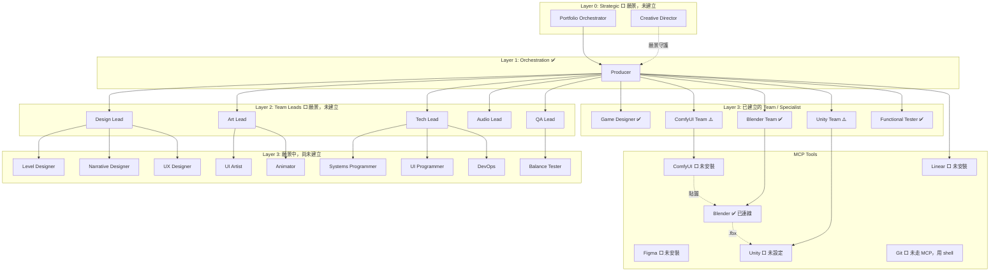

> 圖中「Layer 3：已建立的 Team / Specialist」這 5 個節點（Game Designer、ComfyUI Team、Blender Team、Unity Team、Functional Tester）加上 Producer，共 **6 個**已實際建立為 Agent 檔案；僅 **Blender** 這條 MCP 連線已設定完成。其餘節點（Layer 0、Layer 2、Layer 3 的「願景中」子圖）為完整願景，尚未建立。

### 工具資料流

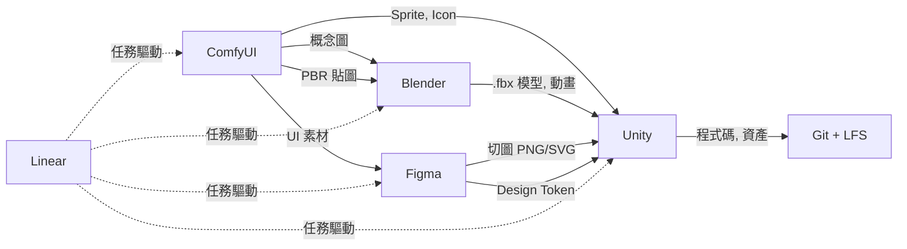

**Linear** — 願景中是整個 Pipeline 的任務驅動中心；**目前尚未安裝**，任務改記錄在本地 `.kiro/state/tasks.yaml`。

**Unity** — 願景中是所有資產的最終組裝站；**目前本專案沒有 Unity 專案資料夾**，`unity-team` 在需要 Unity 專案結構時會主動詢問，不會假設它存在。

### 運作邏輯

| 層級 | 角色 | 做什麼 | 目前狀態 |
|------|------|--------|----------|
| Layer 0 | Creative Director / Portfolio Orchestrator | 定義願景、跨團隊仲裁 | ⬜ 未建立（Solo Dev 不需要） |
| Layer 1 | Producer | 拆任務、串接 Pipeline 三個 Team、追蹤進度、Git commit | ✅ 已建立（分派為手動轉接） |
| Layer 2 | Team Leads | 管理各領域品質，審核產出 | ⬜ 未建立（Solo Dev 不需要） |
| Layer 3 | 執行 Team（comfyui-team / blender-team / unity-team）+ 其他 Specialist | 實際執行工作，呼叫 MCP 工具 | ✅ 6 個已建立 / ⬜ 25+ 個規劃中 |

**關鍵機制（願景 vs 現況）：**
- 願景：Producer 收到需求後，透過 **subagent** 呼叫對應的 Specialist 自動執行
- 現況：Producer 產出 Contract，**由使用者手動**切換到對應 Specialist Agent 貼上執行（因為 subagent 跨 Agent 自動呼叫尚未驗證）
- 每個階段都有 **Review Gate** 品質關卡的設計（願景），Solo Dev 規模下目前簡化為使用者自行確認
- Agent 之間用 **Contract**（YAML 格式，定義於 `.kiro/steering/global/contracts.md`）傳遞需求和規格 —— ✅ 已實作
- 成本控管（token budget）—— ⬜ 目前只在 Agent 對話中提醒，沒有實際自動化監控機制

---

## 快速開始

### 先決條件

| 項目 | 最低需求 | 建議配置 | 本專案目前狀態 |
|------|----------|----------|---------------|
| GPU | GTX 1060 6GB | RTX 3060 12GB+ | 依你本機環境 |
| RAM | 16 GB | 32 GB | — |
| Python | 3.10+ | 3.11 | 需給 `uv` 使用 |
| Unity | 2022.3 LTS | 2023.2+ | ⬜ 尚未建立 Unity 專案 |
| Blender | 3.6+（blender-mcp 建議 5.1+） | 4.0+ / 5.1+ | ✅ 已設定連線 |
| Kiro IDE | 最新版 | 最新版 | ✅ |

### 目前實際配置（Producer + 3 Team + 2 輔助 Agent，共 6 個）

```
.kiro/agents/
├── orchestration/producer.md      # ✅ 拆任務、串接 Pipeline、Git commit
├── design/game-designer.md         # ✅ 寫設計文件、GDD 維護
├── art/comfyui-team.md             # ⚠️ 已建立，需裝 ComfyUI 才能真正產圖
├── art/blender-team.md             # ✅ Blender 建模 + 套貼圖（需 blender-mcp 連線）
├── engineering/unity-team.md       # ⚠️ 已建立，需裝 Unity MCP 才能自動操作 Editor
└── qa/functional-tester.md         # ✅ 跑測試（需測試框架存在）
```

### 安裝與啟動（依現況調整過的步驟）

```bash
# 1. Clone
git clone <your-repo-url>
cd kiro-multi-agent-game-studio

# 2. 安裝 uv（Blender MCP Server 需要）
curl -LsSf https://astral.sh/uv/install.sh | sh
# 或 macOS: brew install uv

# 3. MCP 設定已存在於 .kiro/settings/mcp.json（blender-mcp）
#    若要新增其他工具（ComfyUI / Figma / Linear），照下方「工具鏈與 MCP 整合」章節的範例補上

# 4. 啟動 Blender，安裝並啟用 blender_mcp add-on（見下一節「Blender MCP 整合詳解」）

# 5. 用 Kiro IDE 開啟專案 → Agent Selector 會列出已建立的 6 個 Agent
```

### 使用方式

```
方式 A：直接切換到特定 Team
  → Agent Selector 選 "art/blender-team"
  → 對話：「幫我建一把測試用的短劍，1公尺長」

方式 B：讓 Producer 統籌整條 Pipeline（目前為手動轉接模式）
  → 切到 "orchestration/producer"
  → 「我需要一把發光的劍」
  → Producer 拆解任務，印出 Contract，指示你切換到對應 Agent 貼上執行
```

---

## Blender MCP 整合詳解

> 本節整併自原 `blender/README.md`，是本專案目前**唯一已完成連線**的 MCP 工具說明。

### 概述

Blender MCP 是一個輕量級的 MCP Server，提供自然語言介面與 Blender Python API 互動，讓 Agent 可以探索、理解、修改複雜的場景設定。

架構流程：
```
Kiro ⇐ MCP/stdio ⇒ blender-mcp ⇐ TCP socket ⇒ Blender Add-on
```

> ⚠️ **安全警告**：MCP Server 會在 Blender 中執行 LLM 生成的程式碼，沒有任何防護措施保護你的資料。建議使用虛擬機或不含敏感資料的系統操作。

### 前置需求

- [Blender 5.1](https://www.blender.org/download/) 或更新版本
- [uv](https://docs.astral.sh/uv/) Python 套件管理工具
- [Kiro](https://kiro.dev/) 作為 LLM Client

### 安裝步驟

只需要兩個元件：**Add-on**（裝在 Blender 裡）和 **MCP Server**（由 Kiro 自動管理）。

#### 1. 安裝 uv

```bash
curl -LsSf https://astral.sh/uv/install.sh | sh
```

#### 2. Clone blender_mcp

```bash
git clone https://projects.blender.org/lab/blender_mcp.git
```

#### 3. Blender Add-on 安裝

Add-on 讓 MCP Server 能與正在運行的 Blender 實例溝通。

**方法 A：拖放安裝（推薦）**
- 從 [Release 頁面](https://projects.blender.org/lab/blender_mcp/releases) 下載最新 `.zip`
- 拖放到 Blender 視窗中（需拖放兩次：第一次加入 Blender Lab repository，第二次安裝 add-on）
- 此方法可在新版本可用時收到更新通知

**方法 B：手動安裝**
- 下載 [mcp-1.0.0.zip](https://projects.blender.org/lab/blender_mcp/releases/download/v1.0.0/mcp-1.0.0.zip)
- Blender → Edit → Preferences → Extensions → [Install from Disk](https://docs.blender.org/manual/en/latest/editors/preferences/extensions.html#install)

#### 4. Kiro MCP 設定（stdio 模式）—— 本專案已完成此步

`.kiro/settings/mcp.json`：

```json
{
  "mcpServers": {
    "blender-mcp": {
      "command": "uv",
      "args": ["--directory", "/Users/dayho/Documents/blender_mcp/mcp", "run", "blender-mcp"],
      "disabled": false,
      "autoApprove": []
    }
  }
}
```

Kiro 會自動啟動並管理 blender-mcp process，不需要手動開 terminal。**每次要用 `art/blender-team` 前，記得先開啟 Blender 並確認 add-on 已啟用**，否則連線會失敗（`blender-team.md` 會先自檢連線狀態，連不上會直接回報，不會嘗試繼續建模）。

### 可用 Tools

MCP Server 提供以下工具供 Agent 使用（`art/blender-team` 的工作流程會用到大部分）：

| 工具名稱 | 說明 |
|---------|------|
| `execute_blender_code` | 在連線的 Blender 中執行 Python 程式碼 |
| `get_blendfile_summary_datablocks` | 取得 blend 檔案摘要：data-block 數量、workspace、render engine |
| `get_blendfile_summary_missing_files` | 報告缺失的外部檔案參考 |
| `get_blendfile_summary_of_linked_libraries` | 回傳連結的 library 檔案樹狀結構 |
| `get_blendfile_summary_path_info` | 取得 blend 檔案路徑、儲存狀態等資訊（blender-team 用此工具做連線自檢） |
| `get_blendfile_summary_usage_guess` | 猜測 blend 檔案的主要用途 |
| `get_object_detail_summary` | 回傳指定物件的結構化摘要 |
| `get_objects_summary` | 回傳場景的 collection 階層和物件 |
| `get_python_api_docs` | 取得 Blender Python API 文件 |
| `get_screenshot_of_area_as_image` | 擷取 Blender 單一區域截圖 |
| `get_screenshot_of_window_as_image` | 擷取整個 Blender 視窗截圖 |
| `get_screenshot_of_window_as_json` | 回傳 Blender 視窗佈局的 JSON 描述 |
| `jump_to_tab_by_name` | 切換 workspace tab |
| `jump_to_view3d_object_by_name` | 3D viewport 聚焦到指定物件 |
| `render_thumbnail_to_path` | 渲染低品質縮圖（blender-team 用於產出確認縮圖） |
| `render_viewport_to_path` | 使用目前設定渲染場景 |

### 使用範例

以下為官方文件提供的 prompt 範例，可直接對 `art/blender-team` 或原生對話使用：

```
Analyze the scene and list the outliers: objects with highest polygon count
but smaller size from the camera point of view.
```

```
With the current open Blender file fix the name of all the data-blocks
to remove typos. Report back which data-blocks got fixed.
```

```
With the current open Blender file suggest descriptive names for all
data-blocks, and apply if approved.
```

```
With the current open Blender file explain what the main geometry nodes
setup is doing. Add inline documentation for it with frame elements.
Create a Text data-block with the result of analysis.
```

其他可探索的 prompt：
- 將所有 data-block 從法文翻譯成英文
- Mesh 沒被 armature 變形，如何修復？
- Blender 渲染時記憶體不足，如何優化？
- 找出有不良法線的物件
- 檢查非均勻變換的 mesh 物件
- 設定 compositing nodes 以同時儲存 SDR 和 HDR 圖片
- 匯出的影片無法在瀏覽器播放，該調整哪些設定？

### 參考資料

- [Blender MCP 官方頁面](https://www.blender.org/lab/mcp-server/#llm-client)
- [blender_mcp Releases](https://projects.blender.org/lab/blender_mcp/releases)
- [blender_mcp 原始碼 Repo](https://projects.blender.org/lab/blender_mcp)
- [MCP 協議說明](https://modelcontextprotocol.io/)
- [uv 安裝指南](https://docs.astral.sh/uv/getting-started/installation/)

---

## 團隊角色與職責

> ✅ = 已建立 Agent 檔案　⬜ = 願景中，尚未建立

### Layer 0：Strategic（戰略層）⬜

| Agent | 檔案 | 職責 |
|-------|------|------|
| Creative Director | `orchestration/creative-director.md` | 守護遊戲願景、創意方向最終仲裁、美術風格決定權 |
| Portfolio Orchestrator | `orchestration/portfolio-orchestrator.md` | 多團隊資源仲裁、團隊優先級調整（多專案時才需要） |

### Layer 1：Orchestration（指揮層）

| Agent | 檔案 | 工具 | 職責 | 狀態 |
|-------|------|------|------|------|
| Producer | `orchestration/producer.md` | read, write（願景：+@linear, @git） | 拆解任務、產出 Contract、指引分派、追蹤進度 | ✅ |

> Creative Director 管「做什麼」，Producer 管「怎麼做」。

### Layer 2：Team Leads ⬜

| Lead | 檔案 | 管轄 Specialists | 核心產出 |
|------|------|-----------------|----------|
| Design Lead | `design/design-lead.md` | 6 個設計師 | GDD, 系統規格, 經濟模型 |
| Art Lead | `art/art-lead.md` | 7 個美術師 | 概念圖、模型、貼圖、動畫、UI |
| Tech Lead | `engineering/tech-lead.md` | 4 個工程師 | 可執行遊戲版本 |
| Audio Lead | `audio/audio-lead.md` | 2 個音效師 | 音效、配樂 |
| QA Lead | `qa/qa-lead.md` | 4 個測試員 | Bug 報告、效能報告 |

### Layer 3：Specialist Agents

#### Design Team（6 個規劃，1 個已建立）

| Agent | 工具 | 產出 | 狀態 |
|-------|------|------|------|
| game-designer | read, write | GDD、系統規格、數值平衡表、Asset Spec | ✅ |
| economy-designer | read, write | 經濟模型、商城定價、IAP 設計 | ⬜ |
| combat-designer | read, write | 戰鬥系統、技能設計、敵人 AI | ⬜ |
| level-designer | read, write, @unity | 關卡佈局、觸發器、難度曲線 | ⬜ |
| narrative-designer | read, write | 世界觀、劇情、對話樹（Yarn/Ink） | ⬜ |
| ux-designer | read, write, @figma | Wireframe、操作流程、新手引導 | ⬜ |

#### Art Team（2 個已建立，6 個規劃）

| Agent | 工具 | 產出 | 狀態 |
|-------|------|------|------|
| comfyui-team | read, write（願景：+@comfyui） | 概念圖、PBR 貼圖（目前只能規劃 prompt） | ⚠️ Agent 已建立，需裝 ComfyUI + comfyui-mcp-server 才能真正產圖 |
| blender-team | @blender-mcp, read, write | 3D 模型 + UV、Collider Mesh、套貼圖、匯出 .fbx | ✅ |
| ui-artist | @figma, @comfyui | UI Layout、Design Token、互動狀態規格 | ⬜（需先裝 Figma/ComfyUI MCP） |
| animator | @blender-mcp | 骨骼綁定、動畫片段、Shape Keys | ⬜ |
| vfx-artist | @comfyui | 粒子特效、Shader、序列幀動畫 | ⬜ |
| technical-artist | @blender-mcp, shell | Shader 優化、LOD 策略、Art Pipeline 工具 | ⬜ |

> `concept-artist` / `texture-artist` 這兩個原願景角色已合併進 `comfyui-team`，不再分別建立，因為兩者都依賴同一個尚未安裝的 ComfyUI 工具，拆開建立沒有實際差異。

#### Engineering Team（4 個規劃，1 個已建立）

| Agent | 工具 | 產出 | 狀態 |
|-------|------|------|------|
| unity-team | read, write, shell（願景：+@git） | 遊戲邏輯、狀態機、技能系統 | ✅（需目標專案已存在） |
| systems-programmer | shell, @git | 存檔系統、資源管理、事件系統 | ⬜ |
| ui-programmer | shell, @git | UI 綁定（UI Toolkit）、Localization | ⬜ |
| devops | shell, @git | CI/CD、Build 腳本、部署流程 | ⬜ |

#### Audio Team（2 個規劃，0 個已建立）

| Agent | 工具 | 產出 | 狀態 |
|-------|------|------|------|
| sound-designer | read, write | 音效、Audio Event、空間音效 | ⬜ |
| composer | read, write | 背景音樂、戰鬥音樂、動態音樂 | ⬜ |

#### QA Team（4 個規劃，1 個已建立）

| Agent | 工具 | 產出 | 狀態 |
|-------|------|------|------|
| functional-tester | read, shell | Unit/Integration Test、Bug 報告 | ✅（需目標專案已有測試框架） |
| balance-tester | read, write | 數值模擬、平衡性報告 | ⬜ |
| performance-tester | shell | FPS/Memory 報告、瓶頸分析 | ⬜ |
| usability-tester | read, write | 新手引導評估、卡關點分析 | ⬜ |

---

## Agent 定義格式

每個 Agent 是 `.kiro/agents/` 下的 Markdown 檔案。YAML frontmatter 定義權限，文件本體是 system prompt。

以下是本專案**實際使用**的兩個範例（非虛構樣板）：

> ⚠️ **維護原則**：以下範例過去以「節錄貼上」的方式呈現，但實務上導致範例內容和真實檔案不同步（例如 Team 重構後範例還停留在舊版）。為避免此問題再度發生，這裡改為只列出**檔案路徑 + 核心設計原則摘要**，實際內容請直接開啟檔案查看，不在 README 裡重複貼一份可能過時的複本。

### `.kiro/agents/art/blender-team.md`

核心設計：Agent 沒有背景常駐機制，每次被選中才算「被喚醒」一次。被喚醒後第一步永遠是先判斷情境（打招呼 vs 明確需求 vs Blender MCP 未連線），再決定要不要動手，而不是預設收到訊息就開始建模。啟動時先用 `get_blendfile_summary_path_info` 做連線自檢，連不上就停止並回報。

> 「待命」不是背景常駐機制，而是 Agent 被喚醒時的第一步判斷邏輯。Kiro 的 Custom Agent 沒有 daemon；「平時待命，有需求才動」是寫進 system prompt 的行為規則，不是外部排程實現的。這條原則貫穿本專案所有已建立的 Agent。

### `.kiro/agents/orchestration/producer.md`

核心設計：Producer 不直接畫圖、不直接建模、不直接寫程式碼，只負責拆解需求、建立 Contract、指引使用者交接給正確的 Team，並在流程尾端負責 Git commit（先 `git status` 給使用者確認，再 commit，不自動 push）。因為 subagent 跨 Agent 自動委派尚未驗證，目前的「分派」是產出 Contract 並指示使用者手動切換 Agent，不會假裝已經呼叫了其他 Team 或已完成它們的工作。

> 寧可誠實承認限制，也不讓 Agent 表演出它做不到的能力。這條規則貫穿本專案所有已建立的 Agent（見各 Agent 檔案中的「⚠️ 現況」或「限制」章節）。


---

## 工具鏈與 MCP 整合

### 工具總覽與本專案現況

| 工具 | 用途 | MCP 狀態（願景） | 本專案實際狀態 | 若 MCP 不可用 |
|------|------|----------|---------------|--------------|
| **Blender** | 3D 建模、動畫、渲染 | 🟡 早期 | ✅ **已連線**（`blender-mcp`） | Python Script + CLI |
| **ComfyUI** | 圖像生成（概念圖、貼圖、Sprite、UI Icon） | 🟢 社群可用 | ⬜ 未安裝 | REST API |
| **Figma** | UI/UX 設計、規格匯出、Design Token | 🟢 社群可用 | ⬜ 未安裝 | REST API |
| **Unity** | 遊戲引擎（場景組裝、Build） | 🟡 需自建 | ⬜ 未設定，本專案也還沒有 Unity 專案 | CLI Batch Mode |
| **Git** | 版本控制 | 🟢 穩定 | ⬜ 未透過 MCP，Agent 用 shell 直接操作 | shell CLI |
| **Linear** | 任務追蹤、Sprint 看板 | 🟢 社群可用 | ⬜ 未安裝，改用本地 `.kiro/state/tasks.yaml` | GraphQL API |

### 現有 MCP 配置（`.kiro/settings/mcp.json`，本專案實際內容）

```json
{
  "mcpServers": {
    "blender-mcp": {
      "command": "uv",
      "args": ["--directory", "/Users/dayho/Documents/blender_mcp/mcp", "run", "blender-mcp"],
      "disabled": false,
      "autoApprove": []
    }
  }
}
```

### 若要擴充其他工具（願景中的配置範例，尚未套用）

以下是原始設計願景的 MCP 範例配置，**尚未加入本專案的 `mcp.json`**，需要時再手動補上並填入對應金鑰：

```json
{
  "mcpServers": {
    "comfyui": {
      "command": "uvx",
      "args": ["comfyui-mcp-server@latest"],
      "env": { "COMFYUI_URL": "http://localhost:8188" }
    },
    "figma": {
      "command": "uvx",
      "args": ["figma-mcp-server@latest"],
      "env": { "FIGMA_ACCESS_TOKEN": "${FIGMA_TOKEN}" }
    },
    "git": {
      "command": "uvx",
      "args": ["mcp-server-git@latest"]
    },
    "linear": {
      "command": "uvx",
      "args": ["linear-mcp-server@latest"],
      "env": { "LINEAR_API_KEY": "${LINEAR_API_KEY}" }
    }
  }
}
```

> ⚠️ 新增 MCP Server 前，注意 `LINEAR_API_KEY`、`FIGMA_TOKEN` 等屬於敏感資訊，應使用環境變數而非寫死在 `mcp.json` 裡，並確認 `mcp.json` 或存放金鑰的檔案已被 `.gitignore` 排除，避免意外提交到版本控制。

### 各工具的使用場景（願景設計，供未來擴充參考）

#### ComfyUI（圖像生成）⬜ 未安裝

使用者（規劃）：concept-artist, texture-artist, ui-artist, vfx-artist

```yaml
comfyui_workflows:
  - name: "character_concept"
    params: [prompt, style, pose, background]
    output: 角色概念圖（正面、側面、背面）
  - name: "pbr_texture"
    params: [material_type, color_palette, tiling]
    output: Albedo + Normal + Roughness + AO
  - name: "sprite_sheet"
    params: [character_prompt, action, frame_count]
    output: Sprite Sheet PNG
  - name: "ui_icon_batch"
    params: [icon_descriptions, style, size]
    output: 一批 UI Icon
```

#### Figma（UI/UX 設計）⬜ 未安裝

使用者（規劃）：ux-designer, ui-artist → 產出給 ui-programmer 實作

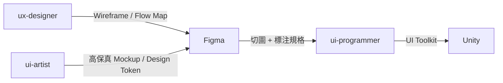

分工：Figma 管結構與精確控制，ComfyUI 管風格化素材生成。
ui-artist 兩者都用：Figma 做 Layout，ComfyUI 生成裝飾元素。

#### Blender（3D）✅ 已連線

使用者：`art/blender-team`（已建立），animator / technical-artist（規劃）

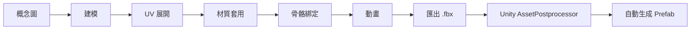

> 目前 `blender-team` 已實作到「建模 → UV 展開 → 匯出 .fbx」這段。骨骼綁定/動畫（animator）與 Unity 自動匯入（AssetPostprocessor）為願景，尚未實作，因為本專案還沒有 Unity 專案。

產出的 `.fbx` 若放入未來的 Unity 專案 `Assets/Models/` 目錄，AssetPostprocessor（願景）應會自動：
- 設定 scale（0.01）、生成 Collider、自動 Rig
- 根據貼圖檔名自動對應材質（`_Albedo`, `_Normal`, `_Roughness`）
- 在指定路徑生成 Prefab，掛上對應的 Component

#### Unity（遊戲引擎）⬜ 未設定

使用者（規劃）：unity-team（已建立，但無 Unity 專案可操作）、ui-programmer, devops, level-designer

```yaml
asset_import:
  method: "File-based (AssetPostprocessor)"
  auto_settings:
    model: { scale: 0.01, generate_collider: true, rig_type: "auto" }
    texture: { max_size: "platform_dependent", compression: "auto" }
    audio: { load_type: "streaming_for_bgm, decompress_for_sfx" }

code_standard:
  namespace: "GameForge.{Module}"
  naming: "PascalCase public, _camelCase private"
  pattern: "Composition over Inheritance, ScriptableObject data-driven"

build:
  test: "Unity -batchmode -runTests -testResults results.xml"
  build: "Unity -batchmode -executeMethod BuildScript.Build"
```

> `unity-team.md` 已將上述 `code_standard` 寫入其職責章節，會在還沒有 Unity 專案時主動詢問，而不是憑空生成程式碼假裝有專案存在。

#### 工具之間的資料流（完整願景）

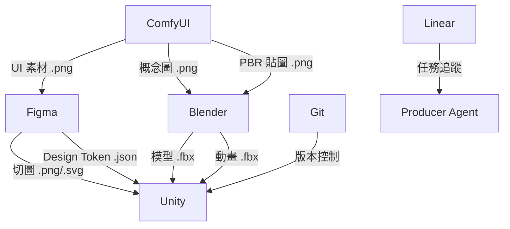

---

## 開發流程

本框架有兩個層級的流程，不要搞混：

1. **遊戲生命週期**（整個專案的大階段）
2. **功能開發流程**（單一功能從設計到交付的步驟）

### 遊戲生命週期（專案級，願景）

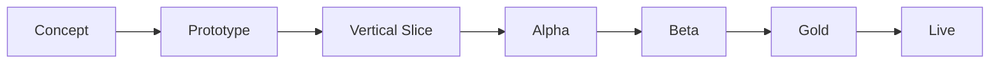

| 里程碑 | 目標 | 哪些 Agent 活躍（願景） | 原則 |
|--------|------|----------------|------|
| **Concept** | 確認遊戲方向 | creative-director, game-designer, narrative-designer | 方向確認 |
| **Prototype** | 驗證核心玩法是否好玩 | game-designer, unity-team | 速度優先，品質不重要 |
| **Vertical Slice** | 一小段最終品質體驗 | 全員 | 品質代表最終水準 |
| **Alpha** | 所有核心功能完成 | 全員 | 功能完整性優先 |
| **Beta** | 所有內容完成，除錯 | qa-lead, programmer, art-lead | 穩定性優先，凍結功能 |
| **Gold** | 可出貨版本 | qa-lead, devops | 通過審核 |
| **Live** | 上線營運 | producer, devops, balance-tester | 數據驅動迭代 |

> 本專案目前處於 **Concept 之前的「工具鏈搭建」階段**：先確認 Agent + Steering + MCP 三層架構能否運作，還沒有正式進入任何一款遊戲的 Concept 階段。

### 功能開發流程（單一功能級，願景）

每個功能（一把劍、一個戰鬥系統、一個 UI 面板）都走這個流程：

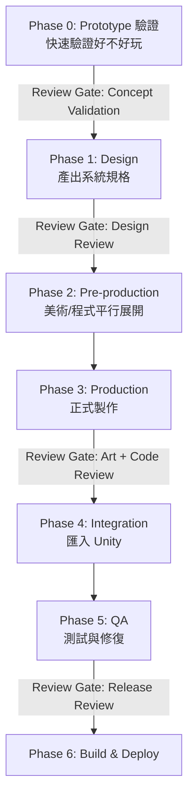

| Phase | 做什麼 | 誰做（願景） | 本專案現況 |
|-------|--------|------|-----------|
| 0: Prototype | 用最低成本驗證功能是否值得做 | unity-team（placeholder art） | 可用（若已有目標專案） |
| 1: Design | 產出系統規格、Wireframe、對話腳本 | game-designer, ux-designer, narrative-designer | 僅 game-designer 可用 |
| 2: Pre-production | 概念圖、UI Layout、核心邏輯（平行） | concept-artist, ui-artist, programmer | 僅程式部分可用（無概念圖能力） |
| 3: Production | PBR 貼圖、3D 模型、動畫、完整 C# | texture-artist, blender-team, animator, programmer | 3D 模型 + 程式可用，貼圖/動畫不可用 |
| 4: Integration | 匯入 Unity、生成 Prefab、組裝場景 | devops / unity import | ⬜ 未設定 Unity 專案 |
| 5: QA | 功能/數值/效能測試、修 Bug（max 3 次） | functional-tester, balance-tester, performance-tester | 僅 functional-tester 可用 |
| 6: Build | 打包目標平台、CI/CD | devops | ⬜ 未建立 |

### 兩個流程的關係

```
遊戲生命週期：  Concept ──── Prototype ──── Vertical Slice ──── Alpha ─── Beta ─── Gold
                                  │              │                  │
功能開發流程：              功能 A 走 Phase 0-6    功能 B 走 Phase 0-6   功能 C 修 Bug
```

> 生命週期是「整個專案在哪個大階段」，功能開發流程是「單一功能怎麼從 0 做到完」。
> 一個里程碑內會有多個功能同時各自走自己的 Phase。

---

## Agent 間通訊協定

Agent 之間不是隨意對話，而是透過標準化的 **Contract** 傳遞需求和交付物。這套機制已實作於 `.kiro/steering/global/contracts.md`（`inclusion: always`，所有 Agent 對話都會自動載入）。

### Asset Contract（美術/音效資產用）—— ✅ 已實作，`blender-team` 會讀取此格式

```yaml
asset_request:
  id: "vt_001.weapon_sword_01"
  team_id: "vt_001"
  type: "3d_model"          # 3d_model | texture | sprite | audio | prefab
  spec:
    poly_budget: 5000
    texture_size: 1024
    style: "stylized_fantasy"
    reference_images: ["ref_sword_01.png"]
  unity_import:
    scale: 0.01
    generate_collider: true
    prefab_path: "Assets/Prefabs/Weapons/"
  metadata:
    priority: "high"
    assigned_to: "art/blender-team"
    depends_on: ["concept_art_sword_01"]
    deadline: "sprint_3"
  cost_budget:
    max_comfyui_generations: 10
    max_blender_operations: 20
```

### Task Contract（程式/設計任務用）—— ✅ 已實作，`unity-team` / `functional-tester` 會讀取此格式

```yaml
task:
  id: "TASK-042"
  title: "實作戰鬥傷害計算"
  assigned_to: "engineering/unity-team"
  input:
    - design_spec: "docs/combat_system_spec.yaml"
    - dependencies: ["health_system", "buff_system"]
  output:
    - code: "Assets/Scripts/Combat/DamageCalculator.cs"
    - tests: "Assets/Tests/Combat/DamageCalculatorTests.cs"
  acceptance_criteria:
    - "傷害公式符合 design_spec"
    - "所有 Unit Test 通過"
    - "處理 edge case（0 防禦、無敵狀態）"
  review_gate: "code_review"
  cost_budget:
    max_llm_tokens: 100000
```

### Contract 的流動方式

**願景**：
```
User → Producer（建立 Contract）→ Specialist（執行）→ Lead（Review）→ Producer（確認交付）
```

**本專案現況**（因 subagent 跨 Agent 自動呼叫尚未驗證）：
```
User → Producer（建立 Contract，印出內容）→ 使用者手動切換 Agent → Specialist（執行）→ 使用者確認交付
```

---

## 治理機制

> 本章節全部為**願景設計**。Solo Dev 規模（目前配置）下，README 原文建議治理機制為「✗ 不啟用」，因此以下機制目前均未實作，僅供未來擴充到 Small Team / Studio 規模時參考。

### Review Gate（品質關卡）⬜

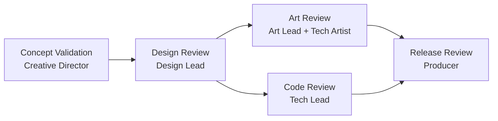

| Gate | 誰審 | 看什麼 |
|------|------|--------|
| Concept Validation | Creative Director | 符合願景嗎？核心循環有趣嗎？ |
| Design Review | Design Lead | 系統有矛盾嗎？數值合理嗎？ |
| Art Review | Art Lead + Technical Artist | 風格一致？面數/貼圖合規？效能OK？ |
| Code Review | Tech Lead | 命名規範？效能？測試覆蓋？ |
| Release Review | Producer | 無 Critical Bug？效能達標？ |

### 衝突升級 ⬜

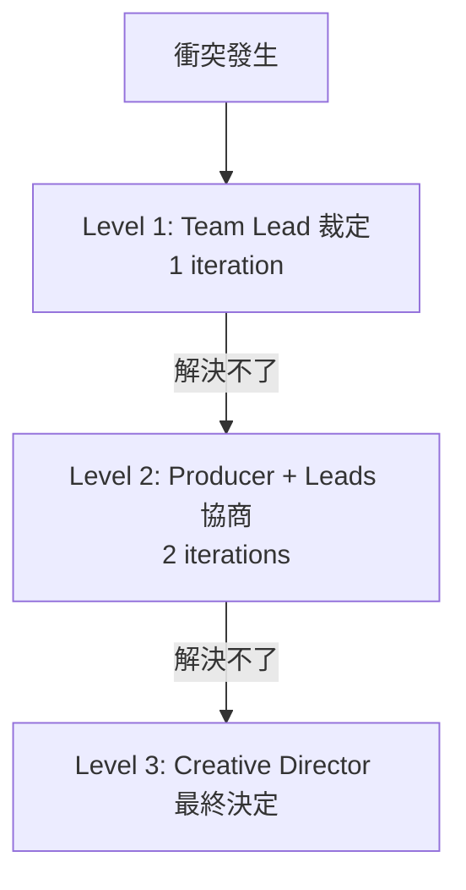

常見衝突：美術效果超出效能預算 → Technical Artist 評估優化方案 → 若無法優化 → Producer 裁決。

### 成本控管 ⚠️ 僅有文字提醒，無實際監控

```yaml
budget:
  per_sprint:
    design: 15%
    art_generation: 35%     # ComfyUI 最耗資源
    programming: 25%
    qa: 15%
    other: 10%
  alerts:
    warning: 80%
    hard_stop: 100%
  overrun_action: "暫停 → Producer 決定追加/降級/人工接手"
```

> `producer.md` 目前只會在對話中「提醒」這個預算分配比例，沒有任何 token 用量的自動追蹤或強制暫停機制。

### 自動化等級（願景）

| Level | 描述 | 適用 |
|-------|------|------|
| 0 | Agent 建議 → 人工執行 | 平台審核提交 |
| 1 | Agent 執行 → 人工 Review | 3D 建模、程式碼、數值平衡 |
| 2 | Agent 執行 → 自動 Review → 人看例外 | 概念圖生成、Build |
| 3 | 全自動 | Unit Test、Icon 批量生成 |

> 本專案目前所有已建立的 Agent 實際運作在 **Level 1**：Agent 執行，人工（你）Review 每一步輸出，因為連「Producer 自動分派」都還沒驗證，Level 2/3 的全自動情境更未觸及。

### 版本控制

```yaml
version_control:
  tool: "Git + Git LFS"
  lfs_tracked: ["*.fbx", "*.glb", "*.png", "*.psd", "*.wav", "*.mp3"]
  branching:
    main: "可出貨版本"
    develop: "開發整合"
    feature/*: "功能開發"
    art/*: "美術資產"
  commit_format: "[team][type] description"
```

> ⬜ 本專案目前沒有設定 Git LFS，且尚未產出任何 `.fbx` 等二進位資產。若之後開始大量產出 3D 模型/貼圖，建議在提交前先設定 LFS，避免 repo 體積暴增。

---

## 端到端 Demo：從參考圖到第三人稱射擊遊戲

這是本專案設計時的核心情境（對應使用者的原始需求）：「參考這張圖，做一個第三人稱射擊遊戲，Blender Team 建模、套用 ComfyUI Team 的貼圖、交給 Unity Team 做出會動的遊戲、最後 commit」。

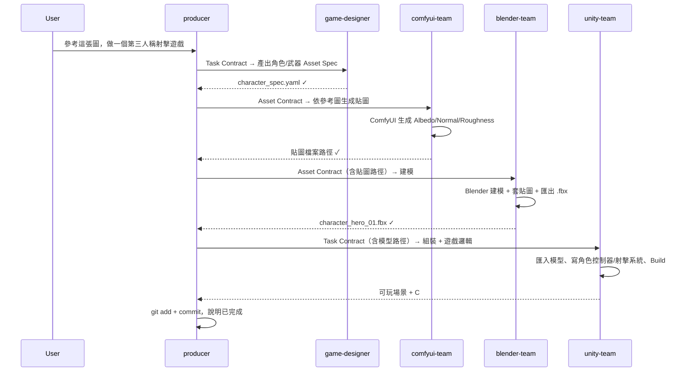

**本專案目前能實測到哪一步（誠實對照）：**

| Step | 願景動作 | 本專案現況 |
|------|---------|-----------|
| 1 | Producer 收到需求（含參考圖） | ✅ 可測試 |
| 2 | Producer → game-designer 出規格 | ✅ 可測試（手動切換 Agent） |
| 3 | Producer → comfyui-team 依參考圖生貼圖 | ❌ **不可測試**，`comfyui-team` 已建立但沒有 ComfyUI MCP，只能規劃 prompt |
| 4 | Producer → blender-team 建模 + 套貼圖 | ⚠️ 可測試，但因為 Step 3 卡住，實際只能做 **untextured** 模型 |
| 5 | Producer → unity-team 組裝場景 + 寫遊戲邏輯 | ⚠️ 可測試「寫 C# 腳本」這部分，但**不能自動組裝場景**（沒有 Unity MCP），你需要手動把 .fbx 和腳本拖進 Unity Editor |
| 6 | Producer 執行 git commit | ✅ 可測試（commit 的內容會是模型檔 + C# 腳本，不是「完整可玩遊戲」） |

**現在就能走的實際流程（誠實版）：**
1. 附上參考圖，跟 `orchestration/producer` 說需求
2. Producer 會告知 Step 3（貼圖生成）目前卡住，問你要「先做無貼圖模型」還是「先去裝 ComfyUI」
3. 若選擇繼續，Producer 產出 Contract，你手動切到 `art/blender-team` 建出 untextured 模型
4. 若已有 Unity 專案，切到 `engineering/unity-team` 寫角色控制器等 C# 腳本；沒有 Unity 專案的話它會先問你
5. 回到 `orchestration/producer`，它會列出目前變更，確認後執行 git commit

---

## 漸進式擴展指南

| 規模 | Agent 數 | 需要工具 | 月成本 | 啟用治理機制 | 本專案現況 |
|------|---------|----------|--------|-------------|-----------|
| **Solo Dev**（1 人） | 6 | ComfyUI, Unity, Git | $50-150 | ✗ | ✅ **目前配置**（僅 ComfyUI/Unity/Git 未裝，Blender 已裝） |
| **Small Team**（2-4 人） | 12-15 | + Blender, Figma, Linear | $200-500 | 基本 Review Gate | ⬜ 規劃中 |
| **Studio**（5-10 人） | 25-30+ | 全套 + 雲端 GPU | $500-2000 | 完整治理 + 可選多團隊 | ⬜ 規劃中 |

### Solo Dev 啟用清單（✅ 已完成，共 6 個）

```
orchestration/producer, design/game-designer,
art/comfyui-team, art/blender-team,
engineering/unity-team, qa/functional-tester
```

> 注意：與原願景清單相比，本專案多加了 `art/comfyui-team`（雖然 ComfyUI 尚未安裝，但 Agent 定義已就位，方便工具裝好後立即可用），並用 `art/blender-team`、`engineering/unity-team` 取代了原願景中拆得更細的 `concept-artist`/`texture-artist`/`gameplay-programmer` 等角色，因為現有可用工具鏈決定了優先建哪個 Agent 才「真的能跑」。

### Small Team 追加（⬜ 下一步可考慮的方向）

```
+ art/art-lead, art/concept-artist, art/animator, art/ui-artist,
  engineering/systems-programmer, engineering/devops, qa/balance-tester
```

前提：需先安裝 ComfyUI（+ comfyui-mcp-server）、Figma MCP、Linear MCP。

### Studio 追加（⬜ 遠期）

```
+ orchestration/creative-director, 所有 Team Leads,
  design/economy-designer, design/combat-designer, design/narrative-designer,
  art/technical-artist, qa/performance-tester
```

---

## 成本估算

### 單一 Indie 遊戲（從 Concept 到 Gold，約 26 週，願景估算）

| 階段 | LLM Tokens | ComfyUI 次數 | 預估成本 |
|------|-----------|-------------|----------|
| Concept (2w) | 2M | 50 | $30-50 |
| Prototype (4w) | 5M | 100 | $80-120 |
| Vertical Slice (6w) | 10M | 300 | $200-400 |
| Alpha (8w) | 15M | 500 | $300-600 |
| Beta (4w) | 5M | 50 | $80-150 |
| Gold (2w) | 2M | 10 | $30-50 |
| **合計** | **~39M** | **~1010** | **$720-1370** |

> 使用本地 LLM + 本地 ComfyUI（SDXL）可降至 $100-300（僅電費）。**本專案目前尚未產出任何實際資產，以上為原始估算，未經本專案實測驗證。**

### 省錢策略

- 本地 LLM 跑 Level 3 任務（Unit Test、Icon 批量）→ 省 50-70%
- ComfyUI 本地 SDXL（需 12GB VRAM）→ 圖像生成成本趨近 0
- 只在 Code Review / Design Review 用高級模型 → 省 30-40%
- Prototype 階段嚴格篩選，早期砍掉不好玩的設計

---

## 多 V-Team 隔離與資源分配

> 💡 此章節適用於同時做多個遊戲專案的工作室。Solo dev（本專案目前狀態）跳過此節。⬜ 全部為願景，尚未實作。

### 架構

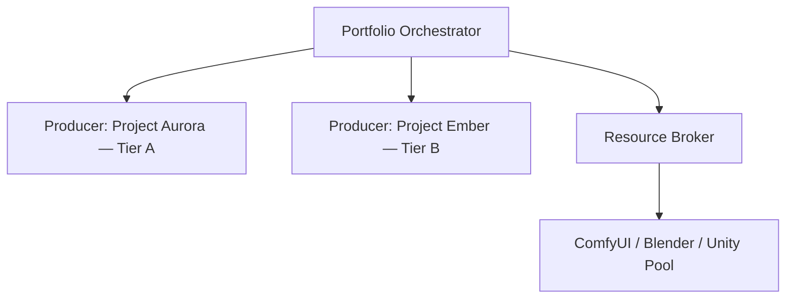

### 核心機制

| 機制 | 說明 |
|------|------|
| **命名空間隔離** | 所有資產前綴 `team_id`（如 `vt_001.weapon_sword_01`）—— ✅ 已在 `asset-standards.md` 中定義並被 `blender-team` 遵循 |
| **Resource Broker** | 共享 GPU 排隊分配，priority_weighted_fifo，防飢餓 —— ⬜ 未實作 |
| **資源配額** | Tier A: 500次/日 ComfyUI, 5M tokens；Tier B: 200次, 2M —— ⬜ 未實作 |
| **跨團隊借用** | Tier 1 免審批（reusable + 只讀）/ Tier 2 需審批（fork）/ Tier 3 禁止 —— ⬜ 未實作 |

### Steering 三層結構（本專案已建立第一層）

```
.kiro/steering/
├── global/         # ✅ 已建立：asset-standards.md, contracts.md
├── teams/vt_001/    # ✅ 已建立骨架：gdd.md, style-guide.md（內容待填）
└── teams/vt_002/    # ⬜ 未建立（單專案不需要）
```

---

## 錯誤處理與退化策略

### MCP 故障

| 工具掛了 | Retry（願景） | Fallback（願景） | 本專案現況 |
|---------|-------|----------|-----------|
| ComfyUI | 3 次（exponential backoff） | 通知用戶手動操作 WebUI | ⬜ 未安裝，無法測試 |
| Blender | 2 次 | 匯出 Python Script，用戶手動執行 | ⚠️ `blender-team.md` 目前做法更簡單：連線失敗直接回報並停止，不會自動重試或匯出腳本 |
| Unity MCP | 1 次 | 產出 .cs，用戶在 Editor 操作 | ⬜ 未設定 |
| Linear | 2 次 | 記錄到本地 tasks.yaml | ✅ 已直接採用 fallback 方案作為主要方式（因為本來就沒裝 Linear） |

### 品質不達標

```
max_iterations: 3

概念圖被退：調 prompt → 加 negative → 換 seed/模型 → 3 次後升級 Art Lead 人工介入
程式被退：根據意見修改 → 重跑 Test → 3 次後標記 needs_human_review
```

> `blender-team.md` 和 `functional-tester.md` 都已寫入「max_iterations: 3」的限制，超過會停止並回報使用者，而非無限重試。

### 成本超支

```
80% → 警告 + 切換便宜模型
100% → 暫停 → Producer 決定：追加預算 / 降低品質要求 / 人工接手
```

> ⬜ 本專案目前無自動化成本追蹤，此策略僅為文字提醒，實際判斷依賴使用者自行留意 token 用量。

---

## 設計依據

本框架的團隊分工參考了遊戲產業通用的六大學科分類（Design、Art、Engineering、Audio、QA、Production），並結合 Agile/Scrum 的迭代開發方法。AI Agent 特有的機制（token budget、MCP 整合、Resource Broker 等）為原創設計，本專案的「誠實聲明」慣例（明確標註哪些是願景、哪些是實際可用）則是在實作過程中因應 Kiro Custom Agent 的實際限制而額外加入的原則，不屬於下列參考文獻範疇。

### 參考文獻

| # | 文獻 | 作者 | 出版 | ISBN |
|---|------|------|------|------|
| 1 | *The Game Production Handbook*, 3rd Edition | Heather Maxwell Chandler | Jones & Bartlett Learning, 2014 | 978-1-4496-8809-7 |
| 2 | *Agile Game Development: Build, Play, Repeat*, 2nd Edition | Clinton Keith | Addison-Wesley (Pearson), 2020 | 978-0-1365-2781-7 |
| 3 | IGDA Curriculum Framework (2008) | IGDA Education SIG | IGDA | — |

### 連結

- Chandler：[O'Reilly](https://www.oreilly.com/library/view/the-game-production/9781449688097/) ｜ [AbeBooks](https://www.abebooks.com/9781449688097/Game-Production-Handbook-Chandler-Heather-1449688098/plp)
- Keith：[Pearson](https://www.pearson.com/store/p/agile-game-development-build-play-repeat/P100002783425/9780136527817) ｜ [O'Reilly](https://www.oreilly.com/library/view/agile-game-development/9780136204831)
- IGDA Curriculum Framework：[Google Drive（IGDA 官方）](https://drive.google.com/file/d/1s9cMaSIjeD2ERhjfCMsh9f1-qs-GJx_A/view) ｜ [IGDA Education SIG](https://igda.org/sigs/game-education/)
- IGDA Game Industry Standards：[igda.org](https://igda.org/resources/game-industry-standards/)
- Blender MCP：[官方頁面](https://www.blender.org/lab/mcp-server/#llm-client) ｜ [原始碼](https://projects.blender.org/lab/blender_mcp)
- Model Context Protocol：[modelcontextprotocol.io](https://modelcontextprotocol.io/)

---

## 共享知識庫

所有 Agent 透過 `.kiro/steering/` 共享以下資料：

| 文件 | 用途 | 維護者（願景） | 本專案現況 |
|------|------|--------|-----------|
| `.kiro/steering/global/asset-standards.md` | 命名規範、3D 模型技術規範（poly budget 等） | art-lead | ✅ 已建立，內容完整 |
| `.kiro/steering/global/contracts.md` | Task Contract / Asset Contract 格式 + 現階段限制聲明 | producer | ✅ 已建立，內容完整 |
| `.kiro/steering/teams/vt_001/gdd.md` | 遊戲設計的單一真相來源 | game-designer | ⚠️ 已建立骨架，章節內容待填寫 |
| `.kiro/steering/teams/vt_001/style-guide.md` | 美術風格指南 | art-lead | ⚠️ 已建立骨架，章節內容待填寫 |
| Technical Spec | 技術規範（平台、效能預算） | tech-lead | ⬜ 未建立 |
| Asset Registry | 已有資產清單 + 鎖定狀態 | producer | ⬜ 未建立（目前尚無任何實際資產產出） |
| World Bible | 世界觀、角色設定 | narrative-designer | ⬜ 未建立 |
| Code Architecture | 程式架構、模組關係圖 | tech-lead | ⬜ 未建立（本專案還沒有 Unity 專案） |
| Cost Dashboard | 即時成本追蹤 | producer | ⬜ 未建立（無自動化追蹤機制） |
| `.kiro/state/tasks.yaml` | Linear 未安裝前的本地任務記錄 fallback | producer | ✅ 已建立，目前為空清單 |

---

## 專案檔案結構（本專案實際結構）

```
kiro-multi-agent-game-studio/
├── .kiro/
│   ├── agents/
│   │   ├── orchestration/
│   │   │   └── producer.md                    # ✅ 拆任務、串接 Pipeline、Git commit
│   │   ├── design/
│   │   │   └── game-designer.md                # ✅
│   │   ├── art/
│   │   │   ├── comfyui-team.md                 # ⚠️ 需裝 ComfyUI 才能真正產圖
│   │   │   └── blender-team.md                 # ✅
│   │   ├── engineering/
│   │   │   └── unity-team.md                   # ⚠️ 需裝 Unity MCP 才能自動操作 Editor
│   │   └── qa/
│   │       └── functional-tester.md            # ✅
│   ├── steering/
│   │   ├── global/
│   │   │   ├── asset-standards.md              # ✅ inclusion: always
│   │   │   └── contracts.md                    # ✅ inclusion: always
│   │   └── teams/
│   │       └── vt_001/
│   │           ├── gdd.md                      # ⚠️ 骨架
│   │           └── style-guide.md               # ⚠️ 骨架
│   ├── state/
│   │   └── tasks.yaml                          # ✅ Linear fallback，目前為空
│   └── settings/
│       └── mcp.json                            # ✅ 僅 blender-mcp
├── blender/
│   └── README.md                               # 已合併進本檔案「Blender MCP 整合詳解」章節
└── README.md                                   # 本文件
```

願景中的完整結構（尚未擴充部分）另包含 `workflows/`（ComfyUI Workflow Templates）、`audio/`、`qa/` 下更多 Agent 分類、以及多團隊的 `teams/vt_002/` 等，待實際需求出現再建立。

---

## 下一步 Roadmap

依目前進度，建議的擴充順序（非強制，依你的實際需求調整）：

1. **✅ 已完成**：Blender MCP 連線、Producer + 3 Team 架構（comfyui-team / blender-team / unity-team）、Contract 機制、Steering 骨架、Git commit 收尾流程
2. **安裝 ComfyUI + comfyui-mcp-server**：解鎖 `art/comfyui-team`，補上「參考圖 → 貼圖」這段，這是目前 Pipeline 第一個卡住的環節
3. **建立或取得 Unity 專案 + 安裝 Unity MCP**（例如 unity-mcp / kiro-unity-accelerator）：解鎖 `engineering/unity-team` 的場景組裝與 Build 能力，這是第二個卡住的環節
4. **驗證 subagent 委派**：測試 Kiro 是否支援 `producer` 自動呼叫其他 Agent，若支援則簡化 `producer.md` 移除「手動轉接」章節
5. **填寫 GDD / Style Guide 實際內容**：目前兩份文件都是空骨架，需要先決定遊戲類型、平台、美術風格才能讓後續 Team 產出一致
6. **視需要安裝 Linear MCP**：目前本地 `tasks.yaml` 對 Solo Dev 已足夠，多人協作時才需要
7. **視需要擴充更多 Specialist**：例如 animator、technical-artist 等，待核心 Pipeline 跑順後再加
8. **依 Small Team 清單擴充**：art-lead、更多 art specialist、systems-programmer、devops 等

---

## 待確認事項

使用本框架前，建議先決定：

- [ ] 遊戲類型（2D / 3D / 混合）
- [ ] 目標平台（PC / Mobile / Console / WebGL）
- [ ] 音訊需求（是否整合 AI 音樂生成）
- [ ] 多人連線需求
- [ ] Monetization 模型（買斷 / F2P+IAP / 訂閱）
- [ ] 團隊規模 → 決定啟用哪些 Agent
- [ ] 是否需要 LiveOps
- [ ] LLM 偏好（雲端 API / 本地模型 / 混合）
- [ ] 是否已有 Unity 專案，或需要從零建立
- [ ] 是否要驗證 Kiro subagent 跨 Agent 自動委派能力（影響 Producer 的設計走向）

---

## License

MIT
