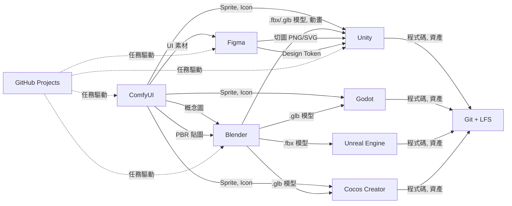

# Kiro Multi-Agent Game Studio

用 AI Agent 模擬一支遊戲開發團隊。**你對 Producer 說一句「用某引擎做某類型遊戲」，它會偵測引擎與類型、拆解任務，自動委派對應的 Specialist Agent，協作完成從設計到引擎實作的各環節**（實際涵蓋範圍依需求而定）——不綁定單一引擎、也不綁定單一類型。

一句話需求的例子：

- 「用 **Unity** 做一款 2D 平台動作遊戲」
- 「用 **Godot** 做一款 roguelike」
- 「用 **Unreal** 做一款 ARPG」
- 「用 **Cocos** 做一款老虎機」

Producer 接手後串起的環節：**設計規格 → 貼圖生成 → 3D 建模 → 引擎場景組裝與程式邏輯 → 測試**。

### 支援 4 大引擎 × 13 種遊戲類型

**引擎**：Unity ｜ Godot ｜ Unreal ｜ Cocos Creator（美術與設計階段引擎無關、可共用）。

**遊戲類型**（每種都有專屬 Domain Expert）：

`老虎機`・`魚機`・`射擊 FPS/TPS`・`多人 / MMORPG`・`RPG / ARPG`・`卡牌`・`三消 / 解謎`・`平台 / metroidvania`・`roguelike`・`策略 / RTS / 塔防`・`模擬經營 / 生存`・`音樂節奏`・`敘事 / 視覺小說`

> 其餘類型（競速、格鬥、體育、walking sim…）走通用 `game-designer`。完整對照見下方「目前專案實際狀態」或 [docs/agents-and-roles.md](docs/agents-and-roles.md)。

**適用場景**：可作為 PM 向團隊或投資人提案的架構藍圖，也適合個人開發者 / 小型獨立工作室（1–10 人）直接拿來用。

### 這個專案能幫你做什麼

- **從一句需求到可執行遊戲**：描述「用 X 引擎做一款 Y 類型遊戲」，Producer 拆成任務、串接各 Specialist，做到引擎內的可執行版本。
- **從參考圖到遊戲資產**：丟一張參考圖，ComfyUI Team 生成概念圖/貼圖/UI 切圖，Blender Team 建模並套貼圖，交給引擎 Team 匯入。
- **拿到該遊戲類型的專業設計**：13 種類型各有專屬顧問，產出數學模型/數值/系統規格，再由 `balance-tester` 用模擬驗證。
- **四大引擎任選**：Unity / Godot / Unreal / Cocos Creator，Producer 依你指定的引擎分派；美術與設計階段引擎無關、可共用。
- **涵蓋到上線前的各環節**：UI/UX（Figma）、音效、動畫、多語系、變現數值、CI 出包、分級與合規送審，都有對應的 Agent（分級送審等仍需人工把關）。

> 📌 本文件同時涵蓋「已建立的功能」與「規劃中的擴充」，章節內用 ✅ / ⬜ 標註；想直接動手看「快速開始」。

---

## 從這裡開始

**你對 Producer 說「用 X 引擎做一款 Y 類型遊戲」，它會自動調度一整組 AI Agent 幫你把遊戲做出來。**

三步上手：

1. **開專案**：用 Kiro IDE 開啟本資料夾，第一次會問「是否信任」，選信任（agent 才會載入）。
2. **選 Agent**：在 chat 輸入框的 **Agent Selector** 選 `producer`（或打 `/producer`）。
3. **下需求**：例如「請幫我用 Godot 開發一款老虎機」。Producer 會偵測引擎與類型、列出計畫，再自動委派各專家執行。

只想先看它怎麼運作、不裝任何引擎也行——先讀下面的「快速摘要」與「架構總覽」。想實際接 Blender / ComfyUI / 引擎，再看下方「深入文件（Reference）」。

> 遇到不熟悉的術語，可參考下一節的術語對照表。

## 術語對照表

| 縮寫 / 術語 | 說明 |
|---|---|
| **Agent** | 一個有特定職責的 AI 角色（一個 `.md` 檔），例如 `producer`、`blender-team`。 |
| **Producer** | 總調度：拆你的需求、分派工作給其他 Agent、最後 commit。你主要跟它對話。 |
| **subagent 委派** | 一個 Agent 自動叫另一個 Agent 幫忙（語法 `Use the "<name>" subagent to …`）。 |
| **MCP** | Model Context Protocol，讓 Agent 能操作外部工具（Blender / Unity / Figma…）的橋接協定。 |
| **GDD** | Game Design Document，遊戲設計文件；「遊戲怎麼設計」的單一真相來源。 |
| **Contract** | Agent 之間傳遞任務 / 資產需求的標準格式（YAML），詳見深入文件。 |
| **RTP / RNG** | 老虎機用語：RTP = 玩家長期返還率；RNG = 亂數產生器。 |
| **netcode** | 多人連線的網路同步程式。 |
| **LFS** | Git Large File Storage，讓大型二進位資產（模型 / 貼圖）不撐爆 repo。 |

## 目前專案實際狀態


這是本專案「現在打開 Kiro 就能用」的內容，不是願景，是已經寫進 `.kiro/` 的實際檔案。

### 核心設計：Producer 偵測「引擎 + 遊戲類型」，串接美術/設計 Team → 對應引擎 Team

Producer 是唯一的調度中樞——你只跟它說需求，它偵測引擎與遊戲類型，依需求動態組出**一條「需求 → 遊戲」的 Pipeline**，把每一站的產出交給下一站：

```
使用者需求（可含參考圖、指定引擎、指定遊戲類型）
  → Producer 拆解，偵測引擎（Unity/Godot/Unreal/Cocos Creator）與遊戲類型
  → design/{類型}-expert 或 game-designer  （系統規格/數值：依類型路由，見「支援的遊戲類型」）
  → design/ui-ux-team              （UI/介面需求時：Figma 版面/流程/Design Token + 切圖規格，若需要）
  → art/comfyui-team               （依參考圖生成貼圖 / UI 切圖素材）
  → art/blender-team               （建模 + 套用貼圖，2D 遊戲可跳過）
  → engineering/{engine}-team      （依偵測到的引擎分派：unity-team / godot-team / unreal-team / cocos-team）
  → Producer 確認完成 → git commit
```

不是每個需求都要走完全部——只要一張貼圖就走到美術階段、只改程式邏輯就直接進引擎階段。Producer 會先把計畫列給你確認，再依序執行。

### 支援的遊戲類型

Producer 偵測遊戲類型後，把設計端**分門別類**路由到對應的 Domain Expert；沒有專屬 expert 的類型才走通用 `game-designer`。

**有專屬 Domain Expert 的類型**（都在 `design/`，各自切分清楚）：

| 類型 | 專屬 Domain Expert | 專屬重點 |
|------|-------------------|---------|
| 老虎機 / casino | `slot-game-expert` | 捲軸數學 / Paytable / RTP / RNG / 認證合規 |
| 魚機 / 捕魚 | `fish-game-expert` | 命中機率 / 賠付經濟 / RTP / 伺服器判定 / 合規 |
| 射擊 FPS/TPS | `shooter-expert` | 武器數值 / 彈道 / 命中判定 / 手感 / 敵人 AI |
| 多人 / MMORPG | `mmo-expert` | netcode / 伺服器權威 / 同步 / 持久化 / 防作弊（⚠️ 全 MMO 對 solo dev 極重，務實先做小規模 co-op/競技） |
| RPG / ARPG | `rpg-systems-expert` | 屬性 / 等級曲線 / 技能樹 / 掉落 / 傷害公式 |
| 卡牌 / Deckbuilder / TCG | `card-game-expert` | 卡牌數值 / 資源曲線 / combo / 平衡 |
| 三消 / 解謎 / merge | `puzzle-match3-expert` | board 可解性 / 難度曲線 / 步數經濟 |
| 平台 / metroidvania | `platformer-expert` | 跳躍手感（coyote/jump buffer）/ 關卡節奏 / 能力 gating |
| Roguelike / roguelite | `roguelike-expert` | 程序生成 / build synergy / 風險報酬 / meta 進度 |
| 策略 / RTS / 4X / 塔防 | `strategy-expert` | 兵種相剋 / 資源經濟 / AI 對手 / 波次曲線 |
| 模擬經營 / 生存 / 沙盒 | `simulation-expert` | 生產鏈 / 供需經濟收斂 / 生存需求 / 自動化 |
| 音樂 / 節奏 | `rhythm-expert` | 譜面 / 判定窗 / 延遲校正（綁 `audio-team`） |
| 敘事 / 視覺小說 / 冒險 | `narrative-adventure-expert` | 分支敘事 / 旗標 / 對話樹（綁 `localization-team`） |

**走通用 `game-designer` 的類型**（不需專屬 expert，必要時拉 `economy-designer` 出數值、`balance-tester` 驗平衡、`audio-team` 出聲音）：
競速、格鬥（rollback netcode 併 `mmo-expert`）、體育、派對、walking sim、idle/clicker…

> **類型會疊加**，Producer 負責串接多個 expert。例：「多人射擊 RPG」= `mmo-expert` + `shooter-expert` + `rpg-systems-expert`；「付費開包卡牌」= `card-game-expert` + `economy-designer` + `compliance-release`。所有數值一律交 `balance-tester` 模擬驗證。

### 已建立的 Agent（37 個）

> 委派 / 呼叫 Agent 時用 frontmatter 的**扁平 `name`**（例如 `blender-team`），不是路徑（不是 `art/blender-team`）；下表「路徑」欄只是檔案位置。詳見 `.kiro/steering/global/contracts.md`「Agent 委派命名規範」。
>
> 💡 **Agent 出現在哪**：chat 輸入框的 **Agent Selector**（模式 / agent 下拉），不是左側「Agent Steering & Skills」面板——那個面板顯示的是 steering 檔（asset-standards / contracts / gdd / style-guide），跟 agent 是兩回事。若 Agent Selector 沒列出全部 37 個，先確認第一次開啟 workspace 時已點「信任」（workspace agent 需信任後才載入）。本專案的 agent 檔依 layer 分放在 `.kiro/agents/` 的子目錄（`orchestration/`、`design/`、`art/`、`engineering/`、`qa/`、`publishing/`），委派名稱取自各檔 frontmatter 的 `name`（例如 `blender-team`）。**實測確認：即使檔案放在子目錄，frontmatter `name` 仍勝過路徑**（見 [Custom agents](https://kiro.dev/docs/custom-agents/)），所以委派名維持乾淨的扁平 `name`，不會變成 `art/blender-team`。

| Agent | 路徑 | 依賴 |
|-------|------|------|
| Creative Director | `.kiro/agents/orchestration/creative-director.md` | 無外部工具，Layer 0：守護願景/pillars、創意方向最終仲裁 |
| Producer | `.kiro/agents/orchestration/producer.md` | 無外部工具，能用 shell 執行 git commit，負責引擎/遊戲類型偵測，是整條 Pipeline 的唯一調度中樞 |
| Game Designer | `.kiro/agents/design/game-designer.md` | 無外部工具 |
| Design Lead | `.kiro/agents/design/design-lead.md` | 無外部工具，Layer 2：整合 GDD、消矛盾、design-review gate |
| Slot Game Expert | `.kiro/agents/design/slot-game-expert.md` | 無外部工具，老虎機數學模型/RNG/認證合規顧問，見「Slot Game Expert 詳解」 |
| Fish Game Expert | `.kiro/agents/design/fish-game-expert.md` | 無外部工具，魚機/捕魚：命中機率/賠付經濟/RTP/合規 |
| Shooter Expert | `.kiro/agents/design/shooter-expert.md` | 無外部工具，FPS/TPS：武器/彈道/命中判定/手感/AI |
| MMO Expert | `.kiro/agents/design/mmo-expert.md` | 無外部工具，多人/MMORPG：netcode/伺服器權威/持久化 |
| RPG Systems Expert | `.kiro/agents/design/rpg-systems-expert.md` | 無外部工具，RPG/ARPG：屬性/技能/掉落/傷害公式 |
| Card Game Expert | `.kiro/agents/design/card-game-expert.md` | 無外部工具，卡牌/Deckbuilder：卡牌數值/combo/平衡 |
| Puzzle / Match-3 Expert | `.kiro/agents/design/puzzle-match3-expert.md` | 無外部工具，三消/解謎：board 可解性/難度曲線/步數經濟 |
| Platformer Expert | `.kiro/agents/design/platformer-expert.md` | 無外部工具，平台/metroidvania：跳躍手感/關卡節奏/能力 gating |
| Roguelike Expert | `.kiro/agents/design/roguelike-expert.md` | 無外部工具，roguelike/lite：程序生成/build synergy/meta 進度 |
| Strategy Expert | `.kiro/agents/design/strategy-expert.md` | 無外部工具，RTS/4X/塔防：兵種相剋/資源經濟/AI/波次曲線 |
| Simulation Expert | `.kiro/agents/design/simulation-expert.md` | 無外部工具，模擬經營/生存/沙盒：生產鏈/供需經濟/自動化 |
| Rhythm Expert | `.kiro/agents/design/rhythm-expert.md` | 無外部工具，音樂節奏：譜面/判定窗/延遲校正 |
| Narrative / Adventure Expert | `.kiro/agents/design/narrative-adventure-expert.md` | 無外部工具，敘事/視覺小說/冒險：分支敘事/旗標/對話樹 |
| Economy Designer | `.kiro/agents/design/economy-designer.md` | 無外部工具，F2P 數值/IAP/貨幣/獎勵曲線設計 |
| UI/UX Team | `.kiro/agents/design/ui-ux-team.md` | 透過 `figma` MCP（官方 Remote Server）產出 UI/UX 版面、Design Token、切圖規格，見「Figma MCP 整合詳解」 |
| Localization Team | `.kiro/agents/design/localization-team.md` | 多語系字串抽取、locale 檔、i18n 落地規格（CJK/RTL/字型需求） |
| Art Lead | `.kiro/agents/art/art-lead.md` | 無外部工具，Layer 2：維護 style-guide、美術一致性 review |
| ComfyUI Team | `.kiro/agents/art/comfyui-team.md` | 透過 `comfyui`（`artokun/comfyui-mcp`）連接本機 ComfyUI，見「ComfyUI MCP 整合詳解」 |
| Blender Team | `.kiro/agents/art/blender-team.md` | 透過 `blender-mcp` 連接 Blender（靜態建模+貼圖），見「Blender MCP 整合詳解」 |
| Animator | `.kiro/agents/art/animator.md` | 透過 `blender-mcp` 做 rig/綁定/動畫 clip |
| Audio Team | `.kiro/agents/art/audio-team.md` | 透過 `comfyui` 的 `generate_audio` 產出 SFX/BGM/voice |
| Technical Artist | `.kiro/agents/art/technical-artist.md` | 透過 `blender-mcp`＋shell 做 shader/優化/LOD/美術-引擎管線 |
| Tech Lead | `.kiro/agents/engineering/tech-lead.md` | read/write/shell，Layer 2：技術架構、效能預算、跨引擎 code-review gate |
| Unity Team | `.kiro/agents/engineering/unity-team.md` | 透過 `unity-mcp` 連接 Unity Editor，見「Unity MCP 整合詳解」 |
| Godot Team | `.kiro/agents/engineering/godot-team.md` | 透過 `godot-mcp` 連接 Godot Editor，見「Godot MCP 整合詳解」 |
| Unreal Team | `.kiro/agents/engineering/unreal-team.md` | 透過 `unreal-engine` local MCP 連接 Unreal Editor，見「Unreal MCP 整合詳解」 |
| Cocos Team | `.kiro/agents/engineering/cocos-team.md` | 透過 `cocos-creator` MCP 連接 Cocos Creator Editor，見「Cocos MCP 整合詳解」 |
| DevOps Team | `.kiro/agents/engineering/devops-team.md` | headless build、CI pipeline、產物與版本管理（能用 shell 跑 build 腳本） |
| QA Lead | `.kiro/agents/qa/qa-lead.md` | 無外部工具，Layer 2：測試策略、協調三 tester、go/no-go |
| Functional Tester | `.kiro/agents/qa/functional-tester.md` | 需目標專案已有測試框架，否則會先詢問是否協助建立 |
| Balance Tester | `.kiro/agents/qa/balance-tester.md` | Monte Carlo 模擬驗證數值（老虎機 RTP、F2P 經濟平衡），能用 shell 跑模擬 |
| Performance Tester | `.kiro/agents/qa/performance-tester.md` | 能用 shell 跑 profiling；FPS/記憶體/draw call/瓶頸分析 |
| Compliance / Release | `.kiro/agents/publishing/compliance-release.md` | 分級、隱私合規、商店素材、送審清單、老虎機認證/牌照流程（能用 web 查現行政策） |
| 其餘願景 Specialist | 見下方「團隊角色與職責」 | ⬜ 少數未建（combat/level/narrative-designer、systems/ui-programmer、vfx-artist、usability-tester、Audio Lead）；多為刻意合併或與現有角色重疊，見各節說明 |

### 已串接的元件（MCP）

| 元件 | 連線方式 | 設定位置 |
|------|---------|----------|
| **Blender** | `blender-mcp`（stdio） | `.kiro/settings/mcp.json` |
| **ComfyUI** | `comfyui`（stdio，[`artokun/comfyui-mcp`](https://github.com/artokun/comfyui-mcp) | `.kiro/settings/mcp.json` |
| **Unity** | `unity-mcp`（HTTP，[`CoplayDev/unity-mcp`](https://github.com/CoplayDev/unity-mcp)） | `.kiro/settings/mcp.json` |
| **Godot** | `godot-mcp`（stdio，npx [`Coding-Solo/godot-mcp`](https://github.com/Coding-Solo/godot-mcp)） | `.kiro/settings/mcp.json` |
| **Unreal Engine** | `unreal-engine`（stdio，local MCP from [`flopperam/unreal-engine-mcp`](https://github.com/flopperam/unreal-engine-mcp)） | `.kiro/settings/mcp.json` |
| **Cocos Creator** | `cocos-creator`（HTTP，[`DaxianLee/cocos-mcp-server`](https://github.com/DaxianLee/cocos-mcp-server)） | `.kiro/settings/mcp.json` |
| **Figma** | `figma`（HTTP，[官方 Figma MCP Server](https://developers.figma.com/docs/figma-mcp-server/) Remote，`https://mcp.figma.com/mcp`） | `.kiro/settings/mcp.json` |
| **GitHub Projects** | `github`（stdio，[`github/github-mcp-server`](https://github.com/github/github-mcp-server)） | `.kiro/settings/mcp.json` |
| Git（本機） | Producer 用 shell 直接 commit | — |

### 端到端流程範例：「請幫我用 Unity 開發一款老虎機」

| 步驟 | 執行方 |
|------|--------|
| 理解需求，偵測引擎（Unity）與遊戲類型（老虎機） | Producer |
| 確認引擎/市場/專案類型，產出數學模型/RNG/合規規格 | Slot Game Expert |
| 依主題生成符號（Symbol）美術 | ComfyUI Team |
| 場景組裝、Spin Lifecycle 邏輯、審計日誌、Build | Unity Team（`@unity-mcp`） |
| 確認完成、git commit | Producer |

> 換成「請幫我用 Cocos Creator 開發一款老虎機」，Producer 會偵測到引擎是 Cocos Creator，改分派給 `engineering/cocos-team`；其他步驟不變。這就是「引擎無關的美術/設計階段 + 依引擎切換的實作階段」的設計核心。

### 已建立的共享規範（Steering）

| 檔案 | 用途 | inclusion 模式 |
|------|------|----------------|
| `.kiro/steering/global/asset-standards.md` | 命名規範、poly budget、3D 模型技術規範 | `always`（每次對話都載入） |
| `.kiro/steering/global/contracts.md` | Task Contract / Asset Contract 格式定義 | `always` |
| `.kiro/steering/project/gdd.md` | 遊戲設計文件（GDD）骨架，單一真相來源（章節待填寫） | `always`（每次對話都載入） |
| `.kiro/steering/project/style-guide.md` | 美術風格指南骨架（章節待填寫） | `always` |

### 誠實聲明：subagent 委派的現況與邊界

Kiro **原生支援 subagent 委派**（見 [官方 Subagents 文件](https://kiro.dev/docs/chat/subagents/)）：主 Agent 用 `Use the "<name>" subagent to …` 語法即可自動調度，Specialist 執行完會把結果回傳。**要能委派，主 Agent 必須在 frontmatter 的 `tools` 陣列中包含 `subagent`**——`producer.md` 已具備此權限，因此改為**主動自動委派**，不再要求使用者手動切換 Agent Selector 貼上 Contract。

```
使用者 → Producer（拆解需求、產出 Contract）
       → Use the "<name>" subagent to <task + contract>   ← Kiro 自動啟動 Specialist
       → Specialist 執行並自動回傳結果
       → Producer 串接下一站 → … → Git commit
```

仍需注意的邊界（誠實聲明）：

- subagent 的執行環境是隔離的獨立 context window，委派時**必須把完整 Contract 與檔案路徑寫進 Prompt**，否則 Specialist 會缺上下文。
- subagent 內**不會觸發 Hooks、也拿不到 Specs**。
- **多層巢狀委派不支援**：能委派的前提是該 agent 自身的 `tools` 含 `subagent`，各 Specialist 都沒有此權限，因此只支援單層「Producer → Specialist」——這正是本專案採用的模式。

### 現在就能測試的最小流程

1. 切到 `orchestration/producer`，輸入「請幫我用 Godot 開發一款老虎機」這類含引擎+類型的需求（或不指定引擎，看它是否會先問你）
2. 觀察它是否正確偵測引擎（Godot）與遊戲類型（老虎機），拆成「slot-game-expert 出數學模型」→「comfyui-team 生符號貼圖」→「godot-team 場景組裝」幾步，並印出對應 Contract
3. 切到 `design/slot-game-expert`，貼上 Contract，確認它會問你市場/專案類型並產出規格
4. 切到 `art/comfyui-team` 貼上 Asset Contract，確認它能生成貼圖並回報路徑
5. 切到對應的引擎 Team（例如 `engineering/godot-team`）貼上 Task Contract，確認它能操作對應 Editor

---

## 快速摘要


```
你說一句話（含引擎+類型）→ Producer 偵測並拆任務 → 用 subagent 自動委派各 Specialist Agent 執行 → 產出遊戲
```

- 每個 Agent 是一個 `.kiro/agents/*.md` 檔案（Kiro IDE 的 Custom Agent 格式）
- Agent 透過 MCP Server 操作外部工具：Blender / ComfyUI / Unity / Godot / Unreal / Cocos Creator / Figma 皆已連線
- 支援 4 種遊戲引擎（Unity、Godot、Unreal Engine、Cocos Creator），Producer 依你的指定自動分派給對應 Team
- 各遊戲類型分門別類有專屬 Domain Expert：老虎機（`slot-game-expert`）、魚機（`fish-game-expert`）、射擊（`shooter-expert`）、多人/MMORPG（`mmo-expert`）、RPG（`rpg-systems-expert`）、卡牌（`card-game-expert`）、三消/解謎（`puzzle-match3-expert`）、平台/metroidvania（`platformer-expert`）、roguelike（`roguelike-expert`）、策略/RTS/塔防（`strategy-expert`）、模擬經營/生存（`simulation-expert`）、音樂節奏（`rhythm-expert`）、敘事/視覺小說（`narrative-adventure-expert`）；其餘類型（競速/格鬥/體育…）走通用 `game-designer`
- 完整團隊 37 個 Agent 全部已建立：戰略層 Creative Director、Producer、4 個 Team Lead、13 類遊戲類型專家、其餘設計、美術/動畫/音訊/Technical Artist、4 引擎 + DevOps、功能/數值/效能 3 條 QA、上架合規
- 所有設計規範存在 `.kiro/steering/` 裡，Agent 會自動參照（`inclusion: always` 的檔案每次對話都會載入）

---

## 目錄


### 本頁（快速上手）

1. [新手從這裡開始](#新手從這裡開始)
2. [術語對照表](#術語對照表)
3. [目前專案實際狀態](#目前專案實際狀態)
4. [快速摘要](#快速摘要)
5. [架構總覽](#架構總覽)
6. [快速開始](#快速開始)
7. [深入文件（Reference）](#深入文件reference)
8. [下一步 Roadmap](#下一步-roadmap)
9. [待確認事項](#待確認事項)

### 深入文件（`docs/`）

- [MCP 整合詳解](docs/mcp-integrations.md) — Blender / ComfyUI / Unity / Godot / Unreal / Cocos / Figma / GitHub 八條 MCP 的安裝與設定
- [Agent 與角色](docs/agents-and-roles.md) — Slot Game Expert 詳解、遊戲類型 Domain Expert 一覽、團隊角色與職責、Agent 定義格式、模型指派
- [架構與流程](docs/architecture-and-process.md) — 工具鏈資料流、開發流程、通訊協定、治理機制、端到端 Demo、擴展指南
- [參考資料](docs/reference.md) — 成本估算、錯誤處理與退化策略、設計依據、共享知識庫、專案檔案結構

## 架構總覽


### 系統架構圖

```mermaid
graph TD
    subgraph "Layer 0: Strategic（CD ✅）"
        CD["Creative Director ✅"]
    end

    subgraph "Layer 1: Orchestration ✅"
        P[Producer]
    end

    subgraph "Layer 2: Team Leads ✅（review gate）"
        DL[Design Lead]
        AL[Art Lead]
        TL[Tech Lead]
        AuL[Audio Lead]
        QL[QA Lead]
    end

    subgraph "Layer 3: 已建立的 Team / Specialist"
        GD["Game Designer ✅"]
        SGE["Slot Game Expert ✅"]
        UIUX["UI/UX Team ✅"]
        CT["ComfyUI Team ✅"]
        BT2["Blender Team ✅"]
        UT["Unity Team ✅"]
        GT["Godot Team ✅"]
        URT["Unreal Team ✅"]
        COT["Cocos Team ✅"]
        FT["Functional Tester ✅"]
    end

    subgraph "Layer 3: 願景中，尚未建立"
        LD[Level Designer]
        ND[Narrative Designer]
        UXD[UX Designer]
        UIA[UI Artist]
        AN[Animator]
        SP[Systems Programmer]
        UIP[UI Programmer]
        DO[DevOps]
        BAL[Balance Tester]
    end

    subgraph "MCP Tools"
        ComfyUI["ComfyUI ✅ 已連線"]
        Blender["Blender ✅ 已連線"]
        Figma["Figma ✅ 已連線"]
        Unity["Unity ✅ 已連線"]
        Godot["Godot ✅ 已連線"]
        Unreal["Unreal ✅ 已連線"]
        Cocos["Cocos Creator ✅ 已連線"]
        Git["Git ⬜ 未走 MCP，用 shell"]
        GHProjects["GitHub Projects ✅ 已設定"]
    end

    CD -.->|願景守護| P
    P --> DL
    P --> AL
    P --> TL
    P --> AuL
    P --> QL
    P --> GD
    P --> SGE
    P --> UIUX
    P --> CT
    P --> BT2
    P --> UT
    P --> GT
    P --> URT
    P --> COT
    P --> FT
    DL --> LD
    DL --> ND
    DL --> UXD
    AL --> UIA
    AL --> AN
    TL --> SP
    TL --> UIP
    TL --> DO
    QL --> BAL
    UIUX --> Figma
    CT --> ComfyUI
    BT2 --> Blender
    UT --> Unity
    GT --> Godot
    URT --> Unreal
    COT --> Cocos
    P --> GHProjects

    ComfyUI -.->|貼圖| Blender
    Figma -.->|版面/Token/切圖| Unity
    ComfyUI -.->|UI 切圖素材| Figma
    Blender -.->|模型| Unity
    Blender -.->|模型| Godot
    Blender -.->|模型| Unreal
    Blender -.->|模型| Cocos
```



> 圖中「Layer 3：已建立的 Team / Specialist」這 10 個節點（Game Designer、Slot Game Expert、UI/UX Team、ComfyUI Team、Blender Team、Unity Team、Godot Team、Unreal Team、Cocos Team、Functional Tester）加上 Producer，以及延伸的 Economy Designer、Localization Team、Animator、Audio Team、DevOps Team、Balance Tester、Compliance / Release，以及 12 個遊戲類型 Domain Expert（Fish/Shooter/MMO/RPG/Card/Puzzle/Platformer/Roguelike/Strategy/Simulation/Rhythm/Narrative），共 **37 個**已實際建立為 Agent 檔案（含 Layer 0 的 Creative Director、Layer 2 的四個 Lead，以及 Performance Tester、Technical Artist）；Blender、ComfyUI、Unity、Godot、Unreal、Cocos、Figma 七條 MCP 連線都已設定完成。仍為願景的少數節點：combat/level/narrative-designer、systems/ui-programmer、vfx-artist、usability-tester、Audio Lead（多為刻意合併或與現有角色重疊）。

### 工具資料流



**GitHub Projects** — 整個 Pipeline 的任務驅動中心，透過官方 [GitHub MCP Server](https://github.com/github/github-mcp-server) 讀寫 issues / Projects 看板。**已寫進 `.kiro/settings/mcp.json`**（`github`，原生 binary、免 Docker，需下載 `github-mcp-server` + 填 PAT 才會實際連上，見「GitHub MCP 整合詳解」）；未連上時任務仍以本地 `.kiro/state/tasks.yaml` 為 fallback。

**Unity / Godot / Unreal / Cocos Creator** — 都是資產的最終組裝站，Producer 依使用者指定的引擎決定分派給哪一個；四條 MCP 都已連線（見對應的「XX MCP 整合詳解」章節），操作對象是你在該引擎 Editor 開啟的專案。

### 運作邏輯

| 層級 | 角色 | 做什麼 | 目前狀態 |
|------|------|--------|----------|
| Layer 0 | Creative Director | 守護遊戲願景、pillars、創意方向最終仲裁 | ✅ 已建立 |
| Layer 1 | Producer | 拆任務、偵測引擎/遊戲類型、串接 Pipeline、追蹤進度、Git commit，是唯一調度中樞 | ✅ 已建立（用 subagent 自動委派） |
| Layer 2 | Team Leads（Design/Art/Tech/QA） | review gate、維護各領域真相文件、審核產出 | ✅ 4 個已建立 |
| Layer 3 | 執行 Team（各設計/類型專家、美術、引擎、QA、上架 Specialist） | 實際執行工作，呼叫 MCP 工具 | ✅ 31 個已建立 |

**關鍵機制（願景 vs 現況）：**
- Producer 收到需求後，透過 Kiro 原生 **subagent** 委派（`Use the "<name>" subagent to …`）自動呼叫對應 Specialist 執行，不需人工轉接
- 只支援單層委派：Producer（`tools` 含 `subagent`）→ Specialist。多層巢狀需中間層 agent 也有 `subagent` 權限，而各 Specialist 未給，故不支援——本專案本就採單層逐一委派
- 每個階段都有 **Review Gate** 品質關卡的設計（願景），Solo Dev 規模下目前簡化為使用者自行確認
- Agent 之間用 **Contract**（YAML 格式，定義於 `.kiro/steering/global/contracts.md`）傳遞需求和規格 —— ✅ 已實作
- 成本控管（token budget）—— ⬜ 目前只在 Agent 對話中提醒，沒有實際自動化監控機制

---

## 快速開始


### 先決條件

| 項目 | 最低需求 | 建議配置 |
|------|----------|----------|
| GPU | GTX 1060 6GB | RTX 3060 12GB+ |
| RAM | 16 GB | 32 GB |
| Python | 3.10+ | 3.11（需給 `uv` 使用） |
| Node.js | 18+ | 最新 LTS（godot-mcp 需要） |
| Unity（若使用） | 2022.3 LTS | 2023.2+ |
| Godot（若使用） | 4.3+ | 4.4+（UID 工具需要） |
| Unreal Engine（若使用） | 5.5+ | 5.6/5.7 |
| Cocos Creator（若使用） | 3.8.6+ | 最新版 |
| Blender | 3.6+（blender-mcp 建議 5.1+） | 4.0+ / 5.1+ |
| ComfyUI | 最新版 | 最新版 |
| Kiro IDE | 最新版 | 最新版 |

> 不需要同時裝四個引擎，只需要裝你實際要用的那個。Producer 會依你的需求分派到對應引擎 Team。

### 目前實際配置（Creative Director + Producer + 4 Team Lead + 17 設計/類型 Team + 5 美術 Team（含 rig/動畫、音訊、TA） + 5 引擎 Team（含 DevOps） + 3 QA（功能/數值/效能） + 法遵上架，共 37 個）

```
.kiro/agents/
├── orchestration/creative-director.md  # Layer 0：願景守門 / pillars / 創意仲裁
├── orchestration/producer.md      # 拆任務、偵測引擎與遊戲類型、串接 Pipeline、Git commit（唯一調度中樞）
├── design/game-designer.md         # 寫設計文件、GDD 維護
├── design/design-lead.md           # Layer 2：整合 GDD + design-review gate
├── design/slot-game-expert.md      # 老虎機：數學模型/RNG/認證合規
├── design/fish-game-expert.md      # 魚機/捕魚：命中機率/賠付經濟/RTP/合規
├── design/shooter-expert.md        # 射擊 FPS/TPS：武器/彈道/命中/AI
├── design/mmo-expert.md            # 多人/MMORPG：netcode/伺服器權威/持久化
├── design/rpg-systems-expert.md    # RPG/ARPG：屬性/技能/掉落/傷害公式
├── design/card-game-expert.md      # 卡牌/Deckbuilder：卡牌數值/combo/平衡
├── design/puzzle-match3-expert.md  # 三消/解謎：board 可解性/難度曲線/步數經濟
├── design/platformer-expert.md     # 平台/metroidvania：跳躍手感/關卡節奏/能力 gating
├── design/roguelike-expert.md      # roguelike/lite：程序生成/build synergy/meta 進度
├── design/strategy-expert.md       # 策略 RTS/4X/塔防：兵種相剋/資源經濟/AI/波次
├── design/simulation-expert.md     # 模擬經營/生存/沙盒：生產鏈/供需經濟/自動化
├── design/rhythm-expert.md         # 音樂節奏：譜面/判定窗/延遲校正（綁 audio-team）
├── design/narrative-adventure-expert.md  # 敘事/視覺小說/冒險：分支敘事/旗標/對話樹
├── design/ui-ux-team.md            # UI/UX 版面、畫面流程、Design Token、切圖規格（透過 figma MCP）
├── design/economy-designer.md      # F2P 數值、IAP、貨幣、獎勵曲線、變現模型
├── design/localization-team.md     # 多語系字串、locale 檔、i18n 落地規格
├── art/art-lead.md                 # Layer 2：維護 style-guide + 美術一致性 review
├── art/comfyui-team.md             # 依參考圖生成貼圖（透過 comfyui / artokun/comfyui-mcp）
├── art/blender-team.md             # Blender 靜態建模 + 套貼圖（透過 blender-mcp）
├── art/animator.md                 # rig/綁定/動畫 clip（透過 blender-mcp）
├── art/audio-team.md               # SFX/BGM/voice（透過 comfyui generate_audio）
├── art/technical-artist.md         # shader/材質/LOD/優化/匯入管線（美術-引擎橋樑）
├── engineering/tech-lead.md        # Layer 2：技術架構 + 效能預算 + code-review gate
├── engineering/unity-team.md       # 場景組裝、遊戲邏輯、Build（透過 unity-mcp）
├── engineering/godot-team.md       # 場景組裝、GDScript、Export（透過 godot-mcp）
├── engineering/unreal-team.md      # 關卡組裝、Blueprint、材質（透過 unreal-engine local MCP）
├── engineering/cocos-team.md       # 場景組裝、TypeScript 元件、Prefab（透過 cocos-creator MCP）
├── engineering/devops-team.md      # headless build、CI pipeline、產物驗證
├── qa/qa-lead.md                   # Layer 2：測試策略 + 協調三 tester + go/no-go
├── qa/functional-tester.md         # 跑功能測試（需測試框架存在）
├── qa/balance-tester.md            # RTP/經濟數值 Monte Carlo 模擬驗證
├── qa/performance-tester.md        # FPS/記憶體/draw call profiling、瓶頸分析
└── publishing/compliance-release.md # 分級、隱私合規、商店素材、送審/認證流程
```

### 安裝與啟動

```bash
# 1. Clone
git clone <your-repo-url>
cd kiro-multi-agent-game-studio

# 1b. 啟用 Git LFS（資產走 LFS，見 .gitattributes；每台機器做一次）
git lfs install
#     若尚未安裝 git-lfs：macOS 用 brew install git-lfs

# 2. 安裝 uv（Blender MCP、ComfyUI MCP、Unreal MCP 都需要）
curl -LsSf https://astral.sh/uv/install.sh | sh
# 或 macOS: brew install uv

# 3. MCP 設定已存在於 .kiro/settings/mcp.json
#    （blender-mcp / comfyui / unity-mcp / godot-mcp / unreal-engine / cocos-creator）
#    各工具的連線細節見對應的「XX MCP 整合詳解」章節

# 4. 依你要用的引擎，啟動對應軟體並完成連線：
#    - Blender：啟用 blender_mcp add-on
#    - ComfyUI：啟動本機服務
#    - Unity：Window → MCP for Unity → Start Server
#    - Godot：npx 自動安裝 @coding-solo/godot-mcp（免 clone/build），設定 GODOT_PATH 即可
#    - Unreal：安裝 UnrealMCP 外掛並在 Editor 啟用
#    - Cocos Creator：安裝 cocos-mcp-server 外掛，擴展 → Cocos MCP Server → 啟動

#    - Figma：預設用官方 Remote MCP Server（首次於 Kiro 完成 OAuth 授權即可，見「Figma MCP 整合詳解」）
# 5. 用 Kiro IDE 開啟專案 → Agent Selector 會列出已建立的 37 個 Agent
```

### 使用方式

```
方式 A：直接切換到特定 Team
  → Agent Selector 選 "art/blender-team"
  → 對話：「幫我建一把測試用的短劍，1公尺長」

方式 B：讓 Producer 統籌整條 Pipeline（Producer 用 subagent 自動委派）
  → 切到 "orchestration/producer"
  → 「請幫我用 Unity 開發一款老虎機」
  → Producer 偵測引擎（Unity）與類型（老虎機），拆解任務，印出 Contract，指示你切換到對應 Agent 貼上執行
```

---

## 深入文件（Reference）

為了讓這份 README 對新手好讀，以下較深入的參考內容已移到 `docs/`（**內容完整保留、只是換了位置**）：

| 文件 | 內容 |
|------|------|
| [docs/mcp-integrations.md](docs/mcp-integrations.md) | 八條 MCP（Blender / ComfyUI / Unity / Godot / Unreal / Cocos / Figma / GitHub）整合與設定詳解 |
| [docs/agents-and-roles.md](docs/agents-and-roles.md) | Slot Game Expert 詳解、遊戲類型 Domain Expert 一覽、團隊角色與職責、Agent 定義格式、模型指派 |
| [docs/architecture-and-process.md](docs/architecture-and-process.md) | 工具鏈與資料流、開發流程、Agent 間通訊協定、治理機制、端到端 Demo、漸進式擴展指南 |
| [docs/reference.md](docs/reference.md) | 成本估算、錯誤處理與退化策略、設計依據、共享知識庫、專案檔案結構 |

## 下一步 Roadmap


依目前進度，建議的擴充順序（非強制，依你的實際需求調整）：

1. **✅ 已完成**：Blender / ComfyUI / Unity / Godot / Unreal / Cocos / Figma MCP 連線、Producer 引擎+類型+UI 偵測機制、4 引擎 Team + Slot Game Expert + UI/UX Team、Contract 機制（含委派命名規範 + 檔案共享/交接規範）、Steering 骨架（`project/gdd.md`、`project/style-guide.md`）、Git commit 收尾流程、Producer 改用 Kiro 原生 subagent 自動委派
2. **subagent 委派（已釐清）**：單層委派（Producer → Specialist）已依 Kiro 原生機制自動化並可運作；多層巢狀委派則**已知不支援**（能委派的 agent 其 `tools` 必須含 `subagent`，各 Specialist 未給），維持由 Producer 逐一委派各 Specialist
3. **填寫 GDD / Style Guide 實際內容**：目前兩份文件都是空骨架，需要先決定遊戲類型、平台、美術風格才能讓後續 Team 產出一致
4. **啟用 GitHub Projects**：`github` MCP 已寫進 `.kiro/settings/mcp.json`（原生 binary、免 Docker），下載 `github-mcp-server` 放進 PATH + 填 PAT 即可用 issues / Projects 看板；Solo Dev 用本地 `tasks.yaml` 也夠，多人協作或想用看板時再啟用
5. **視需要擴充更多 Specialist**：例如 animator、technical-artist 等，待核心 Pipeline 跑順後再加
6. **依 Small Team 清單擴充**：art-lead、更多 art specialist、systems-programmer、devops 等
7. **視需要擴充更多 Domain Expert**：目前已涵蓋 13 類（老虎機/魚機/射擊/MMO/RPG/卡牌/三消/平台/roguelike/策略/模擬/節奏/敘事），未來可依需求再加更細分的類型（例如競速車輛物理、格鬥 frame data/rollback、運動投注類 casino）

---

## 待確認事項


使用本框架前，建議先決定：

- [ ] 遊戲類型（2D / 3D / 混合）
- [ ] 目標平台（PC / Mobile / Console / WebGL）
- [ ] 音訊需求（是否整合 AI 音樂生成）
- [ ] 多人連線需求
- [ ] Monetization 模型（買斷 / F2P+IAP / 訂閱）
- [ ] 團隊規模 → 決定啟用哪些 Agent
- [ ] 是否需要 LiveOps
- [ ] LLM 偏好（雲端 API / 本地模型 / 混合）
- [ ] 使用哪個遊戲引擎（Unity / Godot / Unreal Engine / Cocos Creator）→ 決定分派到哪個引擎 Team
- [ ] 是否已有對應引擎的專案，或需要從零建立
- [x] 多層巢狀 subagent 委派：已釐清為**不支援**（需委派方自身具 `subagent` 權限，各 Specialist 未給）；採單層 Producer → Specialist 逐一委派

---

## License


MIT
