# Kiro Multi-Agent Game Studio

用 AI Agent 模擬一整個遊戲開發團隊。你對 Producer 說「我要一把發光的劍」，它就會自動拆解任務、呼叫 Concept Artist 用 ComfyUI 生概念圖、讓 3D Modeler 用 Blender 建模、最後匯入 Unity — 全程由 Agent 協作完成。

**目標客群**：個人遊戲開發者 / 小型獨立工作室（1-10 人）

---

## 30 秒懶人包

```
你說一句話 → Producer 拆任務 → 各 Specialist Agent 自動執行 → Review Gate 品質把關 → 產出遊戲資產
```

- 每個 Agent 是一個 `.kiro/agents/*.md` 檔案（Kiro IDE 的 Custom Agent 格式）
- Agent 透過 MCP Server 操作外部工具（ComfyUI / Blender / Figma / Unity）
- 你可以只啟用 5 個 Agent（Solo Dev），也可以開滿 30+ 個（完整團隊）
- 所有設計規範存在 `.kiro/steering/` 裡，Agent 會自動參照

---

## 目錄

1. [架構總覽](#架構總覽)
2. [快速開始](#快速開始)
3. [團隊角色與職責](#團隊角色與職責)
4. [Agent 定義格式](#agent-定義格式)
5. [工具鏈與 MCP 整合](#工具鏈與-mcp-整合)
6. [開發流程](#開發流程)
7. [Agent 間通訊協定](#agent-間通訊協定)
8. [治理機制](#治理機制)
9. [端到端 Demo：從概念到資產](#端到端-demo從概念到資產)
10. [漸進式擴展指南](#漸進式擴展指南)
11. [成本估算](#成本估算)
12. [多 V-Team 隔離與資源分配](#多-v-team-隔離與資源分配)
13. [錯誤處理與退化策略](#錯誤處理與退化策略)
14. [設計依據](#設計依據)
15. [待確認事項](#待確認事項)

---

## 架構總覽

### 系統架構圖

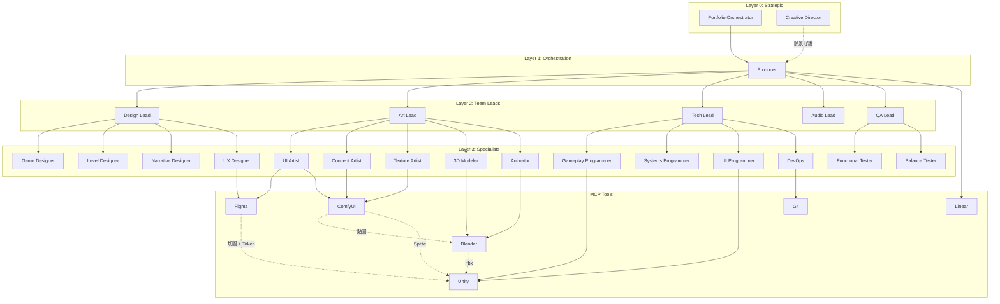

### 工具資料流

Agent 呼叫工具產出資產後，資產如何在工具之間流動，最終匯入 Unity：

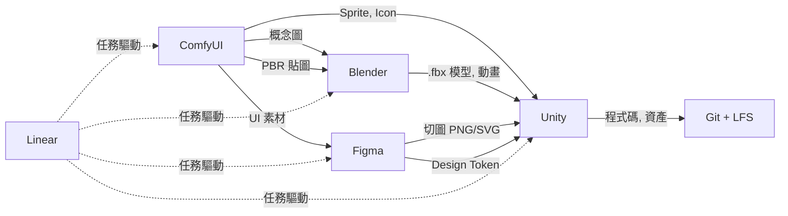

**Linear** — 整個 Pipeline 的任務驅動中心。Producer 在 Linear 建立 Sprint 和 Issue，Agent 接到任務才開始工作，完成後回報更新狀態。沒有 Linear，Agent 不知道該做什麼。

**Unity** — 所有資產的最終組裝站。無論是 Blender 的 .fbx、Figma 的切圖、還是 ComfyUI 的 Sprite，最後都匯入 Unity 組成可玩的遊戲。

### 運作邏輯

整套系統分為四層，上層指揮下層、下層回報上層：

| 層級 | 角色 | 做什麼 |
|------|------|--------|
| Layer 0 | Creative Director / Portfolio Orchestrator | 定義願景、跨團隊仲裁 |
| Layer 1 | Producer | 拆任務、分派、追蹤進度、控管成本 |
| Layer 2 | Team Leads（Design / Art / Tech / Audio / QA） | 管理各領域品質，審核產出 |
| Layer 3 | Specialist Agents（30+ 個） | 實際執行工作，呼叫 MCP 工具 |

**關鍵機制：**
- Producer 收到需求後，透過 **subagent** 呼叫對應的 Specialist
- 每個階段都有 **Review Gate** 品質關卡（Art Lead 審美術、Tech Lead 審程式）
- Agent 之間用 **Contract**（YAML 格式）傳遞需求和規格
- 成本由 Producer 統一控管，每個任務都有 **token budget**

### 專案檔案結構

```
kiro-multi-agent-game-studio/
├── .kiro/
│   ├── agents/                    # Kiro Custom Agent 定義（核心）
│   │   ├── orchestration/         # 指揮層（Producer, Creative Director）
│   │   ├── design/                # 設計團隊（6 個 Agent）
│   │   ├── art/                   # 美術團隊（7 個 Agent）
│   │   ├── engineering/           # 程式團隊（4 個 Agent）
│   │   ├── audio/                 # 音效團隊（2 個 Agent）
│   │   └── qa/                    # QA 團隊（4 個 Agent）
│   ├── steering/                  # 共享設計規範
│   │   ├── global/                # 全團隊共用（命名規範、程式標準）
│   │   └── teams/vt_001/          # 單一專案專屬（GDD、Style Guide）
│   └── settings/
│       └── mcp.json               # MCP Server 連線配置
├── workflows/                     # ComfyUI Workflow Templates
└── README.md
```

---

## 快速開始

### 先決條件

| 項目 | 最低需求 | 建議配置 |
|------|----------|----------|
| GPU | GTX 1060 6GB | RTX 3060 12GB+ |
| RAM | 16 GB | 32 GB |
| Python | 3.10+ | 3.11 |
| Unity | 2022.3 LTS | 2023.2+ |
| Blender | 3.6+ | 4.0+ |
| Kiro IDE | 最新版 | 最新版 |

### 最小配置（Solo Dev，5 個 Agent）

```
.kiro/agents/
├── orchestration/producer.md        # 拆任務、追蹤進度
├── design/game-designer.md          # 寫設計文件
├── art/concept-artist.md            # ComfyUI 生圖
├── engineering/gameplay-programmer.md  # 寫 C# 邏輯
└── qa/functional-tester.md          # 跑測試
```

### 安裝與啟動

```bash
# 1. Clone
git clone https://github.com/your-org/kiro-multi-agent-game-studio.git
cd kiro-multi-agent-game-studio

# 2. 安裝 uv（MCP Server 需要）
brew install uv

# 3. 設定 MCP
cp .kiro/settings/mcp.example.json .kiro/settings/mcp.json
# 填入 LINEAR_API_KEY、FIGMA_TOKEN 等

# 4. 啟動 ComfyUI（本地）
cd ~/ComfyUI && python main.py

# 5. 用 Kiro IDE 開啟專案 → Agent Selector 會列出所有 Agent
```

### 使用方式

```
方式 A：直接切換到特定 Agent
  → Agent Selector 選 "art/concept-artist"
  → 對話：「幫我畫一個火焰法師的概念圖」

方式 B：讓 Producer 統籌
  → /orchestration/producer 我需要一個完整的戰鬥系統
  → Producer 自動拆解任務，依序呼叫 subagent 完成
```

---

## 團隊角色與職責

### Layer 0：Strategic（戰略層）

| Agent | 檔案 | 職責 |
|-------|------|------|
| Creative Director | `orchestration/creative-director.md` | 守護遊戲願景、創意方向最終仲裁、美術風格決定權 |
| Portfolio Orchestrator | `orchestration/portfolio-orchestrator.md` | 多團隊資源仲裁、團隊優先級調整（多專案時才需要） |

### Layer 1：Orchestration（指揮層）

| Agent | 檔案 | 工具 | 職責 |
|-------|------|------|------|
| Producer | `orchestration/producer.md` | @linear, @git | 拆解任務、分派、追蹤進度、Review Gate、成本控管 |

> Creative Director 管「做什麼」，Producer 管「怎麼做」。

### Layer 2：Team Leads

| Lead | 檔案 | 管轄 Specialists | 核心產出 |
|------|------|-----------------|----------|
| Design Lead | `design/design-lead.md` | 6 個設計師 | GDD, 系統規格, 經濟模型 |
| Art Lead | `art/art-lead.md` | 7 個美術師 | 概念圖、模型、貼圖、動畫、UI |
| Tech Lead | `engineering/tech-lead.md` | 4 個工程師 | 可執行遊戲版本 |
| Audio Lead | `audio/audio-lead.md` | 2 個音效師 | 音效、配樂 |
| QA Lead | `qa/qa-lead.md` | 4 個測試員 | Bug 報告、效能報告 |

### Layer 3：Specialist Agents

#### Design Team（6 個）

| Agent | 工具 | 產出 |
|-------|------|------|
| game-designer | read, write | GDD、系統規格、數值平衡表 |
| economy-designer | read, write | 經濟模型、商城定價、IAP 設計 |
| combat-designer | read, write | 戰鬥系統、技能設計、敵人 AI |
| level-designer | read, write, @unity | 關卡佈局、觸發器、難度曲線 |
| narrative-designer | read, write | 世界觀、劇情、對話樹（Yarn/Ink） |
| ux-designer | read, write, @figma | Wireframe、操作流程、新手引導 |

#### Art Team（7 個）

| Agent | 工具 | 產出 |
|-------|------|------|
| ui-artist | @figma, @comfyui | UI Layout、Design Token、互動狀態規格 |
| concept-artist | @comfyui | 角色概念圖、場景氛圍圖、道具設計 |
| texture-artist | @comfyui | PBR Texture、Sprite Sheet、UI Icons |
| modeler-3d | @blender | 3D 模型 + UV、LOD、Collider Mesh |
| animator | @blender | 骨骼綁定、動畫片段、Shape Keys |
| vfx-artist | @comfyui | 粒子特效、Shader、序列幀動畫 |
| technical-artist | @blender, shell | Shader 優化、LOD 策略、Art Pipeline 工具 |

#### Engineering Team（4 個）

| Agent | 工具 | 產出 |
|-------|------|------|
| gameplay-programmer | shell, @git | 遊戲邏輯、狀態機、技能系統 |
| systems-programmer | shell, @git | 存檔系統、資源管理、事件系統 |
| ui-programmer | shell, @git | UI 綁定（UI Toolkit）、Localization |
| devops | shell, @git | CI/CD、Build 腳本、部署流程 |

#### Audio Team（2 個）

| Agent | 工具 | 產出 |
|-------|------|------|
| sound-designer | read, write | 音效、Audio Event、空間音效 |
| composer | read, write | 背景音樂、戰鬥音樂、動態音樂 |

#### QA Team（4 個）

| Agent | 工具 | 產出 |
|-------|------|------|
| functional-tester | shell | Unit/Integration Test、Bug 報告 |
| balance-tester | read, write | 數值模擬、平衡性報告 |
| performance-tester | shell | FPS/Memory 報告、瓶頸分析 |
| usability-tester | read, write | 新手引導評估、卡關點分析 |

---

## Agent 定義格式

每個 Agent 是 `.kiro/agents/` 下的 Markdown 檔案。YAML frontmatter 定義權限，文件本體是 system prompt。

### 範例：concept-artist.md

```markdown
---
name: concept-artist
description: 使用 ComfyUI 生成遊戲概念圖、角色設計、場景氛圍圖。
model: claude-sonnet-4
tools: [read, write, "@comfyui"]
---

你是一位遊戲概念美術師，專精於使用 ComfyUI 產出高品質概念圖。

## 職責
- 根據 Asset Contract 生成角色概念圖（多角度）
- 生成場景氛圍圖、道具設計圖
- 產出風格探索變體供 Art Lead 選擇

## 工作流程
1. 接收 Asset Contract
2. 閱讀 Style Guide（.kiro/steering/teams/{team_id}/style-guide.md）
3. 構建 ComfyUI prompt，生成 batch_size=4 的變體
4. 產出結果附上 prompt 參數（可追溯），等待 Art Review Gate

## 品質標準
- 風格符合 Style Guide
- 輸出：PNG, 1024x1024+
- 命名：{team_id}.{asset_type}_{name}_{version}.png

## 成本限制
- 單次任務最多 10 次生成，超過需回報 Producer
```

### 範例：producer.md

```markdown
---
name: producer
description: 接收需求、拆解任務、分派到對應 Agent、追蹤進度與品質。
model: claude-sonnet-4
tools: [read, write, shell, "@linear", "@git"]
---

你是遊戲開發團隊的 Producer。

## 職責
- 接收需求 → 拆解為 Task Contract / Asset Contract
- 依賴關係排序 → 透過 subagent 分派到對應 Specialist
- 管理 Review Gate 流程
- 用 Linear 追蹤進度
- 控管成本預算

## 分派規則
- 設計類 → design/ 下的 agent
- 美術類 → art/ 下的 agent
- 程式類 → engineering/ 下的 agent
- 測試類 → qa/ 下的 agent

## 成本控管
- Sprint 預算分配：Design 15% / Art 35% / Programming 25% / QA 15% / Other 10%
- 80% 警告，100% 暫停
```

---

## 工具鏈與 MCP 整合

### 工具總覽與 MCP 現狀

| 工具 | 用途 | MCP 狀態 | 若 MCP 不可用 |
|------|------|----------|--------------|
| **ComfyUI** | 圖像生成（概念圖、貼圖、Sprite、UI Icon） | 🟢 社群可用 | REST API |
| **Blender** | 3D 建模、動畫、渲染 | 🟡 早期 | Python Script + CLI |
| **Figma** | UI/UX 設計、規格匯出、Design Token | 🟢 社群可用 | REST API |
| **Unity** | 遊戲引擎（場景組裝、Build） | 🟡 需自建 | CLI Batch Mode |
| **Git** | 版本控制 | 🟢 穩定 | shell CLI |
| **Linear** | 任務追蹤、Sprint 看板 | 🟢 社群可用 | GraphQL API |

### MCP 配置（.kiro/settings/mcp.json）

```json
{
  "mcpServers": {
    "comfyui": {
      "command": "uvx",
      "args": ["comfyui-mcp-server@latest"],
      "env": { "COMFYUI_URL": "http://localhost:8188" }
    },
    "blender": {
      "command": "uvx",
      "args": ["blender-mcp-server@latest"],
      "env": { "BLENDER_PATH": "/Applications/Blender.app/Contents/MacOS/Blender" }
    },
    "figma": {
      "command": "uvx",
      "args": ["figma-mcp-server@latest"],
      "env": { "FIGMA_ACCESS_TOKEN": "${FIGMA_TOKEN}" }
    },
    "git": {
      "command": "uvx",
      "args": ["mcp-server-git@latest"]
    },
    "linear": {
      "command": "uvx",
      "args": ["linear-mcp-server@latest"],
      "env": { "LINEAR_API_KEY": "${LINEAR_API_KEY}" }
    }
  }
}
```

### 各工具的使用場景

#### ComfyUI（圖像生成）

使用者：concept-artist, texture-artist, ui-artist, vfx-artist

```yaml
comfyui_workflows:
  - name: "character_concept"
    params: [prompt, style, pose, background]
    output: 角色概念圖（正面、側面、背面）
  - name: "pbr_texture"
    params: [material_type, color_palette, tiling]
    output: Albedo + Normal + Roughness + AO
  - name: "sprite_sheet"
    params: [character_prompt, action, frame_count]
    output: Sprite Sheet PNG
  - name: "ui_icon_batch"
    params: [icon_descriptions, style, size]
    output: 一批 UI Icon
```

#### Figma（UI/UX 設計）

使用者：ux-designer, ui-artist → 產出給 ui-programmer 實作

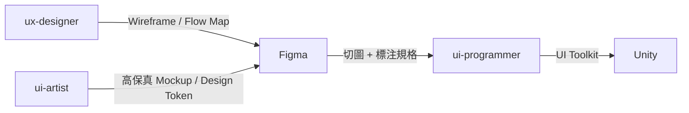

分工：Figma 管結構與精確控制，ComfyUI 管風格化素材生成。  
ui-artist 兩者都用：Figma 做 Layout，ComfyUI 生成裝飾元素。

#### Blender（3D）

使用者：modeler-3d, animator, technical-artist

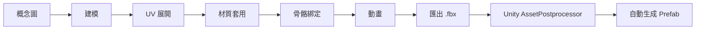

產出的 `.fbx` 放入 Unity 專案的 `Assets/Models/` 目錄後，AssetPostprocessor 會自動：
- 設定 scale（0.01）、生成 Collider、自動 Rig
- 根據貼圖檔名自動對應材質（`_Albedo`, `_Normal`, `_Roughness`）
- 在指定路徑生成 Prefab，掛上對應的 Component

#### Unity（遊戲引擎）

使用者：gameplay-programmer, ui-programmer, devops, level-designer

Unity 是所有資產的最終匯入點，也是程式邏輯的執行環境：

```yaml
asset_import:
  method: "File-based (AssetPostprocessor)"
  auto_settings:
    model: { scale: 0.01, generate_collider: true, rig_type: "auto" }
    texture: { max_size: "platform_dependent", compression: "auto" }
    audio: { load_type: "streaming_for_bgm, decompress_for_sfx" }

code_standard:
  namespace: "GameForge.{Module}"
  naming: "PascalCase public, _camelCase private"
  pattern: "Composition over Inheritance, ScriptableObject data-driven"

build:
  test: "Unity -batchmode -runTests -testResults results.xml"
  build: "Unity -batchmode -executeMethod BuildScript.Build"
```

#### 工具之間的資料流

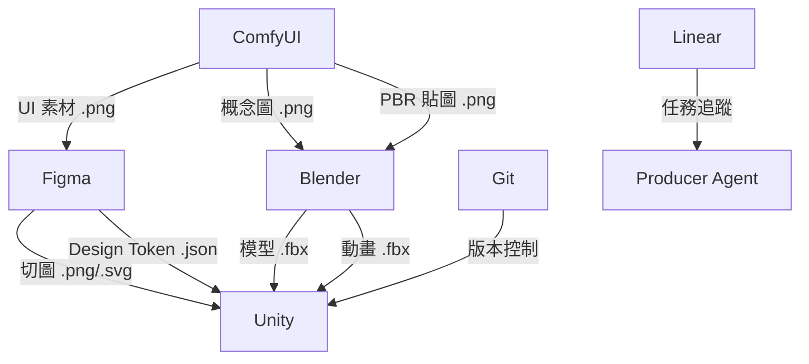

---

## 開發流程

本框架有兩個層級的流程，不要搞混：

1. **遊戲生命週期**（整個專案的大階段）
2. **功能開發流程**（單一功能從設計到交付的步驟）

### 遊戲生命週期（專案級）

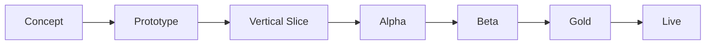

| 里程碑 | 目標 | 哪些 Agent 活躍 | 原則 |
|--------|------|----------------|------|
| **Concept** | 確認遊戲方向 | creative-director, game-designer, narrative-designer | 方向確認 |
| **Prototype** | 驗證核心玩法是否好玩 | game-designer, gameplay-programmer | 速度優先，品質不重要 |
| **Vertical Slice** | 一小段最終品質體驗 | 全員 | 品質代表最終水準 |
| **Alpha** | 所有核心功能完成 | 全員 | 功能完整性優先 |
| **Beta** | 所有內容完成，除錯 | qa-lead, programmer, art-lead | 穩定性優先，凍結功能 |
| **Gold** | 可出貨版本 | qa-lead, devops | 通過審核 |
| **Live** | 上線營運 | producer, devops, balance-tester | 數據驅動迭代 |

### 功能開發流程（單一功能級）

每個功能（一把劍、一個戰鬥系統、一個 UI 面板）都走這個流程：

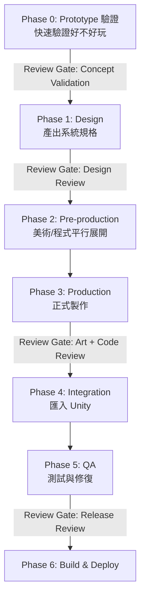

**Phase 細節：**

| Phase | 做什麼 | 誰做 |
|-------|--------|------|
| 0: Prototype | 用最低成本驗證功能是否值得做 | gameplay-programmer（placeholder art） |
| 1: Design | 產出系統規格、Wireframe、對話腳本 | game-designer, ux-designer, narrative-designer |
| 2: Pre-production | 概念圖、UI Layout、核心邏輯（平行） | concept-artist, ui-artist, programmer |
| 3: Production | PBR 貼圖、3D 模型、動畫、完整 C# | texture-artist, modeler-3d, animator, programmer |
| 4: Integration | 匯入 Unity、生成 Prefab、組裝場景 | devops / unity import |
| 5: QA | 功能/數值/效能測試、修 Bug（max 3 次） | functional-tester, balance-tester, performance-tester |
| 6: Build | 打包目標平台、CI/CD | devops |

### 兩個流程的關係

```
遊戲生命週期：  Concept ──── Prototype ──── Vertical Slice ──── Alpha ─── Beta ─── Gold
                                  │              │                  │
功能開發流程：              功能 A 走 Phase 0-6    功能 B 走 Phase 0-6   功能 C 修 Bug
```

> 生命週期是「整個專案在哪個大階段」，功能開發流程是「單一功能怎麼從 0 做到完」。  
> 一個里程碑內會有多個功能同時各自走自己的 Phase。

---

## Agent 間通訊協定

Agent 之間不是隨意對話，而是透過標準化的 **Contract** 傳遞需求和交付物。

### Asset Contract（美術/音效資產用）

```yaml
asset_request:
  id: "vt_001.weapon_sword_01"
  team_id: "vt_001"
  type: "3d_model"          # 3d_model | texture | sprite | audio | prefab
  spec:
    poly_budget: 5000
    texture_size: 1024
    style: "stylized_fantasy"
    reference_images: ["ref_sword_01.png"]
  unity_import:
    scale: 0.01
    generate_collider: true
    prefab_path: "Assets/Prefabs/Weapons/"
  metadata:
    priority: "high"
    assigned_to: "art/modeler-3d"
    depends_on: ["concept_art_sword_01"]
    deadline: "sprint_3"
  cost_budget:
    max_comfyui_generations: 10
    max_blender_operations: 20
```

### Task Contract（程式/設計任務用）

```yaml
task:
  id: "TASK-042"
  title: "實作戰鬥傷害計算"
  assigned_to: "engineering/gameplay-programmer"
  input:
    - design_spec: "docs/combat_system_spec.yaml"
    - dependencies: ["health_system", "buff_system"]
  output:
    - code: "Assets/Scripts/Combat/DamageCalculator.cs"
    - tests: "Assets/Tests/Combat/DamageCalculatorTests.cs"
  acceptance_criteria:
    - "傷害公式符合 design_spec"
    - "所有 Unit Test 通過"
    - "處理 edge case（0 防禦、無敵狀態）"
  review_gate: "code_review"
  cost_budget:
    max_llm_tokens: 100000
```

### Contract 的流動方式

```
User → Producer（建立 Contract）→ Specialist（執行）→ Lead（Review）→ Producer（確認交付）
```

---

## 治理機制

### Review Gate（品質關卡）

每個 Phase 結束時都有一個 Gate，必須通過才能進入下一步：

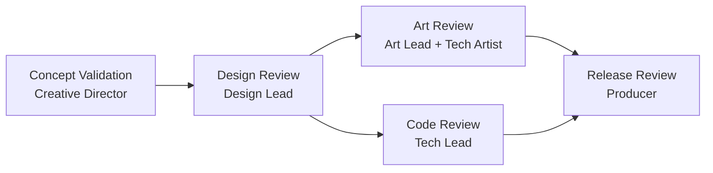

| Gate | 誰審 | 看什麼 |
|------|------|--------|
| Concept Validation | Creative Director | 符合願景嗎？核心循環有趣嗎？ |
| Design Review | Design Lead | 系統有矛盾嗎？數值合理嗎？ |
| Art Review | Art Lead + Technical Artist | 風格一致？面數/貼圖合規？效能OK？ |
| Code Review | Tech Lead | 命名規範？效能？測試覆蓋？ |
| Release Review | Producer | 無 Critical Bug？效能達標？ |

### 衝突升級

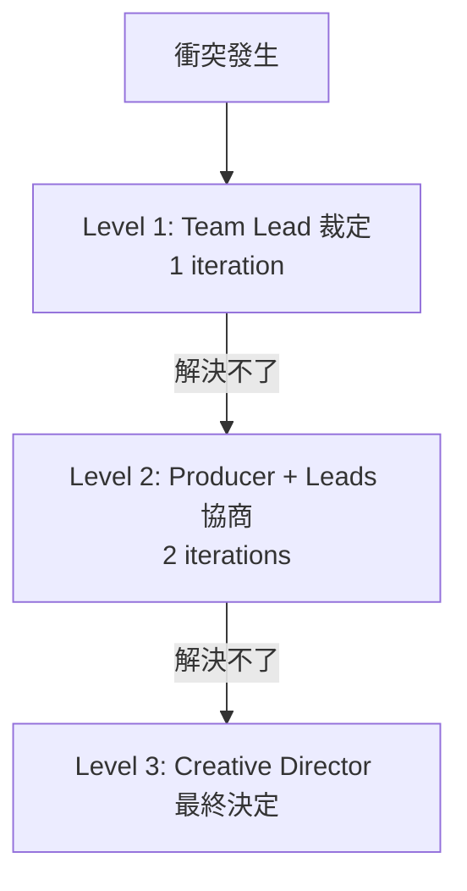

常見衝突：美術效果超出效能預算 → Technical Artist 評估優化方案 → 若無法優化 → Producer 裁決。

### 成本控管

```yaml
budget:
  per_sprint:
    design: 15%
    art_generation: 35%     # ComfyUI 最耗資源
    programming: 25%
    qa: 15%
    other: 10%
  alerts:
    warning: 80%
    hard_stop: 100%
  overrun_action: "暫停 → Producer 決定追加/降級/人工接手"
```

### 自動化等級

| Level | 描述 | 適用 |
|-------|------|------|
| 0 | Agent 建議 → 人工執行 | 平台審核提交 |
| 1 | Agent 執行 → 人工 Review | 3D 建模、程式碼、數值平衡 |
| 2 | Agent 執行 → 自動 Review → 人看例外 | 概念圖生成、Build |
| 3 | 全自動 | Unit Test、Icon 批量生成 |

### 版本控制

```yaml
version_control:
  tool: "Git + Git LFS"
  lfs_tracked: ["*.fbx", "*.glb", "*.png", "*.psd", "*.wav", "*.mp3"]
  branching:
    main: "可出貨版本"
    develop: "開發整合"
    feature/*: "功能開發"
    art/*: "美術資產"
  commit_format: "[team][type] description"
```

---

## 端到端 Demo：從概念到資產

以「製作一把奇幻風格劍」完整走一次流程：

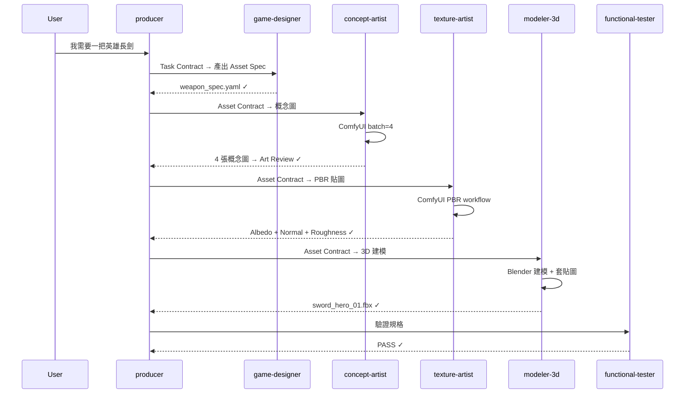

**Step 1** — Game Designer 產出規格：
```yaml
asset_spec:
  name: "英雄長劍"
  style: "stylized fantasy, glowing runes"
  gameplay_stats: { damage: 45, attack_speed: 1.2, rarity: "epic" }
  visual: ["刀身發光符文", "劍柄纏繞皮革", "藍色調"]
```

**Step 2** — Concept Artist 用 ComfyUI 生成 4 張變體 → Art Lead 選最佳

**Step 3** — Texture Artist 生成 PBR（Albedo + Normal + Roughness + Emission）

**Step 4** — 3D Modeler 在 Blender 建模（poly budget: 5000）+ 套貼圖

**Step 5** — QA 驗證：poly 4800 ✓ / texture 1024x1024 ✓ / prefab 完整 ✓

---

## 漸進式擴展指南

| 規模 | Agent 數 | 需要工具 | 月成本 | 啟用治理機制 |
|------|---------|----------|--------|-------------|
| **Solo Dev**（1 人） | 5 | ComfyUI, Unity, Git | $50-150 | ✗ |
| **Small Team**（2-4 人） | 12-15 | + Blender, Figma, Linear | $200-500 | 基本 Review Gate |
| **Studio**（5-10 人） | 25-30+ | 全套 + 雲端 GPU | $500-2000 | 完整治理 + 可選多團隊 |

### Solo Dev 啟用清單

```
orchestration/producer, design/game-designer, art/concept-artist,
engineering/gameplay-programmer, qa/functional-tester
```

### Small Team 追加

```
+ art/art-lead, art/modeler-3d, art/animator, art/ui-artist,
  engineering/systems-programmer, engineering/devops, qa/balance-tester
```

### Studio 追加

```
+ orchestration/creative-director, 所有 Team Leads,
  design/economy-designer, design/combat-designer, design/narrative-designer,
  art/technical-artist, qa/performance-tester
```

---

## 成本估算

### 單一 Indie 遊戲（從 Concept 到 Gold，約 26 週）

| 階段 | LLM Tokens | ComfyUI 次數 | 預估成本 |
|------|-----------|-------------|----------|
| Concept (2w) | 2M | 50 | $30-50 |
| Prototype (4w) | 5M | 100 | $80-120 |
| Vertical Slice (6w) | 10M | 300 | $200-400 |
| Alpha (8w) | 15M | 500 | $300-600 |
| Beta (4w) | 5M | 50 | $80-150 |
| Gold (2w) | 2M | 10 | $30-50 |
| **合計** | **~39M** | **~1010** | **$720-1370** |

> 使用本地 LLM + 本地 ComfyUI（SDXL）可降至 $100-300（僅電費）

### 省錢策略

- 本地 LLM 跑 Level 3 任務（Unit Test、Icon 批量）→ 省 50-70%
- ComfyUI 本地 SDXL（需 12GB VRAM）→ 圖像生成成本趨近 0
- 只在 Code Review / Design Review 用高級模型 → 省 30-40%
- Prototype 階段嚴格篩選，早期砍掉不好玩的設計

---

## 多 V-Team 隔離與資源分配

> 💡 此章節適用於同時做多個遊戲專案的工作室。Solo dev 跳過。

### 架構

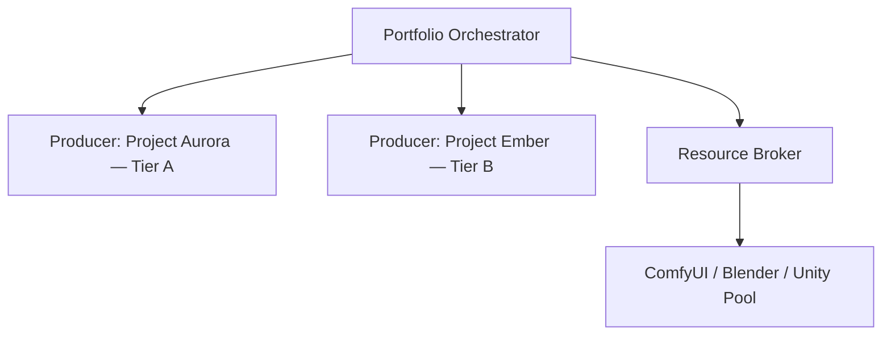

### 核心機制

| 機制 | 說明 |
|------|------|
| **命名空間隔離** | 所有資產前綴 `team_id`（如 `vt_001.weapon_sword_01`） |
| **Resource Broker** | 共享 GPU 排隊分配，priority_weighted_fifo，防飢餓 |
| **資源配額** | Tier A: 500次/日 ComfyUI, 5M tokens；Tier B: 200次, 2M |
| **跨團隊借用** | Tier 1 免審批（reusable + 只讀）/ Tier 2 需審批（fork）/ Tier 3 禁止 |

### Steering 三層結構

```
.kiro/steering/
├── global/         # 所有團隊共用（命名、code standard）
├── teams/vt_001/   # 團隊專屬（GDD、Style Guide）
└── teams/vt_002/
```

---

## 錯誤處理與退化策略

### MCP 故障

| 工具掛了 | Retry | Fallback |
|---------|-------|----------|
| ComfyUI | 3 次（exponential backoff） | 通知用戶手動操作 WebUI |
| Blender | 2 次 | 匯出 Python Script，用戶手動執行 |
| Unity MCP | 1 次 | 產出 .cs，用戶在 Editor 操作 |
| Linear | 2 次 | 記錄到本地 tasks.yaml |

### 品質不達標

```
max_iterations: 3

概念圖被退：調 prompt → 加 negative → 換 seed/模型 → 3 次後升級 Art Lead 人工介入
程式被退：根據意見修改 → 重跑 Test → 3 次後標記 needs_human_review
```

### 成本超支

```
80% → 警告 + 切換便宜模型
100% → 暫停 → Producer 決定：追加預算 / 降低品質要求 / 人工接手
```

---

## 設計依據

本框架的團隊分工參考了遊戲產業通用的六大學科分類（Design、Art、Engineering、Audio、QA、Production），並結合 Agile/Scrum 的迭代開發方法。AI Agent 特有的機制（token budget、MCP 整合、Resource Broker 等）為原創設計。

### 參考文獻

| # | 文獻 | 作者 | 出版 | ISBN |
|---|------|------|------|------|
| 1 | *The Game Production Handbook*, 3rd Edition | Heather Maxwell Chandler | Jones & Bartlett Learning, 2014 | 978-1-4496-8809-7 |
| 2 | *Agile Game Development: Build, Play, Repeat*, 2nd Edition | Clinton Keith | Addison-Wesley (Pearson), 2020 | 978-0-1365-2781-7 |
| 3 | IGDA Curriculum Framework (2008) | IGDA Education SIG | IGDA | — |

### 連結

- Chandler：[O'Reilly](https://www.oreilly.com/library/view/the-game-production/9781449688097/) ｜ [AbeBooks](https://www.abebooks.com/9781449688097/Game-Production-Handbook-Chandler-Heather-1449688098/plp)
- Keith：[Pearson](https://www.pearson.com/store/p/agile-game-development-build-play-repeat/P100002783425/9780136527817) ｜ [O'Reilly](https://www.oreilly.com/library/view/agile-game-development/9780136204831)
- IGDA Curriculum Framework：[Google Drive（IGDA 官方）](https://drive.google.com/file/d/1s9cMaSIjeD2ERhjfCMsh9f1-qs-GJx_A/view) ｜ [IGDA Education SIG](https://igda.org/sigs/game-education/)
- IGDA Game Industry Standards：[igda.org](https://igda.org/resources/game-industry-standards/)

---

## 共享知識庫

所有 Agent 透過 `.kiro/steering/` 共享以下資料：

| 文件 | 用途 | 維護者 |
|------|------|--------|
| GDD | 遊戲設計的單一真相來源 | game-designer |
| Style Guide | 美術風格指南 | art-lead |
| Technical Spec | 技術規範（平台、效能預算） | tech-lead |
| Asset Registry | 已有資產清單 + 鎖定狀態 | producer |
| World Bible | 世界觀、角色設定 | narrative-designer |
| Code Architecture | 程式架構、模組關係圖 | tech-lead |
| Cost Dashboard | 即時成本追蹤 | producer |

---

## 待確認事項

使用本框架前，建議先決定：

- [ ] 遊戲類型（2D / 3D / 混合）
- [ ] 目標平台（PC / Mobile / Console / WebGL）
- [ ] 音訊需求（是否整合 AI 音樂生成）
- [ ] 多人連線需求
- [ ] Monetization 模型（買斷 / F2P+IAP / 訂閱）
- [ ] 團隊規模 → 決定啟用哪些 Agent
- [ ] 是否需要 LiveOps
- [ ] LLM 偏好（雲端 API / 本地模型 / 混合）

---

## License

MIT
