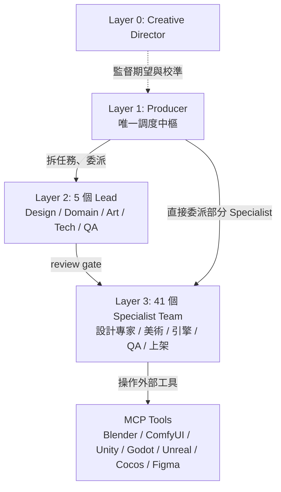
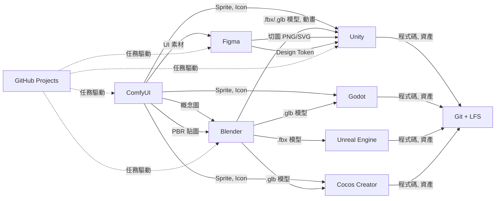

# Kiro Multi-Agent Game Studio

用 AI Agent 模擬一支遊戲開發團隊。**你對 Producer 說一句「用某引擎做某類型遊戲」，它會偵測引擎與類型、拆解任務，自動委派對應的 Specialist Agent，協作完成從設計到引擎實作的各環節**（實際涵蓋範圍依需求而定）——不綁定單一引擎、也不綁定單一類型。

一句話需求的例子：

- 「用 **Unity** 做一款 2D 平台動作遊戲」
- 「用 **Godot** 做一款 roguelike」
- 「用 **Unreal** 做一款 ARPG」
- 「用 **Cocos** 做一款老虎機」

Producer 接手後串起的環節：**設計規格 → 貼圖生成 → 3D 建模 → 引擎場景組裝與程式邏輯 → 測試**。

### 支援 4 大引擎 × 13 種遊戲類型

**引擎**：Unity ｜ Godot ｜ Unreal ｜ Cocos Creator（美術與設計階段引擎無關、可共用）。

**遊戲類型**（每種都有專屬 Domain Expert）：

`老虎機`・`魚機`・`射擊 FPS/TPS`・`多人 / MMORPG`・`RPG / ARPG`・`卡牌`・`三消 / 解謎`・`平台 / metroidvania`・`roguelike`・`策略 / RTS / 塔防`・`模擬經營 / 生存`・`音樂節奏`・`敘事 / 視覺小說`

> 其餘類型（競速、格鬥、體育、walking sim…）走通用 `game-designer`。完整對照見下方「目前專案實際狀態」或 [docs/agents-and-roles.md](docs/agents-and-roles.md)。

**適用場景**：可作為 PM 向團隊或投資人提案的架構藍圖，也適合個人開發者 / 小型獨立工作室（1–10 人）直接拿來用。

### 這個專案能幫你做什麼

- **從一句需求到可執行遊戲**：描述「用 X 引擎做一款 Y 類型遊戲」，Producer 拆成任務、串接各 Specialist，做到引擎內的可執行版本。
- **從參考圖到遊戲資產**：丟一張參考圖，ComfyUI Team 生成概念圖/貼圖/UI 切圖，Blender Team 建模並套貼圖，交給引擎 Team 匯入。
- **拿到該遊戲類型的專業設計**：13 種類型各有專屬顧問，產出數學模型/數值/系統規格，再由 `balance-tester` 用模擬驗證。
- **四大引擎任選**：Unity / Godot / Unreal / Cocos Creator，Producer 依你指定的引擎分派；美術與設計階段引擎無關、可共用。
- **涵蓋到上線前的各環節**：UI/UX（Figma）、音效、動畫、多語系、變現數值、CI 出包、分級與合規送審，都有對應的 Agent（分級送審等仍需人工把關）。

> 📌 本文件同時涵蓋「已建立的功能」與「規劃中的擴充」；想直接動手看「快速開始」。

---

## 從這裡開始

**你對 Producer 說「用 X 引擎做一款 Y 類型遊戲」，它會自動調度一整組 AI Agent 幫你把遊戲做出來。**

三步上手：

1. **開專案**：用 Kiro IDE 開啟本資料夾，第一次會問「是否信任」，選信任（agent 才會載入）。
2. **選 Agent**：在 chat 輸入框的 **Agent Selector** 選 `producer`（或打 `/producer`）。
3. **下需求**：例如「請幫我用 Godot 開發一款老虎機」。Producer 會偵測引擎與類型、列出計畫，再自動委派各專家執行。

只想先看它怎麼運作、不裝任何引擎也行——先讀下面的「快速摘要」與「架構總覽」。想實際接 Blender / ComfyUI / 引擎，再看下方「深入文件（Reference）」。

> **想知道 48 個 Agent 實際怎麼調度、該對誰說話、卡住時怎麼救？**
> 讀 **[docs/orchestration-guide.md](docs/orchestration-guide.md)**——那是使用者視角的操作手冊，含三個完整情境走查與已知限制。
> 這份 README 說明「這個專案是什麼」，調度指南說明「你要怎麼用它」。

> 遇到不熟悉的術語，可參考下一節的術語對照表。

## 術語對照表

| 縮寫 / 術語 | 說明 |
|---|---|
| **Agent** | 一個有特定職責的 AI 角色（一個 `.md` 檔），例如 `producer`、`blender-team`。 |
| **Producer** | 總調度：拆你的需求、分派工作給其他 Agent、最後 commit。你主要跟它對話。 |
| **subagent 委派** | 一個 Agent 自動叫另一個 Agent 幫忙（語法 `Use the "<name>" subagent to …`）。 |
| **MCP** | Model Context Protocol，讓 Agent 能操作外部工具（Blender / Unity / Figma…）的橋接協定。 |
| **GDD** | Game Design Document，遊戲設計文件；「遊戲怎麼設計」的單一真相來源。 |
| **Contract** | Agent 之間傳遞任務 / 資產需求的標準格式（YAML），詳見深入文件。 |
| **RTP / RNG** | 老虎機用語：RTP = 玩家長期返還率；RNG = 亂數產生器。 |
| **netcode** | 多人連線的網路同步程式。 |
| **LFS** | Git Large File Storage，讓大型二進位資產（模型 / 貼圖）不撐爆 repo。 |

## 目前專案實際狀態


這是本專案「現在打開 Kiro 就能用」的內容，不是願景，是已經寫進 `.kiro/` 的實際檔案。

### 核心設計：Producer 偵測「引擎 + 遊戲類型」，串接美術/設計 Team → 對應引擎 Team

Producer 是唯一的調度中樞——你只跟它說需求，它偵測引擎與遊戲類型，依需求動態組出**一條「需求 → 遊戲」的 Pipeline**，把每一站的產出交給下一站：

```
使用者需求（可含參考圖、指定引擎、指定遊戲類型）
  → Producer 拆解，偵測引擎（Unity/Godot/Unreal/Cocos Creator）與遊戲類型
  → design/{類型}-expert 或 game-designer  （系統規格/數值：依類型路由，見「支援的遊戲類型」）
  → design/ui-ux-team              （UI/介面需求時：Figma 版面/流程/Design Token + 切圖規格，若需要）
  → art/comfyui-team               （依參考圖生成貼圖 / UI 切圖素材）
  → art/blender-team               （建模 + 套用貼圖，2D 遊戲可跳過）
  → engineering/{engine}-team      （依偵測到的引擎分派：unity-team / godot-team / unreal-team / cocos-team）
  → Producer 確認完成 → git commit
```

不是每個需求都要走完全部——只要一張貼圖就走到美術階段、只改程式邏輯就直接進引擎階段。Producer 會先把計畫列給你確認，再依序執行。

### 支援的遊戲類型

Producer 偵測遊戲類型後，把設計端**分門別類**路由到對應的 Domain Expert；沒有專屬 expert 的類型才走通用 `game-designer`。

**有專屬 Domain Expert 的類型**（都在 `design/`，各自切分清楚）：

| 類型 | 專屬 Domain Expert | 專屬重點 |
|------|-------------------|---------|
| 老虎機 / casino | `slot-game-expert` | 捲軸數學 / Paytable / RTP / RNG / 認證合規 |
| 魚機 / 捕魚 | `fish-game-expert` | 命中機率 / 賠付經濟 / RTP / 伺服器判定 / 合規 |
| 射擊 FPS/TPS | `shooter-expert` | 武器數值 / 彈道 / 命中判定 / 手感 / 敵人 AI |
| 多人 / MMORPG | `mmo-expert` | netcode / 伺服器權威 / 同步 / 持久化 / 防作弊（⚠️ 全 MMO 對 solo dev 極重，務實先做小規模 co-op/競技） |
| RPG / ARPG | `rpg-systems-expert` | 屬性 / 等級曲線 / 技能樹 / 掉落 / 傷害公式 |
| 卡牌 / Deckbuilder / TCG | `card-game-expert` | 卡牌數值 / 資源曲線 / combo / 平衡 |
| 三消 / 解謎 / merge | `puzzle-match3-expert` | board 可解性 / 難度曲線 / 步數經濟 |
| 平台 / metroidvania | `platformer-expert` | 跳躍手感（coyote/jump buffer）/ 關卡節奏 / 能力 gating |
| Roguelike / roguelite | `roguelike-expert` | 程序生成 / build synergy / 風險報酬 / meta 進度 |
| 策略 / RTS / 4X / 塔防 | `strategy-expert` | 兵種相剋 / 資源經濟 / AI 對手 / 波次曲線 |
| 模擬經營 / 生存 / 沙盒 | `simulation-expert` | 生產鏈 / 供需經濟收斂 / 生存需求 / 自動化 |
| 音樂 / 節奏 | `rhythm-expert` | 譜面 / 判定窗 / 延遲校正（綁 `audio-team`） |
| 敘事 / 視覺小說 / 冒險 | `narrative-adventure-expert` | 分支敘事 / 旗標 / 對話樹（綁 `localization-team`） |

**走通用 `game-designer` 的類型**（不需專屬 expert，必要時拉 `economy-designer` 出數值、`balance-tester` 驗平衡、`audio-team` 出聲音）：
競速、格鬥（rollback netcode 併 `mmo-expert`）、體育、派對、walking sim、idle/clicker…

> **類型會疊加**，Producer 負責串接多個 expert。例：「多人射擊 RPG」= `mmo-expert` + `shooter-expert` + `rpg-systems-expert`；「付費開包卡牌」= `card-game-expert` + `economy-designer` + `compliance-release`。所有數值一律交 `balance-tester` 模擬驗證。

### 已建立的 Agent（48 個）

> 委派 / 呼叫 Agent 時用 frontmatter 的**扁平 `name`**（例如 `blender-team`），不是路徑（不是 `art/blender-team`）；下表「路徑」欄只是檔案位置。詳見 `.kiro/steering/global/contracts.md`「Agent 委派命名規範」。
>
> 💡 **Agent 出現在哪**：chat 輸入框的 **Agent Selector**（模式 / agent 下拉），不是左側「Agent Steering & Skills」面板——那個面板顯示的是 steering 檔（asset-standards / contracts / gdd / style-guide），跟 agent 是兩回事。若 Agent Selector 沒列出全部 48 個，先確認第一次開啟 workspace 時已點「信任」（workspace agent 需信任後才載入）。本專案的 agent 檔依 layer 分放在 `.kiro/agents/` 的子目錄（`orchestration/`、`design/`、`art/`、`engineering/`、`qa/`、`publishing/`），委派名稱取自各檔 frontmatter 的 `name`（例如 `blender-team`）。**實測確認：即使檔案放在子目錄，frontmatter `name` 仍勝過路徑**（見 [Custom agents](https://kiro.dev/docs/custom-agents/)），所以委派名維持乾淨的扁平 `name`，不會變成 `art/blender-team`。

| Agent | 路徑 | 依賴 |
|-------|------|------|
| Creative Director | `.kiro/agents/orchestration/creative-director.md` | 無外部工具，Layer 0：守護願景/pillars、創意方向最終仲裁 |
| Producer | `.kiro/agents/orchestration/producer.md` | 無外部工具，能用 shell 執行 git commit，負責引擎/遊戲類型偵測，是整條 Pipeline 的唯一調度中樞 |
| Game Designer | `.kiro/agents/design/game-designer.md` | 無外部工具 |
| Design Lead | `.kiro/agents/design/design-lead.md` | 無外部工具，Layer 2：核心設計（7 個）整合 GDD、消矛盾、design-review gate |
| Domain Lead | `.kiro/agents/design/domain-lead.md` | 無外部工具，Layer 2：13 類遊戲類型 Domain Expert 的專業審查與轉發 |
| Slot Game Expert | `.kiro/agents/design/slot-game-expert.md` | 無外部工具，老虎機數學模型/RNG/認證合規顧問；領域知識來自 **`kiro-slot-game-expert` Power** |
| Fish Game Expert | `.kiro/agents/design/fish-game-expert.md` | 無外部工具，魚機/捕魚：命中機率/賠付經濟/RTP/合規；領域知識來自 **`kiro-fish-game-expert` Power** |
| Shooter Expert | `.kiro/agents/design/shooter-expert.md` | 無外部工具，FPS/TPS：武器/彈道/命中判定/手感/AI |
| MMO Expert | `.kiro/agents/design/mmo-expert.md` | 無外部工具，多人/MMORPG：netcode/伺服器權威/持久化 |
| RPG Systems Expert | `.kiro/agents/design/rpg-systems-expert.md` | 無外部工具，RPG/ARPG：屬性/技能/掉落/傷害公式 |
| Card Game Expert | `.kiro/agents/design/card-game-expert.md` | 無外部工具，卡牌/Deckbuilder：卡牌數值/combo/平衡 |
| Puzzle / Match-3 Expert | `.kiro/agents/design/puzzle-match3-expert.md` | 無外部工具，三消/解謎：board 可解性/難度曲線/步數經濟 |
| Platformer Expert | `.kiro/agents/design/platformer-expert.md` | 無外部工具，平台/metroidvania：跳躍手感/關卡節奏/能力 gating |
| Roguelike Expert | `.kiro/agents/design/roguelike-expert.md` | 無外部工具，roguelike/lite：程序生成/build synergy/meta 進度 |
| Strategy Expert | `.kiro/agents/design/strategy-expert.md` | 無外部工具，RTS/4X/塔防：兵種相剋/資源經濟/AI/波次曲線 |
| Simulation Expert | `.kiro/agents/design/simulation-expert.md` | 無外部工具，模擬經營/生存/沙盒：生產鏈/供需經濟/自動化 |
| Rhythm Expert | `.kiro/agents/design/rhythm-expert.md` | 無外部工具，音樂節奏：譜面/判定窗/延遲校正 |
| Narrative / Adventure Expert | `.kiro/agents/design/narrative-adventure-expert.md` | 無外部工具，敘事/視覺小說/冒險：分支敘事/旗標/對話樹 |
| Economy Designer | `.kiro/agents/design/economy-designer.md` | 無外部工具，F2P 數值/IAP/貨幣/獎勵曲線設計 |
| UI/UX Team | `.kiro/agents/design/ui-ux-team.md` | 透過 `figma` MCP（官方 Remote Server）產出 UI/UX 版面、Design Token、切圖規格，見「Figma MCP 整合詳解」 |
| Localization Team | `.kiro/agents/design/localization-team.md` | 多語系字串抽取、locale 檔、i18n 落地規格（CJK/RTL/字型需求） |
| Art Lead | `.kiro/agents/art/art-lead.md` | 無外部工具，Layer 2：維護 style-guide、美術一致性 review |
| ComfyUI Team | `.kiro/agents/art/comfyui-team.md` | 透過 `comfyui`（`artokun/comfyui-mcp`）連接本機 ComfyUI；領域知識來自 **`kiro-comfyui-accelerator` Power** |
| Krita Team | `.kiro/agents/art/krita-team.md` | 透過 `krita` MCP 做數位繪圖與手繪精修（承接 comfyui-team 產出）；領域知識來自 **`kiro-krita-accelerator` Power** |
| Blender Team | `.kiro/agents/art/blender-team.md` | 透過 `blender-mcp` 連接 Blender（靜態建模+貼圖），見「Blender MCP 整合詳解」 |
| Animator | `.kiro/agents/art/animator.md` | 透過 `blender-mcp` 做 rig/綁定/動畫 clip |
| Audio Team | `.kiro/agents/art/audio-team.md` | 音樂走 `ableton` MCP（領域知識來自 **`kiro-ableton-accelerator` Power**）、SFX/voice 走 `comfyui` 音訊生成 |
| Technical Artist | `.kiro/agents/art/technical-artist.md` | 透過 `blender-mcp`＋shell 做 shader/優化/LOD/美術-引擎管線 |
| Tech Lead | `.kiro/agents/engineering/tech-lead.md` | read/write/shell，Layer 2：技術架構、效能預算、跨引擎 code-review gate |
| Unity Team | `.kiro/agents/engineering/unity-team.md` | 透過 `unity-mcp` 連接 Unity Editor；領域知識來自 **`kiro-unity-accelerator` Power** |
| Godot Team | `.kiro/agents/engineering/godot-team.md` | 透過 `godot-mcp` 連接 Godot Editor；領域知識來自 **`kiro-godot-accelerator` Power** |
| Unreal Team | `.kiro/agents/engineering/unreal-team.md` | 透過 `unreal-engine` local MCP 連接 Unreal Editor；領域知識來自 **`kiro-unreal-accelerator` Power** |
| Cocos Team | `.kiro/agents/engineering/cocos-team.md` | 透過 `cocos-creator` MCP 連接 Cocos Creator Editor；領域知識來自 **`kiro-cocos-accelerator` Power** |
| Wallet Systems Expert | `.kiro/agents/engineering/wallet-systems-expert.md` | 無外部工具，錢包/金流後端規格（餘額與交易模型、API、DB schema、幂等與鎖、對帳、可觀測性）；領域知識來自 **`kiro-gaming-wallet-expert` Power** |
| DevOps Team | `.kiro/agents/engineering/devops-team.md` | headless build、CI pipeline、產物與版本管理（能用 shell 跑 build 腳本） |
| QA Lead | `.kiro/agents/qa/qa-lead.md` | 無外部工具，Layer 2：測試策略、協調三 tester、go/no-go |
| Functional Tester | `.kiro/agents/qa/functional-tester.md` | 需目標專案已有測試框架，否則會先詢問是否協助建立 |
| Balance Tester | `.kiro/agents/qa/balance-tester.md` | Monte Carlo 模擬驗證數值（老虎機 RTP、F2P 經濟平衡），能用 shell 跑模擬 |
| Performance Tester | `.kiro/agents/qa/performance-tester.md` | 能用 shell 跑 profiling；FPS/記憶體/draw call/瓶頸分析 |
| Compliance / Release | `.kiro/agents/publishing/compliance-release.md` | 分級、隱私合規、商店素材、送審清單、老虎機認證/牌照流程（能用 web 查現行政策） |
| Marketing / PR Team | `.kiro/agents/publishing/marketing-team.md` | 無外部工具，商店文案/預告片腳本/新聞稿/社群貼文草稿（純文字產出，不執行實際發布/投放） |
| Level Designer | `.kiro/agents/design/level-designer.md` | 無外部工具，關卡佈局/觸發器/難度曲線，交引擎 Team 實際搭建 |
| Narrative Designer | `.kiro/agents/design/narrative-designer.md` | 無外部工具，世界觀/角色/劇情內容、維護 World Bible（與 narrative-adventure-expert 分工：內容 vs 系統） |
| Combat Designer | `.kiro/agents/design/combat-designer.md` | 無外部工具，通用戰鬥系統/技能/敵人 AI（FPS/RPG 交對應 Domain Expert，避免重複覆蓋） |
| Systems Programmer | `.kiro/agents/engineering/systems-programmer.md` | read/write/shell，引擎無關的存檔/資源管理/事件系統設計，交引擎 Team 落地 |
| UI Programmer | `.kiro/agents/engineering/ui-programmer.md` | read/write/shell，把 ui-ux-team 版面綁定成可互動引擎 UI，接 localization-team 多語 |
| VFX Artist | `.kiro/agents/art/vfx-artist.md` | 透過 `comfyui` 生成特效素材/序列幀，與 technical-artist 分工：內容 vs 技術實現 |
| Usability Tester | `.kiro/agents/qa/usability-tester.md` | 無外部工具，新手引導評估/卡關點分析，與 functional/balance/performance tester 分工：驗體驗好不好 |

### 已串接的元件（MCP）

| 元件 | 連線方式 | 設定位置 |
|------|---------|----------|
| **Blender** | `blender-mcp`（stdio） | `.kiro/settings/mcp.json` |
| **ComfyUI** | `comfyui`（stdio，[`artokun/comfyui-mcp`](https://github.com/artokun/comfyui-mcp) | `.kiro/settings/mcp.json` |
| **Unity** | `unity-mcp`（HTTP，[`CoplayDev/unity-mcp`](https://github.com/CoplayDev/unity-mcp)） | `.kiro/settings/mcp.json` |
| **Godot** | `godot-mcp`（stdio，npx [`Coding-Solo/godot-mcp`](https://github.com/Coding-Solo/godot-mcp)） | `.kiro/settings/mcp.json` |
| **Unreal Engine** | `unreal-engine`（stdio，local MCP from [`flopperam/unreal-engine-mcp`](https://github.com/flopperam/unreal-engine-mcp)） | `.kiro/settings/mcp.json` |
| **Cocos Creator** | `cocos-creator`（HTTP，[`DaxianLee/cocos-mcp-server`](https://github.com/DaxianLee/cocos-mcp-server)） | `.kiro/settings/mcp.json` |
| **Figma** | `figma`（HTTP，[官方 Figma MCP Server](https://developers.figma.com/docs/figma-mcp-server/) Remote，`https://mcp.figma.com/mcp`） | `.kiro/settings/mcp.json` |
| **GitHub Projects** | `github`（stdio，[`github/github-mcp-server`](https://github.com/github/github-mcp-server)） | `.kiro/settings/mcp.json` |
| **Ableton Live** ⚠️ | `ableton`（stdio，`uvx ableton-mcp`）— `audio-team` 做音樂編曲/混音用 | **尚未加入 `mcp.json`，需手動加**（設定內容見「Ableton MCP 整合詳解」） |
| **Krita** ⚠️ | `krita`（stdio，`python3 ${HOME}/krita-mcp/server.py`）— `krita-team` 做手繪/精修用 | **尚未加入 `mcp.json`，需手動加**（設定內容見「Krita MCP 整合詳解」） |
| Git（本機） | Producer 用 shell 直接 commit | — |

> ⚠️ 標記的兩個 server 是本次接入 Power 時新增的需求。`.kiro/settings/mcp.json` 受 IDE 權限規則保護、無法由 Agent 自動寫入，**必須你手動貼上設定**，否則 `audio-team`（音樂路徑）與 `krita-team` 會在連線自檢時停下並回報缺件。

### 領域知識層：Kiro Powers（29 個 Power，33 個 Agent 的專業知識來源）

本專案採**兩層架構**：Agent 是**組織層**（誰做、何時做、用什麼 Contract 交付給誰），[Kiro Power](https://kiro.dev/docs/powers/) 是**領域知識層**（這個工具／領域實際上怎麼正確做）。

**29 個 Power 全部已安裝且有內容，325 份 steering、約 4.9 MB。** 48 個 Agent 中有 33 個掛了對應 Power，其餘 15 個是協調與整合角色，刻意不掛（理由見下方）。

#### 引擎與工具型（Accelerator，12 個 Agent）

這類 Power 對應一個真實的 MCP server，知識是對實際連線驗證過的。

| Agent | Power | steering | 這個 Power 解決什麼 |
|-------|-------|:--------:|-------------------|
| `unity-team` | `kiro-unity-accelerator` | 15 | 場景／資產／Build／效能／架構／平台相容 |
| `godot-team` | `kiro-godot-accelerator` | 13 | 場景架構／GDScript／Signal／TileMap／Export |
| `unreal-team` | `kiro-unreal-accelerator` | 11 | 關卡／Blueprint／材質／GAS／UE5 功能 |
| `cocos-team` | `kiro-cocos-accelerator` | 14 | 場景／節點元件／Prefab／跨平台 Build |
| `blender-team` | `kiro-blender-accelerator` | 15 | 建模／UV／材質／匯出。**軸向與色彩空間是最常靜默出錯的環節** |
| `animator` | 同上 | — | 讀 `rigging-and-skinning.md`／`animation-authoring.md` |
| `technical-artist` | 同上 | — | 讀 `collider-and-lod.md`／`performance-and-limits.md` |
| `comfyui-team` | `kiro-comfyui-accelerator` | 11 | 模型選型／prompt／sampler／ControlNet／放大／VRAM |
| `vfx-artist` | 同上 | — | 特效素材向（與 `comfyui-team` 共用） |
| `krita-team` | `kiro-krita-accelerator` | 13 | 畫布／筆刷／圖層／選取遮罩／構圖／匯出 |
| `audio-team` | `kiro-ableton-accelerator` | 11 | 編曲／混音／樂理／鼓組律動／曲風 playbook |
| `ui-ux-team` | `figma`（Kiro 官方推薦） | 3 | 讀取版面／萃取 Design Token／Code Connect／design system 規則 |

#### 遊戲類型 Domain Expert（Knowledge Base，13 個 Agent）

純知識、無 MCP server。這類 Power 的價值在於**把設計問題變成可計算的數學**，而不是給通用建議。

| Agent | Power | steering | 這個 Power 的技術核心 |
|-------|-------|:--------:|---------------------|
| `slot-game-expert` | `kiro-slot-game-expert` | 12 | 數學模型／RNG／認證／司法管轄區矩陣／負責任遊戲 |
| `fish-game-expert` | `kiro-fish-game-expert` | 16 | 命中判定 RNG／賠付／多人公平性／控分紅線／認證 |
| `rpg-systems-expert` | `kiro-rpg-systems-expert` | 11 | 傷害公式三類的極端值分析、掉落長尾（P90 = 2.3 倍期望）、技能樹 trap 判定 |
| `shooter-expert` | `kiro-shooter-expert` | 10 | **TTK 斷崖**（HP 100 下傷害 34 需 3 發、33 需 4 發，TTK 差 33%）、後座力模型、武器支配性檢定 |
| `card-game-expert` | `kiro-card-game-expert` | 10 | 超幾何抽牌機率表、power creep 量化偵測、HHI meta 多樣性、關鍵字交互 `C(n,2)` |
| `puzzle-match3-expert` | `kiro-puzzle-match3-expert` | 11 | 可解性三層（第三層數學上不可證）、board 生成拒絕率、通關率敏感度差 37 倍 |
| `platformer-expert` | `kiro-platformer-expert` | 10 | 跳躍物理反推（`g = 2h/t²`）、輸入寬容三機制、gating 死鎖圖檢測 |
| `rhythm-expert` | `kiro-rhythm-expert` | 10 | 音訊時間軸權威（frame 計時 3 分鐘累積 1 秒）、audio 與 input offset 必須分離 |
| `strategy-expert` | `kiro-strategy-expert` | 10 | 四子類型核心約束、相剋矩陣失衡檢定、塔防波次與收入耦合、AI 難度公平性 |
| `simulation-expert` | `kiro-simulation-expert` | 10 | 生產鏈與供需收斂、資源閉環、長期崩壞偵測 |
| `roguelike-expert` | `kiro-roguelike-expert` | 9 | 程序生成正確性、種子架構、build synergy 上限、meta 進度平衡 |
| `narrative-adventure-expert` | `kiro-narrative-adventure-expert` | 14 | 分支結構型態與維護成本、旗標設計、可達性與死路驗證 |
| `mmo-expert` | `kiro-mmo-netcode-expert` | 11 | **scope 分級 T1–T4**（多數說要做 MMO 的專案其實需要 T2）、頻寬容量模型、延遲補償取捨 |

#### 跨領域專業（Knowledge Base，8 個 Agent）

| Agent | Power | steering | 技術核心 |
|-------|-------|:--------:|---------|
| `economy-designer` | `kiro-economy-balancing-expert` | 13 | 貨幣分層／sink-source 閉環／抽卡期望成本與 pity 數學／進度曲線 |
| `balance-tester` | 同上 | — | 讀 `simulation-methodology.md`：樣本量反推 `n ≥ (1.96σ/ε)²`、收斂判斷、RNG stream 分流 |
| `compliance-release` | `kiro-game-compliance-expert` | 14 | 分級／隱私／送審／商店素材／揭露義務。**含 45 類「會過期的斷言清單」** |
| `wallet-systems-expert` | `kiro-gaming-wallet-expert` | 10 | API／DB schema／幂等與鎖／對帳／可觀測性／金流合規 |
| `systems-programmer` | `kiro-game-systems-expert` | 9 | 存檔封套與遷移鏈（逐版 `N-1` vs 捷徑 `N(N-1)/2`）／atomic write 步驟順序／事件風暴 `f^d` |
| `localization-team` | `kiro-i18n-expert` | 10 | 字串串接為何無解／CJK 禁則／RTL 鏡像／字型 subset 與豆腐塊 |
| `devops-team` | `kiro-game-devops-expert` | 9 | 四引擎 headless build／**產物驗證八項**（exit code 0 有七種失敗形態）／版本號／Git LFS |
| `usability-tester` | `kiro-usability-expert` | 8 | 五級證據等級／新手引導審查／卡關點分析／playtest 設計 |

完整對照表、磁碟路徑規則與使用紀律見 `.kiro/steering/global/powers-registry.md`（`inclusion: always`，所有 Agent 自動載入）。

#### 為什麼有 15 個 Agent 刻意不掛 Power

這是設計決策，不是缺漏：

| Agent | 為什麼不需要 |
|-------|------------|
| `producer`、`creative-director` | 調度與願景是本專案的組織知識，不屬於任何領域 |
| 5 個 Lead（`design`／`domain`／`art`／`tech`／`qa`） | **價值來自跨 Specialist 的取捨判斷**。給 Lead 掛 Power 會讓它偏向那個領域，而選型時的中立性正是它存在的理由 |
| `game-designer` | GDD 整合角色，領域知識分散在 13 個 Domain Expert Power 裡 |
| `level-designer` | 關卡設計知識已分佈在 platformer／strategy／puzzle／roguelike 各自的 Power |
| `ui-programmer` | UI 綁定的做法由各引擎 Power 覆蓋 |
| `functional-tester` | 功能測試方法依專案而異；CI 執行面在 devops Power |
| `performance-tester` | 效能量測依各引擎 profiler 而異，知識在各引擎 Power 的效能章節 |
| `narrative-designer` | 敘事**系統結構**在 narrative-adventure Power；本角色產出的是**內容** |
| `combat-designer` | 戰鬥數值在 shooter／rpg Power；本角色服務的是沒有專屬 Power 的類型 |
| `marketing-team` | 純文字產出，無工具依賴 |

#### 三個必須知道的邊界

1. **Power 是全機安裝、不隨 repo 走**（在 `~/.kiro/powers/`）。clone 這個 repo 不會帶來知識層。
2. **缺 Power 時 Agent 會誠實停下**並回報安裝來源，不會憑印象操作工具、也不會靜默降級。
3. **Power 內含的 `hooks/`（preToolUse，強迫先讀 steering）在本專案不生效**——依官方文件 subagent 不觸發 Hooks，而本專案 Pipeline 全走 subagent 委派。**Steering-First 紀律靠 prompt 自律，沒有機制強制**，這正是 `unity-team` 當初累積 7 處失效 API 的同一個成因。

#### Power 內容的信心等級（引用前必讀）

Knowledge Base 型 Power 普遍用三級標記，Agent 應照實轉述：

| 等級 | 意義 | 佔比感受 |
|------|------|---------|
| `HIGH` | 可用數學推導或有明文標準（公式、組合數學、Unicode／CLDR 規則、POSIX 語意） | 數學部分幾乎全是 |
| `MEDIUM` | 廣泛採用的設計慣例，非唯一解。轉述時要一併說「什麼前提改了建議會變」 | 參數選擇多屬此類 |
| `UNVERIFIED` | 來自訓練資料的產業數字，未查證且隨時間變動 | **佔比不小**，見下 |

**`UNVERIFIED` 集中在四類**，引用時必須明說需要使用者用自家數據校準：

- 所有「業界平均」（留存率、ARPPU、常見 TTK 區間、coyote time 毫秒數、受測人數建議）
- 所有法規細節（分級問卷、平台政策、機率公示義務——`kiro-game-compliance-expert` 的 `UNVERIFIED` 是刻意佔多數的）
- 所有引擎端行為（各 Power 沒有連線可驗證引擎的匯入設定與 API）
- 所有平台延遲與硬體規格數字

### 架構聲明：知識庫在 repo 外，本 repo 只存路由

這一點是刻意的設計，不是實作偷懶：

| | 存什麼 | 在哪 |
|---|---|---|
| **本 repo** | **路由與組織**：哪個 agent 對應哪個 Power、該讀哪個 steering 檔名、什麼時機讀、缺件時怎麼回報 | `.kiro/` |
| **Kiro Power** | **知識本身**：那個 steering 檔案實際寫了什麼 | `~/.kiro/powers/installed/`（全機安裝，repo 外） |

可驗證的事實：325 份 Power steering 全部在 repo 外；repo 內對 Power 知識內容的字串搜尋零命中（測過 `Redlock`、`euler_ancestral`、`GPU Resident Drawer`、`krita_select_by_alpha` 等各 Power 獨有字串）；repo 內提到 Power 的檔案內容都是**引用路徑與檔名**，而非複製內容。

**為什麼不把知識放進來**：Power 的知識對真實工具連線驗證過，且獨立於本專案持續更新。複製進 repo 就會產生第二份會過時的副本——本專案已經因此吃過一次教訓（見上方那 7 處失效的 Unity API）。

**代價（誠實聲明）**：這讓本 repo **不是自足的**。clone 下來，33 個 agent 的知識層是空的，需要另外從 Powers 面板安裝 29 個 Power。目前沒有可機器檢查的 manifest 或 setup 腳本，只有文件說明與 `powers-registry.md` 的對照表。

### 覆蓋率缺口分析（2026-08-03 實測）

**已驗證的事實**：29 個 Power 全部有 agent 引用（零孤兒）；33/48 個 agent 掛 Power；所有 steering 檔名對磁碟核對過（無虛構檔名）。

以下是**目前沒有 Power 覆蓋、且值得考慮補的四個缺口**。這不是待辦清單，是誠實的覆蓋率盤點——每一項都說明現在誰在頂替、以及不補的代價：

| 缺口 | 受影響 agent | 現在誰頂替 | 不補的代價 |
|------|------------|-----------|-----------|
| **跨引擎 profiling 方法論** | `performance-tester` | 各引擎 Power 的效能章節（分散、只有該引擎視角） | 效能數字有變異性，沒有方法論容易「優化了錯的東西」而看不出來。缺的是：該量什麼、frame budget 歸因、量測的統計有效性、平台專屬陷阱 |
| **格鬥／動作遊戲的近戰戰鬥** | `combat-designer` | 自身 prompt。shooter Power 只覆蓋射擊、rpg Power 只覆蓋數值 | frame data、hitbox/hurtbox、input buffer 與 cancel 窗、連段設計、hitstop 這些**沒有任何 Power 覆蓋**。13 類 Domain Expert 裡沒有格鬥類 |
| **敘事內容撰寫與工具** | `narrative-designer` | 自身 prompt。narrative-adventure Power 覆蓋的是**系統結構**不是內容 | Ink／Yarn／Twine 的語法與慣例、World Bible 結構、對話撰寫工藝，目前只能靠基礎模型知識 |
| **商店轉換與預告片結構** | `marketing-team` | 自身 prompt | 商店頁轉換要素、預告片 shot list 結構、press kit 組成，屬可累積的工藝知識 |

**同時盤點出的類型覆蓋缺口**：13 類 Domain Expert 沒有涵蓋 **格鬥、賽車、體育、恐怖、派對遊戲**。其中格鬥的機制最獨特（frame data 是一整套獨立學問），其餘四類目前由既有 expert 部分服務。要不要補取決於你實際會做什麼類型——**不建議為了覆蓋率而補**，48 個 agent 已經是需要謹慎管理的規模。

**判斷是否值得補一個 Power 的標準**（本專案的實測經驗）：

1. **內容會不會超過基礎模型已知範圍？** 若一份 Power 寫出來的東西大語言模型本來就知道，它的價值接近零——只是把同樣的知識搬到另一個檔案。有價值的是**具體數字與推導**（例如 TTK 斷崖的臨界點清單）、**可驗證的 API 事實**（例如 Blender 5.x 已移除 `action.fcurves`）、**當前法規與日期**。
2. **錯誤的代價高不高？** 存檔遷移做錯會丟玩家進度、合規做錯會下架——這類優先。
3. **知識會不會過時？** 會過時的（工具 API、法規）更該放 Power，因為 Power 能獨立更新；不會過時的（數學）放哪都行。

### 端到端流程範例：「請幫我用 Unity 開發一款老虎機」

| 步驟 | 執行方 |
|------|--------|
| 理解需求，偵測引擎（Unity）與遊戲類型（老虎機） | Producer |
| 確認引擎/市場/專案類型，產出數學模型/RNG/合規規格 | Slot Game Expert |
| 依主題生成符號（Symbol）美術 | ComfyUI Team |
| 場景組裝、Spin Lifecycle 邏輯、審計日誌、Build | Unity Team（`@unity-mcp`） |
| 確認完成、git commit | Producer |

> 換成「請幫我用 Cocos Creator 開發一款老虎機」，Producer 會偵測到引擎是 Cocos Creator，改分派給 `engineering/cocos-team`；其他步驟不變。這就是「引擎無關的美術/設計階段 + 依引擎切換的實作階段」的設計核心。

### 已建立的共享規範（Steering）

| 檔案 | 用途 | inclusion 模式 |
|------|------|----------------|
| `.kiro/steering/global/asset-standards.md` | 命名規範、poly budget、3D 模型技術規範 | `always`（每次對話都載入） |
| `.kiro/steering/global/contracts.md` | Task Contract / Asset Contract / Change Request 格式定義 | `always` |
| `.kiro/steering/global/bug-severity.md` | Bug 嚴重度分級標準（S1-S4）與 release 門檻，QA 全線共用 | `always` |
| `.kiro/steering/global/powers-registry.md` | Agent ↔ Kiro Power 對照表、Power 磁碟路徑規則、steering-first 與缺件處理紀律 | `always` |
| `.kiro/steering/global/advisory-mode.md` | 諮詢模式：使用者不懂遊戲開發時，Lead 該主動給建議與預設值而非丟問題；決定分級（現在必須定／可用預設往前走／上線前必須定） | `always` |
| `.kiro/steering/project/gdd.md` | 遊戲設計文件（GDD）骨架，單一真相來源，含 Postmortem 範本（章節待填寫） | `always`（每次對話都載入） |
| `.kiro/steering/project/style-guide.md` | 美術風格指南骨架（章節待填寫） | `always` |
| `.kiro/steering/project/milestones.md` | Prototype→Gold 各階段驗收標準（Exit Criteria）骨架 | `always` |

### 誠實聲明：subagent 委派的現況與邊界

Kiro **原生支援 subagent 委派**（見 [官方 Subagents 文件](https://kiro.dev/docs/chat/subagents/)）：主 Agent 用 `Use the "<name>" subagent to …` 語法即可自動調度，被委派的 Agent 執行完會把結果回傳。**要能委派，主 Agent 必須在 frontmatter 的 `tools` 陣列中包含 `subagent`**——`producer.md` 與 5 個 Lead（`design-lead`/`domain-lead`/`art-lead`/`tech-lead`/`qa-lead`）都已具備此權限。

**委派模型：Producer → Lead → Specialist（兩層）**。Producer 不再直接委派 41 個 Specialist，而是委派給對應的 Lead（5 個：Design/Domain/Art/Tech/QA），由 Lead 轉發給它管理範圍內的 Specialist、做該領域的 review，再彙整結果回報。Design Lead 管核心設計（7 個常駐職能），Domain Lead 管 13 類遊戲類型專家（按偵測到的類型按需啟用）：

```
使用者 → Producer（拆解需求、產出 Contract，標明轉發對象）
       → Use the "<lead-name>" subagent to <task + contract>   ← Kiro 啟動 Team Lead
       → Lead 用 Use the "<specialist-name>" subagent to … 轉發給 Specialist
       → Specialist 執行並回傳結果給 Lead → Lead 審查後回傳給 Producer
       → Producer 串接下一站 → … → Git commit
```

仍需注意的邊界（誠實聲明）：

- subagent 的執行環境是隔離的獨立 context window，委派時**必須把完整 Contract 與檔案路徑寫進 Prompt**，否則下游會缺上下文；兩層委派時，Lead 也必須把完整 Contract 原文轉發給 Specialist。
- subagent 內**不會觸發 Hooks、也拿不到 Specs**。
- **這個兩層委派模型尚未在真實 Kiro 環境完整驗證**：官方文件沒有明確保證支援巢狀 subagent 委派。若某次委派失敗，退化策略是 Producer 直接委派對應 Specialist（見 `producer.md`「分派規則」），不強求整條 Pipeline 都走兩層——實際使用時請留意 Lead 是否有回報「巢狀委派失敗」。

### 現在就能測試的最小流程

1. 切到 `orchestration/producer`，輸入「請幫我用 Godot 開發一款老虎機」這類含引擎+類型的需求（或不指定引擎，看它是否會先問你）
2. 觀察它是否正確偵測引擎（Godot）與遊戲類型（老虎機），拆成「design-lead 轉發 slot-game-expert 出數學模型」→「art-lead 轉發 comfyui-team 生符號貼圖」→「tech-lead 轉發 godot-team 場景組裝」幾步，並印出對應 Contract
3. **關鍵驗證點**：觀察 Lead 是否真的成功轉發給 Specialist、拿到回應——這是本專案目前尚待實測的巢狀委派機制；若失敗，Producer 應退化為直接委派該 Specialist
4. 切到 `design/slot-game-expert`，貼上 Contract，確認它會問你市場/專案類型並產出規格
5. 切到 `art/comfyui-team` 貼上 Asset Contract，確認它能生成貼圖並回報路徑
6. 切到對應的引擎 Team（例如 `engineering/godot-team`）貼上 Task Contract，確認它能操作對應 Editor

---

## 快速摘要


```
你說一句話（含引擎+類型）→ Producer 偵測並拆任務 → 用 subagent 自動委派各 Specialist Agent 執行 → 產出遊戲
```

- 每個 Agent 是一個 `.kiro/agents/*.md` 檔案（Kiro IDE 的 Custom Agent 格式）
- Agent 透過 MCP Server 操作外部工具：Blender / ComfyUI / Unity / Godot / Unreal / Cocos Creator / Figma 皆已連線
- 支援 4 種遊戲引擎（Unity、Godot、Unreal Engine、Cocos Creator），Producer 依你的指定自動分派給對應 Team
- 各遊戲類型分門別類有專屬 Domain Expert：老虎機（`slot-game-expert`）、魚機（`fish-game-expert`）、射擊（`shooter-expert`）、多人/MMORPG（`mmo-expert`）、RPG（`rpg-systems-expert`）、卡牌（`card-game-expert`）、三消/解謎（`puzzle-match3-expert`）、平台/metroidvania（`platformer-expert`）、roguelike（`roguelike-expert`）、策略/RTS/塔防（`strategy-expert`）、模擬經營/生存（`simulation-expert`）、音樂節奏（`rhythm-expert`）、敘事/視覺小說（`narrative-adventure-expert`）；其餘類型（競速/格鬥/體育…）走通用 `game-designer`
- 完整團隊 48 個 Agent 全部已建立：戰略層 Creative Director、Producer、5 個 Lead（Design/Domain/Art/Tech/QA，Art Lead 已涵蓋原願景 Audio Lead 職責）、13 類遊戲類型專家（歸 Domain Lead）、Level/Narrative/Combat Designer（歸 Design Lead）、其餘設計、美術/手繪精修/動畫/音訊/VFX/Technical Artist、4 引擎 + Systems/UI Programmer + DevOps + 錢包金流、功能/數值/效能/可用性 4 條 QA、上架合規 + 行銷公關
- 其中 **33 個 Agent** 的領域知識已外接到 **29 個 Kiro Power**（4 引擎 + Blender/ComfyUI/Krita/Ableton/Figma + 13 類遊戲類型 + 經濟/合規/錢包/核心系統/i18n/DevOps/可用性），agent prompt 只留組織與交付紀律；其餘 15 個是協調角色，刻意不掛。見「領域知識層：Kiro Powers」
- 所有設計規範存在 `.kiro/steering/` 裡，Agent 會自動參照（`inclusion: always` 的檔案每次對話都會載入）

---

## 目錄


### 本頁（快速上手）

1. [新手從這裡開始](#新手從這裡開始)
2. [術語對照表](#術語對照表)
3. [目前專案實際狀態](#目前專案實際狀態)
4. [快速摘要](#快速摘要)
5. [架構總覽](#架構總覽)
6. [快速開始](#快速開始)
7. [深入文件（Reference）](#深入文件reference)

### 深入文件（`docs/`）

- [MCP 整合詳解](docs/mcp-integrations.md) — Blender / ComfyUI / Unity / Godot / Unreal / Cocos / Figma / GitHub / Ableton / Krita 十條 MCP 的安裝與設定
- [Power 建置規格（歷史文件）](docs/missing-powers.md) — 18 個 Power 從零建置時的規格：Power 型態慣例、steering 檔案清單與各檔職責、驗證來源、接入步驟。**這 18 個已全部完成**，本文件保留作為未來新增 Power 的範本
- [調度指南](docs/orchestration-guide.md) — **使用者視角的操作手冊**：三種入口、五個 Lead 各能替你決定什麼、三個完整情境走查、檔案地圖、卡住時的排查表、五條已知限制
- [Agent 與角色](docs/agents-and-roles.md) — Slot Game Expert 詳解、遊戲類型 Domain Expert 一覽、團隊角色與職責、Agent 定義格式、模型指派
- [架構與流程](docs/architecture-and-process.md) — 工具鏈資料流、開發流程、通訊協定、治理機制、端到端 Demo、擴展指南
- [參考資料](docs/reference.md) — 成本估算、錯誤處理與退化策略、設計依據、共享知識庫、專案檔案結構

## 架構總覽


### 系統架構圖


```mermaid
%%{init: {'themeVariables': {'fontSize': '18px'}}}%%
graph TD
    CD[Layer 0: Creative Director]
    P[Layer 1: Producer<br/>唯一調度中樞]
    L2[Layer 2: 5 個 Lead<br/>Design / Domain / Art / Tech / QA]
    L3[Layer 3: 41 個 Specialist Team<br/>設計專家 / 美術 / 引擎 / QA / 上架]
    MCP[MCP Tools<br/>Blender / ComfyUI / Unity / Godot / Unreal / Cocos / Figma]

    CD -.->|監督期望與校準| P
    P -->|拆任務、委派| L2
    L2 -->|review gate| L3
    P -->|直接委派部分 Specialist| L3
    L3 -->|操作外部工具| MCP
```

> 這是簡化的層級關係圖，只顯示 5 個 Layer 彼此如何串接，共 **48 個**已實際建立的 Agent 檔案（Layer 0 的 Creative Director、Layer 1 的 Producer、Layer 2 的 5 個 Lead、Layer 3 的 41 個 Specialist）；Blender、ComfyUI、Unity、Godot、Unreal、Cocos、Figma 七條 MCP 連線都已設定完成。**完整的 48 個 Agent 節點圖**（含每個 Team 的名稱、分組與資料流向）見 [docs/architecture-and-process.md](docs/architecture-and-process.md#完整系統架構圖)。

### 工具資料流


```mermaid
graph LR
    ComfyUI[ComfyUI]
    Blender[Blender]
    Figma[Figma]
    Unity[Unity]
    Godot[Godot]
    Unreal[Unreal Engine]
    Cocos[Cocos Creator]
    GHProjects[GitHub Projects]
    Git[Git + LFS]

    ComfyUI -->|概念圖| Blender
    ComfyUI -->|PBR 貼圖| Blender
    ComfyUI -->|UI 素材| Figma
    ComfyUI -->|Sprite, Icon| Unity
    ComfyUI -->|Sprite, Icon| Godot
    ComfyUI -->|Sprite, Icon| Cocos
    Blender -->|.fbx/.glb 模型, 動畫| Unity
    Blender -->|.glb 模型| Godot
    Blender -->|.fbx 模型| Unreal
    Blender -->|.glb 模型| Cocos
    Figma -->|切圖 PNG/SVG| Unity
    Figma -->|Design Token| Unity
    Unity -->|程式碼, 資產| Git
    Godot -->|程式碼, 資產| Git
    Unreal -->|程式碼, 資產| Git
    Cocos -->|程式碼, 資產| Git
    GHProjects -.->|任務驅動| ComfyUI
    GHProjects -.->|任務驅動| Blender
    GHProjects -.->|任務驅動| Figma
    GHProjects -.->|任務驅動| Unity
```

**GitHub Projects** — 整個 Pipeline 的任務驅動中心，透過官方 [GitHub MCP Server](https://github.com/github/github-mcp-server) 讀寫 issues / Projects 看板。**已寫進 `.kiro/settings/mcp.json`**（`github`，原生 binary、免 Docker，需下載 `github-mcp-server` + 填 PAT 才會實際連上，見「GitHub MCP 整合詳解」）；未連上時任務仍以本地 `.kiro/state/tasks.yaml` 為 fallback。

**Unity / Godot / Unreal / Cocos Creator** — 都是資產的最終組裝站，Producer 依使用者指定的引擎決定分派給哪一個；四條 MCP 都已連線（見對應的「XX MCP 整合詳解」章節），操作對象是你在該引擎 Editor 開啟的專案。

### 運作邏輯

| 層級 | 角色 | 做什麼 |
|------|------|--------|
| Layer 0 | Creative Director | 守護遊戲願景、pillars、創意方向最終仲裁 |
| Layer 1 | Producer | 拆任務、偵測引擎/遊戲類型、串接 Pipeline、追蹤進度、Git commit，是唯一調度中樞（用 subagent 委派） |
| Layer 2 | 5 個 Lead（Design/Domain/Art/Tech/QA） | review gate、維護各領域真相文件、審核產出 |
| Layer 3 | 執行 Team（核心設計/類型專家、美術、引擎、QA、上架 Specialist） | 實際執行工作，呼叫 MCP 工具 |

Producer 透過 Kiro 原生 subagent 委派自動呼叫對應 Specialist，不需人工轉接；Review Gate、Contract 傳遞機制、成本控管等細節，見 [docs/architecture-and-process.md](docs/architecture-and-process.md)。

---

## 快速開始


### 先決條件

| 項目 | 最低需求 | 建議配置 |
|------|----------|----------|
| GPU | GTX 1060 6GB | RTX 3060 12GB+ |
| RAM | 16 GB | 32 GB |
| Python | 3.10+ | 3.11（需給 `uv` 使用） |
| Node.js | 18+ | 最新 LTS（godot-mcp 需要） |
| Unity（若使用） | 2022.3 LTS | 2023.2+ |
| Godot（若使用） | 4.3+ | 4.4+（UID 工具需要） |
| Unreal Engine（若使用） | 5.5+ | 5.6/5.7 |
| Cocos Creator（若使用） | 3.8.6+ | 最新版 |
| Blender | 3.6+（blender-mcp 建議 5.1+） | 4.0+ / 5.1+ |
| ComfyUI | 最新版 | 最新版 |
| Kiro IDE | 最新版 | 最新版 |

> 不需要同時裝四個引擎，只需要裝你實際要用的那個。Producer 會依你的需求分派到對應引擎 Team。

### 目前實際配置（48 個 Agent × 29 個 Power）

| Layer | 數量 | 組成 |
|-------|:----:|------|
| L0 戰略 | 2 | `creative-director`（願景守門）、`producer`（調度中樞） |
| L2 Lead | 5 | `design` / `domain` / `art` / `tech` / `qa`——**中介調度者兼品質守門，刻意不掛 Power** |
| L3 設計／類型 | 20 | 7 個核心設計職能 + 13 類遊戲類型 Domain Expert |
| L3 美術／聲音 | 7 | Blender、ComfyUI、Krita、Animator、Audio、VFX、Technical Artist |
| L3 引擎／工程 | 8 | 4 引擎 Team + Systems/UI Programmer、DevOps、錢包金流 |
| L3 QA | 4 | 功能 / 數值 / 效能 / 可用性 |
| L3 發行 | 2 | 法遵上架、行銷公關 |

其中 **33 個掛 Power**（知識在 repo 外、獨立更新），**15 個是協調與整合角色**（知識即本專案的組織規範）。

```
.kiro/agents/
├── orchestration/creative-director.md  # Layer 0：願景守門 / pillars / 創意仲裁
├── orchestration/producer.md      # 拆任務、偵測引擎與遊戲類型、串接 Pipeline、Git commit（唯一調度中樞）
├── design/game-designer.md         # 寫設計文件、GDD 維護
├── design/design-lead.md           # Layer 2：整合 GDD + design-review gate
├── design/slot-game-expert.md      # 老虎機：數學模型/RNG/認證合規
├── design/fish-game-expert.md      # 魚機/捕魚：命中機率/賠付經濟/RTP/合規
├── design/shooter-expert.md        # 射擊 FPS/TPS：武器/彈道/命中/AI
├── design/mmo-expert.md            # 多人/MMORPG：netcode/伺服器權威/持久化
├── design/rpg-systems-expert.md    # RPG/ARPG：屬性/技能/掉落/傷害公式
├── design/card-game-expert.md      # 卡牌/Deckbuilder：卡牌數值/combo/平衡
├── design/puzzle-match3-expert.md  # 三消/解謎：board 可解性/難度曲線/步數經濟
├── design/platformer-expert.md     # 平台/metroidvania：跳躍手感/關卡節奏/能力 gating
├── design/roguelike-expert.md      # roguelike/lite：程序生成/build synergy/meta 進度
├── design/strategy-expert.md       # 策略 RTS/4X/塔防：兵種相剋/資源經濟/AI/波次
├── design/simulation-expert.md     # 模擬經營/生存/沙盒：生產鏈/供需經濟/自動化
├── design/rhythm-expert.md         # 音樂節奏：譜面/判定窗/延遲校正（綁 audio-team）
├── design/narrative-adventure-expert.md  # 敘事/視覺小說/冒險：分支敘事/旗標/對話樹
├── design/ui-ux-team.md            # UI/UX 版面、畫面流程、Design Token、切圖規格（透過 figma MCP）
├── design/economy-designer.md      # F2P 數值、IAP、貨幣、獎勵曲線、變現模型
├── design/localization-team.md     # 多語系字串、locale 檔、i18n 落地規格
├── art/art-lead.md                 # Layer 2：維護 style-guide + 美術一致性 review
├── art/comfyui-team.md             # 依參考圖生成貼圖（透過 comfyui / artokun/comfyui-mcp）
├── art/blender-team.md             # Blender 靜態建模 + 套貼圖（透過 blender-mcp）
├── art/animator.md                 # rig/綁定/動畫 clip（透過 blender-mcp）
├── art/audio-team.md               # SFX/BGM/voice（透過 comfyui generate_audio）
├── art/technical-artist.md         # shader/材質/LOD/優化/匯入管線（美術-引擎橋樑）
├── engineering/tech-lead.md        # Layer 2：技術架構 + 效能預算 + code-review gate
├── engineering/unity-team.md       # 場景組裝、遊戲邏輯、Build（透過 unity-mcp）
├── engineering/godot-team.md       # 場景組裝、GDScript、Export（透過 godot-mcp）
├── engineering/unreal-team.md      # 關卡組裝、Blueprint、材質（透過 unreal-engine local MCP）
├── engineering/cocos-team.md       # 場景組裝、TypeScript 元件、Prefab（透過 cocos-creator MCP）
├── engineering/devops-team.md      # headless build、CI pipeline、產物驗證
├── qa/qa-lead.md                   # Layer 2：測試策略 + 協調三 tester + go/no-go
├── qa/functional-tester.md         # 跑功能測試（需測試框架存在）
├── qa/balance-tester.md            # RTP/經濟數值 Monte Carlo 模擬驗證
├── qa/performance-tester.md        # FPS/記憶體/draw call profiling、瓶頸分析
├── publishing/compliance-release.md # 分級、隱私合規、商店素材、送審/認證流程
└── publishing/marketing-team.md    # 商店文案、預告片腳本、新聞稿、社群貼文草稿
```

### 安裝與啟動

```bash
# 1. Clone
git clone <your-repo-url>
cd kiro-multi-agent-game-studio

# 1b. 啟用 Git LFS（資產走 LFS，見 .gitattributes；每台機器做一次）
git lfs install
#     若尚未安裝 git-lfs：macOS 用 brew install git-lfs

# 2. 安裝 uv（Blender MCP、ComfyUI MCP、Unreal MCP 都需要）
curl -LsSf https://astral.sh/uv/install.sh | sh
# 或 macOS: brew install uv

# 3. MCP 設定已存在於 .kiro/settings/mcp.json
#    （blender-mcp / comfyui / unity-mcp / godot-mcp / unreal-engine / cocos-creator / figma / github）
#    ⚠️ ableton 與 krita 兩個 server 尚未加入，若要用 audio-team 的音樂路徑或 krita-team，
#       需手動加進 mcp.json（設定內容見「Ableton / Krita MCP 整合詳解」）
#    各工具的連線細節見對應的「XX MCP 整合詳解」章節

# 4. 依你要用的引擎，啟動對應軟體並完成連線：
#    - Blender：啟用 blender_mcp add-on
#    - ComfyUI：啟動本機服務
#    - Unity：Window → MCP for Unity → Start Server
#    - Godot：npx 自動安裝 @coding-solo/godot-mcp（免 clone/build），設定 GODOT_PATH 即可
#    - Unreal：安裝 UnrealMCP 外掛並在 Editor 啟用
#    - Cocos Creator：安裝 cocos-mcp-server 外掛，擴展 → Cocos MCP Server → 啟動

#    - Figma：預設用官方 Remote MCP Server（首次於 Kiro 完成 OAuth 授權即可，見「Figma MCP 整合詳解」）
# 5. 安裝領域知識層（Kiro Powers）：Kiro → Powers 面板 → Add custom power
#    來源 https://github.com/hoycdanny/<power 名稱>（figma 除外，它在官方推薦清單裡）
#    完整清單見下方「安裝哪些 Power」；對照表見 .kiro/steering/global/powers-registry.md
#    未安裝時對應 Agent 會誠實回報缺件，不會憑印象操作工具

# 6. 用 Kiro IDE 開啟專案 → Agent Selector 會列出已建立的 48 個 Agent
```

#### 安裝哪些 Power

**不需要一次裝完 29 個。** 只裝你這次會用到的——沒裝的 Power，對應 Agent 會誠實回報缺件而不是憑印象亂做。

**最小可用組合**（做任何遊戲都建議裝）：

```
kiro-<你的引擎>-accelerator     unity / godot / unreal / cocos 選一
kiro-comfyui-accelerator        2D 素材生成（幾乎必用）
kiro-economy-balancing-expert   經濟數值 + balance-tester 的模擬方法論
kiro-game-compliance-expert     要上架就需要
```

**依需求追加**：

| 你要做什麼 | 加裝 |
|-----------|------|
| 3D 模型／動畫 | `kiro-blender-accelerator` |
| 手繪精修 UI／sprite | `kiro-krita-accelerator` |
| 遊戲配樂 | `kiro-ableton-accelerator` |
| Figma 設計稿轉引擎 UI | `figma`（官方推薦清單，非 hoycdanny） |
| 老虎機／魚機 | `kiro-slot-game-expert` / `kiro-fish-game-expert` |
| 錢包金流後端 | `kiro-gaming-wallet-expert` |
| RPG／射擊／卡牌／三消／平台／節奏／策略／模擬／roguelike／敘事冒險 | 對應的 `kiro-<類型>-expert`（見上方 Domain Expert 表） |
| 多人連線 | `kiro-mmo-netcode-expert`（**先看它的 T1–T4 scope 分級，多數專案不需要真 MMO**） |
| 存檔系統／資源管理 | `kiro-game-systems-expert` |
| 多語系 | `kiro-i18n-expert` |
| CI 自動出包 | `kiro-game-devops-expert` |
| 可用性評估 | `kiro-usability-expert` |

**驗證安裝結果**：

```bash
# 應列出你已安裝的 Power
ls ~/.kiro/powers/installed/

# 檢查某個 Power 的 steering 是否完整（以 blender 為例）
ls ~/.kiro/powers/installed/kiro-blender-accelerator/steering/

# templates/ 只存在於 repos/，installed/ 沒有
ls ~/.kiro/powers/repos/kiro-blender-accelerator/templates/
```

若 Agent 回報「找不到 `<power>` 的 steering」，先用上面第一條指令確認它在不在 `installed/`。

### 使用方式

```
方式 A：直接切換到特定 Team
  → Agent Selector 選 "art/blender-team"
  → 對話：「幫我建一把測試用的短劍，1公尺長」

方式 B：讓 Producer 統籌整條 Pipeline（Producer 用 subagent 自動委派）
  → 切到 "orchestration/producer"
  → 「請幫我用 Unity 開發一款老虎機」
  → Producer 偵測引擎（Unity）與類型（老虎機），拆解任務，印出 Contract，指示你切換到對應 Agent 貼上執行
```

---

## 深入文件（Reference）

為了讓這份 README 對新手好讀，以下較深入的參考內容已移到 `docs/`（**內容完整保留、只是換了位置**）：

| 文件 | 內容 |
|------|------|
| [docs/mcp-integrations.md](docs/mcp-integrations.md) | 十條 MCP（Blender / ComfyUI / Unity / Godot / Unreal / Cocos / Figma / GitHub / Ableton / Krita）整合與設定詳解 |
| [docs/orchestration-guide.md](docs/orchestration-guide.md) | **使用者視角的操作手冊**：三種入口（Producer／Lead／Specialist）與適用時機、五個 Lead 各能替你決定什麼、三個完整情境走查、檔案地圖、卡住時的症狀對照表、五條已知限制 |
| [docs/missing-powers.md](docs/missing-powers.md) | **Power 建置規格（18 個已全部完成）**：兩種 Power 型態的慣例、steering 檔案切分方式、驗證來源、接入步驟、完成度檢查清單。保留作為未來新增 Power 的範本 |
| [docs/agents-and-roles.md](docs/agents-and-roles.md) | Slot Game Expert 詳解、遊戲類型 Domain Expert 一覽、團隊角色與職責、Agent 定義格式、模型指派 |
| [docs/architecture-and-process.md](docs/architecture-and-process.md) | 工具鏈與資料流、開發流程、Agent 間通訊協定、治理機制、端到端 Demo、漸進式擴展指南 |
| [docs/reference.md](docs/reference.md) | 成本估算、錯誤處理與退化策略、設計依據、共享知識庫、專案檔案結構 |
| [docs/audio-pipeline.md](docs/audio-pipeline.md) | 配音（Voiceover）與音樂（Music）Pipeline：AI 生成路徑 vs 真人製作路徑、授權檢查清單 |
| [docs/closing-kit-checklist.md](docs/closing-kit-checklist.md) | 結案資料包檢查清單（版本封存/交接前使用） |


## License


MIT
