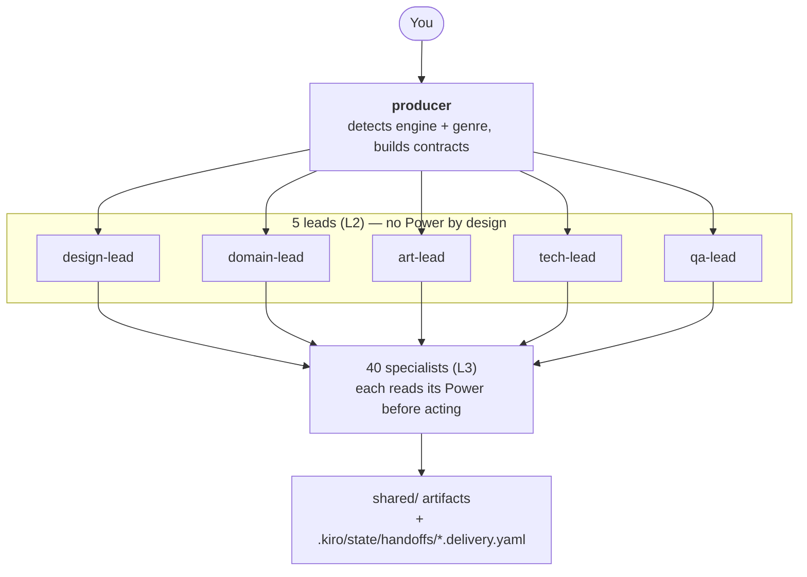
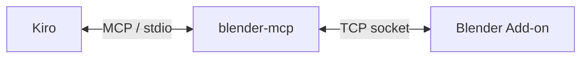
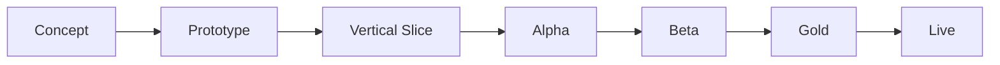
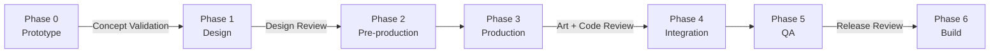

# Kiro Multi-Agent Game Studio

[English](README.md) | [繁體中文](README_ZH.md) | [简体中文](README_CN.md) | [日本語](README_JP.md) | [한국어](README_KR.md)

> **Note on language availability**: This README is the single canonical document for the project, maintained in 5 languages so the whole thing is readable without translation tooling. The five versions are kept structurally parallel — same sections, same tables, same numbers. The agent definitions under `.kiro/agents/` and the steering files under `.kiro/steering/` are written in Traditional Chinese. That does not constrain you: every agent replies in whatever language you write in. If you hit a language barrier, please open an issue.

Turn your IDE into a virtual game studio. Describe what game you want in plain language, and a coordinated team of **48 AI agents** — producer, five leads, genre specialists, artists, engine teams, QA, and publishing — plans it, builds it, and hands artifacts between each other through explicit contracts.

Domain knowledge does not live in this repository. It lives in **29 [Kiro Powers](https://kiro.dev/docs/powers/)** installed machine-wide, each independently maintained and verified against real tool connections. This repo holds the **organization layer**: who does what, in what order, and with what deliverable.

> **Why two layers**: hand-copied tool knowledge inside agent prompts goes stale. Before this split, `unity-team.md` contained 7 API calls that no longer exist. Powers are verified against live connections and update independently, so the agent prompt only carries role and handoff discipline. See [Powers](#powers).

> **Key Concepts**: terms used throughout this document (you do not need to understand them all upfront):
> - **Agent**: a role definition (`.kiro/agents/*.md`) with its own system prompt, model, and tool permissions
> - **Power**: a [Kiro Power](https://kiro.dev/docs/powers/) — a packaged domain knowledge layer (steering files) plus optional MCP server, installed machine-wide under `~/.kiro/powers/`
> - **MCP** (Model Context Protocol): a standardized protocol letting AI assistants operate development tools — Unity, Blender, ComfyUI, Figma, and others — through natural language
> - **Steering**: markdown knowledge files a Power or project injects into agent context, either always or conditionally
> - **Contract**: the YAML handoff format agents use to pass work to each other (Task Contract / Asset Contract / Change Request)
> - **Subagent delegation**: how the producer dispatches work — each subagent runs in an isolated context window, so the full contract must be written into the delegation prompt

## Features

- **One entry point** — talk to `producer`; it detects your engine and genre, then dispatches to the right leads and specialists. You do not need to know any agent names.
- **4 engines** — Unity, Godot, Unreal, Cocos Creator. The producer routes to the matching engine team instead of assuming one.
- **13 game genres** — slot, fish table, shooter, MMO, RPG, card, match-3, platformer, roguelike, strategy, simulation, rhythm, narrative adventure. Each has a dedicated domain expert with a Power behind it.
- **Advisory mode** — say "I don't know games" and leads give you a recommendation with reasoning, tradeoffs, and a default to proceed with, instead of blocking you with technical questions.
- **Externalized knowledge** — 29 Powers, 323 steering files, ~4.9 MB of domain knowledge, all outside this repo and independently updatable.
- **Quantified domain knowledge** — Powers turn design questions into math: TTK cliffs from integer division, drop-rate long tails (P90 = 2.3× the mean), jump physics solved backward from height and apex time, MMO scope tiers T1–T4.
- **Explicit contracts** — every handoff is a YAML contract with acceptance criteria; every delivery writes a manifest so downstream agents know what was produced and what is still broken.
- **Honest capability boundaries** — every Power declares what it cannot verify. Agents stop and report missing knowledge instead of guessing tool APIs.
- **Confidence tiers** — domain facts are marked `HIGH` (derivable), `MEDIUM` (convention), or `UNVERIFIED` (industry number needing your own calibration). Agents relay the tier rather than presenting all numbers as equal.

## Architecture


```mermaid
graph TD
    U([You]) --> P["<b>producer</b><br/>detects engine + genre, builds contracts"]
    subgraph LEADS["5 leads (L2) — no Power by design"]
        direction LR
        DL[design-lead]
        DOL[domain-lead]
        AL[art-lead]
        TL[tech-lead]
        QL[qa-lead]
    end
    P --> DL & DOL & AL & TL & QL
    DL & DOL & AL & TL & QL --> SP["40 specialists (L3)<br/>each reads its Power before acting"]
    SP --> OUT["shared/ artifacts<br/>+ .kiro/state/handoffs/*.delivery.yaml"]
```

Three structural decisions worth knowing:

**Powers are read at the specialist layer only.** The producer and the five leads have no Power. A lead's value is cross-specialist tradeoff judgment — you cannot ask `unity-team` whether you should use Unity, because it will always say yes. Attaching a Power to a lead would bias it toward that domain, defeating its purpose.

**Agents communicate through files, not conversation.** Subagents run in isolated contexts, so there is no live channel between them. Design truth lives in `.kiro/steering/project/gdd.md`, deliverables in `shared/`, and handoff receipts in `.kiro/state/handoffs/`.

**The producer is the router.** It reads an upstream delivery manifest and writes its contents into the next agent's delegation prompt. Nothing is assumed to be shared implicitly.

### Design basis

The team breakdown follows the six disciplines used across the game industry (Design, Art, Engineering, Audio, QA, Production) combined with iterative Agile practice. The AI-specific mechanisms — token budgeting, MCP integration, contract-based handoff — are original to this project, as is the convention of labelling explicitly which capabilities are real and which are aspiration.

| # | Reference | Author | Publisher | ISBN |
|---|-----------|--------|-----------|------|
| 1 | *The Game Production Handbook*, 3rd Edition | Heather Maxwell Chandler | Jones & Bartlett Learning, 2014 | 978-1-4496-8809-7 |
| 2 | *Agile Game Development: Build, Play, Repeat*, 2nd Edition | Clinton Keith | Addison-Wesley (Pearson), 2020 | 978-0-1365-2781-7 |
| 3 | IGDA Curriculum Framework (2008) | IGDA Education SIG | IGDA | — |

## Prerequisites

| Requirement | Notes |
|-------------|-------|
| [Kiro IDE](https://kiro.dev/) | Agents, Powers, and steering all load from Kiro |
| Git + [Git LFS](https://git-lfs.com/) | Binary assets are tracked via LFS (27 patterns in `.gitattributes`) |
| [uv](https://docs.astral.sh/uv/) | Required by the Blender, ComfyUI, Unreal, and Ableton MCP servers |
| Your target engine | Unity / Godot / Unreal / Cocos Creator — only the one you actually use |
| Node.js ≥ 18 | Only if you use the Godot or ComfyUI MCP servers (installed via `npx`) |

Optional, per pipeline: Blender (3D), ComfyUI (2D generation), Krita (hand-painted art), Ableton Live (music), a Figma account (UI).

## Installation

### Step 1 — Clone and enable LFS

```bash
git clone https://github.com/hoycdanny/kiro-multi-agent-game-studio.git
cd kiro-multi-agent-game-studio
git lfs install    # once per machine; brew install git-lfs if missing
```

### Step 2 — Open in Kiro and trust the workspace

Open the folder in Kiro IDE. On first open it asks whether you trust the workspace — **choose trust**, otherwise agents and steering will not load. The Agent Selector will then list all 48 agents.

### Step 3 — Install the Powers you need

Kiro → Powers panel → **Add custom power** → source `https://github.com/hoycdanny/<power-name>`.

**You do not need all 29.** Install only what this project will use — an agent whose Power is missing reports the gap honestly instead of improvising.

Minimum useful set for any game:

```
kiro-<your-engine>-accelerator    unity / godot / unreal / cocos — pick one
kiro-comfyui-accelerator          2D asset generation (almost always needed)
kiro-economy-balancing-expert     economy numbers + the simulation methodology balance-tester relies on
kiro-game-compliance-expert       needed the moment you plan to ship
```

Add as required:

| If you are doing | Install |
|------------------|---------|
| 3D models / animation | `kiro-blender-accelerator` |
| Hand-painted UI or sprites | `kiro-krita-accelerator` |
| Original music | `kiro-ableton-accelerator` |
| Figma designs → engine UI | `figma` (Kiro's official recommended list, not `hoycdanny`) |
| Slot / fish table | `kiro-slot-game-expert` / `kiro-fish-game-expert` |
| Wallet or payment backend | `kiro-gaming-wallet-expert` |
| RPG / shooter / card / match-3 / platformer / rhythm / strategy / simulation / roguelike / narrative | the matching `kiro-<genre>-expert` |
| Multiplayer | `kiro-mmo-netcode-expert` — **read its T1–T4 scope tiers first; most projects do not need a real MMO** |
| Save system / resource management | `kiro-game-systems-expert` |
| Localization | `kiro-i18n-expert` |
| CI / automated builds | `kiro-game-devops-expert` |
| Usability evaluation | `kiro-usability-expert` |

Verify:

```bash
ls ~/.kiro/powers/installed/                                        # installed Powers
ls ~/.kiro/powers/installed/kiro-blender-accelerator/steering/      # its steering files
ls ~/.kiro/powers/repos/kiro-blender-accelerator/templates/         # templates live in repos/, not installed/
```

> `templates/` and `hooks/` exist **only** under `~/.kiro/powers/repos/<power>/`. The `installed/` copy has just `POWER.md`, `steering/`, and `mcp.json`. If a `POWER.md` tells an agent to load a template, the path resolves against `repos/`.

### Step 4 — Connect your tool MCP servers

`.kiro/settings/mcp.json` already contains configuration for `blender-mcp`, `comfyui`, `unity-mcp`, `godot-mcp`, `unreal-engine`, `cocos-creator`, `figma`, and `github`.

> ⚠️ **`ableton` and `krita` are not in `mcp.json`.** That file is protected by IDE permission rules and cannot be written by an agent, so you must paste them in yourself — the exact blocks are in [Ableton](#ableton) and [Krita](#krita). Until you do, `audio-team` and `krita-team` stop at their connection self-check and report the gap; they will not pretend to have produced audio or artwork.

Then start the tools you actually use:

| Tool | How to connect |
|------|----------------|
| Blender | Enable the `blender_mcp` add-on and start its server (default `localhost:9876`) |
| ComfyUI | Start the local service (auto-detected on port 8188, then 8000) |
| Unity | Window → MCP for Unity → Start Server |
| Godot | `npx` installs `@coding-solo/godot-mcp` automatically; set `GODOT_PATH` |
| Unreal | Install the UnrealMCP plugin and enable it in the Editor |
| Cocos Creator | Install `cocos-mcp-server`, then Extension → Cocos MCP Server → Start |
| Figma | Official Remote MCP Server; complete OAuth in Kiro on first use |
| GitHub | Put the `github-mcp-server` binary on `PATH` and supply a PAT |
| Ableton | Enable the Remote Script bridge listening on `localhost:9877` |
| Krita | Install the Krita Python plugin; it serves `127.0.0.1:5678` |

Per-tool prerequisites, config, and failure modes: [MCP Integrations](#mcp-integrations).

## Usage

### Three ways in

| Your situation | Talk to | Why |
|----------------|---------|-----|
| You have a goal but no game-dev background | `producer` | It enters advisory mode and delegates leads to recommend, rather than interrogating you |
| You know the domain and want a professional judgment | the matching **lead** | Skips a dispatch hop; the lead answers selection questions directly |
| Narrow, self-contained question | the **specialist** | e.g. ask `shooter-expert` how TTK is calculated |

What each lead can decide for you:

| Lead | Decides | Typical question |
|------|---------|------------------|
| `tech-lead` | **Engine selection**, architecture tradeoffs, performance budget, whether you need multiplayer | "Which engine for a slot machine?" |
| `domain-lead` | Which genre this is, which domain expert to activate, precedence when genres overlap | "Is this a roguelike or an RPG?" |
| `design-lead` | What the core loop should be, how small to cut scope, which system to build first | "How far should v1 go?" |
| `art-lead` | Art direction, 2D vs 3D, generative vs hand-painted split, audio tone | "What style suits this theme?" |
| `qa-lead` | What to test at this stage, what counts as shippable | "Can we ship now?" |

**Why selection questions must go to a lead, not a specialist**: you cannot ask `unity-team` whether to use Unity — it will always say yes. All four engine teams have a stake, and both casino domain experts want the job. A lead has no single tool's baggage within its scope; that is the structural reason it exists.

Going straight to a specialist is fastest when the question is narrow and needs no cross-domain coordination:

| Question | Ask | Power it reads |
|----------|-----|----------------|
| "HP 100, damage 33 — what's the TTK?" | `shooter-expert` | `kiro-shooter-expert` |
| "1% gacha rate — how many pulls for 90% confidence?" | `economy-designer` | `kiro-economy-balancing-expert` |
| "40-card deck, 3 copies — odds of drawing one in the opening 5?" | `card-game-expert` | `kiro-card-game-expert` |
| "This FBX imports into Unity at the wrong scale" | `blender-team` | `kiro-blender-accelerator` |
| "Jump 3 tiles high, 0.35 s to apex — what gravity?" | `platformer-expert` | `kiro-platformer-expert` |

A specialist gives you a spec but will not coordinate downstream work. Turning a spec into an implementation goes back through the producer.

### Example commands

```
"Build a slot machine in Unity"
"I want to make a slot machine but I don't know anything about games"     → advisory mode
"Which engine should I use for a mobile match-3?"                        → ask tech-lead
"HP is 100 and damage is 33 — what is the TTK?"                          → ask shooter-expert
"40-card deck with 3 copies — odds of drawing one in the opening 5?"      → ask card-game-expert
"Implement this skill tree in Unity, spec is in specs/skill-tree.md"      → skips advisory mode
```

### Walkthrough A — a beginner with one sentence

> **You**: I want to make a slot machine, but I don't know anything about game development.

1. **`producer`** detects two things: genre is casino, and the user declared no background → enters **advisory mode** (`.kiro/steering/global/advisory-mode.md`).

2. It does **not** dump technical questions on you. It delegates `tech-lead` for engine selection and `domain-lead` to confirm which expert to activate.

3. **`tech-lead`** answers in the four-part advisory format:
   > **Recommendation**: Cocos Creator.
   > **Reasoning**: slot machines are 2D, need web plus mobile targets, and are animation- and UI-heavy; Cocos has the most direct 2D pipeline and web export maturity for that combination.
   > **Tradeoff**: if you later want a 3D version or already have Unity staff, Unity is better; a pure web frontend team could consider PixiJS.
   > **Default**: if you do not reply, proceeding with Cocos Creator.

4. **`slot-game-expert`** reads `kiro-slot-game-expert` and **asks for your target jurisdiction first** — because "what should the minimum spin interval be" has different legal answers per market. If you say undecided, it proceeds with the most conservative assumption (entertainment-only prototype, no real money) and labels that assumption explicitly.

5. Producer relays the recommendations and asks **one** question: "Shall we start?"

6. On approval the pipeline runs:

```
slot-game-expert   → math model (RTP / volatility / paytable)
balance-tester     → reads simulation-methodology.md, Monte Carlo verification of actual RTP
art-lead           → comfyui-team generates symbols and background
ui-ux-team         → reads the figma Power, produces layout + Design Tokens
cocos-team         → reads kiro-cocos-accelerator, assembles scene and logic
qa-lead            → functional-tester verifies flow
compliance-release → reads kiro-game-compliance-expert (if you intend to ship)
```

You answered "yes" exactly once. That is the point of advisory mode.

### Walkthrough B — you already have a spec

> **You**: Implement this skill tree in Unity, the spec is in `specs/skill-tree.md`.

1. Producer does **not** enter advisory mode. `advisory-mode.md` explicitly forbids re-confirming decisions you have already made.
2. It builds a Task Contract, delegates `tech-lead`, which forwards to `unity-team`.
3. `unity-team` reads the relevant `kiro-unity-accelerator` steering (scene assembly / scripting / build) rather than guessing MCP tool names.
4. On completion it writes a delivery manifest to `.kiro/state/handoffs/TASK-xxx.delivery.yaml`.
5. `tech-lead` does code review; the producer reports back to you.

If the spec has a numbers problem — say the skill-point growth curve is unreasonable — `unity-team` does not fix it on its own. It reports back, and the producer routes it to `rpg-systems-expert`.

### Walkthrough C — analysis only, build nothing

> **You**: If I build a card game with PvP, what is the biggest technical risk?

The producer recognises an analysis question, delegates several leads in parallel, and returns a consolidated risk list. **No Task Contract is created and no files are produced.**

- `tech-lead`: PvP sync architecture, pulling in `mmo-expert` to classify it as T1 or T2 on the `kiro-mmo-netcode-expert` scope scale
- `domain-lead` → `card-game-expert`: power creep as a long-term structural risk
- `design-lead`: first-player advantage is structural in card PvP and must be measured, not assumed
- `qa-lead`: sample size needed for match simulation (±1pp precision needs roughly 9,604 matches)

Work starts only when you ask for work. Analysis questions do not silently generate a pile of files.

### Where to look for project state

Agents have no live channel between them, so current state lives in files:

| You want to know | Look at |
|------------------|---------|
| What the game design currently is | `.kiro/steering/project/gdd.md` |
| What art and audio direction was decided | `.kiro/steering/project/style-guide.md` |
| What tasks exist and their status | `.kiro/state/tasks.yaml` |
| What a task delivered and what is still broken | `.kiro/state/handoffs/<contract_id>.delivery.yaml` |
| The actual asset files | `shared/` (models / textures / sprites / audio / locales / sim) |
| Which milestone you are at | `.kiro/steering/project/milestones.md` |
| Which agent has which Power | `.kiro/steering/global/powers-registry.md` |

Delivery records are **append-only**: to correct one, add a new entry rather than editing the old one, so the history stays traceable.

## Project Structure

```
.kiro/
├── agents/              48 agent definitions, grouped by layer
│   ├── orchestration/   creative-director, producer
│   ├── design/          5 core design roles + 13 genre domain experts + ui-ux + economy + localization
│   ├── art/             art-lead, blender, comfyui, krita, animator, audio, vfx, technical-artist
│   ├── engineering/     tech-lead + 4 engine teams + systems/ui programmer, devops, wallet
│   ├── qa/              qa-lead + functional / balance / performance / usability
│   └── publishing/      compliance-release, marketing-team
├── steering/
│   ├── global/          contracts, asset-standards, bug-severity, powers-registry, advisory-mode
│   └── project/         gdd, style-guide, milestones      ← your game's single source of truth
├── state/               tasks.yaml, handoffs/*.delivery.yaml
└── settings/mcp.json    MCP server configuration

shared/                  cross-agent artifact staging
├── concept/ textures/ sprites/ ui/     from comfyui-team
├── models/                             from blender-team
├── rigs/ animations/                   from animator
├── audio/{sfx,music,voice}/            from audio-team
├── locales/                            from localization-team
└── sim/                                from balance-tester
```

`~/.kiro/powers/` — the knowledge layer, **outside this repo**, machine-wide.

Each agent has both a `.md` (frontmatter + system prompt) and a `.json`. The subdirectory is organizational only: Kiro registers agents by the flat `name` in frontmatter, so you delegate with `Use the "blender-team" subagent to ...`, never `"art/blender-team"`.

## Agent Layers

| Layer | Count | Composition |
|-------|:-----:|-------------|
| L0 Strategy | 2 | `creative-director` (vision gate), `producer` (dispatch hub) |
| L2 Lead | 5 | `design` / `domain` / `art` / `tech` / `qa` — dispatch intermediaries and quality gates, **no Power by design** |
| L3 Design & Genre | 20 | 7 core design roles + 13 genre domain experts |
| L3 Art & Audio | 7 | Blender, ComfyUI, Krita, Animator, Audio, VFX, Technical Artist |
| L3 Engineering | 8 | 4 engine teams + Systems/UI Programmer, DevOps, Wallet |
| L3 QA | 4 | functional / balance / performance / usability |
| L3 Publishing | 2 | compliance-release, marketing-team |

**33 of 48 have a Power**; the other 15 are coordination roles whose knowledge *is* this project's organizational convention. See [Powers](#powers).

### The 13 genre domain experts

Each is activated on demand by `domain-lead`, never all at once.

| Expert | Covers |
|--------|--------|
| `slot-game-expert` | Slot machines: math model, RNG, certification, jurisdiction matrix, responsible gaming |
| `fish-game-expert` | Fish tables: capture RNG, payout, multiplayer fairness, payout-control red lines |
| `shooter-expert` | FPS/TPS: weapon stats, ballistics, hit detection, recoil, bot AI, gunfeel |
| `mmo-expert` | Multiplayer: server authority, replication, interest management, latency compensation |
| `rpg-systems-expert` | Stats, level curves, skill trees, loot rarity, damage formulas, status effects |
| `card-game-expert` | Deckbuilders/TCG: draw probability, cost curves, archetypes, power creep control |
| `puzzle-match3-expert` | Board generation, solvability, cascades, difficulty curve, moves economy |
| `platformer-expert` | Jump physics, input forgiveness, level rhythm, metroidvania ability gating |
| `roguelike-expert` | Procedural generation, run builds and synergy, meta progression, scaling |
| `strategy-expert` | RTS / turn-based / 4X / tower defense: unit counters, economy, AI, wave curves |
| `simulation-expert` | Production chains, resource loops, automation, survival needs, emergence |
| `rhythm-expert` | Beatmaps, timing windows, audio/input offset calibration, scoring |
| `narrative-adventure-expert` | Branching structure, flags and state, dialogue trees, endings and convergence |

### Agent definition format

Each agent is a markdown file under `.kiro/agents/`. YAML frontmatter defines permissions; the body is the system prompt.

Two design principles run through every agent in this project:

**"On standby" is not a background process.** Kiro custom agents have no daemon. An agent is only "awake" when selected, and its first step is always to judge the situation — greeting versus concrete request versus tool not connected — before deciding whether to act. `blender-team`, for instance, runs a connection self-check with `get_blendfile_summary_path_info` and stops if it fails, rather than starting to model.

**Admitting a limit beats performing a capability.** No agent fabricates another team's results or progress. `producer` reports only what a subagent actually returned.

Example prompts are deliberately not pasted here. They used to be, and the excerpts drifted out of sync with the real files after refactors. Open the file instead.

### Model assignment

Each agent pins a model in frontmatter. The `.json` value is what takes effect; the `.md` frontmatter is kept in sync. Measured distribution across the 48 agents:

| Model | Count | Assigned to | Rationale |
|-------|:-----:|-------------|-----------|
| `claude-sonnet-5` | 7 | `creative-director`, `producer`, the 5 leads | Dispatch and review gates: multi-step agentic work where an error propagates down the whole pipeline |
| `deepseek-3.2` | 9 | `slot-game-expert`, `fish-game-expert`, `rpg-systems-expert`, `shooter-expert`, `card-game-expert`, `strategy-expert`, `economy-designer`, `balance-tester`, `wallet-systems-expert` | Numeric and probabilistic reasoning: RTP, payout, growth curves, economy convergence, ledger consistency |
| `claude-sonnet-4` | 20 | All art roles, general design, remaining genre experts, `ui-ux-team`, `compliance-release` | General strength is sufficient; this is the largest tier |
| `qwen3-coder-next` | 7 | 4 engine teams, `systems-programmer`, `ui-programmer`, `devops-team` | Pure coding and tool orchestration |
| `claude-haiku-4.5` | 5 | `functional-tester`, `performance-tester`, `usability-tester`, `localization-team`, `marketing-team` | High call volume, low cost per individual error |

> This split is derived from Kiro's published model positioning combined with task type and cost — **not from benchmarking inside this project**. Adjust to taste: if an agent's output feels shallow, move it up a tier or raise reasoning effort.

Levers: raise `slot-game-expert` / `fish-game-expert` / `wallet-systems-expert` to `claude-opus-4.8` if you want more safety where miscalculation is expensive; set everything to `auto` if you would rather not tune. A model ID that does not exist in your `/model` list silently falls back to the default. Note that some models are Experimental and region-limited, so check availability in your own environment.

## Powers

Agents are the **organization layer**. [Kiro Powers](https://kiro.dev/docs/powers/) are the **domain knowledge layer**. All 29 are installed and populated: **323 steering files, roughly 4.9 MB.**

The authoritative mapping lives in `.kiro/steering/global/powers-registry.md`, which every agent loads automatically. The tables below are the human-readable version.

### Engine and tool Powers (Accelerator — 12 agents)

Each backs a real MCP server, and its knowledge is verified against a live connection.

| Agent | Power | Steering | What it solves |
|-------|-------|:--------:|----------------|
| `unity-team` | `kiro-unity-accelerator` | 15 | Scene / assets / build / performance / architecture / platform compatibility |
| `godot-team` | `kiro-godot-accelerator` | 13 | Scene architecture / GDScript / signals / TileMap / export |
| `unreal-team` | `kiro-unreal-accelerator` | 11 | Levels / Blueprint / materials / GAS / UE5 features |
| `cocos-team` | `kiro-cocos-accelerator` | 14 | Scenes / node components / prefabs / cross-platform build |
| `blender-team` | `kiro-blender-accelerator` | 15 | Modeling / UV / materials / export. **Axis orientation and color space fail silently most often** |
| `animator` | same | — | Reads `rigging-and-skinning.md` / `animation-authoring.md` |
| `technical-artist` | same | — | Reads `collider-and-lod.md` / `performance-and-limits.md` |
| `comfyui-team` | `kiro-comfyui-accelerator` | 11 | Model selection / prompt / sampler / ControlNet / upscaling / VRAM |
| `vfx-artist` | same | — | Effects assets, sharing the Power with `comfyui-team` |
| `krita-team` | `kiro-krita-accelerator` | 13 | Canvas / brushes / layers / masking / composition / export |
| `audio-team` | `kiro-ableton-accelerator` | 11 | Arrangement / mixing / theory / drum groove / genre playbooks |
| `ui-ux-team` | `figma` | 3 | Reading layouts / extracting Design Tokens / Code Connect / design system rules |

> The `figma` Power assumes Figma → web frontend code, while this project needs Figma → native engine UI. Follow it for reading layouts and extracting tokens, but produce this project's handoff spec rather than HTML/CSS.

### Genre domain experts (Knowledge Base — 13 agents)

Pure knowledge, no MCP server. The value is turning design questions into computable math rather than offering generic advice.

| Agent | Power | Steering | Technical core |
|-------|-------|:--------:|----------------|
| `slot-game-expert` | `kiro-slot-game-expert` | 12 | Math model / RNG / certification / jurisdiction matrix / responsible gaming |
| `fish-game-expert` | `kiro-fish-game-expert` | 16 | Capture RNG / payout / multiplayer fairness / payout-control limits / certification |
| `rpg-systems-expert` | `kiro-rpg-systems-expert` | 11 | Extreme-value behavior of three damage formula families, loot long tail (P90 = 2.3× the mean), skill-tree trap detection |
| `shooter-expert` | `kiro-shooter-expert` | 10 | **TTK cliffs** — at 100 HP, 34 damage needs 3 shots and 33 needs 4, a 33% TTK jump from one point of damage; recoil models; weapon dominance tests |
| `card-game-expert` | `kiro-card-game-expert` | 10 | Hypergeometric draw tables, quantified power-creep detection, HHI meta diversity, `C(n,2)` keyword interactions |
| `puzzle-match3-expert` | `kiro-puzzle-match3-expert` | 11 | Three tiers of solvability (the third is not mathematically provable), board rejection rates, pass-rate sensitivity spanning 37× |
| `platformer-expert` | `kiro-platformer-expert` | 10 | Jump physics solved backward (`g = 2h/t²`), three input-forgiveness mechanisms, gating deadlock graph detection |
| `rhythm-expert` | `kiro-rhythm-expert` | 10 | Audio clock as the authority (frame timing drifts ~1 s over 3 minutes), audio and input offset must stay separate |
| `strategy-expert` | `kiro-strategy-expert` | 10 | Four sub-genre constraints, counter-matrix imbalance tests, tower-defense wave/income coupling, AI difficulty fairness |
| `simulation-expert` | `kiro-simulation-expert` | 10 | Production chains and supply/demand convergence, closed resource loops, long-run collapse detection |
| `roguelike-expert` | `kiro-roguelike-expert` | 9 | Procedural generation correctness, seed architecture, build synergy ceilings, meta progression balance |
| `narrative-adventure-expert` | `kiro-narrative-adventure-expert` | 14 | Branch topologies and their maintenance cost, flag design, reachability and dead-end verification |
| `mmo-expert` | `kiro-mmo-netcode-expert` | 11 | **Scope tiers T1–T4** — most projects asking for an MMO actually need T2; bandwidth and capacity models; latency compensation tradeoffs |

### Cross-domain Powers (Knowledge Base — 8 agents)

| Agent | Power | Steering | Technical core |
|-------|-------|:--------:|----------------|
| `economy-designer` | `kiro-economy-balancing-expert` | 13 | Currency tiers / sink-source closure / gacha expected cost and pity math / progression curves |
| `balance-tester` | same | — | Reads `simulation-methodology.md`: sample size from `n ≥ (1.96σ/ε)²`, convergence checks, RNG stream separation |
| `compliance-release` | `kiro-game-compliance-expert` | 14 | Ratings / privacy / submission / store assets / disclosure duties. **Includes 45 categories of claims that will expire** |
| `wallet-systems-expert` | `kiro-gaming-wallet-expert` | 10 | API / DB schema / idempotency and locking / reconciliation / observability / payment compliance |
| `systems-programmer` | `kiro-game-systems-expert` | 9 | Save envelopes and migration chains (stepwise `N-1` vs shortcut `N(N-1)/2`), atomic write ordering, event storms at `f^d` |
| `localization-team` | `kiro-i18n-expert` | 10 | Why string concatenation has no general solution / CJK line-break rules / RTL mirroring / font subsetting and tofu |
| `devops-team` | `kiro-game-devops-expert` | 9 | Headless builds for four engines / **eight artifact verification checks** (exit code 0 has seven distinct failure shapes) / versioning / Git LFS |
| `usability-tester` | `kiro-usability-expert` | 8 | Five evidence tiers / onboarding review / friction analysis / playtest design |

### Why 15 agents deliberately have no Power

This is a design decision, not an omission.

| Agent | Why not |
|-------|---------|
| `producer`, `creative-director` | Dispatch and vision are this project's organizational knowledge, belonging to no single domain |
| The 5 leads | **Value comes from cross-specialist tradeoff judgment.** A Power would bias a lead toward that domain, and neutrality during selection is exactly why it exists — you cannot ask `unity-team` whether to use Unity |
| `game-designer` | GDD integration role; its domain knowledge is spread across the 13 genre Powers |
| `level-designer` | Level design knowledge already lives in the platformer / strategy / puzzle / roguelike Powers |
| `ui-programmer` | UI binding is covered by each engine's Power |
| `functional-tester` | Functional test method varies by project; the CI execution side sits in the devops Power |
| `performance-tester` | Measurement depends on each engine's profiler; that knowledge is in the engine Powers' performance chapters |
| `narrative-designer` | Narrative *system structure* is in the narrative-adventure Power; this role produces *content* |
| `combat-designer` | Combat numbers are in the shooter / rpg Powers; this role serves genres with no dedicated Power |
| `marketing-team` | Text-only output, no tool dependency |

### Confidence tiers — read before quoting any number

Knowledge Base Powers mark content in three tiers, and agents are required to relay the tier as-is:

| Tier | Meaning | How to relay |
|------|---------|--------------|
| `HIGH` | Derivable by math or set by published standard (formulas, combinatorics, Unicode/CLDR rules, POSIX semantics) | Usable directly as a conclusion |
| `MEDIUM` | Widely adopted convention, not the only answer | State what premise would change the recommendation |
| `UNVERIFIED` | Industry figure from training data, unchecked and drifting over time | **Must be stated as needing calibration against your own data** |

`UNVERIFIED` is a meaningful share of the total, concentrated in four areas:

- Every "industry average" (retention, ARPPU, typical TTK bands, coyote-time milliseconds, recommended participant counts)
- Every regulatory detail (rating questionnaires, platform policy, odds-disclosure duties — in `kiro-game-compliance-expert`, `UNVERIFIED` is deliberately the majority)
- Every engine-side behavior (no Power has a live connection to verify import settings or APIs)
- Every platform latency and hardware spec figure

If you see a specific number with no tier marking, ask whether it is derivable or needs calibration.

### The knowledge base lives outside this repo

| | Holds | Location |
|---|---|---|
| **This repo** | **Routing and organization**: which agent maps to which Power, which steering file to read, when to read it, how to report a gap | `.kiro/` |
| **Kiro Powers** | **The knowledge itself** | `~/.kiro/powers/installed/` (machine-wide, outside the repo) |

Verifiable facts: all 323 Power steering files are outside this repo; searching the repo for strings unique to Power content returns zero hits (tested with `Redlock`, `euler_ancestral`, `GPU Resident Drawer`, `krita_select_by_alpha`); every in-repo mention of a Power is a path or filename reference, not copied content. A disk check of all **376 steering filenames referenced across the 48 agent prompts found zero fabricated names**.

**The cost, stated honestly**: this repo is **not self-contained**. Clone it and the knowledge layer for 33 agents is empty until you install the Powers from the Powers panel. There is no machine-checkable manifest or setup script — only this document and the mapping in `powers-registry.md`.

### Coverage gap analysis

All 29 Powers are referenced by at least one agent (zero orphans). Four domains have **no** Power coverage. This is not a to-do list; it is an honest inventory, with who covers for it now and the cost of leaving it:

| Gap | Affected agent | Covered by | Cost of not filling it |
|-----|---------------|-----------|------------------------|
| **Cross-engine profiling methodology** | `performance-tester` | Performance chapters of each engine Power (scattered, single-engine view) | Performance numbers are noisy; without methodology it is easy to optimize the wrong thing and not notice. Missing: what to measure, frame-budget attribution, statistical validity, platform-specific traps |
| **Melee combat for fighting/action games** | `combat-designer` | Its own prompt. The shooter Power covers shooting only, the rpg Power numbers only | Frame data, hitbox/hurtbox, input buffer and cancel windows, combo design, hitstop are covered by **no Power**. Fighting is absent from the 13 genres |
| **Narrative authoring craft and tooling** | `narrative-designer` | Its own prompt. The narrative-adventure Power covers *system structure*, not content | Ink / Yarn / Twine syntax and conventions, World Bible structure, dialogue craft rest on base model knowledge alone |
| **Store conversion and trailer structure** | `marketing-team` | Its own prompt | Store page conversion elements, trailer shot-list structure, press kit composition are accumulable craft knowledge |

The 13 genres also leave **fighting, racing, sports, horror, and party games** uncovered. Fighting has the most distinctive mechanics — frame data is a discipline of its own — while the other four are partly served by existing experts. Whether to add any depends on what you actually build; **do not add Powers for coverage's sake**, since 48 agents is already a size that needs careful management.

### Adding a new Power

Powers come in two archetypes: **Accelerator** (wraps a real MCP server; knowledge verified against a live connection) and **Knowledge Base** (pure domain knowledge, no server, confidence-tiered).

Three tests for whether a Power is worth building:

1. **Does the content exceed what a base model already knows?** If a language model already knows it, the Power's value is near zero — it just relocates the same knowledge. Value comes from concrete numbers and derivations (a TTK cliff threshold table), verifiable API facts (Blender 5.x removed `action.fcurves`), and current regulation with dates.
2. **How expensive is being wrong?** Save migration corrupts player progress; compliance errors get you delisted. Prioritize those.
3. **Will the knowledge go stale?** Things that expire (tool APIs, regulation) belong in a Power precisely because a Power updates independently. Timeless math can live anywhere.

After finishing a Power: install it via the Powers panel, add the agent ↔ Power row to `.kiro/steering/global/powers-registry.md`, add it to the inventory tables above, and confirm every steering filename you reference actually exists on disk.

## MCP Integrations

> **This section covers how to connect, not how to use.** Exact tool names, parameters, and correct operation order are authoritative in each Power's `POWER.md` and `steering/`, which are verified against live connections and updated independently. Any tool list here is conceptual and may lag.
>
> If a call returns `Unknown action` or a parameter validation error, **the legal values in the error message are the highest authority**, ahead of any documentation.

### Blender

`art/blender-team`, `animator`, and `technical-artist` drive Blender through a lightweight MCP server.


```mermaid
graph LR
    K[Kiro] <-->|MCP / stdio| M[blender-mcp] <-->|TCP socket| B[Blender Add-on]
```

> ⚠️ **Security**: the MCP server executes LLM-generated code inside Blender with no sandbox. Use a VM or a machine without sensitive data.

Prerequisites: [Blender 5.1+](https://www.blender.org/download/), [uv](https://docs.astral.sh/uv/), Kiro.

```json
"blender-mcp": {
  "command": "uv",
  "args": ["--directory", "/path/to/blender_mcp/mcp", "run", "blender-mcp"],
  "disabled": false,
  "autoApprove": []
}
```

1. Install uv: `curl -LsSf https://astral.sh/uv/install.sh | sh`
2. `git clone https://projects.blender.org/lab/blender_mcp.git`
3. Install the add-on — drag the release `.zip` onto the Blender window twice (first adds the Blender Lab repository, second installs), or Edit → Preferences → Extensions → Install from Disk
4. Point the `--directory` argument at your own clone of `blender_mcp/mcp`

Kiro starts and manages the process; you do not need a terminal. **Open Blender and confirm the add-on is enabled before waking `blender-team`** — it self-checks the connection with `get_blendfile_summary_path_info` and stops rather than proceeding blind.

Tooling spans read-only inspection (`get_objects_summary`, `get_object_detail_summary`, `get_blendfile_summary_*`), screenshots, viewport rendering, and `execute_blender_code` for arbitrary `bpy` work.

Reference: [Blender MCP](https://www.blender.org/lab/mcp-server/#llm-client) · [source](https://projects.blender.org/lab/blender_mcp)

### ComfyUI

`art/comfyui-team` and `vfx-artist` generate images through [`artokun/comfyui-mcp`](https://github.com/artokun/comfyui-mcp) (108 tools, MIT).

Comfy's official options were rejected for concrete reasons: Comfy Cloud MCP needs a subscription and credits; the first-party Comfy Local MCP is in closed beta and unobtainable; Comfy CLI is a shell command, not an MCP tool.

```json
"comfyui": {
  "command": "npx",
  "args": ["-y", "comfyui-mcp"],
  "env": {
    "CIVITAI_API_TOKEN": "",
    "HUGGINGFACE_TOKEN": ""
  },
  "disabled": false,
  "autoApprove": []
}
```

1. Start ComfyUI locally. The server auto-detects it — port 8188 (CLI default) then 8000 (Desktop app).
2. No `COMFY_URL`, workflow JSON path, or node ID is needed; high-level tools build the workflow.
3. `CIVITAI_API_TOKEN` and `HUGGINGFACE_TOKEN` are optional, only for downloading models from those platforms.
4. Non-standard install location: set `COMFYUI_PATH` to the data directory.

Tools group into high-level generation (`generate_image`, `generate_with_controlnet`, `generate_with_ip_adapter`, `generate_audio`), asset iteration, workflow assembly, model management, and diagnostics (`clear_vram`).

> Security: the server binds locally. Do not expose it without additional auth. If you fill in API keys, use environment variables rather than committing them.

### Unity

`engineering/unity-team` operates the Unity Editor through [CoplayDev/unity-mcp](https://github.com/CoplayDev/unity-mcp).

```json
"unity-mcp": {
  "url": "http://127.0.0.1:8080/mcp",
  "transport": "http",
  "disabled": false,
  "autoApprove": []
}
```

1. Package Manager → Add package from git URL → `https://github.com/CoplayDev/unity-mcp.git?path=/MCPForUnity#main`
2. Window → MCP for Unity → Start Server
3. If the window reports a port other than 8080, update `url` to match

Fallback when the port is taken or a firewall interferes: stdio, `{ "command": "uvx", "args": ["unity-mcp"], "transport": "stdio" }`.

> HTTP is deliberate — the endpoint only talks to the Unity Editor on loopback, so traffic never leaves the machine and HTTPS is unnecessary. Do not bind it publicly.

**Tool lists are intentionally omitted here.** They live in `~/.kiro/powers/installed/kiro-unity-accelerator/POWER.md`, which marks each entry as verified against a live connection. A hand-copied table used to sit in this position and listed several actions that do not exist — `manage_asset(list)` is really `search`, `manage_editor(action:"build")` is really `manage_build`, `manage_graphics(get_rendering_stats)` is really `stats_get` — plus `project_info` and `editor_state` resources the Power explicitly says not to assume exist. That is the origin of this project's two-layer split.

### Godot

`engineering/godot-team` uses [Coding-Solo/godot-mcp](https://github.com/Coding-Solo/godot-mcp) (npm `@coding-solo/godot-mcp`).

```json
"godot-mcp": {
  "command": "npx",
  "args": ["-y", "@coding-solo/godot-mcp"],
  "env": {
    "GODOT_PATH": "/Applications/Godot.app/Contents/MacOS/Godot",
    "DEBUG": "false"
  },
  "disabled": false,
  "autoApprove": []
}
```

1. Install Node.js ≥ 18 and Godot.
2. `npx` fetches and starts the server automatically — no manual clone or build.
3. Set `GODOT_PATH` to your Godot binary. If Godot is already on `PATH` you can omit it.

Tools cover project control (`launch_editor`, `run_project`, `stop_project`, `get_project_info`), scene editing (`create_scene`, `add_node`, `edit_node`, `load_sprite`, `save_scene`), debug output, and UID handling for Godot 4.4+.

Failure modes: `run_project` blocks until the game window closes — use `stop_project` to interrupt rather than treating it as an error to retry; the UID tools require 4.4+, older versions use `res://` paths.

### Unreal

`engineering/unreal-team` uses the open-source local MCP from [flopperam/unreal-engine-mcp](https://github.com/flopperam/unreal-engine-mcp) — the `Python/` server plus the `UnrealMCP` C++ plugin — not the paid hosted variant. The hosted Flop MCP offers 50+ tools including Niagara and Sequencer, but requires a paid API key and a remote round trip.

```json
"unreal-engine": {
  "command": "uv",
  "args": [
    "--directory",
    "/ABSOLUTE/PATH/TO/unreal-engine-mcp/Python",
    "run",
    "unreal_mcp_server_advanced.py"
  ],
  "disabled": false,
  "autoApprove": []
}
```

1. Clone outside your Unreal project: `git clone https://github.com/flopperam/unreal-engine-mcp.git`
2. Copy the plugin into the project (run from the `.uproject` directory): `cp -r ~/path/unreal-engine-mcp/UnrealMCP Plugins/`
3. Right-click the `.uproject` → Generate project files → build Development Editor
4. Editor → Edit → Plugins → enable `UnrealMCP` → restart
5. Install Python 3.12+ and uv, then point `--directory` at your absolute `Python/` path

Tools cover Blueprint scripting and analysis, world building, physics and materials, and actor management.

Known issues `unreal-team` already routes around: **never issue the `ce` console command** — through MCP it crashes the Editor instantly; `set_component_property` on `OverrideMaterials` is unreliable, so use the verified Blueprint SCS approach; avoid long Undo chains, preferring explicit re-application.

### Cocos Creator

`engineering/cocos-team` uses [DaxianLee/cocos-mcp-server](https://github.com/DaxianLee/cocos-mcp-server). Well suited to lightweight cross-platform and H5 games, including slot machines that need fast multi-platform deployment.

```json
"cocos-creator": {
  "url": "http://127.0.0.1:3000/mcp",
  "transport": "http",
  "disabled": false,
  "autoApprove": []
}
```

1. Download `cocos-mcp-server` or install from the [Cocos Store](https://store.cocos.com/app/detail/7941)
2. Copy the folder to `extensions/cocos-mcp-server/` in your Cocos project
3. `cd extensions/cocos-mcp-server && npm install && npm run build`
4. Restart Cocos Creator or refresh extensions
5. Extension → Cocos MCP Server → set port (default 3000) → Start
6. If the port differs, update `url`

Tools are prefixed by area: `scene_*`, `node_*`, `component_*`, `prefab_*`, `project_*`, `debug_*`, `advancedAsset_*`.

Failure modes `cocos-team` guards against: `node_create_node` without a `parentUuid` creates at the scene root; `component_set_component_property` **fails silently** if `propertyType` is omitted; asset paths must use the `db://` prefix, never filesystem paths; 2D nodes use x/y while 3D uses x/y/z.

### Figma

`design/ui-ux-team` reads layouts and Design Tokens through the [official Figma MCP Server](https://developers.figma.com/docs/figma-mcp-server/). Kiro is a documented supported client.

Figma owns the UI/UX layer only: UX flow, UI layout (HUD, menus, modals, store; a slot machine's reel frame, spin button, paytable), the design system (color, type scale, spacing, button states), and handoff (coordinates, sizes, spacing, colors, a slice list). 3D models and PBR textures go to `blender-team` and `comfyui-team`; game logic to the engine team; pixel assets to `comfyui-team`. Figma decides layout, flow, and tokens — the engine team rebuilds it in Unity UI Toolkit, Godot Theme, Unreal UMG, or Cocos UI.

```json
"figma": {
  "url": "https://mcp.figma.com/mcp",
  "transport": "http",
  "disabled": false,
  "autoApprove": []
}
```

1. First use in Kiro completes OAuth — no token in `mcp.json`
2. In Figma, select the frame to implement → right-click → **Copy link to selection**
3. Switch to `ui-ux-team`, paste the link, describe the requirement (the node ID is parsed from the URL)
4. It extracts layout and tokens into a handoff spec
5. Hand decorative asset requests to `comfyui-team`, then hand the spec to the engine team

Alternatives: official Desktop (`http://127.0.0.1:3845/mcp`, needs a paid Dev/Full seat) or the community Framelink server (`npx -y figma-developer-mcp --figma-api-key=${FIGMA_TOKEN} --stdio`, reads via REST). If you use Framelink, keep the token in an environment variable.

### GitHub

`producer` reads and writes issues, pull requests, and **Projects boards** through the official [GitHub MCP Server](https://github.com/github/github-mcp-server) — the substitute for a separate task tracker, keeping tasks and code in one place.

```json
"github": {
  "command": "github-mcp-server",
  "args": ["stdio"],
  "env": { "GITHUB_PERSONAL_ACCESS_TOKEN": "" },
  "disabled": false,
  "autoApprove": []
}
```

1. Download the binary from [releases](https://github.com/github/github-mcp-server/releases), or `go install github.com/github/github-mcp-server/cmd/github-mcp-server@latest`
2. Put it on `PATH`
3. Create a PAT with at least repo / issues / projects scope
4. Supply it via environment variable rather than committing it

Alternatives: the official Remote endpoint (`https://api.githubcopilot.com/mcp/`, zero install but requires a Copilot entitlement) or local Docker.

> This server exposes many tools and consumes noticeable context. Narrow it with `--toolsets` (or the `X-MCP-Toolsets` header when remote) to just `issues` and `projects` if needed. A PAT is a high-privilege credential — grant minimum scope.

### Ableton

`art/audio-team` produces music — arrangement, harmony, drum groove, mixing — through Ableton Live. SFX and voice stay on the ComfyUI path.

> ⚠️ **Add this to `mcp.json` yourself.** `.kiro/settings/mcp.json` is protected by IDE permission rules and cannot be written by an agent.

```json
"ableton": {
  "command": "uvx",
  "args": ["ableton-mcp"],
  "env": {
    "ABLETON_HOST": "localhost",
    "ABLETON_PORT": "9877",
    "ABLETON_MCP_DISABLE_TELEMETRY": "true"
  },
  "disabled": false,
  "autoApprove": []
}
```

1. Install [Ableton Live](https://www.ableton.com/)
2. Install [uv](https://docs.astral.sh/uv/) (`uvx` ships with it)
3. Enable the MCP bridge Remote Script in Ableton so it listens on `localhost:9877`
4. Open Ableton Live before waking `audio-team`

Until it is configured, `audio-team` stops at its self-check and reports the gap — **it will not pretend to have produced audio files**. The ComfyUI path for SFX and voice keeps working regardless.

The Power's `POWER.md` opens with a scenario-selection table that `audio-team` reads before choosing steering. **Before modifying an existing Ableton project it must read `operation-safety.md`** — destructive DAW operations are hard to undo.

### Krita

`art/krita-team` does digital painting and hand cleanup: compositing generated assets, masking, fixing composition, and coloring, or painting sprites, UI, and textures from scratch.

Generative AI is fast but uncontrolled. `comfyui-team` generates; `krita-team` makes it deliverable. That is a common gap between AI output and shippable game art.

> ⚠️ **Add this to `mcp.json` yourself** — same permission restriction as Ableton.

```json
"krita": {
  "command": "python3",
  "args": ["${HOME}/krita-mcp/server.py"],
  "transport": "stdio",
  "env": {
    "KRITA_URL": "http://127.0.0.1:5678"
  },
  "disabled": false
}
```

1. Install [Krita](https://krita.org/)
2. Install the Krita MCP bridge (Python plugin + MCP server). The plugin opens an HTTP server on `127.0.0.1:5678` and queues each command onto Krita's main thread.
3. Put the server at `${HOME}/krita-mcp/server.py`, or point `args` at your actual path
4. Open Krita with the plugin enabled before waking `krita-team`

The Power evaluated two MIT-licensed bridge implementations with identical core tool names and signatures, so it applies to either; `POWER.md` is authoritative on which to use.

Its distinguishing steering file is `iterative-review.md`: export the canvas to an image and look at it after each step, so the AI **sees what it actually painted** instead of assuming the operation log implies a correct image. `krita-team` is required to follow it.

## Development Process

Two levels of process, not to be confused with each other.

**Game lifecycle** (whole project):


```mermaid
graph LR
    C[Concept] --> P[Prototype] --> V[Vertical Slice] --> A[Alpha] --> B[Beta] --> G[Gold] --> L[Live]
```

| Milestone | Goal | Principle |
|-----------|------|-----------|
| Concept | Confirm direction | Direction over detail |
| Prototype | Verify the core loop is fun | Speed first, quality irrelevant |
| Vertical Slice | One short stretch at final quality | Quality represents the finished bar |
| Alpha | All core features present | Feature completeness first |
| Beta | All content present, debugging | Stability first, features frozen |
| Gold | Shippable | Passes review |
| Live | Operating | Data-driven iteration |

Exit criteria per milestone live in `.kiro/steering/project/milestones.md`, which is where `producer` and `qa-lead` check before advancing.

**Feature development** (single feature — a sword, a combat system, a UI panel):


```mermaid
graph LR
    P0["Phase 0<br/>Prototype"] -->|Concept Validation| P1["Phase 1<br/>Design"]
    P1 -->|Design Review| P2["Phase 2<br/>Pre-production"]
    P2 --> P3["Phase 3<br/>Production"]
    P3 -->|Art + Code Review| P4["Phase 4<br/>Integration"]
    P4 --> P5["Phase 5<br/>QA"]
    P5 -->|Release Review| P6["Phase 6<br/>Build"]
```

A milestone contains several features each running its own phases independently.

### Contracts

Every handoff is an explicit contract. Full schemas live in `.kiro/steering/global/contracts.md`, which every agent loads automatically, so only the shape is shown here:

```yaml
task:
  id: "TASK-042"
  title: "..."
  assigned_to: "unity-team"        # or godot-team / unreal-team / cocos-team
  engine: "Unity"
  input:  { design_spec: "...", dependencies: [...] }
  output: { code: "...", tests: "..." }
  acceptance_criteria: ["...", "..."]
  review_gate: "code_review"
```

There are three kinds. **Task Contract** for code and design work, **Asset Contract** for art and audio, and **Change Request** for altering the scope of already-approved work. The last one exists to prevent feature creep: from Alpha onward — and strictly during Beta feature freeze — anything that expands scope needs a CR you explicitly approve before it runs.

Each completed contract writes a **delivery manifest** to `.kiro/state/handoffs/<contract_id>.delivery.yaml` recording outputs, acceptance status, known issues, and what happens next. These are append-only.

### Review gates and governance

| Gate | Reviewer | Checks |
|------|----------|--------|
| Concept Validation | `creative-director` | Fits the vision? Is the core loop interesting? |
| Design Review | `design-lead` | Any system contradictions? Are the numbers sane? |
| Art Review | `art-lead` + `technical-artist` | Style consistent? Poly and texture budgets met? Performance acceptable? |
| Code Review | `tech-lead` | Naming conventions? Performance? Test coverage? |
| Release Review | `producer` | No critical bugs? Performance on target? |

Conflicts escalate in three levels: the relevant lead rules first, then the producer with the leads, and finally `creative-director` for vision calls.

> **Honest scope**: at solo-developer scale these gates are conventions the agents follow in their prompts, not mechanically enforced stages. There is no automated blocker preventing a phase from advancing. Cost control is likewise advisory — `producer` will remind you of a budget split but there is no token tracking or hard stop.

Bug severity is shared across all four QA lines via `.kiro/steering/global/bug-severity.md`: **S1** crash-class blocks release outright, **S2** major blocks unless you explicitly accept the deferral, **S3** and **S4** are tracked but do not block.

### Scaling up

| Scale | Agents | Tooling | Governance |
|-------|:------:|---------|------------|
| Solo Dev | ~10 active | ComfyUI, Figma, one engine, Git | Off — current configuration |
| Small Team (2–4) | 15–18 | + GitHub Projects | Basic review gates |
| Studio (5–10) | 30+ | Full set + cloud GPU | Full governance |

All 48 agents are defined; you activate the subset a given scale needs. Note the deliberate deviations from a conventional org chart: `comfyui-team` and `blender-team` replace finer-grained concept/texture artist roles, one gameplay-programmer role was split into four engine-specific teams because the engine dictates language, API, and editor workflow, and an independent Audio Lead was folded into `art-lead` rather than created.

## Audio Pipeline

`audio-team` has two output paths, and which one you are on must be settled before work starts.

| | AI generation | Human production |
|---|---------------|------------------|
| Who executes | `audio-team` | Voice actors / composers, coordinated by you offline |
| What this framework automates | Generation, naming, spec, landing in `shared/audio/` | Nothing — it can only help you plan |
| When it fits | Prototyping, tight budget, stylized needs, placeholder audio | Shipping, character performance, brand tone |

Most projects mix them: AI placeholders early, then decide which characters or tracks to re-record before launch.

**No tool here can find a voice actor, negotiate a licence, or book a studio.** Those remain human work.

### Voiceover

The AI path: take dialogue and tone descriptions from `narrative-designer` or `game-designer`, generate with `generate_audio`, name as `voice_{character}_{line}_01` per `asset-standards.md`, and land in `shared/audio/voice/`. Emotional range and character consistency generally fall short of a real actor, so long or emotionally complex lines need human review — do not assume generated output ships unchecked.

The human path — casting, contracts and usage scope, recording sessions and direction, post-production, final integration — has no agent or MCP tool behind it. `audio-team` can assemble the plan and verify that delivered files match naming and format rules, nothing more.

### Music

**Path A, Ableton** (the primary music route): read the "audio tone" section of `.kiro/steering/project/style-guide.md`, read the Power's `POWER.md` and `operation-safety.md`, then work through theory, genre playbooks, groove, arrangement, and mixing. Verify against the Power's `verification-policy.md` rather than assuming the operation log implies a correct result. Mark loop points for seamless BGM, name as `music_bgm_{scene}_01`, land in `shared/audio/music/`.

**Path B, ComfyUI**: better for ambient and atmospheric music, or when Ableton is unavailable. SFX and voice always take this path.

**Licensing**: AI-generated music carries genuine legal uncertainty around authorship and training data. `compliance-release` can format a licence tracking checklist but **provides no legal advice**; consult a lawyer before shipping commercially. Track per track: source (`ai_generated` / `commissioned` / `licensed_library` / `royalty_free`), provider, licence type, usage scope including commercial and streaming rights and territory, and proof of purchase.

## Cost and Degradation

Estimated for one indie game, Concept to Gold, roughly 26 weeks:

| Phase | LLM tokens | ComfyUI runs | Estimate |
|-------|-----------|--------------|----------|
| Concept (2w) | 2M | 50 | $30–50 |
| Prototype (4w) | 5M | 100 | $80–120 |
| Vertical Slice (6w) | 10M | 300 | $200–400 |
| Alpha (8w) | 15M | 500 | $300–600 |
| Beta (4w) | 5M | 50 | $80–150 |
| Gold (2w) | 2M | 10 | $30–50 |
| **Total** | **~39M** | **~1010** | **$720–1370** |

> Local LLM plus local ComfyUI (SDXL) brings this to $100–300, essentially electricity. **This project has not produced a full game, so these are original estimates, not measured results.**

Ways to spend less: run mechanical work on a local model, generate images locally with SDXL on 12 GB VRAM, reserve expensive models for review gates, and cut unfun designs during Prototype rather than after.

### When a tool fails

Behavior is deliberately simple and honest rather than elaborate:

| Tool | Behavior on failure |
|------|--------------------|
| ComfyUI | Up to 2 retries, then stop and report the specific error. No silent fallback to driving the web UI. |
| Blender | Report and stop. No auto-retry, no script export. |
| Unity | Connection self-check per the Power's `unity-general.md`; failure stops immediately. One retry if the Editor is merely busy. |
| Godot | `get_project_info` failure stops immediately. |
| Unreal | Report and stop. The known-crashing `ce` command is never used as a fallback. |
| Cocos | Connection failure stops immediately. |
| GitHub | Falls back to local `.kiro/state/tasks.yaml` until the binary and PAT are in place. |

Quality iteration is capped at `max_iterations: 3`. Beyond that an agent stops and escalates to you rather than looping — `blender-team` and `functional-tester` both enforce this.

## Troubleshooting

| Symptom | Cause | Fix |
|---------|-------|-----|
| Agent reports it cannot find a Power's steering | Power not installed | Kiro → Powers panel → install `hoycdanny/<power-name>`; verify with `ls ~/.kiro/powers/installed/` |
| Agent asks a barrage of technical questions | Advisory mode not triggered | Say explicitly: "I don't know this area — give me a recommendation and a default" |
| Agent calls a nonexistent MCP tool | Steering-First was not followed | Tell it to read the corresponding Power's steering before operating. **Known weakness — see below** |
| Two specialists give contradictory numbers | Missing lead integration | Go back to the producer and ask it to delegate the relevant lead for an integration review |
| Artifacts land in odd places | `asset-standards.md` not read | Point to the correct target directory (`shared/<type>/`) and naming rule |
| Someone wants a new feature after Beta | Change Request not filed | Ask the producer to produce a CR; it executes only after you approve |
| Agent says "should be fine" with no evidence | Verification discipline not followed | Demand checkable numbers — every Power's `verification-policy.md` specifies what must be attached |
| A lead reports it cannot delegate | Nested delegation limitation | Ask the producer to dispatch that specialist directly (documented fallback) |
| `POWER.md` says to load a template but the path fails | Templates are not in `installed/` | Look under `~/.kiro/powers/repos/<power>/templates/` |

## Known Limitations

Architectural, not bugs. Knowing them prevents surprises.

**Steering-First is not mechanically enforced.** Powers ship `hooks/pre-*-tool.json` (preToolUse guards meant to force reading steering before any tool call), but **subagents do not fire Hooks** per Kiro's documentation — and this project's entire pipeline runs on subagent delegation. That guard is inert here. This is the same root cause that let `unity-team` accumulate 7 phantom APIs.

**Two-level delegation is not fully verified.** Kiro's docs make no guarantee about nested subagent delegation. This project uses producer → lead → specialist; if a nested dispatch fails, the fallback is the producer dispatching the specialist directly.

**Subagents cannot read Specs and do not fire Hooks.** Anything under `.kiro/specs/` is invisible inside a subagent. Do not put critical specs there only — put them in `gdd.md` or write them into the delegation prompt.

**A meaningful share of Power content is `UNVERIFIED`.** Industry averages, regulatory details, engine-side import behavior, and platform latency numbers are all marked as needing your own calibration. If you see a specific number with no tier marking, ask whether it is derivable or needs calibration.

**Nobody here can tell you whether the game is fun.** Every Power states this in its capability boundaries. Numbers can be simulated, levels verified as traversable, performance measured against budget — but feel and enjoyment require real playtesting. `usability-tester` provides evaluation frameworks and **cannot actually play the game**; when asked to run a usability test it marks the delivery `blocked`, not `delivered`.

## Recommended First Step

Not running all 48 agents. Instead: **build one tiny game end to end until you have an executable build.**

This pipeline has many seams — contract passing, artifact landing, delivery manifests, engine import, build verification — and each can only be proven by real use. Verifying the whole path with something you can finish in two days is worth more than writing a thorough design document first.

- [ ] Producer correctly detects genre and engine, dispatches to the right lead
- [ ] Lead forwards to a specialist and receives the result back (this tests the unverified two-level delegation)
- [ ] Specialist actually read its Power steering (ask which file it cited)
- [ ] Artifacts land in the correct `shared/` directory with compliant names
- [ ] A delivery manifest was written and downstream can read it
- [ ] Engine team imports upstream artifacts and produces an executable build
- [ ] QA reports at least one issue with a severity tag (verifying `bug-severity.md` was followed)

After one pass you will know which seams actually connect and which only look connected on paper.

## Release Checklist

Use this when archiving a version — before shipping, or when handing the project to someone else. Not for every minor update; the natural point is the Gold milestone.

**Code**

- [ ] The engine project opens from a clean clone
- [ ] All agent definitions and steering files are committed
- [ ] No significant uncommitted changes remain
- [ ] Known technical debt is listed somewhere trackable

**Assets**

- [ ] Everything in `shared/` is tracked by Git LFS
- [ ] No critical asset exists only on one machine
- [ ] Names follow `asset-standards.md`

**Documentation**

- [ ] `gdd.md` reflects the game as it actually is, not an earlier version
- [ ] `style-guide.md` reflects the art and audio direction actually used
- [ ] `milestones.md` marks the stage actually reached
- [ ] Significant Change Requests are recorded in the `gdd.md` change log
- [ ] Any postmortem is written up

**Tooling**

- [ ] The MCP server list and versions in `mcp.json` are recorded so the environment can be rebuilt
- [ ] Required environment variable and API key **names** are listed, with where to obtain them — never the values
- [ ] The installation steps in this README still work (walk through them once)

**Compliance, if applicable**

- [ ] `compliance-release` rating, privacy, and submission checklists are current
- [ ] For casino projects, certification and licence document status is confirmed

> **No automation checks any of this.** No tool scans and ticks these boxes; you or `producer` walk through it manually. The list is deliberately lighter than a full multi-team handover, because at solo scale most of that ceremony has no reader.

## Shared Conventions

All agents load these automatically:

| File | Purpose |
|------|---------|
| `.kiro/steering/global/contracts.md` | Task Contract / Asset Contract / Change Request formats, delegation naming, delivery manifests |
| `.kiro/steering/global/powers-registry.md` | Agent ↔ Power mapping, disk paths, usage discipline, confidence-tier relay rules |
| `.kiro/steering/global/advisory-mode.md` | How leads behave when you lack domain knowledge; decision urgency tiers |
| `.kiro/steering/global/asset-standards.md` | Naming, poly budgets, audio formats, artifact landing directories |
| `.kiro/steering/global/bug-severity.md` | S1–S4 severity definitions shared by all four QA lines |
| `.kiro/steering/project/gdd.md` | **Your game's single source of truth** — concept, core loop, system specs, numbers |
| `.kiro/steering/project/style-guide.md` | Art and audio direction |
| `.kiro/steering/project/milestones.md` | Exit criteria from Prototype through Gold |

## Contributing

See [CONTRIBUTING.md](CONTRIBUTING.md). This project welcomes new agents, new Powers, and corrections to stale facts — the last one especially, since staleness is the failure mode this architecture exists to fight.

## Security

Never commit credentials, signing keys, keystores, or API tokens. `.gitignore` covers the common cases, but review your diff before committing. Every MCP server here talks only to localhost; do not expose any of them publicly. If you find a security issue, please open an issue rather than a public pull request.

## License

MIT — see [LICENSE](LICENSE).
