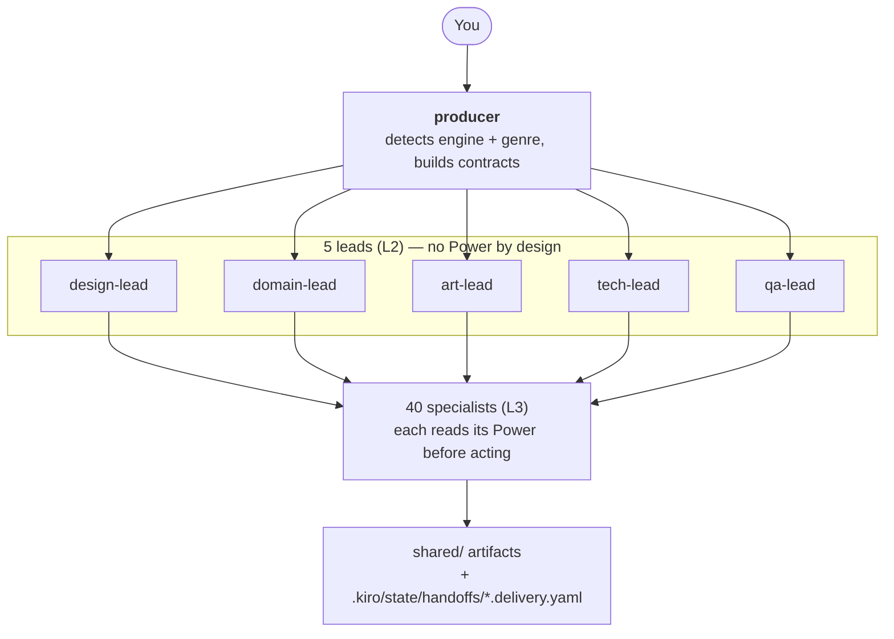
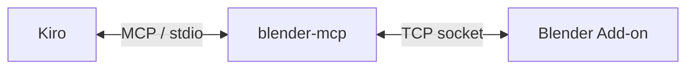
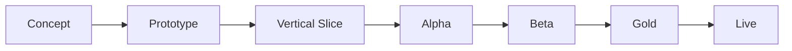
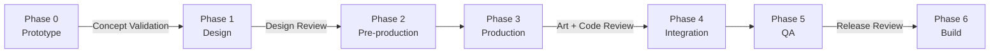

# Kiro Multi-Agent Game Studio

[English](README.md) | [繁體中文](README_ZH.md) | [简体中文](README_CN.md) | [日本語](README_JP.md) | [한국어](README_KR.md)

> **语言版本说明**：这份 README 是本项目唯一的正式文档，维护 5 种语言版本，让你不必靠翻译工具就能读完整份内容。五个版本在结构上保持平行——一样的章节、一样的表格、一样的数字。`.kiro/agents/` 下的 Agent 定义与 `.kiro/steering/` 下的 steering 文件是用繁体中文写的。这不会限制你：每个 Agent 都会用你书写的语言回复。如果你遇到语言障碍，请开一个 issue。

把你的 IDE 变成一支虚拟游戏工作室。用白话描述你想做什么游戏，一支协调运作的 **48 个 AI Agent** 团队——producer、五位 Lead、游戏类型专家、美术、引擎 Team、QA 与发行——会替你规划、实现，并通过明确的 Contract 把产出交接给彼此。

领域知识不放在这个 repo 里，而是放在全机安装的 **29 个 [Kiro Powers](https://kiro.dev/docs/powers/)**，每一个都独立维护，并对真实工具连接验证过。这个 repo 只放**组织层**：谁做什么、什么顺序、交付什么。

> **为什么要分两层**：手抄进 Agent prompt 的工具知识会过时。在做这个切分之前，`unity-team.md` 里有 7 个已经不存在的 API 调用。Power 对真实连接验证过，而且独立更新，所以 Agent prompt 只需要承载角色定位与交接纪律。见 [Powers](#powers)。

> **关键概念**：这份文档通篇会用到的名词（你不需要一开始就全部搞懂）：
> - **Agent**：一份角色定义（`.kiro/agents/*.md`），有自己的 system prompt、模型与工具权限
> - **Power**：一个 [Kiro Power](https://kiro.dev/docs/powers/)——打包好的领域知识层（steering 文件）加上可选的 MCP server，全机安装在 `~/.kiro/powers/` 下
> - **MCP**（Model Context Protocol）：一套标准化协议，让 AI 助手能用自然语言操作开发工具——Unity、Blender、ComfyUI、Figma 等等
> - **Steering**：Power 或项目注入 Agent context 的 markdown 知识文件，可以是永远加载，也可以是条件式加载
> - **Contract**：Agent 之间互相交接工作用的 YAML 格式（Task Contract / Asset Contract / Change Request）
> - **Subagent 委派**：producer 派工的方式——每个 Subagent 都跑在隔离的 context window 里，所以完整的 Contract 必须写进委派 prompt

## 功能特色

- **单一入口** — 找 `producer` 就好；它会检测你的引擎与游戏类型，再派给对的 Lead 与 Specialist。你不需要知道任何 Agent 的名字。
- **4 个引擎** — Unity、Godot、Unreal、Cocos Creator。producer 会派给对应的引擎 Team，不会预设只有一个。
- **13 种游戏类型** — 老虎机、捕鱼机、射击、MMO、RPG、卡牌、三消、平台跳跃、roguelike、策略、模拟、节奏、叙事冒险。每一种都有专属的 Domain Expert，背后挂着对应的 Power。
- **咨询模式** — 说一句“我不懂游戏”，Lead 就会给你建议、理由、取舍，还有一个可以直接往前走的默认值，而不是丢一串技术问题把你挡在门外。
- **外部化的知识** — 29 个 Power、323 个 steering 文件、约 4.9 MB 的领域知识，全部在这个 repo 之外，可以独立更新。
- **量化的领域知识** — Power 把设计问题变成数学：整数除法造成的 TTK 断崖、掉落率的长尾（P90 = 平均值的 2.3×）、从高度与顶点时间反推的跳跃物理、MMO 的 scope 分级 T1–T4。
- **明确的 Contract** — 每一次交接都是一份带验收条件的 YAML Contract；每一次交付都会写一份 manifest，让下游知道产出了什么、还有什么是坏的。
- **诚实的能力边界** — 每个 Power 都会声明自己无法验证什么。Agent 会停下来汇报知识缺口，而不是去猜工具 API。
- **信心等级** — 领域事实标记为 `HIGH`（可推导）、`MEDIUM`（惯例）或 `UNVERIFIED`（行业数字，需要你自己校准）。Agent 会照实转述等级，不会把所有数字都当成同等可信。

## 架构



有三个结构上的决定值得先知道：

**Power 只在 Specialist 层读取。** producer 与五位 Lead 都没有 Power。Lead 的价值在于跨 Specialist 的取舍判断——你不可能问 `unity-team` 该不该用 Unity，因为它必然说该。给 Lead 挂 Power 会让它偏向那个领域，反而毁掉它存在的目的。

**Agent 之间通过文件沟通，不是对话。** Subagent 跑在隔离的 context 里，彼此之间没有实时通道。设计真相在 `.kiro/steering/project/gdd.md`、交付物在 `shared/`、交接回执在 `.kiro/state/handoffs/`。

**producer 是路由器。** 它会读上游的 delivery manifest，把内容写进下一个 Agent 的委派 prompt。没有任何东西被假设为隐性共享。

### 设计依据

团队拆分依照游戏行业通行的六大职能（设计、美术、工程、音频、QA、制作），再结合迭代式 Agile 实务。AI 特有的机制——token 预算、MCP 集成、以 Contract 为基础的交接——是本项目原创；明确标示哪些能力是真的、哪些只是愿景，也是原创的做法。

| # | 参考文献 | 作者 | 出版社 | ISBN |
|---|-----------|--------|-----------|------|
| 1 | *The Game Production Handbook*，第 3 版 | Heather Maxwell Chandler | Jones & Bartlett Learning, 2014 | 978-1-4496-8809-7 |
| 2 | *Agile Game Development: Build, Play, Repeat*，第 2 版 | Clinton Keith | Addison-Wesley (Pearson), 2020 | 978-0-1365-2781-7 |
| 3 | IGDA Curriculum Framework (2008) | IGDA Education SIG | IGDA | — |

## 前置需求

| 需求 | 说明 |
|-------------|-------|
| [Kiro IDE](https://kiro.dev/) | Agent、Power 与 steering 全部从 Kiro 加载 |
| Git + [Git LFS](https://git-lfs.com/) | 二进制资产通过 LFS 追踪（`.gitattributes` 里有 27 条规则） |
| [uv](https://docs.astral.sh/uv/) | Blender、ComfyUI、Unreal 与 Ableton 的 MCP server 都需要 |
| 你的目标引擎 | Unity / Godot / Unreal / Cocos Creator — 只装你真的会用的那一个 |
| Node.js ≥ 18 | 只有在你使用 Godot 或 ComfyUI 的 MCP server 时才需要（通过 `npx` 安装） |

依 pipeline 选用：Blender（3D）、ComfyUI（2D 生成）、Krita（手绘美术）、Ableton Live（音乐）、一个 Figma 账号（UI）。

## 安装

### 步骤一 — Clone 并启用 LFS

```bash
git clone https://github.com/hoycdanny/kiro-multi-agent-game-studio.git
cd kiro-multi-agent-game-studio
git lfs install    # 每台机器做一次；没装的话先 brew install git-lfs
```

### 步骤二 — 在 Kiro 中打开并信任这个 workspace

在 Kiro IDE 打开这个文件夹。第一次打开时它会问你是否信任这个 workspace——**选择信任**，否则 Agent 与 steering 都不会加载。Agent Selector 接着就会列出全部 48 个 Agent。

### 步骤三 — 安装你需要的 Power

Kiro → Powers 面板 → **Add custom power** → 来源 `https://github.com/hoycdanny/<power-name>`。

**你不需要全部 29 个。** 只装这个项目会用到的——Power 缺件的 Agent 会诚实汇报缺口，不会即兴硬做。

任何游戏都用得到的最小组合：

```
kiro-<your-engine>-accelerator    unity / godot / unreal / cocos — pick one
kiro-comfyui-accelerator          2D asset generation (almost always needed)
kiro-economy-balancing-expert     economy numbers + the simulation methodology balance-tester relies on
kiro-game-compliance-expert       needed the moment you plan to ship
```

依需要再加：

| 如果你要做 | 安装 |
|------------------|---------|
| 3D 模型 / 动画 | `kiro-blender-accelerator` |
| 手绘 UI 或 sprite | `kiro-krita-accelerator` |
| 原创音乐 | `kiro-ableton-accelerator` |
| Figma 设计 → 引擎 UI | `figma`（Kiro 官方推荐清单里的，不是 `hoycdanny`） |
| 老虎机 / 捕鱼机 | `kiro-slot-game-expert` / `kiro-fish-game-expert` |
| 钱包或支付后端 | `kiro-gaming-wallet-expert` |
| RPG / 射击 / 卡牌 / 三消 / 平台跳跃 / 节奏 / 策略 / 模拟 / roguelike / 叙事 | 对应的 `kiro-<genre>-expert` |
| 多人联机 | `kiro-mmo-netcode-expert` — **先读它的 T1–T4 scope 分级；大多数项目不需要真正的 MMO** |
| 存档系统 / 资源管理 | `kiro-game-systems-expert` |
| 多语言 | `kiro-i18n-expert` |
| CI / 自动化构建 | `kiro-game-devops-expert` |
| 可用性评估 | `kiro-usability-expert` |

验证：

```bash
ls ~/.kiro/powers/installed/                                        # 已安装的 Power
ls ~/.kiro/powers/installed/kiro-blender-accelerator/steering/      # 它的 steering 文件
ls ~/.kiro/powers/repos/kiro-blender-accelerator/templates/         # templates 在 repos/ 下，不在 installed/
```

> `templates/` 与 `hooks/` **只**存在于 `~/.kiro/powers/repos/<power>/` 下。`installed/` 那份只有 `POWER.md`、`steering/` 与 `mcp.json`。如果某个 `POWER.md` 叫 Agent 去加载模板，那个路径要对着 `repos/` 解析。

### 步骤四 — 连上你的工具 MCP server

`.kiro/settings/mcp.json` 里已经有 `blender-mcp`、`comfyui`、`unity-mcp`、`godot-mcp`、`unreal-engine`、`cocos-creator`、`figma` 与 `github` 的配置。

> ⚠️ **`ableton` 与 `krita` 不在 `mcp.json` 里。** 那个文件受 IDE 权限规则保护，Agent 写不进去，所以你得自己粘贴——确切的区块在 [Ableton](#ableton) 与 [Krita](#krita)。在你粘贴之前，`audio-team` 与 `krita-team` 会停在连接自检并汇报缺口；它们不会假装已经产出音频或美术。

接着启动你真的会用到的工具：

| 工具 | 怎么连 |
|------|----------------|
| Blender | 启用 `blender_mcp` 插件并启动它的 server（默认 `localhost:9876`） |
| ComfyUI | 启动本机服务（会自动检测 8188，再试 8000） |
| Unity | Window → MCP for Unity → Start Server |
| Godot | `npx` 会自动安装 `@coding-solo/godot-mcp`；设置 `GODOT_PATH` |
| Unreal | 安装 UnrealMCP 插件并在 Editor 里启用 |
| Cocos Creator | 安装 `cocos-mcp-server`，然后 Extension → Cocos MCP Server → Start |
| Figma | 官方 Remote MCP Server；第一次使用时在 Kiro 完成 OAuth |
| GitHub | 把 `github-mcp-server` 可执行文件放进 `PATH`，并提供一组 PAT |
| Ableton | 启用监听 `localhost:9877` 的 Remote Script 桥接 |
| Krita | 安装 Krita 的 Python 插件；它会服务在 `127.0.0.1:5678` |

各工具的前置需求、配置与失败模式：[MCP Integrations](#mcp-integrations)。

## 使用方式

### 三种入口

| 你的状况 | 找谁 | 为什么 |
|----------------|---------|-----|
| 你有目标但没有游戏开发背景 | `producer` | 它会进入咨询模式，委派 Lead 给建议，而不是拷问你 |
| 你懂这个领域，想要专业判断 | 对应的 **Lead** | 少一层转派；Lead 会直接回答选型问题 |
| 范围明确、能自成一题的问题 | 对应的 **Specialist** | 例如问 `shooter-expert` TTK 怎么算 |

每位 Lead 能替你决定什么：

| Lead | 决定什么 | 典型问题 |
|------|---------|------------------|
| `tech-lead` | **引擎选型**、架构取舍、性能预算、要不要上多人联机 | “老虎机该用哪个引擎？” |
| `domain-lead` | 这是哪个游戏类型、该启用哪位 Domain Expert、类型叠加时的主从关系 | “这是 roguelike 还是 RPG？” |
| `design-lead` | 核心循环该长什么样、范围该切多小、先做哪个系统 | “v1 该做到哪里？” |
| `art-lead` | 美术方向、2D 还是 3D、生成式与手绘的分工、声音基调 | “这个主题适合什么风格？” |
| `qa-lead` | 这个阶段该测什么、什么程度算可以发布 | “现在可以发布了吗？” |

**为什么选型问题必须问 Lead 而不是 Specialist**：你不可能问 `unity-team` 该不该用 Unity——它必然说该。四个引擎 Team 各有立场，两个 casino Domain Expert 也都想接活。Lead 在它管的范围内没有单一工具的包袱；那就是它存在的结构性理由。

当问题范围明确、又不需要跨领域协调时，直接找 Specialist 最快：

| 问题 | 问谁 | 它会读的 Power |
|----------|-----|----------------|
| “HP 100、伤害 33，TTK 是多少？” | `shooter-expert` | `kiro-shooter-expert` |
| “抽卡概率 1%，要抽几次才有 90% 信心？” | `economy-designer` | `kiro-economy-balancing-expert` |
| “40 张牌组放 3 张，开局 5 张抽到一张的概率？” | `card-game-expert` | `kiro-card-game-expert` |
| “这个 FBX 导入 Unity 的 scale 不对” | `blender-team` | `kiro-blender-accelerator` |
| “跳 3 格高、0.35 秒到顶点，重力要设多少？” | `platformer-expert` | `kiro-platformer-expert` |

Specialist 会给你规格，但不会协调下游工作。要把规格变成实现，还是得回头走 producer。

### 示例指令

```
"Build a slot machine in Unity"
"I want to make a slot machine but I don't know anything about games"     → 咨询模式
"Which engine should I use for a mobile match-3?"                        → 问 tech-lead
"HP is 100 and damage is 33 — what is the TTK?"                          → 问 shooter-expert
"40-card deck with 3 copies — odds of drawing one in the opening 5?"      → 问 card-game-expert
"Implement this skill tree in Unity, spec is in specs/skill-tree.md"      → 跳过咨询模式
```

### 实例 A — 只用一句话的新手

> **你**：我想做一台老虎机，但我完全不懂游戏开发。

1. **`producer`** 检测到两件事：类型是 casino，而且用户声明没有背景 → 进入**咨询模式**（`.kiro/steering/global/advisory-mode.md`）。

2. 它**不会**丢一串技术问题给你。它会委派 `tech-lead` 做引擎选型，委派 `domain-lead` 确认该启用哪位专家。

3. **`tech-lead`** 用四段式咨询格式回答：
   > **建议**：Cocos Creator。
   > **理由**：老虎机是 2D、要同时上网页与移动平台，而且动画与 UI 很重；这个组合下 Cocos 的 2D 管线最直接、网页导出也最成熟。
   > **取舍**：如果你之后想做 3D 版，或已经有 Unity 人力，那 Unity 更好；纯网页前端团队可以考虑 PixiJS。
   > **默认值**：如果你不回复，就以 Cocos Creator 往前走。

4. **`slot-game-expert`** 会读 `kiro-slot-game-expert`，并**先问你的目标司法管辖区**——因为“最短转轴间隔该设多少”在不同市场有不同的法律答案。如果你说还没决定，它会用最保守的假设往前走（纯娱乐原型、不涉及真实金钱），并明确标示这个假设。

5. producer 转述这些建议，然后只问**一个**问题：“这样可以开始吗？”

6. 你同意之后，pipeline 就跑起来：

```
slot-game-expert   → math model (RTP / volatility / paytable)
balance-tester     → reads simulation-methodology.md, Monte Carlo verification of actual RTP
art-lead           → comfyui-team generates symbols and background
ui-ux-team         → reads the figma Power, produces layout + Design Tokens
cocos-team         → reads kiro-cocos-accelerator, assembles scene and logic
qa-lead            → functional-tester verifies flow
compliance-release → reads kiro-game-compliance-expert (if you intend to ship)
```

你总共只回答了一次“好”。这就是咨询模式的意义。

### 实例 B — 你已经有规格了

> **你**：帮我在 Unity 实现这棵技能树，规格在 `specs/skill-tree.md`。

1. producer **不会**进入咨询模式。`advisory-mode.md` 明确禁止重新确认你已经做过的决定。
2. 它建立一份 Task Contract，委派 `tech-lead`，再转给 `unity-team`。
3. `unity-team` 会读相关的 `kiro-unity-accelerator` steering（场景组装 / 脚本 / 构建），而不是去猜 MCP 工具名称。
4. 完成后写一份 delivery manifest 到 `.kiro/state/handoffs/TASK-xxx.delivery.yaml`。
5. `tech-lead` 做 code review；producer 汇报给你。

如果规格本身有数值问题——例如技能点成长曲线不合理——`unity-team` 不会自己改。它会汇报，producer 再把它转给 `rpg-systems-expert`。

### 实例 C — 只做分析，不动工

> **你**：如果我做一款带 PvP 的卡牌游戏，最大的技术风险是什么？

producer 判定这是分析型问题，并行委派几位 Lead，返回一份汇总后的风险清单。**不会建立任何 Task Contract，也不会产出任何文件。**

- `tech-lead`：PvP 同步架构，拉 `mmo-expert` 进来，依 `kiro-mmo-netcode-expert` 的 scope 分级把它归为 T1 或 T2
- `domain-lead` → `card-game-expert`：power creep 是长期的结构性风险
- `design-lead`：先手优势在卡牌 PvP 里是结构性的，必须测量，不能靠假设
- `qa-lead`：对战模拟需要的样本量（±1pp 精度大约需要 9,604 场）

只有你要求动工，工作才会开始。分析型问题不会默默生出一堆文件。

### 项目状态要去哪里看

Agent 之间没有实时通道，所以当前状态都存在文件里：

| 你想知道 | 看这里 |
|------------------|---------|
| 现在的游戏设计是什么 | `.kiro/steering/project/gdd.md` |
| 美术与声音方向定案成什么 | `.kiro/steering/project/style-guide.md` |
| 有哪些任务、状态如何 | `.kiro/state/tasks.yaml` |
| 某个任务交付了什么、还有什么是坏的 | `.kiro/state/handoffs/<contract_id>.delivery.yaml` |
| 实际的资产文件 | `shared/`（models / textures / sprites / audio / locales / sim） |
| 你现在在哪个 milestone | `.kiro/steering/project/milestones.md` |
| 哪个 Agent 挂哪个 Power | `.kiro/steering/global/powers-registry.md` |

交付记录是**只增不改**的：要更正就补一则新的，不要去改旧的，这样历程才追溯得到。

## 项目结构

```
.kiro/
├── agents/              48 agent definitions, grouped by layer
│   ├── orchestration/   creative-director, producer
│   ├── design/          5 core design roles + 13 genre domain experts + ui-ux + economy + localization
│   ├── art/             art-lead, blender, comfyui, krita, animator, audio, vfx, technical-artist
│   ├── engineering/     tech-lead + 4 engine teams + systems/ui programmer, devops, wallet
│   ├── qa/              qa-lead + functional / balance / performance / usability
│   └── publishing/      compliance-release, marketing-team
├── steering/
│   ├── global/          contracts, asset-standards, bug-severity, powers-registry, advisory-mode
│   └── project/         gdd, style-guide, milestones      ← your game's single source of truth
├── state/               tasks.yaml, handoffs/*.delivery.yaml
└── settings/mcp.json    MCP server configuration

shared/                  cross-agent artifact staging
├── concept/ textures/ sprites/ ui/     from comfyui-team
├── models/                             from blender-team
├── rigs/ animations/                   from animator
├── audio/{sfx,music,voice}/            from audio-team
├── locales/                            from localization-team
└── sim/                                from balance-tester
```

`~/.kiro/powers/` — 知识层，**在这个 repo 之外**，全机安装。

每个 Agent 都有一份 `.md`（frontmatter + system prompt）与一份 `.json`。子目录只是组织用途：Kiro 依 frontmatter 里扁平的 `name` 注册 Agent，所以你委派时写 `Use the "blender-team" subagent to ...`，绝对不是 `"art/blender-team"`。

## Agent 分层

| 分层 | 数量 | 组成 |
|-------|:-----:|-------------|
| L0 战略 | 2 | `creative-director`（愿景守门）、`producer`（派工中枢） |
| L2 Lead | 5 | `design` / `domain` / `art` / `tech` / `qa` — 中介调度者与质量关卡，**刻意不挂 Power** |
| L3 设计与类型 | 20 | 7 个核心设计职能 + 13 位游戏类型 Domain Expert |
| L3 美术与音频 | 7 | Blender、ComfyUI、Krita、Animator、Audio、VFX、Technical Artist |
| L3 工程 | 8 | 4 个引擎 Team + Systems/UI Programmer、DevOps、Wallet |
| L3 QA | 4 | functional / balance / performance / usability |
| L3 发行 | 2 | compliance-release、marketing-team |

**48 个里有 33 个挂了 Power**；另外 15 个是协调角色，它们的知识*就是*本项目的组织惯例。见 [Powers](#powers)。

### 13 位游戏类型 Domain Expert

由 `domain-lead` 按需启用，绝不会全部同时开。

| 专家 | 涵盖范围 |
|--------|--------|
| `slot-game-expert` | 老虎机：数学模型、RNG、认证、司法管辖区矩阵、负责任游戏 |
| `fish-game-expert` | 捕鱼机：捕获判定 RNG、赔付、多人公平性、控分红线 |
| `shooter-expert` | FPS/TPS：武器数值、弹道、命中判定、后坐力、Bot AI、射击手感 |
| `mmo-expert` | 多人联机：服务器权威、状态复制、兴趣管理、延迟补偿 |
| `rpg-systems-expert` | 属性、等级曲线、技能树、掉落稀有度、伤害公式、状态效果 |
| `card-game-expert` | Deckbuilder/TCG：抽牌概率、费用曲线、archetype、power creep 控制 |
| `puzzle-match3-expert` | board 生成、可解性、连锁、难度曲线、步数经济 |
| `platformer-expert` | 跳跃物理、输入宽容、关卡节奏、metroidvania 能力 gating |
| `roguelike-expert` | 程序生成、run 内 build 与 synergy、meta 进度、难度缩放 |
| `strategy-expert` | RTS / 回合制 / 4X / 塔防：单位相克、经济、AI、波次曲线 |
| `simulation-expert` | 生产链、资源循环、自动化、生存需求、系统涌现 |
| `rhythm-expert` | 谱面、判定窗、audio/input offset 校准、计分 |
| `narrative-adventure-expert` | 分支结构、旗标与状态、对话树、结局与收敛 |

### Agent 定义格式

每个 Agent 都是 `.kiro/agents/` 下的一个 markdown 文件。YAML frontmatter 定义权限；正文就是 system prompt。

本项目每个 Agent 都贯彻两个设计原则：

**“待机中”不是后台进程。** Kiro 的自定义 Agent 没有常驻服务。Agent 只有在被选中时才“醒着”，而它的第一步永远是判断状况——打招呼、具体请求，还是工具没连上——再决定要不要动手。例如 `blender-team` 会用 `get_blendfile_summary_path_info` 做连接自检，失败就停下，而不是直接开始建模。

**承认做不到胜过演出做得到。** 没有任何 Agent 会编造别的 Team 的结果或进度。`producer` 只汇报 Subagent 真正返回的内容。

这里刻意不贴 prompt 示例。以前贴过，重构之后那些节录就和真正的文件脱节了。要看就直接开文件。

### 模型分配

每个 Agent 都在 frontmatter 里指定模型。实际生效的是 `.json` 里的值；`.md` 的 frontmatter 保持同步。实测 48 个 Agent 的分布：

| 模型 | 数量 | 指派给 | 理由 |
|-------|:-----:|-------------|-----------|
| `claude-sonnet-5` | 7 | `creative-director`、`producer`、五位 Lead | 派工与审查关卡：多步骤的 agentic 工作，一个错误会沿整条 pipeline 往下扩散 |
| `deepseek-3.2` | 9 | `slot-game-expert`、`fish-game-expert`、`rpg-systems-expert`、`shooter-expert`、`card-game-expert`、`strategy-expert`、`economy-designer`、`balance-tester`、`wallet-systems-expert` | 数值与概率推理：RTP、赔付、成长曲线、经济收敛、账务一致性 |
| `claude-sonnet-4` | 20 | 所有美术职能、一般设计、其余类型专家、`ui-ux-team`、`compliance-release` | 通用能力就够用；这是人数最多的一层 |
| `qwen3-coder-next` | 7 | 4 个引擎 Team、`systems-programmer`、`ui-programmer`、`devops-team` | 纯写代码与工具编排 |
| `claude-haiku-4.5` | 5 | `functional-tester`、`performance-tester`、`usability-tester`、`localization-team`、`marketing-team` | 调用量大，单次出错的代价低 |

> 这个分配是依 Kiro 公开的模型定位，结合任务类型与成本推导出来的——**不是在本项目内做过 benchmark 的结果**。可以自己调：如果某个 Agent 的产出感觉太浅，就往上升一阶，或提高 reasoning effort。

可调的杠杆：如果你希望算错代价高的地方更安全，可以把 `slot-game-expert` / `fish-game-expert` / `wallet-systems-expert` 升到 `claude-opus-4.8`；如果你不想调，全部设成 `auto` 就好。你的 `/model` 清单里不存在的模型 ID 会静默退回默认值。要注意有些模型是 Experimental 且有区域限制，请在你自己的环境确认可用性。

## Powers

Agent 是**组织层**。[Kiro Powers](https://kiro.dev/docs/powers/) 是**领域知识层**。29 个全部已安装且有内容：**323 个 steering 文件，约 4.9 MB。**

权威对照表在 `.kiro/steering/global/powers-registry.md`，每个 Agent 都会自动加载。下面的表格是给人看的版本。

### 引擎与工具 Power（Accelerator — 12 个 Agent）

每一个背后都有真实的 MCP server，知识也对真实连接验证过。

| Agent | Power | Steering | 解决什么 |
|-------|-------|:--------:|----------------|
| `unity-team` | `kiro-unity-accelerator` | 15 | 场景 / 资产 / 构建 / 性能 / 架构 / 平台兼容 |
| `godot-team` | `kiro-godot-accelerator` | 13 | 场景架构 / GDScript / signal / TileMap / 导出 |
| `unreal-team` | `kiro-unreal-accelerator` | 11 | 关卡 / Blueprint / 材质 / GAS / UE5 功能 |
| `cocos-team` | `kiro-cocos-accelerator` | 14 | 场景 / 节点组件 / prefab / 跨平台构建 |
| `blender-team` | `kiro-blender-accelerator` | 15 | 建模 / UV / 材质 / 导出。**轴向与色彩空间最常静默出错** |
| `animator` | 同上 | — | 读 `rigging-and-skinning.md` / `animation-authoring.md` |
| `technical-artist` | 同上 | — | 读 `collider-and-lod.md` / `performance-and-limits.md` |
| `comfyui-team` | `kiro-comfyui-accelerator` | 11 | 模型选型 / prompt / sampler / ControlNet / 放大 / VRAM |
| `vfx-artist` | 同上 | — | 特效素材，与 `comfyui-team` 共用同一个 Power |
| `krita-team` | `kiro-krita-accelerator` | 13 | 画布 / 笔刷 / 图层 / 蒙版 / 构图 / 导出 |
| `audio-team` | `kiro-ableton-accelerator` | 11 | 编曲 / 混音 / 乐理 / 鼓组律动 / 曲风 playbook |
| `ui-ux-team` | `figma` | 3 | 读取版面 / 提取 Design Token / Code Connect / design system 规则 |

> `figma` Power 预设的是 Figma → 网页前端代码，而这个项目需要的是 Figma → 原生引擎 UI。读版面与提取 token 照它走，但要产出本项目的 handoff 规格，不是 HTML/CSS。

### 游戏类型 Domain Expert（Knowledge Base — 13 个 Agent）

纯知识，没有 MCP server。它的价值在于把设计问题变成可计算的数学，而不是给一般性建议。

| Agent | Power | Steering | 技术核心 |
|-------|-------|:--------:|----------------|
| `slot-game-expert` | `kiro-slot-game-expert` | 12 | 数学模型 / RNG / 认证 / 司法管辖区矩阵 / 负责任游戏 |
| `fish-game-expert` | `kiro-fish-game-expert` | 16 | 捕获判定 RNG / 赔付 / 多人公平性 / 控分上限 / 认证 |
| `rpg-systems-expert` | `kiro-rpg-systems-expert` | 11 | 三类伤害公式的极端值行为、掉落长尾（P90 = 平均值的 2.3×）、技能树 trap 判定 |
| `shooter-expert` | `kiro-shooter-expert` | 10 | **TTK 断崖** — 100 HP 之下，34 伤害要 3 枪、33 伤害要 4 枪，差 1 点伤害就让 TTK 跳 33%；后坐力模型；武器支配性检定 |
| `card-game-expert` | `kiro-card-game-expert` | 10 | 超几何抽牌概率表、量化的 power creep 检测、HHI meta 多样性、`C(n,2)` 关键字交互 |
| `puzzle-match3-expert` | `kiro-puzzle-match3-expert` | 11 | 可解性三层（第三层在数学上无法证明）、board 生成拒绝率、通关率敏感度可差到 37× |
| `platformer-expert` | `kiro-platformer-expert` | 10 | 跳跃物理反推（`g = 2h/t²`）、三种输入宽容机制、gating 死锁图检测 |
| `rhythm-expert` | `kiro-rhythm-expert` | 10 | 以音频时钟为权威（用 frame 计时 3 分钟会漂移约 1 秒）、audio 与 input offset 必须分开 |
| `strategy-expert` | `kiro-strategy-expert` | 10 | 四个子类型的核心约束、相克矩阵失衡检测、塔防波次与收入的耦合、AI 难度公平性 |
| `simulation-expert` | `kiro-simulation-expert` | 10 | 生产链与供需收敛、资源闭环、长期崩溃检测 |
| `roguelike-expert` | `kiro-roguelike-expert` | 9 | 程序生成正确性、种子架构、build synergy 上限、meta 进度平衡 |
| `narrative-adventure-expert` | `kiro-narrative-adventure-expert` | 14 | 分支结构型态与各自的维护成本、旗标设计、可达性与死路验证 |
| `mmo-expert` | `kiro-mmo-netcode-expert` | 11 | **scope 分级 T1–T4** — 大多数说要做 MMO 的项目其实只需要 T2；带宽与容量模型；延迟补偿的取舍 |

### 跨领域 Power（Knowledge Base — 8 个 Agent）

| Agent | Power | Steering | 技术核心 |
|-------|-------|:--------:|----------------|
| `economy-designer` | `kiro-economy-balancing-expert` | 13 | 货币分层 / sink-source 闭环 / 抽卡期望成本与保底数学 / 进度曲线 |
| `balance-tester` | 同上 | — | 读 `simulation-methodology.md`：用 `n ≥ (1.96σ/ε)²` 算样本量、收敛判断、RNG 流分离 |
| `compliance-release` | `kiro-game-compliance-expert` | 14 | 分级 / 隐私 / 送审 / 商店素材 / 披露义务。**包含 45 类会过期的陈述** |
| `wallet-systems-expert` | `kiro-gaming-wallet-expert` | 10 | API / DB schema / 幂等与锁 / 对账 / 可观测性 / 支付合规 |
| `systems-programmer` | `kiro-game-systems-expert` | 9 | 存档封套与迁移链（逐步 `N-1` 对上捷径 `N(N-1)/2`）、atomic write 的顺序、`f^d` 规模的事件风暴 |
| `localization-team` | `kiro-i18n-expert` | 10 | 为什么字符串拼接没有通解 / CJK 断行禁则 / RTL 镜像 / 字体 subset 与豆腐块 |
| `devops-team` | `kiro-game-devops-expert` | 9 | 四个引擎的 headless 构建 / **产物验证八项**（exit code 0 有七种不同的失败形态）/ 版本号 / Git LFS |
| `usability-tester` | `kiro-usability-expert` | 8 | 五级证据等级 / 新手引导审查 / 卡关点分析 / playtest 设计 |

### 为什么有 15 个 Agent 刻意不挂 Power

这是设计上的决定，不是漏掉。

| Agent | 为什么没有 |
|-------|---------|
| `producer`、`creative-director` | 派工与愿景是本项目的组织知识，不属于任何单一领域 |
| 五位 Lead | **价值来自跨 Specialist 的取舍判断。** Power 会让 Lead 偏向那个领域，而选型时的中立正是它存在的理由——你不可能问 `unity-team` 该不该用 Unity |
| `game-designer` | GDD 整合角色；它的领域知识分散在 13 个类型 Power 里 |
| `level-designer` | 关卡设计知识已经在 platformer / strategy / puzzle / roguelike 这几个 Power 里 |
| `ui-programmer` | UI 绑定由各引擎自己的 Power 覆盖 |
| `functional-tester` | 功能测试的方法依项目而异；CI 执行那一侧在 devops Power 里 |
| `performance-tester` | 测量依各引擎的 profiler 而异；那份知识在各引擎 Power 的性能章节里 |
| `narrative-designer` | 叙事的*系统结构*在 narrative-adventure Power 里；这个角色产出的是*内容* |
| `combat-designer` | 战斗数值在 shooter / rpg Power 里；这个角色服务没有专属 Power 的类型 |
| `marketing-team` | 纯文字产出，不依赖工具 |

### 信心等级 — 引用任何数字前先看这里

Knowledge Base 型的 Power 把内容标成三级，Agent 必须照实转述等级：

| 等级 | 意义 | 怎么转述 |
|------|---------|--------------|
| `HIGH` | 可用数学推导，或有明文标准（公式、组合数学、Unicode/CLDR 规则、POSIX 语义） | 可以直接当结论用 |
| `MEDIUM` | 广泛采用的惯例，不是唯一解 | 要说出什么前提改了建议就会变 |
| `UNVERIFIED` | 来自训练数据的行业数字，未查证且随时间变动 | **必须明说需要用你自己的数据校准** |

`UNVERIFIED` 在总量里占了相当的比例，集中在四个地方：

- 所有“行业平均值”（留存、ARPPU、典型 TTK 区间、coyote time 的毫秒数、建议受测人数）
- 所有法规细节（分级问卷、平台政策、概率披露义务——在 `kiro-game-compliance-expert` 里，`UNVERIFIED` 刻意占多数）
- 所有引擎端的行为（没有任何 Power 有真实连接可以验证导入设置或 API）
- 所有平台延迟与硬件规格数字

如果你看到一个具体数字却没有标等级，就问它是可推导的、还是需要校准的。

### 知识库在这个 repo 之外

| | 放什么 | 位置 |
|---|---|---|
| **这个 repo** | **路由与组织**：哪个 Agent 对应哪个 Power、该读哪份 steering、什么时候读、缺件时怎么汇报 | `.kiro/` |
| **Kiro Powers** | **知识本身** | `~/.kiro/powers/installed/`（全机安装，在 repo 之外） |

可验证的事实：323 个 Power steering 文件全部在这个 repo 之外；在 repo 里搜索只有 Power 内容才有的字符串，命中数为零（用 `Redlock`、`euler_ancestral`、`GPU Resident Drawer`、`krita_select_by_alpha` 测过）；repo 里每一处提到 Power 都是路径或文件名引用，不是复制过来的内容。对磁盘核对 48 个 Agent prompt 引用的**全部 376 个 steering 文件名，零虚构**。

**诚实说出代价**：这个 repo **不是自我完备的**。clone 下来之后，33 个 Agent 的知识层是空的，直到你从 Powers 面板把 Power 装起来。没有可机器检查的 manifest，也没有安装脚本——只有这份文档与 `powers-registry.md` 里的对照表。

### 覆盖缺口分析

29 个 Power 全部至少被一个 Agent 引用（没有孤儿）。有四个领域**完全没有** Power 覆盖。这不是待办清单，而是诚实的盘点，一并列出现在由谁顶着、以及不补的代价：

| 缺口 | 受影响的 Agent | 现在由谁顶 | 不补的代价 |
|-----|---------------|-----------|------------------------|
| **跨引擎的 profiling 方法论** | `performance-tester` | 各引擎 Power 的性能章节（分散，而且是单一引擎视角） | 性能数字噪音大；没有方法论很容易优化错地方而且自己不知道。缺的是：该测什么、frame 预算归因、统计效力、平台特有的陷阱 |
| **格斗／动作游戏的近战战斗** | `combat-designer` | 它自己的 prompt。shooter Power 只涵盖射击，rpg Power 只涵盖数值 | frame data、hitbox/hurtbox、输入缓冲与取消窗、连段设计、hitstop **没有任何 Power** 覆盖。格斗不在那 13 种类型里 |
| **叙事写作的技艺与工具** | `narrative-designer` | 它自己的 prompt。narrative-adventure Power 涵盖的是*系统结构*，不是内容 | Ink / Yarn / Twine 的语法与惯例、World Bible 结构、对话写作的技艺，只能靠基础模型的知识撑着 |
| **商店转化率与预告片结构** | `marketing-team` | 它自己的 prompt | 商店页的转化要素、预告片 shot list 结构、press kit 组成，都是可以累积的技艺知识 |

那 13 种类型也还没覆盖**格斗、赛车、体育、恐怖与派对游戏**。格斗的机制最独特——frame data 本身就是一门学问——另外四种则有一部分由现有专家顶着。要不要补，取决于你真的要做什么；**不要为了覆盖率而加 Power**，因为 48 个 Agent 已经是需要小心管理的规模了。

### 新增一个 Power

Power 有两种原型：**Accelerator**（包一个真实的 MCP server；知识对真实连接验证过）与 **Knowledge Base**（纯领域知识，没有 server，标信心等级）。

判断一个 Power 值不值得做，有三个测试：

1. **内容是否超过基础模型已经知道的？** 如果语言模型本来就知道，那个 Power 的价值接近零——它只是把同一份知识搬个位置。价值来自具体数字与推导（一张 TTK 断崖门槛表）、可验证的 API 事实（Blender 5.x 移除了 `action.fcurves`），以及带日期的现行法规。
2. **弄错的代价有多高？** 存档迁移出错会毁掉玩家进度；合规出错会被下架。优先做这些。
3. **这份知识会不会过时？** 会过期的东西（工具 API、法规）正好该放进 Power，因为 Power 是独立更新的。不会过时的数学放哪里都行。

做完一个 Power 之后：从 Powers 面板安装它、把 Agent ↔ Power 那一列加进 `.kiro/steering/global/powers-registry.md`、加进上面的盘点表格，并确认你引用的每一个 steering 文件名在磁盘上真的存在。

## MCP Integrations

> **这一节讲怎么连上，不讲怎么用。** 确切的工具名称、参数与正确的操作顺序，权威在各 Power 的 `POWER.md` 与 `steering/`，它们对真实连接验证过，而且独立更新。这里出现的任何工具清单都只是概念性的，可能落后。
>
> 如果调用返回 `Unknown action` 或参数验证错误，**错误消息里列出的合法值是最高权威**，胜过任何文档。

### Blender

`art/blender-team`、`animator` 与 `technical-artist` 通过一个轻量的 MCP server 驱动 Blender。



> ⚠️ **安全性**：这个 MCP server 会在 Blender 里执行 LLM 生成的代码，没有沙箱。请用虚拟机，或用一台没有敏感数据的机器。

前置需求：[Blender 5.1+](https://www.blender.org/download/)、[uv](https://docs.astral.sh/uv/)、Kiro。

```json
"blender-mcp": {
  "command": "uv",
  "args": ["--directory", "/path/to/blender_mcp/mcp", "run", "blender-mcp"],
  "disabled": false,
  "autoApprove": []
}
```

1. 安装 uv：`curl -LsSf https://astral.sh/uv/install.sh | sh`
2. `git clone https://projects.blender.org/lab/blender_mcp.git`
3. 安装插件——把 release 的 `.zip` 拖到 Blender 窗口上两次（第一次会加入 Blender Lab 仓库，第二次才安装），或走 Edit → Preferences → Extensions → Install from Disk
4. 把 `--directory` 参数指向你自己 clone 的 `blender_mcp/mcp`

Kiro 会启动并管理这个进程，你不需要开终端。**在唤醒 `blender-team` 之前，先开 Blender 并确认插件已启用**——它会用 `get_blendfile_summary_path_info` 自检连接，失败就停下，不会盲目往前做。

工具涵盖只读查看（`get_objects_summary`、`get_object_detail_summary`、`get_blendfile_summary_*`）、截图、viewport 渲染，以及用 `execute_blender_code` 做任意 `bpy` 操作。

参考：[Blender MCP](https://www.blender.org/lab/mcp-server/#llm-client) · [源码](https://projects.blender.org/lab/blender_mcp)

### ComfyUI

`art/comfyui-team` 与 `vfx-artist` 通过 [`artokun/comfyui-mcp`](https://github.com/artokun/comfyui-mcp)（108 个工具，MIT）生成图像。

Comfy 官方的选项因为具体理由被排除：Comfy Cloud MCP 需要订阅与点数；第一方的 Comfy Local MCP 还在封闭测试、拿不到；Comfy CLI 是 shell 命令，不是 MCP 工具。

```json
"comfyui": {
  "command": "npx",
  "args": ["-y", "comfyui-mcp"],
  "env": {
    "CIVITAI_API_TOKEN": "",
    "HUGGINGFACE_TOKEN": ""
  },
  "disabled": false,
  "autoApprove": []
}
```

1. 在本机启动 ComfyUI。server 会自动检测——先试 8188（CLI 默认），再试 8000（桌面版 app）。
2. 不需要 `COMFY_URL`、workflow JSON 路径或 node ID；高阶工具会自己组 workflow。
3. `CIVITAI_API_TOKEN` 与 `HUGGINGFACE_TOKEN` 是可选的，只在要从那些平台下载模型时才需要。
4. 非标准安装位置：把 `COMFYUI_PATH` 设成数据目录。

工具分成高阶生成（`generate_image`、`generate_with_controlnet`、`generate_with_ip_adapter`、`generate_audio`）、素材迭代、workflow 组装、模型管理，以及诊断（`clear_vram`）。

> 安全性：这个 server 绑在本机。没有额外认证就不要对外开放。如果你填了 API key，请用环境变量，不要 commit 进去。

### Unity

`engineering/unity-team` 通过 [CoplayDev/unity-mcp](https://github.com/CoplayDev/unity-mcp) 操作 Unity Editor。

```json
"unity-mcp": {
  "url": "http://127.0.0.1:8080/mcp",
  "transport": "http",
  "disabled": false,
  "autoApprove": []
}
```

1. Package Manager → Add package from git URL → `https://github.com/CoplayDev/unity-mcp.git?path=/MCPForUnity#main`
2. Window → MCP for Unity → Start Server
3. 如果窗口汇报的 port 不是 8080，就把 `url` 改成一致

port 被占用或防火墙干扰时的退路：改用 stdio，`{ "command": "uvx", "args": ["unity-mcp"], "transport": "stdio" }`。

> 用 HTTP 是刻意的——这个 endpoint 只在 loopback 上和 Unity Editor 对话，流量不会离开本机，所以不需要 HTTPS。不要把它绑到对外地址。

**这里刻意不列工具清单。** 它们在 `~/.kiro/powers/installed/kiro-unity-accelerator/POWER.md` 里，每一项都标明对真实连接验证过。这个位置以前放过一张手抄的表格，列了几个不存在的 action——`manage_asset(list)` 实际上是 `search`、`manage_editor(action:"build")` 实际上是 `manage_build`、`manage_graphics(get_rendering_stats)` 实际上是 `stats_get`——再加上 `project_info` 与 `editor_state` 这两个 Power 明确说不要假设存在的 resource。那就是本项目分两层的起因。

### Godot

`engineering/godot-team` 使用 [Coding-Solo/godot-mcp](https://github.com/Coding-Solo/godot-mcp)（npm `@coding-solo/godot-mcp`）。

```json
"godot-mcp": {
  "command": "npx",
  "args": ["-y", "@coding-solo/godot-mcp"],
  "env": {
    "GODOT_PATH": "/Applications/Godot.app/Contents/MacOS/Godot",
    "DEBUG": "false"
  },
  "disabled": false,
  "autoApprove": []
}
```

1. 安装 Node.js ≥ 18 与 Godot。
2. `npx` 会自动抓取并启动 server——不需要手动 clone 或构建。
3. 把 `GODOT_PATH` 设成你的 Godot 可执行文件。如果 Godot 已经在 `PATH` 上，可以省略。

工具涵盖项目控制（`launch_editor`、`run_project`、`stop_project`、`get_project_info`）、场景编辑（`create_scene`、`add_node`、`edit_node`、`load_sprite`、`save_scene`）、debug 输出，以及 Godot 4.4+ 的 UID 处理。

失败模式：`run_project` 会一直阻塞到游戏窗口关闭——用 `stop_project` 中断它，不要把它当成要重试的错误；UID 工具需要 4.4+，更旧的版本用 `res://` 路径。

### Unreal

`engineering/unreal-team` 使用 [flopperam/unreal-engine-mcp](https://github.com/flopperam/unreal-engine-mcp) 的开源本机 MCP——`Python/` server 加上 `UnrealMCP` C++ 插件——不是付费的托管版本。托管的 Flop MCP 提供 50+ 工具，包含 Niagara 与 Sequencer，但需要付费 API key，还要绕一趟远端。

```json
"unreal-engine": {
  "command": "uv",
  "args": [
    "--directory",
    "/ABSOLUTE/PATH/TO/unreal-engine-mcp/Python",
    "run",
    "unreal_mcp_server_advanced.py"
  ],
  "disabled": false,
  "autoApprove": []
}
```

1. 在你的 Unreal 项目之外 clone：`git clone https://github.com/flopperam/unreal-engine-mcp.git`
2. 把插件复制进项目（在 `.uproject` 所在目录执行）：`cp -r ~/path/unreal-engine-mcp/UnrealMCP Plugins/`
3. 右键点 `.uproject` → Generate project files → 构建 Development Editor
4. Editor → Edit → Plugins → 启用 `UnrealMCP` → 重启
5. 安装 Python 3.12+ 与 uv，再把 `--directory` 指向你的绝对 `Python/` 路径

工具涵盖 Blueprint 脚本与分析、世界搭建、物理与材质，以及 actor 管理。

`unreal-team` 已经绕开的已知问题：**绝对不要下 `ce` console 命令**——通过 MCP 下这个命令会让 Editor 立刻崩溃；对 `OverrideMaterials` 用 `set_component_property` 不可靠，请改用验证过的 Blueprint SCS 做法；避免长串的 Undo，宁可明确地重新套用一次。

### Cocos Creator

`engineering/cocos-team` 使用 [DaxianLee/cocos-mcp-server](https://github.com/DaxianLee/cocos-mcp-server)。很适合轻量的跨平台与 H5 游戏，包含需要快速多平台上线的老虎机。

```json
"cocos-creator": {
  "url": "http://127.0.0.1:3000/mcp",
  "transport": "http",
  "disabled": false,
  "autoApprove": []
}
```

1. 下载 `cocos-mcp-server`，或从 [Cocos Store](https://store.cocos.com/app/detail/7941) 安装
2. 把文件夹复制到 Cocos 项目的 `extensions/cocos-mcp-server/`
3. `cd extensions/cocos-mcp-server && npm install && npm run build`
4. 重启 Cocos Creator 或刷新扩展
5. Extension → Cocos MCP Server → 设置 port（默认 3000）→ Start
6. 如果 port 不同，就更新 `url`

工具按领域加前缀：`scene_*`、`node_*`、`component_*`、`prefab_*`、`project_*`、`debug_*`、`advancedAsset_*`。

`cocos-team` 会防范的失败模式：`node_create_node` 没给 `parentUuid` 会建在场景根节点；`component_set_component_property` 少了 `propertyType` 会**静默失败**；资产路径必须用 `db://` 前缀，不能用文件系统路径；2D 节点用 x/y，3D 用 x/y/z。

### Figma

`design/ui-ux-team` 通过[官方 Figma MCP Server](https://developers.figma.com/docs/figma-mcp-server/)读取版面与 Design Token。Kiro 是文档明列的支持客户端。

Figma 只负责 UI/UX 这一层：UX 流程、UI 版面（HUD、菜单、弹窗、商店；老虎机的转轴框、Spin 按钮、赔付表）、design system（颜色、字级、间距、按钮状态），以及 handoff（坐标、尺寸、间距、颜色、切图清单）。3D 模型与 PBR 纹理交给 `blender-team` 与 `comfyui-team`；游戏逻辑交给引擎 Team；像素素材交给 `comfyui-team`。Figma 决定版面、流程与 token——引擎 Team 再在 Unity UI Toolkit、Godot Theme、Unreal UMG 或 Cocos UI 里重建。

```json
"figma": {
  "url": "https://mcp.figma.com/mcp",
  "transport": "http",
  "disabled": false,
  "autoApprove": []
}
```

1. 在 Kiro 第一次使用时完成 OAuth——`mcp.json` 里不放 token
2. 在 Figma 选中要实现的 frame → 右键 → **Copy link to selection**
3. 切到 `ui-ux-team`，粘贴链接，描述需求（node ID 会从 URL 解析出来）
4. 它会把版面与 token 提取成一份 handoff 规格
5. 装饰性素材需求交给 `comfyui-team`，再把规格交给引擎 Team

替代方案：官方桌面版（`http://127.0.0.1:3845/mcp`，需要付费的 Dev/Full 席位），或社区的 Framelink server（`npx -y figma-developer-mcp --figma-api-key=${FIGMA_TOKEN} --stdio`，走 REST 读取）。如果用 Framelink，请把 token 放在环境变量里。

### GitHub

`producer` 通过官方的 [GitHub MCP Server](https://github.com/github/github-mcp-server) 读写 issue、pull request 与 **Projects 看板**——这就是独立任务追踪系统的替代品，让任务与代码待在同一个地方。

```json
"github": {
  "command": "github-mcp-server",
  "args": ["stdio"],
  "env": { "GITHUB_PERSONAL_ACCESS_TOKEN": "" },
  "disabled": false,
  "autoApprove": []
}
```

1. 从 [releases](https://github.com/github/github-mcp-server/releases) 下载可执行文件，或 `go install github.com/github/github-mcp-server/cmd/github-mcp-server@latest`
2. 把它放进 `PATH`
3. 建立一组至少有 repo / issues / projects scope 的 PAT
4. 用环境变量提供，不要 commit 进去

替代方案：官方 Remote endpoint（`https://api.githubcopilot.com/mcp/`，零安装，但需要 Copilot 权益），或本机 Docker。

> 这个 server 暴露的工具很多，会吃掉明显的 context。需要的话用 `--toolsets`（远端时用 `X-MCP-Toolsets` header）把它缩到只有 `issues` 与 `projects`。PAT 是高权限凭证——只给最小 scope。

### Ableton

`art/audio-team` 通过 Ableton Live 制作音乐——编曲、和声、鼓组律动、混音。音效与配音留在 ComfyUI 那条路。

> ⚠️ **这段要你自己加进 `mcp.json`。** `.kiro/settings/mcp.json` 受 IDE 权限规则保护，Agent 写不进去。

```json
"ableton": {
  "command": "uvx",
  "args": ["ableton-mcp"],
  "env": {
    "ABLETON_HOST": "localhost",
    "ABLETON_PORT": "9877",
    "ABLETON_MCP_DISABLE_TELEMETRY": "true"
  },
  "disabled": false,
  "autoApprove": []
}
```

1. 安装 [Ableton Live](https://www.ableton.com/)
2. 安装 [uv](https://docs.astral.sh/uv/)（`uvx` 随它一起附带）
3. 在 Ableton 里启用 MCP 桥接的 Remote Script，让它监听 `localhost:9877`
4. 唤醒 `audio-team` 之前先开好 Ableton Live

在配置好之前，`audio-team` 会停在自检并汇报缺口——**它不会假装已经产出音频文件**。音效与配音走的 ComfyUI 那条路不受影响，照样能用。

这个 Power 的 `POWER.md` 开头有一张情境选择表，`audio-team` 会先读它再决定该读哪份 steering。**在修改既有的 Ableton 项目之前，它必须先读 `operation-safety.md`**——破坏性的 DAW 操作很难恢复。

### Krita

`art/krita-team` 做数字绘图与手绘精修：合成生成素材、蒙版、修正构图与上色，或从零手绘 sprite、UI 与纹理。

生成式 AI 很快，但不受控。`comfyui-team` 生成；`krita-team` 让它变成可以交付的东西。那正是 AI 产出与可发布游戏美术之间常见的落差。

> ⚠️ **这段也要你自己加进 `mcp.json`**——和 Ableton 一样的权限限制。

```json
"krita": {
  "command": "python3",
  "args": ["${HOME}/krita-mcp/server.py"],
  "transport": "stdio",
  "env": {
    "KRITA_URL": "http://127.0.0.1:5678"
  },
  "disabled": false
}
```

1. 安装 [Krita](https://krita.org/)
2. 安装 Krita 的 MCP 桥接（Python 插件 + MCP server）。这个插件会在 `127.0.0.1:5678` 开一个 HTTP server，并把每个命令排进 Krita 的主线程。
3. 把 server 放在 `${HOME}/krita-mcp/server.py`，或把 `args` 指向你实际的路径
4. 唤醒 `krita-team` 之前先开好 Krita 并启用插件

这个 Power 评估过两份 MIT 许可的桥接实现，两者核心工具名称与签名相同，所以对哪一份都适用；用哪一份以 `POWER.md` 为权威。

它最有辨识度的 steering 文件是 `iterative-review.md`：每一步之后把画布导出成图片并实际看一眼，让 AI **看见它真正画出来的东西**，而不是假设操作记录就代表图是对的。`krita-team` 必须照着做。

## 开发流程

流程分两个层级，不要搞混。

**游戏生命周期**（整个项目）：



| Milestone | 目标 | 原则 |
|-----------|------|-----------|
| Concept | 确认方向 | 方向优先于细节 |
| Prototype | 验证核心循环好不好玩 | 速度优先，质量不重要 |
| Vertical Slice | 用最终质量做出一小段 | 质量要代表成品的水准 |
| Alpha | 核心功能全部到位 | 功能完整优先 |
| Beta | 内容全部到位，修 bug | 稳定优先，功能冻结 |
| Gold | 可发布 | 通过审查 |
| Live | 运营中 | 数据驱动迭代 |

每个 milestone 的 Exit Criteria 在 `.kiro/steering/project/milestones.md`，那也是 `producer` 与 `qa-lead` 在推进之前会去确认的地方。

**功能开发**（单一功能——一把剑、一套战斗系统、一个 UI 面板）：



一个 milestone 里会有好几个功能，各自独立跑自己的 phase。

### Contract

每一次交接都是一份明确的 Contract。完整 schema 在 `.kiro/steering/global/contracts.md`，每个 Agent 都会自动加载，所以这里只展示形状：

```yaml
task:
  id: "TASK-042"
  title: "..."
  assigned_to: "unity-team"        # or godot-team / unreal-team / cocos-team
  engine: "Unity"
  input:  { design_spec: "...", dependencies: [...] }
  output: { code: "...", tests: "..." }
  acceptance_criteria: ["...", "..."]
  review_gate: "code_review"
```

一共有三种。**Task Contract** 用于程序与设计工作、**Asset Contract** 用于美术与音频、**Change Request** 用于变更已核准工作的范围。最后一种的存在是为了防止 feature creep：从 Alpha 之后——尤其在 Beta 功能冻结期间——任何会扩大范围的请求，都需要一份你明确核准的 CR 才能执行。

每一份完成的 Contract 都会写一份 **delivery manifest** 到 `.kiro/state/handoffs/<contract_id>.delivery.yaml`，记录产出、验收状态、已知问题，以及接下来要做什么。这些记录只增不改。

### 审查关卡与治理

| 关卡 | 审查者 | 检查什么 |
|------|----------|--------|
| Concept Validation | `creative-director` | 符合愿景吗？核心循环有趣吗？ |
| Design Review | `design-lead` | 系统之间有矛盾吗？数值合理吗？ |
| Art Review | `art-lead` + `technical-artist` | 风格一致吗？poly 与纹理预算达标吗？性能可接受吗？ |
| Code Review | `tech-lead` | 命名规范？性能？测试覆盖率？ |
| Release Review | `producer` | 没有 critical bug 吗？性能达标吗？ |

冲突分三级上升：先由相关的 Lead 裁决，再由 producer 带着 Lead 们处理，最后愿景相关的判断交给 `creative-director`。

> **诚实界定范围**：在个人开发的规模下，这些关卡是 Agent 在 prompt 里遵守的惯例，不是机制上强制的阶段。没有任何自动阻挡能防止某个 phase 往前推进。成本控制同样只是建议性的——`producer` 会提醒你预算分配，但没有 token 追踪，也没有硬性中止。

Bug 严重度通过 `.kiro/steering/global/bug-severity.md` 在四条 QA 线之间共用：**S1** 崩溃级直接阻挡 release、**S2** 重大级也会阻挡，除非你明确接受延后、**S3** 与 **S4** 会追踪但不阻挡。

### 规模扩张

| 规模 | Agent | 工具 | 治理 |
|-------|:------:|---------|------------|
| Solo Dev | 约 10 个启用 | ComfyUI、Figma、一个引擎、Git | 关闭 — 目前的配置 |
| Small Team（2–4 人） | 15–18 | + GitHub Projects | 基本审查关卡 |
| Studio（5–10 人） | 30+ | 全套 + 云端 GPU | 完整治理 |

48 个 Agent 全部已定义；你只要启用该规模需要的那一部分。注意几个刻意偏离常规组织图的地方：`comfyui-team` 与 `blender-team` 取代了更细分的概念／纹理美术职能；原本一个 gameplay programmer 职能被拆成四个引擎专属的 Team，因为引擎决定了语言、API 与编辑器工作流；独立的 Audio Lead 被并进 `art-lead`，没有另外开。

## 音频 Pipeline

`audio-team` 有两条产出路线，动工前必须先确定你走哪一条。

| | AI 生成 | 真人制作 |
|---|---------------|------------------|
| 谁执行 | `audio-team` | 配音员 / 作曲家，由你在线下协调 |
| 这个框架能自动化什么 | 生成、命名、规格、落地到 `shared/audio/` | 什么都不行——它只能帮你规划 |
| 什么时候适合 | 原型阶段、预算紧、风格化需求、placeholder 音频 | 发布、角色演出、品牌基调 |

大多数项目会混用：早期先用 AI placeholder，上线前再决定哪些角色或曲子要重录。

**这里没有任何工具能帮你找配音员、谈授权或订录音室。** 那些仍然是人的工作。

### 配音

AI 路线：从 `narrative-designer` 或 `game-designer` 拿到台词与语气描述，用 `generate_audio` 生成，依 `asset-standards.md` 命名为 `voice_{character}_{line}_01`，落地到 `shared/audio/voice/`。情绪幅度与角色一致性通常比不上真人，所以长台词或情绪复杂的台词需要人工复核——不要假设生成结果可以不看就发布。

真人路线——选角、合约与使用范围、录音场次与导演、后期、最终集成——背后没有任何 Agent 或 MCP 工具。`audio-team` 能做的就是把计划整理起来，并验证交付的文件符合命名与格式规则，仅此而已。

### 音乐

**路线 A，Ableton**（主要的音乐路线）：读 `.kiro/steering/project/style-guide.md` 的“声音基调”章节，读这个 Power 的 `POWER.md` 与 `operation-safety.md`，再依序处理乐理、曲风 playbook、律动、编曲与混音。用这个 Power 的 `verification-policy.md` 验证，不要假设操作记录就代表结果是对的。无缝循环的 BGM 要标 loop point，命名为 `music_bgm_{scene}_01`，落地到 `shared/audio/music/`。

**路线 B，ComfyUI**：比较适合环境音与氛围音乐，或 Ableton 不可用的时候。音效与配音一律走这条。

**授权**：AI 生成的音乐在著作权归属与训练数据上有真实的法律不确定性。`compliance-release` 可以帮你把授权追踪清单整理成格式，但**不提供法律意见**；商业发布前请咨询律师。每一首都要追踪：来源（`ai_generated` / `commissioned` / `licensed_library` / `royalty_free`）、提供者、授权类型、使用范围（含商用与流媒体权利、地区），以及购买证明。

## 成本与降级

以一款独立游戏从 Concept 到 Gold、约 26 周估算：

| 阶段 | LLM token | ComfyUI 执行次数 | 估算 |
|-------|-----------|--------------|----------|
| Concept（2 周） | 2M | 50 | $30–50 |
| Prototype（4 周） | 5M | 100 | $80–120 |
| Vertical Slice（6 周） | 10M | 300 | $200–400 |
| Alpha（8 周） | 15M | 500 | $300–600 |
| Beta（4 周） | 5M | 50 | $80–150 |
| Gold（2 周） | 2M | 10 | $30–50 |
| **总计** | **~39M** | **~1010** | **$720–1370** |

> 改用本机 LLM 加本机 ComfyUI（SDXL）可以把这个数字压到 $100–300，基本上就是电费。**本项目还没有做出一款完整的游戏，所以这些是原创估算，不是实测结果。**

省钱的方法：机械性的工作跑本机模型、用 12 GB VRAM 的 SDXL 在本机生图、把贵的模型留给审查关卡，还有在 Prototype 阶段就砍掉不好玩的设计，而不是事后才砍。

### 工具失败时

失败时的行为刻意做得简单而诚实，而不是精巧：

| 工具 | 失败时的行为 |
|------|--------------------|
| ComfyUI | 最多重试 2 次，然后停下并汇报具体错误。不会静默改去操作网页 UI。 |
| Blender | 汇报并停下。不自动重试，不导出脚本。 |
| Unity | 依这个 Power 的 `unity-general.md` 做连接自检；失败立刻停下。如果只是 Editor 忙碌，重试一次。 |
| Godot | `get_project_info` 失败就立刻停下。 |
| Unreal | 汇报并停下。已知会崩溃的 `ce` 命令绝不拿来当退路。 |
| Cocos | 连接失败立刻停下。 |
| GitHub | 在可执行文件与 PAT 就位之前，退回使用本机的 `.kiro/state/tasks.yaml`。 |

质量迭代上限是 `max_iterations: 3`。超过就停下并上报给你，而不是一直绕圈——`blender-team` 与 `functional-tester` 都会强制这一点。

## 故障排除

| 症状 | 原因 | 怎么处理 |
|---------|-------|-----|
| Agent 汇报找不到某个 Power 的 steering | Power 没安装 | Kiro → Powers 面板 → 安装 `hoycdanny/<power-name>`；用 `ls ~/.kiro/powers/installed/` 验证 |
| Agent 丢一连串技术问题 | 咨询模式没被触发 | 明说：“我不懂这块——给我一个建议和一个默认值” |
| Agent 调用不存在的 MCP 工具 | 没有遵守 Steering-First | 叫它在操作前先读对应 Power 的 steering。**已知弱点——见下方** |
| 两个 Specialist 给出互相矛盾的数字 | 少了 Lead 的整合 | 回头找 producer，请它委派相关的 Lead 做整合审查 |
| 产出落在奇怪的地方 | 没读 `asset-standards.md` | 指出正确的目标目录（`shared/<type>/`）与命名规则 |
| Beta 之后有人想加新功能 | 没有走 Change Request | 请 producer 产一份 CR；你核准之后它才会执行 |
| Agent 说“应该没问题”却没有证据 | 没有遵守验证纪律 | 要求可查核的数字——每个 Power 的 `verification-policy.md` 都规定了必须附上什么 |
| 某个 Lead 汇报它无法委派 | 嵌套委派的限制 | 请 producer 直接派那个 Specialist（文档记载的降级策略） |
| `POWER.md` 叫你加载模板但路径失败 | 模板不在 `installed/` 里 | 去 `~/.kiro/powers/repos/<power>/templates/` 下找 |

## 已知限制

这些是架构层面的，不是 bug。知道它们可以避免意外。

**Steering-First 没有机制强制。** Power 内含 `hooks/pre-*-tool.json`（preToolUse 防护，用意是在任何工具调用前强迫先读 steering），但依 Kiro 的文档，**Subagent 不会触发 Hooks**——而本项目整条 pipeline 都跑在 Subagent 委派上。那道防护在这里完全不生效。这正是当初让 `unity-team` 累积出 7 个幽灵 API 的同一个根因。

**两层委派尚未完整验证。** Kiro 的文档对嵌套 Subagent 委派没有任何保证。本项目采用 producer → Lead → Specialist；若某次嵌套派工失败，降级策略是由 producer 直接派那个 Specialist。

**Subagent 读不到 Specs，也不会触发 Hooks。** `.kiro/specs/` 下的任何东西在 Subagent 内都是看不到的。不要把关键规格只放在那里——放进 `gdd.md`，或直接写进委派 prompt。

**Power 内容有相当比例是 `UNVERIFIED`。** 行业平均值、法规细节、引擎端的导入行为、平台延迟数字，全部标记为需要你自己校准。如果你看到一个具体数字却没有标等级，就问它是可推导的、还是需要校准的。

**这里没有任何人能告诉你这款游戏好不好玩。** 每个 Power 都在自己的能力边界里写明这一点。数值可以模拟、关卡可以验证走得通、性能可以对着预算测量——但手感与乐趣需要真人实测。`usability-tester` 提供评估框架，**没办法真的把游戏玩过一遍**；被要求执行可用性测试时，它会把交付标成 `blocked`，不是 `delivered`。

## 建议的第一步

不是把 48 个 Agent 全部跑起来。而是：**把一款极小的游戏从头做到尾，直到你手上有一个可执行的构建。**

这条 pipeline 有很多接缝——Contract 传递、产出落地、delivery manifest、引擎导入、构建验证——每一个都只能靠真正用过才能证明。用一个你两天内做得完的东西把整条路验一遍，比先写一份详尽的设计文档更有价值。

- [ ] producer 正确检测出类型与引擎，派给对的 Lead
- [ ] Lead 转发给 Specialist 并收回结果（这是在测那个尚未验证的两层委派）
- [ ] Specialist 真的读了它的 Power steering（问它引用了哪个文件）
- [ ] 产出落在正确的 `shared/` 目录，命名符合规范
- [ ] 有写出 delivery manifest，而且下游读得到
- [ ] 引擎 Team 导入上游产出，并做出一个可执行的构建
- [ ] QA 至少汇报一个带严重度标记的问题（验证有遵守 `bug-severity.md`）

跑完一轮，你就会知道哪些接缝真的接上了，哪些只是在纸上看起来接上了。

## 发布检查清单

在封存某个版本时使用——发布之前，或是要把项目交给别人的时候。不是每次小更新都要跑一遍；自然的时机点是 Gold milestone。

**代码**

- [ ] 引擎项目可以从干净的 clone 打开
- [ ] 所有 Agent 定义与 steering 文件都已 commit
- [ ] 没有残留重要的未 commit 变更
- [ ] 已知技术债列在某个追踪得到的地方

**资产**

- [ ] `shared/` 里的所有东西都被 Git LFS 追踪
- [ ] 没有任何关键资产只存在于某一台机器上
- [ ] 命名符合 `asset-standards.md`

**文档**

- [ ] `gdd.md` 反映的是游戏现在真正的样子，不是旧版本
- [ ] `style-guide.md` 反映的是实际采用的美术与声音方向
- [ ] `milestones.md` 标记的是实际到达的阶段
- [ ] 重大的 Change Request 已记进 `gdd.md` 的变更记录
- [ ] 该写的 postmortem 都写了

**工具**

- [ ] `mcp.json` 里的 MCP server 清单与版本都有记录下来，环境重建得回来
- [ ] 需要的环境变量与 API key **名称**都列出来了，也写了从哪里取得——绝对不要写值
- [ ] 这份 README 的安装步骤仍然可行（亲自走一遍）

**合规（若适用）**

- [ ] `compliance-release` 的分级、隐私与送审清单都是最新的
- [ ] casino 项目要确认认证与牌照文件的状态

> **这些都没有任何自动化在检查。** 没有工具会扫过去然后帮你打勾；是你或 `producer` 手动走一遍。这份清单刻意比完整的多团队交接轻，因为在个人规模下，那些仪式大多没有读者。

## 共用规范

所有 Agent 都会自动加载这些：

| 文件 | 用途 |
|------|---------|
| `.kiro/steering/global/contracts.md` | Task Contract / Asset Contract / Change Request 格式、委派命名、delivery manifest |
| `.kiro/steering/global/powers-registry.md` | Agent ↔ Power 对照、磁盘路径、使用纪律、信心等级的转述规则 |
| `.kiro/steering/global/advisory-mode.md` | 你缺乏领域知识时 Lead 该有的行为；决定的紧急分级 |
| `.kiro/steering/global/asset-standards.md` | 命名、poly 预算、音频格式、产出落地目录 |
| `.kiro/steering/global/bug-severity.md` | 四条 QA 线共用的 S1–S4 严重度定义 |
| `.kiro/steering/project/gdd.md` | **你的游戏的单一真相来源** — 概念、核心循环、系统规格、数值 |
| `.kiro/steering/project/style-guide.md` | 美术与声音方向 |
| `.kiro/steering/project/milestones.md` | 从 Prototype 到 Gold 的 Exit Criteria |

## 参与贡献

见 [CONTRIBUTING.md](CONTRIBUTING.md)。这个项目欢迎新的 Agent、新的 Power，以及对过时事实的更正——特别是最后一项，因为过时正是这套架构要对抗的失效模式。

## 安全性

绝对不要 commit 凭证、签名密钥、keystore 或 API token。`.gitignore` 已涵盖常见情况，但 commit 前还是要看一下 diff。这里每个 MCP server 都只和 localhost 对话；不要把任何一个对外开放。如果你发现安全问题，请开 issue，不要开公开的 pull request。

## 许可证

MIT — 见 [LICENSE](LICENSE)。
