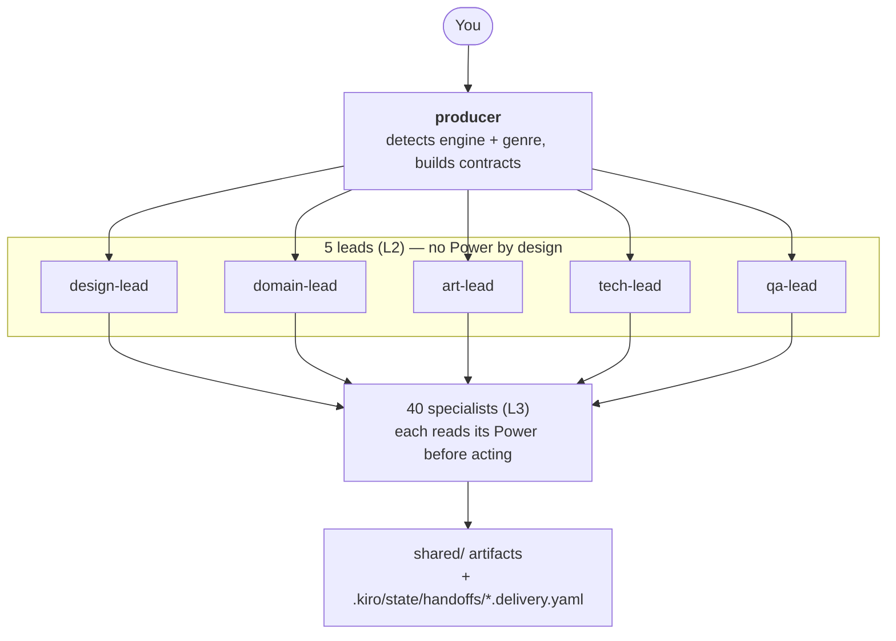
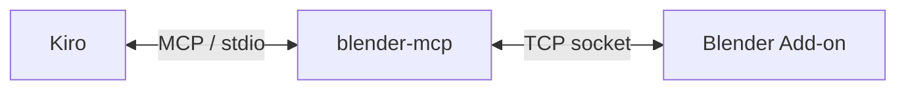
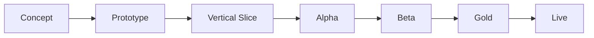
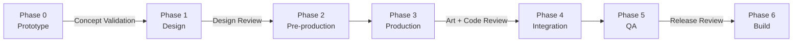

# Kiro Multi-Agent Game Studio

[English](README.md) | [繁體中文](README_ZH.md) | [简体中文](README_CN.md) | [日本語](README_JP.md) | [한국어](README_KR.md)

> **言語バージョンについて**：この README はこのプロジェクトの唯一の正式ドキュメントで、翻訳ツールなしで全体を読めるように 5 言語で維持されています。5 つのバージョンは構造的に並行に保たれています — 同じセクション、同じ表、同じ数値です。`.kiro/agents/` 配下の Agent 定義と `.kiro/steering/` 配下の steering ファイルは繁体字中国語で書かれています。それはあなたを制約しません：どの Agent もあなたが書いた言語で返答します。言語の壁にぶつかったら issue を立ててください。

あなたの IDE を仮想ゲームスタジオに変えます。作りたいゲームを普通の言葉で説明すれば、**48 個の AI Agent** から成る協調チーム — producer、5 人の Lead、ジャンル専門家、アート、エンジン Team、QA、パブリッシング — が計画し、実装し、明示的な Contract を通じて成果物を互いに引き渡します。

ドメイン知識はこのリポジトリにはありません。マシン全体にインストールされた **29 個の [Kiro Powers](https://kiro.dev/docs/powers/)** の中にあり、それぞれが独立して維持され、実際のツール接続に対して検証されています。このリポジトリが持つのは**組織レイヤー**です：誰が何を、どの順序で、どの成果物として行うか。

> **なぜ 2 層に分けるのか**：Agent prompt の中に手で写したツール知識は古くなります。この分割の前、`unity-team.md` には既に存在しない API 呼び出しが 7 個ありました。Power は実接続に対して検証され、独立して更新されるので、Agent prompt は役割と引き渡しの規律だけを担います。[Powers](#powers) を参照してください。

> **主要な概念**：このドキュメント全体で使う用語です（最初から全部理解する必要はありません）：
> - **Agent**：独自の system prompt、モデル、ツール権限を持つ役割定義（`.kiro/agents/*.md`）
> - **Power**：[Kiro Power](https://kiro.dev/docs/powers/) — パッケージ化されたドメイン知識レイヤー（steering ファイル）と任意の MCP server で、`~/.kiro/powers/` 配下にマシン全体でインストールされます
> - **MCP**（Model Context Protocol）：AI アシスタントが自然言語で開発ツール — Unity、Blender、ComfyUI、Figma など — を操作できるようにする標準化プロトコル
> - **Steering**：Power またはプロジェクトが Agent の context に注入する markdown 知識ファイル。常時読み込みか条件付き読み込みのいずれかです
> - **Contract**：Agent 同士が作業を引き渡すときに使う YAML 形式（Task Contract / Asset Contract / Change Request）
> - **Subagent 委譲**：producer が仕事を割り振る方法 — 各 Subagent は隔離された context window で走るため、完全な Contract を委譲 prompt に書き込む必要があります

## 主な特徴

- **入口はひとつ** — `producer` に話しかけるだけです。エンジンとジャンルを検出し、適切な Lead と Specialist に割り振ります。Agent の名前を知る必要はありません。
- **4 つのエンジン** — Unity、Godot、Unreal、Cocos Creator。producer はひとつを前提とせず、該当するエンジン Team にルーティングします。
- **13 のゲームジャンル** — スロット、フィッシュテーブル、シューター、MMO、RPG、カード、マッチ 3、プラットフォーマー、roguelike、ストラテジー、シミュレーション、リズム、ナラティブアドベンチャー。それぞれに専用の Domain Expert があり、背後に対応する Power があります。
- **アドバイザリーモード** — 「ゲームは分からない」と言えば、Lead は技術的な質問であなたを止めるのではなく、推奨・理由・トレードオフ・そのまま進められるデフォルト値を返します。
- **外部化された知識** — 29 個の Power、323 個の steering ファイル、約 4.9 MB のドメイン知識。すべてこのリポジトリの外にあり、独立して更新できます。
- **定量化されたドメイン知識** — Power は設計上の問いを数学に変えます：整数除算から生じる TTK の崖、ドロップ率のロングテール（P90 = 平均の 2.3 倍）、高さと頂点までの時間から逆算するジャンプ物理、MMO のスコープ階層 T1–T4。
- **明示的な Contract** — すべての引き渡しは受け入れ条件付きの YAML Contract です。すべての納品は manifest を書き、下流は何が作られ何がまだ壊れているかを把握できます。
- **正直な能力境界** — すべての Power は自分が検証できないことを宣言します。Agent はツール API を推測せず、知識の欠落を報告して止まります。
- **信頼度の階層** — ドメイン上の事実は `HIGH`（導出可能）、`MEDIUM`（慣例）、`UNVERIFIED`（あなた自身のキャリブレーションが必要な業界数値）と印が付きます。Agent はすべての数値を同等に扱わず、階層をそのまま伝えます。

## アーキテクチャ



知っておく価値のある構造的な決定が 3 つあります。

**Power は Specialist レイヤーでのみ読まれます。** producer と 5 人の Lead は Power を持ちません。Lead の価値は Specialist をまたいだトレードオフ判断です — `unity-team` に Unity を使うべきか聞くことはできません。必ず「使うべき」と答えるからです。Lead に Power を付けるとその領域に偏り、存在意義を損ないます。

**Agent は会話ではなくファイルで通信します。** Subagent は隔離された context で走るため、相互のライブチャネルはありません。設計上の真実は `.kiro/steering/project/gdd.md`、成果物は `shared/`、引き渡しの受領記録は `.kiro/state/handoffs/` にあります。

**producer はルーターです。** 上流の delivery manifest を読み、その内容を次の Agent の委譲 prompt に書き込みます。暗黙に共有されているものは何もありません。

### 設計の根拠

チーム分割はゲーム業界で通用する 6 つの職能（デザイン、アート、エンジニアリング、オーディオ、QA、プロダクション）に従い、反復的な Agile の実務と組み合わせています。AI 固有の仕組み — token 予算、MCP 統合、Contract ベースの引き渡し — はこのプロジェクトのオリジナルです。どの能力が実在しどれが構想なのかを明示的にラベル付けする慣習も同様です。

| # | 参考文献 | 著者 | 出版社 | ISBN |
|---|-----------|--------|-----------|------|
| 1 | *The Game Production Handbook*, 第 3 版 | Heather Maxwell Chandler | Jones & Bartlett Learning, 2014 | 978-1-4496-8809-7 |
| 2 | *Agile Game Development: Build, Play, Repeat*, 第 2 版 | Clinton Keith | Addison-Wesley (Pearson), 2020 | 978-0-1365-2781-7 |
| 3 | IGDA Curriculum Framework (2008) | IGDA Education SIG | IGDA | — |

## 前提条件

| 必要なもの | 備考 |
|-------------|-------|
| [Kiro IDE](https://kiro.dev/) | Agent、Power、steering はすべて Kiro から読み込まれます |
| Git + [Git LFS](https://git-lfs.com/) | バイナリアセットは LFS で追跡されます（`.gitattributes` に 27 個のパターン） |
| [uv](https://docs.astral.sh/uv/) | Blender、ComfyUI、Unreal、Ableton の MCP server が必要とします |
| ターゲットエンジン | Unity / Godot / Unreal / Cocos Creator — 実際に使うものだけ |
| Node.js ≥ 18 | Godot または ComfyUI の MCP server を使う場合のみ（`npx` でインストール） |

パイプラインに応じて任意：Blender（3D）、ComfyUI（2D 生成）、Krita（手描きアート）、Ableton Live（音楽）、Figma アカウント（UI）。

## インストール

### ステップ 1 — Clone して LFS を有効化

```bash
git clone https://github.com/hoycdanny/kiro-multi-agent-game-studio.git
cd kiro-multi-agent-game-studio
git lfs install    # マシンごとに 1 回。無ければ brew install git-lfs
```

### ステップ 2 — Kiro で開いて workspace を信頼する

Kiro IDE でこのフォルダを開きます。初回起動時に workspace を信頼するか聞かれます — **信頼を選んでください**。そうしないと Agent と steering が読み込まれません。その後 Agent Selector に 48 個すべての Agent が並びます。

### ステップ 3 — 必要な Power をインストール

Kiro → Powers パネル → **Add custom power** → ソース `https://github.com/hoycdanny/<power-name>`。

**29 個すべては必要ありません。** このプロジェクトで使うものだけ入れてください — Power が欠けている Agent は場当たり的に作業せず、正直に欠落を報告します。

どんなゲームでも役に立つ最小構成：

```
kiro-<your-engine>-accelerator    unity / godot / unreal / cocos — pick one
kiro-comfyui-accelerator          2D asset generation (almost always needed)
kiro-economy-balancing-expert     economy numbers + the simulation methodology balance-tester relies on
kiro-game-compliance-expert       needed the moment you plan to ship
```

必要に応じて追加：

| やりたいこと | インストール |
|------------------|---------|
| 3D モデル / アニメーション | `kiro-blender-accelerator` |
| 手描きの UI や sprite | `kiro-krita-accelerator` |
| オリジナル音楽 | `kiro-ableton-accelerator` |
| Figma デザイン → エンジン UI | `figma`（Kiro 公式の推奨リスト。`hoycdanny` ではありません） |
| スロット / フィッシュテーブル | `kiro-slot-game-expert` / `kiro-fish-game-expert` |
| ウォレットまたは決済バックエンド | `kiro-gaming-wallet-expert` |
| RPG / シューター / カード / マッチ 3 / プラットフォーマー / リズム / ストラテジー / シミュレーション / roguelike / ナラティブ | 該当する `kiro-<genre>-expert` |
| マルチプレイヤー | `kiro-mmo-netcode-expert` — **まず T1–T4 のスコープ階層を読んでください。ほとんどのプロジェクトに本物の MMO は不要です** |
| セーブシステム / リソース管理 | `kiro-game-systems-expert` |
| ローカライズ | `kiro-i18n-expert` |
| CI / 自動ビルド | `kiro-game-devops-expert` |
| ユーザビリティ評価 | `kiro-usability-expert` |

確認：

```bash
ls ~/.kiro/powers/installed/                                        # インストール済みの Power
ls ~/.kiro/powers/installed/kiro-blender-accelerator/steering/      # その steering ファイル
ls ~/.kiro/powers/repos/kiro-blender-accelerator/templates/         # templates は repos/ 配下。installed/ にはありません
```

> `templates/` と `hooks/` は `~/.kiro/powers/repos/<power>/` 配下に**のみ**存在します。`installed/` のコピーには `POWER.md`、`steering/`、`mcp.json` だけがあります。`POWER.md` が Agent にテンプレートの読み込みを指示している場合、そのパスは `repos/` を基準に解決されます。

### ステップ 4 — ツールの MCP server を接続

`.kiro/settings/mcp.json` には既に `blender-mcp`、`comfyui`、`unity-mcp`、`godot-mcp`、`unreal-engine`、`cocos-creator`、`figma`、`github` の設定が入っています。

> ⚠️ **`ableton` と `krita` は `mcp.json` にありません。** このファイルは IDE の権限ルールで保護されており Agent が書き込めないため、自分で貼り付ける必要があります — 正確なブロックは [Ableton](#ableton) と [Krita](#krita) にあります。貼り付けるまで、`audio-team` と `krita-team` は接続セルフチェックで止まって欠落を報告します。オーディオやアートワークを作ったふりはしません。

そのうえで、実際に使うツールを起動します：

| ツール | 接続方法 |
|------|----------------|
| Blender | `blender_mcp` アドオンを有効化し server を起動（デフォルト `localhost:9876`） |
| ComfyUI | ローカルサービスを起動（ポート 8188、次に 8000 を自動検出） |
| Unity | Window → MCP for Unity → Start Server |
| Godot | `npx` が `@coding-solo/godot-mcp` を自動インストール。`GODOT_PATH` を設定 |
| Unreal | UnrealMCP プラグインをインストールし Editor で有効化 |
| Cocos Creator | `cocos-mcp-server` をインストールし、Extension → Cocos MCP Server → Start |
| Figma | 公式 Remote MCP Server。初回利用時に Kiro で OAuth を完了 |
| GitHub | `github-mcp-server` バイナリを `PATH` に置き、PAT を渡す |
| Ableton | `localhost:9877` を listen する Remote Script ブリッジを有効化 |
| Krita | Krita の Python プラグインをインストール。`127.0.0.1:5678` で待ち受けます |

ツールごとの前提条件、設定、失敗パターン：[MCP Integrations](#mcp-integrations)。

## 使い方

### 3 つの入口

| あなたの状況 | 話す相手 | 理由 |
|----------------|---------|-----|
| 目標はあるがゲーム開発の背景がない | `producer` | アドバイザリーモードに入り、あなたを尋問せず Lead に推奨を委譲します |
| 領域を理解していて専門的な判断が欲しい | 該当する **Lead** | 委譲を 1 段飛ばせます。Lead が選定の問いに直接答えます |
| 範囲が狭く単独で完結する質問 | 該当する **Specialist** | 例：`shooter-expert` に TTK の計算方法を聞く |

各 Lead があなたのために決められること：

| Lead | 決めること | 典型的な質問 |
|------|---------|------------------|
| `tech-lead` | **エンジン選定**、アーキテクチャのトレードオフ、パフォーマンス予算、マルチプレイヤーが必要か | 「スロットマシンにはどのエンジン？」 |
| `domain-lead` | これはどのジャンルか、どの Domain Expert を起動するか、ジャンルが重なるときの優先順位 | 「これは roguelike か RPG か？」 |
| `design-lead` | コアループはどうあるべきか、スコープをどこまで削るか、どのシステムを先に作るか | 「v1 はどこまでやるべき？」 |
| `art-lead` | アートディレクション、2D と 3D、生成と手描きの分担、オーディオの基調 | 「このテーマにはどのスタイル？」 |
| `qa-lead` | この段階で何をテストするか、どこまでで出荷可能とみなすか | 「今出荷できる？」 |

**なぜ選定の問いは Specialist ではなく Lead に向けるべきなのか**：`unity-team` に Unity を使うべきか聞くことはできません — 必ず「使うべき」と答えます。4 つのエンジン Team にはそれぞれ立場があり、2 つの casino Domain Expert もどちらも仕事を取りたがります。Lead は自分の管掌範囲において単一ツールのしがらみを持ちません。それが存在する構造的な理由です。

問いが狭く、領域をまたいだ調整が不要なときは、Specialist に直接聞くのが最速です：

| 質問 | 聞く相手 | 読む Power |
|----------|-----|----------------|
| 「HP 100、ダメージ 33 — TTK は？」 | `shooter-expert` | `kiro-shooter-expert` |
| 「ガチャ確率 1% — 90% の確度には何回引く？」 | `economy-designer` | `kiro-economy-balancing-expert` |
| 「40 枚デッキに 3 枚 — 初手 5 枚で引く確率は？」 | `card-game-expert` | `kiro-card-game-expert` |
| 「この FBX を Unity に入れるとスケールがおかしい」 | `blender-team` | `kiro-blender-accelerator` |
| 「3 タイル分の高さ、頂点まで 0.35 秒 — 重力は？」 | `platformer-expert` | `kiro-platformer-expert` |

Specialist は仕様を出しますが、下流の作業を調整しません。仕様を実装に変えるには producer に戻る必要があります。

### コマンド例

```
"Build a slot machine in Unity"
"I want to make a slot machine but I don't know anything about games"     → アドバイザリーモード
"Which engine should I use for a mobile match-3?"                        → tech-lead に聞く
"HP is 100 and damage is 33 — what is the TTK?"                          → shooter-expert に聞く
"40-card deck with 3 copies — odds of drawing one in the opening 5?"      → card-game-expert に聞く
"Implement this skill tree in Unity, spec is in specs/skill-tree.md"      → アドバイザリーモードを飛ばす
```

### ウォークスルー A — 一文だけの初心者

> **あなた**：スロットマシンを作りたいのですが、ゲーム開発は全く分かりません。

1. **`producer`** が 2 つを検出します：ジャンルは casino、そしてユーザーが背景の無さを宣言した → **アドバイザリーモード**（`.kiro/steering/global/advisory-mode.md`）に入ります。

2. 技術的な質問を並べ立てることは**しません**。エンジン選定のために `tech-lead`、起動すべき専門家の確認のために `domain-lead` を委譲します。

3. **`tech-lead`** は 4 部構成のアドバイザリー形式で答えます：
   > **推奨**：Cocos Creator。
   > **理由**：スロットマシンは 2D で、web とモバイル両方が必要、そしてアニメーションと UI が重い。この組み合わせでは Cocos の 2D パイプラインが最も直接的で、web エクスポートの成熟度も高いです。
   > **トレードオフ**：後で 3D 版が欲しくなる、あるいは既に Unity の人員がいるなら Unity のほうが良い。純粋な web フロントエンドチームなら PixiJS も検討できます。
   > **デフォルト**：返答がなければ Cocos Creator で進めます。

4. **`slot-game-expert`** は `kiro-slot-game-expert` を読み、**まず対象となる司法管轄区を尋ねます** — 「最小スピン間隔をいくつにすべきか」は市場ごとに法的な答えが違うからです。未定と答えた場合は最も保守的な仮定（娯楽専用のプロトタイプ、実際の金銭は絡まない）で進め、その仮定を明示的にラベル付けします。

5. producer は推奨を伝え、質問は**ひとつ**だけします：「始めましょうか？」

6. 承認後、パイプラインが動きます：

```
slot-game-expert   → math model (RTP / volatility / paytable)
balance-tester     → reads simulation-methodology.md, Monte Carlo verification of actual RTP
art-lead           → comfyui-team generates symbols and background
ui-ux-team         → reads the figma Power, produces layout + Design Tokens
cocos-team         → reads kiro-cocos-accelerator, assembles scene and logic
qa-lead            → functional-tester verifies flow
compliance-release → reads kiro-game-compliance-expert (if you intend to ship)
```

あなたが「はい」と答えたのはちょうど 1 回です。それがアドバイザリーモードの狙いです。

### ウォークスルー B — すでに仕様がある

> **あなた**：このスキルツリーを Unity で実装してください。仕様は `specs/skill-tree.md` にあります。

1. producer はアドバイザリーモードに**入りません**。`advisory-mode.md` は既に決めたことの再確認を明確に禁じています。
2. Task Contract を作り、`tech-lead` に委譲し、そこから `unity-team` に転送されます。
3. `unity-team` は MCP のツール名を推測せず、該当する `kiro-unity-accelerator` の steering（シーン組み立て / スクリプト / ビルド）を読みます。
4. 完了時に `.kiro/state/handoffs/TASK-xxx.delivery.yaml` へ delivery manifest を書きます。
5. `tech-lead` が code review を行い、producer があなたに報告します。

仕様に数値上の問題がある場合 — 例えばスキルポイントの成長カーブが不合理なとき — `unity-team` は自分で直しません。報告を返し、producer が `rpg-systems-expert` にルーティングします。

### ウォークスルー C — 分析のみ、何も作らない

> **あなた**：PvP のあるカードゲームを作るなら、最大の技術的リスクは何ですか？

producer は分析型の問いだと認識し、複数の Lead を並行で委譲し、統合されたリスクリストを返します。**Task Contract は作られず、ファイルも生成されません。**

- `tech-lead`：PvP の同期アーキテクチャ。`mmo-expert` を引き込み、`kiro-mmo-netcode-expert` のスコープ尺度で T1 か T2 かを分類します
- `domain-lead` → `card-game-expert`：power creep は長期的な構造リスク
- `design-lead`：先手有利はカード PvP において構造的なもので、仮定ではなく測定が必要
- `qa-lead`：対戦シミュレーションに必要なサンプル数（±1pp の精度には約 9,604 試合）

作業はあなたが求めたときにだけ始まります。分析型の問いが黙ってファイルの山を生むことはありません。

### プロジェクトの状態を見る場所

Agent 間にライブチャネルは無いので、現在の状態はファイルの中にあります：

| 知りたいこと | 見る場所 |
|------------------|---------|
| 今のゲームデザインがどうなっているか | `.kiro/steering/project/gdd.md` |
| アートとオーディオの方向性が何に決まったか | `.kiro/steering/project/style-guide.md` |
| どんなタスクがあり、状態はどうか | `.kiro/state/tasks.yaml` |
| あるタスクが何を納品し、何がまだ壊れているか | `.kiro/state/handoffs/<contract_id>.delivery.yaml` |
| 実際のアセットファイル | `shared/`（models / textures / sprites / audio / locales / sim） |
| 今どの milestone にいるか | `.kiro/steering/project/milestones.md` |
| どの Agent がどの Power を持つか | `.kiro/steering/global/powers-registry.md` |

納品記録は**追記のみ**です：訂正するには古いものを編集せず新しい項目を追加します。そうすることで履歴が追跡可能に保たれます。

## プロジェクト構成

```
.kiro/
├── agents/              48 agent definitions, grouped by layer
│   ├── orchestration/   creative-director, producer
│   ├── design/          5 core design roles + 13 genre domain experts + ui-ux + economy + localization
│   ├── art/             art-lead, blender, comfyui, krita, animator, audio, vfx, technical-artist
│   ├── engineering/     tech-lead + 4 engine teams + systems/ui programmer, devops, wallet
│   ├── qa/              qa-lead + functional / balance / performance / usability
│   └── publishing/      compliance-release, marketing-team
├── steering/
│   ├── global/          contracts, asset-standards, bug-severity, powers-registry, advisory-mode
│   └── project/         gdd, style-guide, milestones      ← your game's single source of truth
├── state/               tasks.yaml, handoffs/*.delivery.yaml
└── settings/mcp.json    MCP server configuration

shared/                  cross-agent artifact staging
├── concept/ textures/ sprites/ ui/     from comfyui-team
├── models/                             from blender-team
├── rigs/ animations/                   from animator
├── audio/{sfx,music,voice}/            from audio-team
├── locales/                            from localization-team
└── sim/                                from balance-tester
```

`~/.kiro/powers/` — 知識レイヤー。**このリポジトリの外**、マシン全体にあります。

各 Agent は `.md`（frontmatter + system prompt）と `.json` の両方を持ちます。サブディレクトリは整理のためだけのものです：Kiro は frontmatter のフラットな `name` で Agent を登録するので、委譲は `Use the "blender-team" subagent to ...` と書き、`"art/blender-team"` とは絶対に書きません。

## Agent のレイヤー

| レイヤー | 数 | 構成 |
|-------|:-----:|-------------|
| L0 戦略 | 2 | `creative-director`（ビジョンのゲート）、`producer`（委譲のハブ） |
| L2 Lead | 5 | `design` / `domain` / `art` / `tech` / `qa` — 委譲の仲介役と品質ゲート。**設計上 Power を持ちません** |
| L3 デザインとジャンル | 20 | 7 つのコアデザイン職能 + 13 のジャンル Domain Expert |
| L3 アートとオーディオ | 7 | Blender、ComfyUI、Krita、Animator、Audio、VFX、Technical Artist |
| L3 エンジニアリング | 8 | 4 つのエンジン Team + Systems/UI Programmer、DevOps、Wallet |
| L3 QA | 4 | functional / balance / performance / usability |
| L3 パブリッシング | 2 | compliance-release、marketing-team |

**48 個のうち 33 個が Power を持ちます**。残りの 15 個は調整役で、その知識*こそが*このプロジェクトの組織的な慣習です。[Powers](#powers) を参照してください。

### 13 のジャンル Domain Expert

`domain-lead` が必要に応じて起動します。全部を同時に立ち上げることはありません。

| 専門家 | 扱う範囲 |
|--------|--------|
| `slot-game-expert` | スロットマシン：数学モデル、RNG、認証、司法管轄区マトリクス、責任あるゲーミング |
| `fish-game-expert` | フィッシュテーブル：捕獲 RNG、ペイアウト、マルチプレイヤーの公平性、ペイアウト制御のレッドライン |
| `shooter-expert` | FPS/TPS：武器数値、弾道、ヒット判定、リコイル、Bot AI、ガンフィール |
| `mmo-expert` | マルチプレイヤー：サーバー権威、レプリケーション、interest management、レイテンシ補償 |
| `rpg-systems-expert` | ステータス、レベルカーブ、スキルツリー、ドロップのレアリティ、ダメージ式、状態効果 |
| `card-game-expert` | デッキビルダー/TCG：ドロー確率、コストカーブ、archetype、power creep の制御 |
| `puzzle-match3-expert` | board 生成、可解性、カスケード、難易度カーブ、手数の経済 |
| `platformer-expert` | ジャンプ物理、入力の寛容さ、レベルのリズム、metroidvania の能力 gating |
| `roguelike-expert` | プロシージャル生成、run 内の build と synergy、meta 進行、スケーリング |
| `strategy-expert` | RTS / ターン制 / 4X / タワーディフェンス：ユニット相性、経済、AI、ウェーブカーブ |
| `simulation-expert` | 生産チェーン、資源ループ、自動化、サバイバルの必要値、創発 |
| `rhythm-expert` | 譜面、判定ウィンドウ、audio/input offset のキャリブレーション、スコアリング |
| `narrative-adventure-expert` | 分岐構造、フラグと状態、会話ツリー、エンディングと収束 |

### Agent 定義のフォーマット

各 Agent は `.kiro/agents/` 配下の markdown ファイルです。YAML frontmatter が権限を定義し、本文が system prompt です。

このプロジェクトのすべての Agent に通底する設計原則が 2 つあります。

**「待機中」はバックグラウンドプロセスではありません。** Kiro のカスタム Agent に常駐サービスはありません。Agent は選択されたときにだけ「起きて」おり、最初の一歩は必ず状況の判断です — 挨拶か、具体的な依頼か、ツールが未接続か — そのうえで動くかどうかを決めます。例えば `blender-team` は `get_blendfile_summary_path_info` で接続セルフチェックを行い、失敗すればモデリングを始めずに止まります。

**できないと認めることは、できるふりに勝ります。** どの Agent も他の Team の結果や進捗を捏造しません。`producer` は Subagent が実際に返した内容だけを報告します。

prompt の例をここに貼るのは意図的に避けています。以前は貼っていましたが、リファクタ後に抜粋が実ファイルと乖離しました。見たいならファイルを開いてください。

### モデルの割り当て

各 Agent は frontmatter でモデルを固定します。実効値は `.json` の値で、`.md` の frontmatter は同期を保っています。48 個の Agent 全体で実測した分布：

| モデル | 数 | 割り当て先 | 根拠 |
|-------|:-----:|-------------|-----------|
| `claude-sonnet-5` | 7 | `creative-director`、`producer`、5 人の Lead | 委譲とレビューゲート：多段の agentic な作業で、誤りがパイプライン全体に伝播します |
| `deepseek-3.2` | 9 | `slot-game-expert`、`fish-game-expert`、`rpg-systems-expert`、`shooter-expert`、`card-game-expert`、`strategy-expert`、`economy-designer`、`balance-tester`、`wallet-systems-expert` | 数値と確率の推論：RTP、ペイアウト、成長カーブ、経済の収束、台帳の整合性 |
| `claude-sonnet-4` | 20 | すべてのアート職能、一般的なデザイン、残りのジャンル専門家、`ui-ux-team`、`compliance-release` | 汎用的な強さで十分。最も人数の多い層です |
| `qwen3-coder-next` | 7 | 4 つのエンジン Team、`systems-programmer`、`ui-programmer`、`devops-team` | 純粋なコーディングとツールのオーケストレーション |
| `claude-haiku-4.5` | 5 | `functional-tester`、`performance-tester`、`usability-tester`、`localization-team`、`marketing-team` | 呼び出し回数が多く、1 回の誤りのコストが低い |

> この振り分けは Kiro が公開しているモデルの位置づけとタスク種別・コストから導いたもので、**このプロジェクト内でのベンチマーク結果ではありません**。好みに合わせて調整してください：ある Agent の出力が浅いと感じたら 1 段上げるか reasoning effort を上げます。

調整のレバー：誤算のコストが高い箇所をより安全にしたいなら `slot-game-expert` / `fish-game-expert` / `wallet-systems-expert` を `claude-opus-4.8` に上げます。調整したくないならすべて `auto` にしてください。`/model` のリストに存在しないモデル ID は黙ってデフォルトに戻ります。一部のモデルは Experimental でリージョン制限があるため、自分の環境で可用性を確認してください。

## Powers

Agent は**組織レイヤー**です。[Kiro Powers](https://kiro.dev/docs/powers/) は**ドメイン知識レイヤー**です。29 個すべてがインストール済みで中身が入っています：**323 個の steering ファイル、約 4.9 MB。**

権威ある対応表は `.kiro/steering/global/powers-registry.md` にあり、すべての Agent が自動で読み込みます。以下の表は人間向けのバージョンです。

### エンジンとツールの Power（Accelerator — 12 個の Agent）

それぞれが実際の MCP server を背後に持ち、知識は実接続に対して検証されています。

| Agent | Power | Steering | 何を解決するか |
|-------|-------|:--------:|----------------|
| `unity-team` | `kiro-unity-accelerator` | 15 | シーン / アセット / ビルド / パフォーマンス / アーキテクチャ / プラットフォーム互換 |
| `godot-team` | `kiro-godot-accelerator` | 13 | シーンアーキテクチャ / GDScript / signal / TileMap / エクスポート |
| `unreal-team` | `kiro-unreal-accelerator` | 11 | レベル / Blueprint / マテリアル / GAS / UE5 機能 |
| `cocos-team` | `kiro-cocos-accelerator` | 14 | シーン / ノードコンポーネント / prefab / クロスプラットフォームビルド |
| `blender-team` | `kiro-blender-accelerator` | 15 | モデリング / UV / マテリアル / エクスポート。**軸の向きと色空間が最も静かに壊れます** |
| `animator` | 同上 | — | `rigging-and-skinning.md` / `animation-authoring.md` を読みます |
| `technical-artist` | 同上 | — | `collider-and-lod.md` / `performance-and-limits.md` を読みます |
| `comfyui-team` | `kiro-comfyui-accelerator` | 11 | モデル選択 / prompt / sampler / ControlNet / アップスケール / VRAM |
| `vfx-artist` | 同上 | — | エフェクト素材。`comfyui-team` と Power を共有します |
| `krita-team` | `kiro-krita-accelerator` | 13 | キャンバス / ブラシ / レイヤー / マスク / 構図 / エクスポート |
| `audio-team` | `kiro-ableton-accelerator` | 11 | アレンジ / ミキシング / 音楽理論 / ドラムのグルーヴ / ジャンル playbook |
| `ui-ux-team` | `figma` | 3 | レイアウトの読み取り / Design Token の抽出 / Code Connect / design system ルール |

> `figma` Power は Figma → web フロントエンドコードを前提としていますが、このプロジェクトが必要とするのは Figma → ネイティブなエンジン UI です。レイアウトの読み取りと token の抽出はそれに従い、成果物は HTML/CSS ではなくこのプロジェクトの handoff 仕様を作ってください。

### ジャンル Domain Expert（Knowledge Base — 13 個の Agent）

純粋な知識で、MCP server はありません。価値は一般的な助言ではなく、設計上の問いを計算可能な数学に変えることにあります。

| Agent | Power | Steering | 技術的な核 |
|-------|-------|:--------:|----------------|
| `slot-game-expert` | `kiro-slot-game-expert` | 12 | 数学モデル / RNG / 認証 / 司法管轄区マトリクス / 責任あるゲーミング |
| `fish-game-expert` | `kiro-fish-game-expert` | 16 | 捕獲 RNG / ペイアウト / マルチプレイヤーの公平性 / ペイアウト制御の限界 / 認証 |
| `rpg-systems-expert` | `kiro-rpg-systems-expert` | 11 | 3 系統のダメージ式における極値の振る舞い、ドロップのロングテール（P90 = 平均の 2.3 倍）、スキルツリーの trap 検出 |
| `shooter-expert` | `kiro-shooter-expert` | 10 | **TTK の崖** — HP 100 ではダメージ 34 で 3 発、33 で 4 発。ダメージ 1 点差で TTK が 33% 跳ねます。リコイルモデル、武器の支配性検定 |
| `card-game-expert` | `kiro-card-game-expert` | 10 | 超幾何分布のドロー表、定量化された power creep 検出、HHI による meta 多様性、`C(n,2)` のキーワード相互作用 |
| `puzzle-match3-expert` | `kiro-puzzle-match3-expert` | 11 | 可解性の 3 階層（3 番目は数学的に証明不可能）、board の棄却率、クリア率の感度が 37 倍に広がる |
| `platformer-expert` | `kiro-platformer-expert` | 10 | ジャンプ物理の逆算（`g = 2h/t²`）、3 つの入力寛容メカニズム、gating のデッドロックグラフ検出 |
| `rhythm-expert` | `kiro-rhythm-expert` | 10 | オーディオクロックを権威とする（frame 計時は 3 分で約 1 秒ずれます）、audio と input の offset は分離必須 |
| `strategy-expert` | `kiro-strategy-expert` | 10 | 4 つのサブジャンルの制約、相性マトリクスの不均衡検定、タワーディフェンスのウェーブと収入の結合、AI 難易度の公平性 |
| `simulation-expert` | `kiro-simulation-expert` | 10 | 生産チェーンと需給の収束、閉じた資源ループ、長期的な崩壊の検出 |
| `roguelike-expert` | `kiro-roguelike-expert` | 9 | プロシージャル生成の正しさ、シード設計、build synergy の上限、meta 進行のバランス |
| `narrative-adventure-expert` | `kiro-narrative-adventure-expert` | 14 | 分岐のトポロジーとその維持コスト、フラグ設計、到達可能性と行き止まりの検証 |
| `mmo-expert` | `kiro-mmo-netcode-expert` | 11 | **スコープ階層 T1–T4** — MMO を求めるプロジェクトの多くが実際に必要なのは T2 です。帯域と容量のモデル、レイテンシ補償のトレードオフ |

### 領域横断の Power（Knowledge Base — 8 個の Agent）

| Agent | Power | Steering | 技術的な核 |
|-------|-------|:--------:|----------------|
| `economy-designer` | `kiro-economy-balancing-expert` | 13 | 通貨の階層 / sink-source の閉環 / ガチャの期待コストと天井の数学 / 進行カーブ |
| `balance-tester` | 同上 | — | `simulation-methodology.md` を読みます：`n ≥ (1.96σ/ε)²` からのサンプル数、収束判定、RNG ストリームの分離 |
| `compliance-release` | `kiro-game-compliance-expert` | 14 | レーティング / プライバシー / 申請 / ストア素材 / 開示義務。**期限切れになる主張を 45 分類で収録** |
| `wallet-systems-expert` | `kiro-gaming-wallet-expert` | 10 | API / DB schema / 冪等性とロック / 突合 / 可観測性 / 決済コンプライアンス |
| `systems-programmer` | `kiro-game-systems-expert` | 9 | セーブのエンベロープと移行チェーン（逐次 `N-1` 対 近道 `N(N-1)/2`）、atomic write の順序、`f^d` 規模のイベントストーム |
| `localization-team` | `kiro-i18n-expert` | 10 | 文字列連結に一般解が無い理由 / CJK の禁則処理 / RTL のミラーリング / フォントのサブセット化と豆腐 |
| `devops-team` | `kiro-game-devops-expert` | 9 | 4 エンジンの headless ビルド / **成果物検証の 8 項目**（exit code 0 には 7 通りの失敗形態がある）/ バージョニング / Git LFS |
| `usability-tester` | `kiro-usability-expert` | 8 | 5 段階のエビデンス階層 / オンボーディング審査 / 詰まり点の分析 / playtest 設計 |

### なぜ 15 個の Agent が意図的に Power を持たないのか

これは設計上の決定で、抜け漏れではありません。

| Agent | 持たない理由 |
|-------|---------|
| `producer`、`creative-director` | 委譲とビジョンはこのプロジェクトの組織的知識で、単一の領域に属しません |
| 5 人の Lead | **価値は Specialist をまたいだトレードオフ判断から来ます。** Power はその領域に Lead を偏らせ、選定における中立性こそが存在理由です — `unity-team` に Unity を使うべきか聞くことはできません |
| `game-designer` | GDD 統合の役割。ドメイン知識は 13 のジャンル Power に散在しています |
| `level-designer` | レベルデザインの知識は既に platformer / strategy / puzzle / roguelike の Power の中にあります |
| `ui-programmer` | UI のバインディングは各エンジンの Power がカバーします |
| `functional-tester` | 機能テストの方法はプロジェクトごとに異なり、CI 実行側は devops Power にあります |
| `performance-tester` | 計測は各エンジンの profiler に依存し、その知識はエンジン Power のパフォーマンス章にあります |
| `narrative-designer` | ナラティブの*システム構造*は narrative-adventure Power にあり、この役割が作るのは*内容*です |
| `combat-designer` | 戦闘の数値は shooter / rpg Power にあり、この役割は専用 Power の無いジャンルに奉仕します |
| `marketing-team` | テキストのみの出力で、ツール依存がありません |

### 信頼度の階層 — どんな数値を引用する前にも読んでください

Knowledge Base 型の Power は内容を 3 階層で印付けし、Agent はその階層をそのまま伝える義務があります：

| 階層 | 意味 | 伝え方 |
|------|---------|--------------|
| `HIGH` | 数学的に導出可能、または公開された標準による（式、組合せ論、Unicode/CLDR ルール、POSIX セマンティクス） | そのまま結論として使えます |
| `MEDIUM` | 広く採用された慣例で、唯一の答えではありません | どの前提が変われば推奨が変わるかを述べてください |
| `UNVERIFIED` | 学習データ由来の業界数値。未検証で時間とともに変動します | **あなた自身のデータでキャリブレーションが必要だと明言しなければなりません** |

`UNVERIFIED` は全体のかなりの割合を占め、4 つの領域に集中しています：

- あらゆる「業界平均」（リテンション、ARPPU、典型的な TTK 帯、coyote time のミリ秒、推奨被験者数）
- あらゆる規制の詳細（レーティング質問票、プラットフォーム方針、確率開示義務 — `kiro-game-compliance-expert` では `UNVERIFIED` が意図的に多数派です）
- あらゆるエンジン側の挙動（インポート設定や API を検証できる実接続を持つ Power はありません）
- あらゆるプラットフォームのレイテンシとハードウェア仕様の数値

階層の印が無い具体的な数値を見かけたら、導出可能なのかキャリブレーションが必要なのかを尋ねてください。

### 知識ベースはこのリポジトリの外にあります

| | 何を持つか | 場所 |
|---|---|---|
| **このリポジトリ** | **ルーティングと組織**：どの Agent がどの Power に対応するか、どの steering ファイルを読むか、いつ読むか、欠落をどう報告するか | `.kiro/` |
| **Kiro Powers** | **知識そのもの** | `~/.kiro/powers/installed/`（マシン全体、リポジトリの外） |

検証可能な事実：323 個の Power steering ファイルはすべてこのリポジトリの外にあります。Power の内容にしか出てこない文字列でリポジトリを検索してもヒットは 0 です（`Redlock`、`euler_ancestral`、`GPU Resident Drawer`、`krita_select_by_alpha` で検証）。リポジトリ内で Power に言及している箇所はすべてパスかファイル名の参照で、複製された内容ではありません。48 個の Agent prompt が参照する **376 個すべての steering ファイル名をディスクと照合し、捏造は 0 でした**。

**コストを正直に述べると**：このリポジトリは**自己完結していません**。clone しても 33 個の Agent の知識レイヤーは空で、Powers パネルから Power をインストールするまでそのままです。機械的にチェックできる manifest もセットアップスクリプトもありません — このドキュメントと `powers-registry.md` の対応表だけです。

### カバレッジのギャップ分析

29 個の Power はすべて少なくとも 1 つの Agent から参照されています（孤児は 0）。4 つの領域には Power のカバレッジが**まったくありません**。これは TODO リストではなく正直な棚卸しで、今は誰が代役を務めているか、埋めない場合のコストも併記します：

| ギャップ | 影響を受ける Agent | 現在の代役 | 埋めない場合のコスト |
|-----|---------------|-----------|------------------------|
| **エンジン横断の profiling 方法論** | `performance-tester` | 各エンジン Power のパフォーマンス章（散在し、単一エンジンの視点） | パフォーマンス数値はノイズが大きく、方法論が無いと間違ったものを最適化して気づかないことが容易に起きます。欠けているのは：何を測るか、frame 予算の帰属、統計的妥当性、プラットフォーム固有の罠 |
| **格闘／アクションゲームの近接戦闘** | `combat-designer` | 自身の prompt。shooter Power は射撃のみ、rpg Power は数値のみをカバー | frame data、hitbox/hurtbox、入力バッファとキャンセル窓、コンボ設計、hitstop は**どの Power もカバーしていません**。格闘は 13 ジャンルに含まれていません |
| **ナラティブ執筆の技法とツール** | `narrative-designer` | 自身の prompt。narrative-adventure Power がカバーするのは*システム構造*で、内容ではありません | Ink / Yarn / Twine の構文と慣習、World Bible の構造、会話執筆の技法は、基盤モデルの知識だけに依存しています |
| **ストアのコンバージョンとトレーラー構成** | `marketing-team` | 自身の prompt | ストアページのコンバージョン要素、トレーラーの shot list 構成、press kit の構成は、蓄積可能な技法的知識です |

13 ジャンルも**格闘、レース、スポーツ、ホラー、パーティゲーム**をカバーしていません。格闘のメカニクスが最も独特で — frame data はそれ自体が一分野です — 残りの 4 つは既存の専門家が部分的に担っています。追加すべきかは実際に何を作るかによります。**カバレッジのために Power を追加してはいけません** — 48 個の Agent は既に慎重な管理を要する規模です。

### 新しい Power を追加する

Power には 2 つの原型があります：**Accelerator**（実際の MCP server を包み、知識は実接続に対して検証済み）と **Knowledge Base**（純粋なドメイン知識、server なし、信頼度階層付き）。

Power を作る価値があるかを判断する 3 つのテスト：

1. **内容が基盤モデルの既知を超えるか？** 言語モデルが既に知っているなら、その Power の価値はほぼ 0 です — 同じ知識を置き場所だけ変えただけです。価値は具体的な数値と導出（TTK の崖の閾値表）、検証可能な API の事実（Blender 5.x は `action.fcurves` を削除）、日付付きの現行規制から来ます。
2. **間違えたときのコストはどれだけ高いか？** セーブ移行の失敗はプレイヤーの進行を壊し、コンプライアンスの失敗は配信停止を招きます。そちらを優先してください。
3. **その知識は古くなるか？** 期限が来るもの（ツール API、規制）は、Power が独立して更新できるからこそ Power に置くべきです。時代を超える数学はどこに置いても構いません。

Power を完成させたら：Powers パネルからインストールし、Agent ↔ Power の行を `.kiro/steering/global/powers-registry.md` に追加し、上の棚卸し表に追加し、参照するすべての steering ファイル名が実際にディスクに存在することを確認してください。

## MCP Integrations

> **このセクションは接続方法を扱い、使い方は扱いません。** 正確なツール名、パラメータ、正しい操作順序は各 Power の `POWER.md` と `steering/` が権威で、それらは実接続に対して検証され独立して更新されます。ここにあるツール一覧はすべて概念的なもので、遅れている可能性があります。
>
> 呼び出しが `Unknown action` やパラメータ検証エラーを返した場合、**エラーメッセージ内の正当な値が最高の権威**で、いかなるドキュメントよりも優先されます。

### Blender

`art/blender-team`、`animator`、`technical-artist` が軽量な MCP server を通して Blender を駆動します。



> ⚠️ **セキュリティ**：この MCP server は LLM が生成したコードを Blender 内でサンドボックスなしに実行します。VM か、機密データの無いマシンを使ってください。

前提条件：[Blender 5.1+](https://www.blender.org/download/)、[uv](https://docs.astral.sh/uv/)、Kiro。

```json
"blender-mcp": {
  "command": "uv",
  "args": ["--directory", "/path/to/blender_mcp/mcp", "run", "blender-mcp"],
  "disabled": false,
  "autoApprove": []
}
```

1. uv をインストール：`curl -LsSf https://astral.sh/uv/install.sh | sh`
2. `git clone https://projects.blender.org/lab/blender_mcp.git`
3. アドオンをインストール — release の `.zip` を Blender ウィンドウに 2 回ドラッグ（1 回目で Blender Lab リポジトリを追加、2 回目でインストール）、または Edit → Preferences → Extensions → Install from Disk
4. `--directory` 引数を自分が clone した `blender_mcp/mcp` に向けます

Kiro がプロセスを起動・管理するので、ターミナルは不要です。**`blender-team` を起動する前に Blender を開きアドオンが有効なことを確認してください** — `get_blendfile_summary_path_info` で接続をセルフチェックし、見えないまま進むのではなく止まります。

ツールは読み取り専用の検査（`get_objects_summary`、`get_object_detail_summary`、`get_blendfile_summary_*`）、スクリーンショット、viewport レンダリング、任意の `bpy` 作業のための `execute_blender_code` に及びます。

参考：[Blender MCP](https://www.blender.org/lab/mcp-server/#llm-client) · [ソース](https://projects.blender.org/lab/blender_mcp)

### ComfyUI

`art/comfyui-team` と `vfx-artist` が [`artokun/comfyui-mcp`](https://github.com/artokun/comfyui-mcp)（108 ツール、MIT）で画像を生成します。

Comfy の公式オプションは具体的な理由で除外しました：Comfy Cloud MCP はサブスクリプションとクレジットが必要、ファーストパーティの Comfy Local MCP はクローズドベータで入手不可、Comfy CLI は shell コマンドで MCP ツールではありません。

```json
"comfyui": {
  "command": "npx",
  "args": ["-y", "comfyui-mcp"],
  "env": {
    "CIVITAI_API_TOKEN": "",
    "HUGGINGFACE_TOKEN": ""
  },
  "disabled": false,
  "autoApprove": []
}
```

1. ComfyUI をローカルで起動します。server が自動検出します — ポート 8188（CLI デフォルト）、次に 8000（デスクトップアプリ）。
2. `COMFY_URL`、workflow JSON のパス、node ID は不要です。高レベルツールが workflow を組み立てます。
3. `CIVITAI_API_TOKEN` と `HUGGINGFACE_TOKEN` は任意で、それらのプラットフォームからモデルをダウンロードするときだけ必要です。
4. 非標準の場所にインストールした場合：`COMFYUI_PATH` をデータディレクトリに設定します。

ツールは高レベル生成（`generate_image`、`generate_with_controlnet`、`generate_with_ip_adapter`、`generate_audio`）、アセットの反復、workflow の組み立て、モデル管理、診断（`clear_vram`）に分かれます。

> セキュリティ：この server はローカルにバインドします。追加の認証なしで公開しないでください。API キーを入力する場合は commit せず環境変数を使ってください。

### Unity

`engineering/unity-team` が [CoplayDev/unity-mcp](https://github.com/CoplayDev/unity-mcp) を通して Unity Editor を操作します。

```json
"unity-mcp": {
  "url": "http://127.0.0.1:8080/mcp",
  "transport": "http",
  "disabled": false,
  "autoApprove": []
}
```

1. Package Manager → Add package from git URL → `https://github.com/CoplayDev/unity-mcp.git?path=/MCPForUnity#main`
2. Window → MCP for Unity → Start Server
3. ウィンドウが 8080 以外のポートを報告する場合は `url` を合わせます

ポートが使用中またはファイアウォールが干渉する場合のフォールバック：stdio、`{ "command": "uvx", "args": ["unity-mcp"], "transport": "stdio" }`。

> HTTP は意図的な選択です — この endpoint は loopback 上の Unity Editor とだけ通信するので、トラフィックはマシンから出ず HTTPS は不要です。公開バインドしないでください。

**ツール一覧はここに意図的に載せていません。** それらは `~/.kiro/powers/installed/kiro-unity-accelerator/POWER.md` にあり、各項目が実接続に対して検証済みと印付けされています。以前この位置に手写しの表があり、存在しない action をいくつも載せていました — `manage_asset(list)` は実際には `search`、`manage_editor(action:"build")` は実際には `manage_build`、`manage_graphics(get_rendering_stats)` は実際には `stats_get` — さらに Power が明確に「存在を仮定するな」と述べている `project_info` と `editor_state` の resource もありました。それがこのプロジェクトの 2 層分割の由来です。

### Godot

`engineering/godot-team` は [Coding-Solo/godot-mcp](https://github.com/Coding-Solo/godot-mcp)（npm `@coding-solo/godot-mcp`）を使います。

```json
"godot-mcp": {
  "command": "npx",
  "args": ["-y", "@coding-solo/godot-mcp"],
  "env": {
    "GODOT_PATH": "/Applications/Godot.app/Contents/MacOS/Godot",
    "DEBUG": "false"
  },
  "disabled": false,
  "autoApprove": []
}
```

1. Node.js ≥ 18 と Godot をインストールします。
2. `npx` が server を自動で取得・起動します — 手動の clone やビルドは不要です。
3. `GODOT_PATH` を自分の Godot バイナリに設定します。既に `PATH` 上にあるなら省略できます。

ツールはプロジェクト制御（`launch_editor`、`run_project`、`stop_project`、`get_project_info`）、シーン編集（`create_scene`、`add_node`、`edit_node`、`load_sprite`、`save_scene`）、debug 出力、Godot 4.4+ の UID 処理に及びます。

失敗パターン：`run_project` はゲームウィンドウが閉じるまでブロックします — リトライすべきエラーとして扱わず `stop_project` で中断してください。UID ツールは 4.4+ が必要で、古いバージョンは `res://` パスを使います。

### Unreal

`engineering/unreal-team` は [flopperam/unreal-engine-mcp](https://github.com/flopperam/unreal-engine-mcp) のオープンソースなローカル MCP — `Python/` server と `UnrealMCP` C++ プラグイン — を使います。有料のホスト版ではありません。ホスト版の Flop MCP は Niagara や Sequencer を含む 50+ のツールを提供しますが、有料 API キーとリモート往復が必要です。

```json
"unreal-engine": {
  "command": "uv",
  "args": [
    "--directory",
    "/ABSOLUTE/PATH/TO/unreal-engine-mcp/Python",
    "run",
    "unreal_mcp_server_advanced.py"
  ],
  "disabled": false,
  "autoApprove": []
}
```

1. Unreal プロジェクトの外に clone：`git clone https://github.com/flopperam/unreal-engine-mcp.git`
2. プラグインをプロジェクトにコピー（`.uproject` のディレクトリで実行）：`cp -r ~/path/unreal-engine-mcp/UnrealMCP Plugins/`
3. `.uproject` を右クリック → Generate project files → Development Editor をビルド
4. Editor → Edit → Plugins → `UnrealMCP` を有効化 → 再起動
5. Python 3.12+ と uv をインストールし、`--directory` を絶対パスの `Python/` に向けます

ツールは Blueprint のスクリプティングと解析、ワールド構築、物理とマテリアル、actor 管理に及びます。

`unreal-team` が既に回避している既知の問題：**`ce` console コマンドは絶対に使わないこと** — MCP 経由で実行すると Editor が即座にクラッシュします。`OverrideMaterials` への `set_component_property` は信頼できないため、検証済みの Blueprint SCS 方式を使ってください。長い Undo の連鎖は避け、明示的な再適用を優先します。

### Cocos Creator

`engineering/cocos-team` は [DaxianLee/cocos-mcp-server](https://github.com/DaxianLee/cocos-mcp-server) を使います。軽量なクロスプラットフォームや H5 ゲームに適しており、素早い多プラットフォーム展開が必要なスロットマシンも含みます。

```json
"cocos-creator": {
  "url": "http://127.0.0.1:3000/mcp",
  "transport": "http",
  "disabled": false,
  "autoApprove": []
}
```

1. `cocos-mcp-server` をダウンロード、または [Cocos Store](https://store.cocos.com/app/detail/7941) からインストール
2. フォルダを Cocos プロジェクトの `extensions/cocos-mcp-server/` にコピー
3. `cd extensions/cocos-mcp-server && npm install && npm run build`
4. Cocos Creator を再起動、または拡張をリフレッシュ
5. Extension → Cocos MCP Server → ポートを設定（デフォルト 3000）→ Start
6. ポートが違う場合は `url` を更新

ツールは領域ごとに接頭辞が付きます：`scene_*`、`node_*`、`component_*`、`prefab_*`、`project_*`、`debug_*`、`advancedAsset_*`。

`cocos-team` が防いでいる失敗パターン：`node_create_node` に `parentUuid` が無いとシーンのルートに作られます。`component_set_component_property` は `propertyType` を省くと**静かに失敗します**。アセットパスは `db://` 接頭辞が必須で、ファイルシステムのパスは使えません。2D ノードは x/y、3D は x/y/z を使います。

### Figma

`design/ui-ux-team` は[公式 Figma MCP Server](https://developers.figma.com/docs/figma-mcp-server/)を通してレイアウトと Design Token を読みます。Kiro はドキュメントに記載されたサポート対象クライアントです。

Figma が担うのは UI/UX レイヤーだけです：UX フロー、UI レイアウト（HUD、メニュー、モーダル、ストア。スロットマシンのリールフレーム、spin ボタン、ペイテーブル）、design system（色、タイプスケール、余白、ボタンの状態）、handoff（座標、サイズ、余白、色、スライス一覧）。3D モデルと PBR テクスチャは `blender-team` と `comfyui-team` へ、ゲームロジックはエンジン Team へ、ピクセル素材は `comfyui-team` へ。Figma がレイアウト・フロー・token を決め — エンジン Team が Unity UI Toolkit、Godot Theme、Unreal UMG、Cocos UI で再構築します。

```json
"figma": {
  "url": "https://mcp.figma.com/mcp",
  "transport": "http",
  "disabled": false,
  "autoApprove": []
}
```

1. Kiro での初回利用時に OAuth を完了 — `mcp.json` に token は置きません
2. Figma で実装対象の frame を選択 → 右クリック → **Copy link to selection**
3. `ui-ux-team` に切り替えてリンクを貼り、要件を説明します（node ID は URL から解析されます）
4. レイアウトと token を handoff 仕様に抽出します
5. 装飾素材の依頼は `comfyui-team` に渡し、仕様をエンジン Team に渡します

代替：公式 Desktop（`http://127.0.0.1:3845/mcp`、有料の Dev/Full シートが必要）、またはコミュニティの Framelink server（`npx -y figma-developer-mcp --figma-api-key=${FIGMA_TOKEN} --stdio`、REST 経由で読み取り）。Framelink を使う場合は token を環境変数に置いてください。

### GitHub

`producer` は公式の [GitHub MCP Server](https://github.com/github/github-mcp-server) を通して issue、pull request、**Projects ボード**を読み書きします — 別立てのタスク管理ツールの代替で、タスクとコードを同じ場所に保ちます。

```json
"github": {
  "command": "github-mcp-server",
  "args": ["stdio"],
  "env": { "GITHUB_PERSONAL_ACCESS_TOKEN": "" },
  "disabled": false,
  "autoApprove": []
}
```

1. [releases](https://github.com/github/github-mcp-server/releases) からバイナリをダウンロード、または `go install github.com/github/github-mcp-server/cmd/github-mcp-server@latest`
2. `PATH` に置きます
3. 少なくとも repo / issues / projects スコープを持つ PAT を作ります
4. commit せず環境変数で渡します

代替：公式の Remote endpoint（`https://api.githubcopilot.com/mcp/`、インストール不要ですが Copilot の権利が必要）、またはローカル Docker。

> この server は多くのツールを露出し、context を目に見えて消費します。必要なら `--toolsets`（リモートでは `X-MCP-Toolsets` ヘッダ）で `issues` と `projects` だけに絞ってください。PAT は高権限の資格情報です — 最小スコープだけ付与してください。

### Ableton

`art/audio-team` は Ableton Live で音楽を制作します — アレンジ、ハーモニー、ドラムのグルーヴ、ミキシング。SFX とボイスは ComfyUI の経路に残ります。

> ⚠️ **これは自分で `mcp.json` に追加してください。** `.kiro/settings/mcp.json` は IDE の権限ルールで保護されており、Agent は書き込めません。

```json
"ableton": {
  "command": "uvx",
  "args": ["ableton-mcp"],
  "env": {
    "ABLETON_HOST": "localhost",
    "ABLETON_PORT": "9877",
    "ABLETON_MCP_DISABLE_TELEMETRY": "true"
  },
  "disabled": false,
  "autoApprove": []
}
```

1. [Ableton Live](https://www.ableton.com/) をインストール
2. [uv](https://docs.astral.sh/uv/) をインストール（`uvx` が同梱されます）
3. Ableton 側で MCP ブリッジの Remote Script を有効にし、`localhost:9877` を listen させます
4. `audio-team` を起動する前に Ableton Live を開きます

設定されるまで、`audio-team` はセルフチェックで止まり欠落を報告します — **オーディオファイルを作ったふりはしません**。SFX とボイスの ComfyUI 経路はそのまま動きます。

この Power の `POWER.md` の冒頭にはシナリオ選択の表があり、`audio-team` は steering を選ぶ前にそれを読みます。**既存の Ableton プロジェクトを変更する前に `operation-safety.md` を読む必要があります** — DAW の破壊的操作は元に戻しにくいからです。

### Krita

`art/krita-team` はデジタルペイントと手作業の仕上げを行います：生成素材の合成、マスク、構図の修正、着色、あるいは sprite・UI・テクスチャをゼロから描くこと。

生成 AI は速いが制御できません。`comfyui-team` が生成し、`krita-team` が納品可能にします。それは AI の出力と出荷可能なゲームアートの間によくあるギャップです。

> ⚠️ **これも自分で `mcp.json` に追加してください** — Ableton と同じ権限の制約です。

```json
"krita": {
  "command": "python3",
  "args": ["${HOME}/krita-mcp/server.py"],
  "transport": "stdio",
  "env": {
    "KRITA_URL": "http://127.0.0.1:5678"
  },
  "disabled": false
}
```

1. [Krita](https://krita.org/) をインストール
2. Krita の MCP ブリッジ（Python プラグイン + MCP server）をインストールします。プラグインは `127.0.0.1:5678` に HTTP server を開き、各コマンドを Krita のメインスレッドにキューイングします。
3. server を `${HOME}/krita-mcp/server.py` に置く、または `args` を実際のパスに向けます
4. `krita-team` を起動する前にプラグインを有効にした Krita を開きます

この Power は MIT ライセンスの 2 つのブリッジ実装を評価し、コアのツール名とシグネチャが同一なのでどちらにも適用できます。どちらを使うかは `POWER.md` が権威です。

特徴的な steering ファイルは `iterative-review.md` です：各ステップ後にキャンバスを画像へ書き出して実際に見ることで、AI が操作ログから正しい画像を推測するのではなく**自分が実際に描いたものを見る**ようにします。`krita-team` はこれに従う義務があります。

## 開発プロセス

プロセスには 2 つのレベルがあり、混同しないでください。

**ゲームのライフサイクル**（プロジェクト全体）：



| Milestone | 目標 | 原則 |
|-----------|------|-----------|
| Concept | 方向性を確定する | 細部より方向性 |
| Prototype | コアループが面白いか検証する | 速度優先、品質は問わない |
| Vertical Slice | 最終品質で短い一区間を作る | 品質は完成時の水準を代表する |
| Alpha | コア機能がすべて揃う | 機能の完全性を優先 |
| Beta | コンテンツがすべて揃い、デバッグ | 安定性優先、機能凍結 |
| Gold | 出荷可能 | 審査を通過 |
| Live | 運用中 | データ駆動の反復 |

milestone ごとの Exit Criteria は `.kiro/steering/project/milestones.md` にあり、`producer` と `qa-lead` が次に進める前に確認する場所です。

**機能開発**（単一の機能 — 剣 1 本、戦闘システム 1 つ、UI パネル 1 枚）：



1 つの milestone の中に複数の機能があり、それぞれが独立して自分の phase を走ります。

### Contract

すべての引き渡しは明示的な Contract です。完全な schema は `.kiro/steering/global/contracts.md` にあり、すべての Agent が自動で読み込むので、ここでは形だけ示します：

```yaml
task:
  id: "TASK-042"
  title: "..."
  assigned_to: "unity-team"        # or godot-team / unreal-team / cocos-team
  engine: "Unity"
  input:  { design_spec: "...", dependencies: [...] }
  output: { code: "...", tests: "..." }
  acceptance_criteria: ["...", "..."]
  review_gate: "code_review"
```

3 種類あります。**Task Contract** はコードと設計の作業、**Asset Contract** はアートとオーディオ、**Change Request** は既に承認された作業の範囲を変えるためのものです。最後のものは feature creep を防ぐために存在します：Alpha 以降 — とくに Beta の機能凍結期間 — 範囲を広げるものはすべて、あなたが明示的に承認した CR を経てから実行されます。

完了した Contract はそれぞれ `.kiro/state/handoffs/<contract_id>.delivery.yaml` に **delivery manifest** を書き、成果物、受け入れ状態、既知の問題、次に何が起きるかを記録します。これらは追記のみです。

### レビューゲートとガバナンス

| ゲート | レビュアー | 確認すること |
|------|----------|--------|
| Concept Validation | `creative-director` | ビジョンに合っているか？コアループは面白いか？ |
| Design Review | `design-lead` | システム間に矛盾はないか？数値は妥当か？ |
| Art Review | `art-lead` + `technical-artist` | スタイルは一貫しているか？poly とテクスチャの予算内か？パフォーマンスは許容範囲か？ |
| Code Review | `tech-lead` | 命名規約？パフォーマンス？テストカバレッジ？ |
| Release Review | `producer` | critical なバグは無いか？パフォーマンスは目標どおりか？ |

衝突は 3 段階でエスカレートします：まず該当する Lead が裁定し、次に producer が Lead たちと共に、最後にビジョンに関わる判断は `creative-director` が行います。

> **正直に範囲を述べると**：個人開発の規模では、これらのゲートは Agent が prompt の中で従う慣習であり、機械的に強制される段階ではありません。phase の前進を止める自動ブロッカーはありません。コスト管理も同様に助言的です — `producer` は予算配分を思い出させますが、token の追跡もハードストップもありません。

バグの重大度は `.kiro/steering/global/bug-severity.md` を通して 4 つの QA ラインで共有されます：**S1** クラッシュ級は release を無条件にブロック、**S2** 重大級もあなたが明示的に延期を受け入れない限りブロック、**S3** と **S4** は追跡しますがブロックしません。

### 規模の拡大

| 規模 | Agent | ツール | ガバナンス |
|-------|:------:|---------|------------|
| Solo Dev | 約 10 個を有効化 | ComfyUI、Figma、エンジン 1 つ、Git | オフ — 現在の構成 |
| Small Team（2–4 人） | 15–18 | + GitHub Projects | 基本的なレビューゲート |
| Studio（5–10 人） | 30+ | フルセット + クラウド GPU | 完全なガバナンス |

48 個の Agent はすべて定義済みで、その規模に必要な部分だけを有効化します。従来の組織図から意図的に逸脱している点に注意してください：`comfyui-team` と `blender-team` がより細分化されたコンセプト／テクスチャアーティストの役割を置き換え、1 つの gameplay programmer の役割はエンジンが言語・API・エディタのワークフローを決めるため 4 つのエンジン専属 Team に分割され、独立した Audio Lead は新設せず `art-lead` に統合されました。

## オーディオ Pipeline

`audio-team` には 2 つの出力経路があり、着手前にどちらを通るか確定しなければなりません。

| | AI 生成 | 人間による制作 |
|---|---------------|------------------|
| 実行者 | `audio-team` | 声優 / 作曲家。あなたがオフラインで調整します |
| このフレームワークが自動化すること | 生成、命名、仕様、`shared/audio/` への配置 | 何もありません — 計画の手伝いだけです |
| 適する場面 | プロトタイプ、限られた予算、様式化された要求、placeholder のオーディオ | 出荷、キャラクターの演技、ブランドのトーン |

ほとんどのプロジェクトは併用します：早期は AI の placeholder、ローンチ前にどのキャラクターや曲を録り直すか決めます。

**ここには声優を探す、ライセンスを交渉する、スタジオを予約するツールはありません。** それは人間の仕事のままです。

### ボイスオーバー

AI の経路：`narrative-designer` か `game-designer` からセリフとトーンの記述を受け取り、`generate_audio` で生成し、`asset-standards.md` に従って `voice_{character}_{line}_01` と命名し、`shared/audio/voice/` に配置します。感情の幅とキャラクターの一貫性は一般に本物の役者に及ばないので、長いセリフや感情的に複雑なセリフは人間のレビューが必要です — 生成物が無検査で出荷できると仮定しないでください。

人間の経路 — キャスティング、契約と使用範囲、収録セッションとディレクション、ポストプロダクション、最終統合 — の背後には Agent も MCP ツールもありません。`audio-team` ができるのは計画をまとめ、納品されたファイルが命名とフォーマットの規則に合っているか検証することだけです。

### 音楽

**経路 A、Ableton**（主要な音楽経路）：`.kiro/steering/project/style-guide.md` の「オーディオの基調」セクションを読み、Power の `POWER.md` と `operation-safety.md` を読み、それから理論、ジャンル playbook、グルーヴ、アレンジ、ミキシングを順に進めます。操作ログが正しい結果を意味すると仮定せず、Power の `verification-policy.md` に照らして検証してください。シームレスな BGM は loop point を記し、`music_bgm_{scene}_01` と命名し、`shared/audio/music/` に配置します。

**経路 B、ComfyUI**：環境音や雰囲気の音楽、あるいは Ableton が使えないときに適します。SFX とボイスは常にこの経路です。

**ライセンス**：AI 生成の音楽は著作者性と学習データについて現実の法的不確実性を抱えています。`compliance-release` はライセンス追跡のチェックリストを整形できますが、**法的助言は行いません**。商業的に出荷する前に弁護士に相談してください。曲ごとに追跡すること：出典（`ai_generated` / `commissioned` / `licensed_library` / `royalty_free`）、提供元、ライセンス種別、商用・ストリーミング権と地域を含む使用範囲、購入証明。

## コストと縮退

インディーゲーム 1 本、Concept から Gold まで、約 26 週の見積もり：

| フェーズ | LLM token | ComfyUI 実行 | 見積もり |
|-------|-----------|--------------|----------|
| Concept（2 週） | 2M | 50 | $30–50 |
| Prototype（4 週） | 5M | 100 | $80–120 |
| Vertical Slice（6 週） | 10M | 300 | $200–400 |
| Alpha（8 週） | 15M | 500 | $300–600 |
| Beta（4 週） | 5M | 50 | $80–150 |
| Gold（2 週） | 2M | 10 | $30–50 |
| **合計** | **~39M** | **~1010** | **$720–1370** |

> ローカル LLM とローカル ComfyUI（SDXL）にすればこれは $100–300、実質的には電気代になります。**このプロジェクトはまだ完全なゲームを 1 本も作っていないので、これらは当初の見積もりであり実測結果ではありません。**

支出を抑える方法：機械的な作業はローカルモデルで走らせる、12 GB VRAM の SDXL でローカルに画像生成する、高価なモデインはレビューゲートに取っておく、そして面白くない設計を後からではなく Prototype 中に切ること。

### ツールが失敗したとき

失敗時の挙動は意図的に、精巧ではなく単純で正直にしています：

| ツール | 失敗時の挙動 |
|------|--------------------|
| ComfyUI | 最大 2 回リトライし、その後停止して具体的なエラーを報告。web UI 操作への暗黙のフォールバックはしません。 |
| Blender | 報告して停止。自動リトライもスクリプト書き出しもしません。 |
| Unity | Power の `unity-general.md` に従って接続セルフチェック。失敗すれば即停止。Editor が単に忙しい場合のみ 1 回リトライ。 |
| Godot | `get_project_info` の失敗で即停止。 |
| Unreal | 報告して停止。クラッシュが既知の `ce` コマンドはフォールバックに使いません。 |
| Cocos | 接続失敗で即停止。 |
| GitHub | バイナリと PAT が揃うまでローカルの `.kiro/state/tasks.yaml` にフォールバック。 |

品質の反復は `max_iterations: 3` が上限です。それを超えると Agent はループせず停止してあなたにエスカレートします — `blender-team` と `functional-tester` の両方がこれを強制します。

## トラブルシューティング

| 症状 | 原因 | 対処 |
|---------|-------|-----|
| Agent が Power の steering を見つけられないと報告する | Power が未インストール | Kiro → Powers パネル → `hoycdanny/<power-name>` をインストール。`ls ~/.kiro/powers/installed/` で確認 |
| Agent が技術的な質問を大量に投げてくる | アドバイザリーモードが起動していない | 明示的に言う：「この領域は分かりません — 推奨とデフォルト値をください」 |
| Agent が存在しない MCP ツールを呼ぶ | Steering-First が守られていない | 操作前に該当 Power の steering を読むよう指示してください。**既知の弱点 — 下記参照** |
| 2 人の Specialist が矛盾する数値を出す | Lead の統合が欠けている | producer に戻り、該当する Lead に統合レビューを委譲するよう頼んでください |
| 成果物が変な場所に落ちる | `asset-standards.md` が読まれていない | 正しい配置先（`shared/<type>/`）と命名規則を指摘してください |
| Beta 以降に新機能を求める人がいる | Change Request が出されていない | producer に CR を作らせてください。あなたの承認後にのみ実行されます |
| Agent が根拠なく「大丈夫でしょう」と言う | 検証の規律が守られていない | 検査可能な数値を要求してください — 各 Power の `verification-policy.md` が添付すべきものを規定しています |
| ある Lead が委譲できないと報告する | ネストした委譲の制約 | producer にその Specialist を直接委譲させてください（文書化されたフォールバック） |
| `POWER.md` がテンプレートの読み込みを指示するがパスが失敗する | テンプレートは `installed/` にありません | `~/.kiro/powers/repos/<power>/templates/` 配下を見てください |

## 既知の制約

これらはアーキテクチャ上のもので、バグではありません。知っておくと驚きを避けられます。

**Steering-First は機械的に強制されていません。** Power は `hooks/pre-*-tool.json`（ツール呼び出し前に steering を読ませるための preToolUse ガード）を同梱していますが、Kiro のドキュメントによれば **Subagent は Hooks を発火しません** — そしてこのプロジェクトのパイプライン全体が Subagent 委譲で走ります。そのガードはここでは無効です。これは `unity-team` が 7 個の幽霊 API を蓄積させたのと同じ根本原因です。

**2 段の委譲は完全には検証されていません。** Kiro のドキュメントはネストした Subagent 委譲について何も保証していません。このプロジェクトは producer → Lead → Specialist を採用しています。ネストした委譲が失敗した場合のフォールバックは、producer が Specialist を直接委譲することです。

**Subagent は Specs を読めず、Hooks も発火しません。** `.kiro/specs/` 配下のものは Subagent の内側からは見えません。重要な仕様をそこだけに置かないでください — `gdd.md` に入れるか、委譲 prompt に書き込んでください。

**Power の内容のかなりの割合が `UNVERIFIED` です。** 業界平均、規制の詳細、エンジン側のインポート挙動、プラットフォームのレイテンシ数値はすべて、あなた自身のキャリブレーションが必要と印付けされています。階層の印が無い具体的な数値を見かけたら、導出可能なのかキャリブレーションが必要なのかを尋ねてください。

**このゲームが面白いかどうかを教えられる者はここにいません。** すべての Power が能力境界にこれを明記しています。数値はシミュレートでき、レベルは踏破可能か検証でき、パフォーマンスは予算に対して測れます — しかし手触りと楽しさには実際のプレイテストが必要です。`usability-tester` は評価フレームワークを提供しますが、**実際にゲームをプレイすることはできません**。ユーザビリティテストの実行を求められると、納品を `delivered` ではなく `blocked` と印付けします。

## 最初の一歩として推奨すること

48 個の Agent を全部走らせることではありません。そうではなく：**極小のゲームを 1 本、実行可能なビルドが手に入るまで端から端まで作ること。**

このパイプラインには継ぎ目が多くあります — Contract の受け渡し、成果物の配置、delivery manifest、エンジンへのインポート、ビルドの検証 — そのどれも実際に使ってみないと証明できません。2 日で終わるもので全経路を検証するほうが、先に詳細な設計書を書くよりも価値があります。

- [ ] producer がジャンルとエンジンを正しく検出し、適切な Lead に委譲する
- [ ] Lead が Specialist に転送し結果を受け取る（これが未検証の 2 段委譲のテストです）
- [ ] Specialist が実際に自分の Power steering を読んだ（どのファイルを引用したか尋ねてください）
- [ ] 成果物が正しい `shared/` ディレクトリに規約通りの名前で落ちる
- [ ] delivery manifest が書かれ、下流が読める
- [ ] エンジン Team が上流の成果物をインポートし、実行可能なビルドを作る
- [ ] QA が重大度タグ付きの問題を少なくとも 1 件報告する（`bug-severity.md` が守られたことの検証）

1 周終えれば、どの継ぎ目が実際に繋がっていて、どれが紙の上だけで繋がって見えていたかが分かります。

## リリースのチェックリスト

あるバージョンをアーカイブするときに使ってください — 出荷前、またはプロジェクトを他の誰かに引き渡すとき。細かな更新ごとに走らせるものではなく、自然な時点は Gold milestone です。

**コード**

- [ ] エンジンプロジェクトがクリーンな clone から開ける
- [ ] すべての Agent 定義と steering ファイルが commit 済み
- [ ] 重要な未 commit の変更が残っていない
- [ ] 既知の技術的負債がどこか追跡できる場所に列挙されている

**アセット**

- [ ] `shared/` のすべてが Git LFS で追跡されている
- [ ] 重要なアセットが 1 台のマシンにしか存在しない状態が無い
- [ ] 命名が `asset-standards.md` に従っている

**ドキュメント**

- [ ] `gdd.md` が古い版ではなく、今のゲームの実際の姿を反映している
- [ ] `style-guide.md` が実際に採用したアートとオーディオの方向性を反映している
- [ ] `milestones.md` が実際に到達した段階を示している
- [ ] 重要な Change Request が `gdd.md` の変更履歴に記録されている
- [ ] postmortem を書くべきものは書かれている

**ツール**

- [ ] `mcp.json` の MCP server の一覧とバージョンが記録され、環境を再構築できる
- [ ] 必要な環境変数と API キーの**名前**が、取得先とともに列挙されている — 値は絶対に書かない
- [ ] この README のインストール手順がまだ有効（実際に一度通してみてください）

**コンプライアンス（該当する場合）**

- [ ] `compliance-release` のレーティング、プライバシー、申請チェックリストが最新
- [ ] casino プロジェクトでは認証とライセンス文書の状態を確認済み

> **これらを自動でチェックする仕組みはありません。** 走査してチェックを付けてくれるツールはなく、あなたか `producer` が手作業で通します。このリストは完全な多チーム引き継ぎより意図的に軽くしています。個人規模ではその儀式の大半に読み手がいないからです。

## 共有される規約

すべての Agent がこれらを自動で読み込みます：

| ファイル | 目的 |
|------|---------|
| `.kiro/steering/global/contracts.md` | Task Contract / Asset Contract / Change Request の形式、委譲の命名、delivery manifest |
| `.kiro/steering/global/powers-registry.md` | Agent ↔ Power の対応、ディスク上のパス、利用の規律、信頼度階層の伝達ルール |
| `.kiro/steering/global/advisory-mode.md` | あなたにドメイン知識が無いときの Lead の振る舞い、決定の緊急度階層 |
| `.kiro/steering/global/asset-standards.md` | 命名、poly 予算、オーディオ形式、成果物の配置先 |
| `.kiro/steering/global/bug-severity.md` | 4 つの QA ラインが共有する S1–S4 の重大度定義 |
| `.kiro/steering/project/gdd.md` | **あなたのゲームの単一の真実** — コンセプト、コアループ、システム仕様、数値 |
| `.kiro/steering/project/style-guide.md` | アートとオーディオの方向性 |
| `.kiro/steering/project/milestones.md` | Prototype から Gold までの Exit Criteria |

## 貢献するには

[CONTRIBUTING.md](CONTRIBUTING.md) を参照してください。このプロジェクトは新しい Agent、新しい Power、そして古くなった事実の訂正を歓迎します — 特に最後のものを。陳腐化こそ、このアーキテクチャが戦うために存在する失敗モードだからです。

## セキュリティ

資格情報、署名鍵、keystore、API token を絶対に commit しないでください。`.gitignore` は一般的なケースを網羅していますが、commit 前に diff を確認してください。ここにあるすべての MCP server は localhost とだけ通信します。どれも公開しないでください。セキュリティ上の問題を見つけた場合は、公開の pull request ではなく issue を立ててください。

## ライセンス

MIT — [LICENSE](LICENSE) を参照してください。
