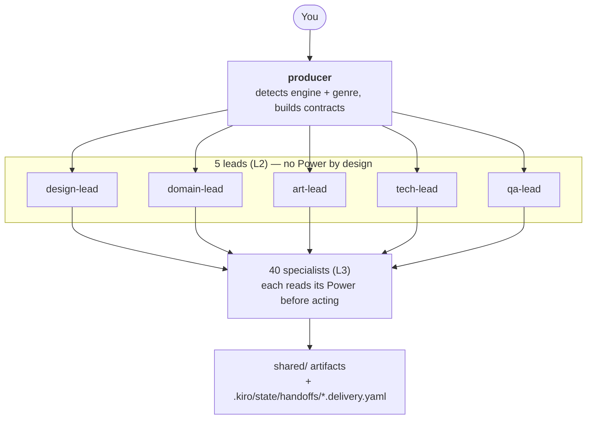
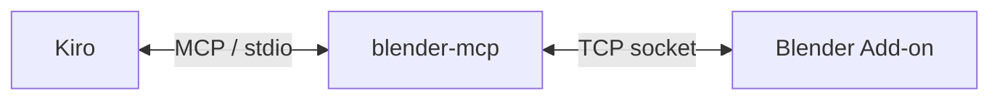
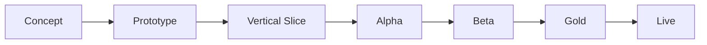
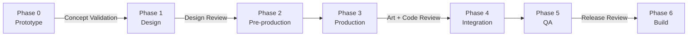

# Kiro Multi-Agent Game Studio

[English](README.md) | [繁體中文](README_ZH.md) | [简体中文](README_CN.md) | [日本語](README_JP.md) | [한국어](README_KR.md)

> **언어 버전 안내**: 이 README는 이 프로젝트의 유일한 공식 문서이며, 번역 도구 없이 전체를 읽을 수 있도록 5개 언어로 관리됩니다. 다섯 버전은 구조적으로 평행하게 유지됩니다 — 같은 섹션, 같은 표, 같은 숫자입니다. `.kiro/agents/` 아래의 Agent 정의와 `.kiro/steering/` 아래의 steering 파일은 번체 중국어로 작성되어 있습니다. 그것이 당신을 제약하지는 않습니다: 모든 Agent는 당신이 쓴 언어로 답합니다. 언어 장벽을 만나면 issue를 열어 주세요.

당신의 IDE를 가상 게임 스튜디오로 바꿉니다. 만들고 싶은 게임을 평범한 말로 설명하면, **48개 AI Agent**로 이루어진 협업 팀 — producer, 다섯 명의 Lead, 장르 전문가, 아트, 엔진 Team, QA, 퍼블리싱 — 이 계획하고 구현하며, 명시적인 Contract를 통해 산출물을 서로 넘깁니다.

도메인 지식은 이 저장소에 없습니다. 머신 전체에 설치된 **29개의 [Kiro Powers](https://kiro.dev/docs/powers/)** 안에 있으며, 각각 독립적으로 유지되고 실제 도구 연결에 대해 검증되었습니다. 이 저장소가 가진 것은 **조직 레이어**입니다: 누가 무엇을, 어떤 순서로, 어떤 산출물로 하는가.

> **왜 두 층으로 나누는가**: Agent prompt 안에 손으로 옮겨 적은 도구 지식은 낡습니다. 이 분리 전에는 `unity-team.md`에 더 이상 존재하지 않는 API 호출이 7개 있었습니다. Power는 실제 연결에 대해 검증되고 독립적으로 업데이트되므로, Agent prompt는 역할과 인계 규율만 담습니다. [Powers](#powers)를 참조하세요.

> **핵심 개념**: 이 문서 전반에서 쓰이는 용어입니다(처음부터 전부 이해할 필요는 없습니다):
> - **Agent**: 자체 system prompt, 모델, 도구 권한을 가진 역할 정의(`.kiro/agents/*.md`)
> - **Power**: [Kiro Power](https://kiro.dev/docs/powers/) — 패키징된 도메인 지식 레이어(steering 파일)와 선택적 MCP server로, `~/.kiro/powers/` 아래에 머신 전체로 설치됩니다
> - **MCP**(Model Context Protocol): AI 어시스턴트가 자연어로 개발 도구 — Unity, Blender, ComfyUI, Figma 등 — 를 조작하게 하는 표준화 프로토콜
> - **Steering**: Power나 프로젝트가 Agent context에 주입하는 markdown 지식 파일. 항상 로드되거나 조건부로 로드됩니다
> - **Contract**: Agent들이 작업을 서로 넘길 때 쓰는 YAML 형식(Task Contract / Asset Contract / Change Request)
> - **Subagent 위임**: producer가 일을 배분하는 방식 — 각 Subagent는 격리된 context window에서 실행되므로, 완전한 Contract를 위임 prompt에 써 넣어야 합니다

## 주요 특징

- **입구는 하나** — `producer`에게 말하면 됩니다. 엔진과 장르를 감지해 적절한 Lead와 Specialist에게 배분합니다. Agent 이름을 알 필요가 없습니다.
- **4개 엔진** — Unity, Godot, Unreal, Cocos Creator. producer는 하나를 가정하지 않고 해당 엔진 Team으로 라우팅합니다.
- **13개 게임 장르** — 슬롯, 피시 테이블, 슈터, MMO, RPG, 카드, 매치 3, 플랫포머, roguelike, 전략, 시뮬레이션, 리듬, 내러티브 어드벤처. 각각 전용 Domain Expert가 있고 그 뒤에 대응하는 Power가 있습니다.
- **어드바이저리 모드** — "게임을 잘 모른다"고 말하면, Lead는 기술 질문으로 당신을 막는 대신 추천, 근거, 트레이드오프, 그대로 진행할 수 있는 기본값을 줍니다.
- **외부화된 지식** — 29개 Power, 323개 steering 파일, 약 4.9 MB의 도메인 지식. 모두 이 저장소 밖에 있고 독립적으로 업데이트됩니다.
- **정량화된 도메인 지식** — Power는 설계 질문을 수학으로 바꿉니다: 정수 나눗셈에서 생기는 TTK 절벽, 드롭률의 롱테일(P90 = 평균의 2.3배), 높이와 정점 도달 시간에서 역산하는 점프 물리, MMO 스코프 계층 T1–T4.
- **명시적 Contract** — 모든 인계는 수용 조건이 붙은 YAML Contract입니다. 모든 납품은 manifest를 작성해, 하류가 무엇이 만들어지고 무엇이 아직 깨져 있는지 알 수 있게 합니다.
- **정직한 능력 경계** — 모든 Power는 자신이 검증할 수 없는 것을 선언합니다. Agent는 도구 API를 추측하지 않고 지식 공백을 보고하며 멈춥니다.
- **신뢰도 계층** — 도메인 사실은 `HIGH`(도출 가능), `MEDIUM`(관례), `UNVERIFIED`(당신 자신의 캘리브레이션이 필요한 업계 수치)로 표시됩니다. Agent는 모든 수치를 동등하게 제시하지 않고 계층을 그대로 전달합니다.

## 아키텍처



알아 둘 만한 구조적 결정이 세 가지 있습니다.

**Power는 Specialist 레이어에서만 읽힙니다.** producer와 다섯 Lead는 Power가 없습니다. Lead의 가치는 Specialist를 넘나드는 트레이드오프 판단입니다 — `unity-team`에게 Unity를 써야 하냐고 물을 수는 없습니다. 반드시 그렇다고 답하기 때문입니다. Lead에 Power를 붙이면 그 영역으로 편향되어 존재 목적을 무너뜨립니다.

**Agent들은 대화가 아니라 파일로 소통합니다.** Subagent는 격리된 context에서 실행되므로 서로 간의 실시간 채널이 없습니다. 설계의 진실은 `.kiro/steering/project/gdd.md`, 산출물은 `shared/`, 인계 수령 기록은 `.kiro/state/handoffs/`에 있습니다.

**producer는 라우터입니다.** 상류의 delivery manifest를 읽고 그 내용을 다음 Agent의 위임 prompt에 씁니다. 암묵적으로 공유된다고 가정되는 것은 없습니다.

### 설계 근거

팀 분할은 게임 업계에서 통용되는 여섯 직능(디자인, 아트, 엔지니어링, 오디오, QA, 프로덕션)을 따르고 반복적 Agile 실무와 결합했습니다. AI 고유의 메커니즘 — token 예산, MCP 통합, Contract 기반 인계 — 은 이 프로젝트의 원작이며, 어떤 능력이 실재하고 어떤 것이 구상인지 명시적으로 표시하는 관행 또한 그렇습니다.

| # | 참고 문헌 | 저자 | 출판사 | ISBN |
|---|-----------|--------|-----------|------|
| 1 | *The Game Production Handbook*, 제 3 판 | Heather Maxwell Chandler | Jones & Bartlett Learning, 2014 | 978-1-4496-8809-7 |
| 2 | *Agile Game Development: Build, Play, Repeat*, 제 2 판 | Clinton Keith | Addison-Wesley (Pearson), 2020 | 978-0-1365-2781-7 |
| 3 | IGDA Curriculum Framework (2008) | IGDA Education SIG | IGDA | — |

## 사전 요구 사항

| 요구 사항 | 비고 |
|-------------|-------|
| [Kiro IDE](https://kiro.dev/) | Agent, Power, steering 모두 Kiro에서 로드됩니다 |
| Git + [Git LFS](https://git-lfs.com/) | 바이너리 에셋은 LFS로 추적됩니다(`.gitattributes`에 27개 패턴) |
| [uv](https://docs.astral.sh/uv/) | Blender, ComfyUI, Unreal, Ableton MCP server가 필요로 합니다 |
| 대상 엔진 | Unity / Godot / Unreal / Cocos Creator — 실제로 쓰는 것만 |
| Node.js ≥ 18 | Godot 또는 ComfyUI MCP server를 쓸 때만(`npx`로 설치) |

파이프라인에 따라 선택: Blender(3D), ComfyUI(2D 생성), Krita(수작업 아트), Ableton Live(음악), Figma 계정(UI).

## 설치

### 1단계 — Clone 후 LFS 활성화

```bash
git clone https://github.com/hoycdanny/kiro-multi-agent-game-studio.git
cd kiro-multi-agent-game-studio
git lfs install    # 머신당 한 번. 없으면 brew install git-lfs
```

### 2단계 — Kiro에서 열고 workspace를 신뢰

Kiro IDE에서 이 폴더를 엽니다. 처음 열 때 workspace를 신뢰할지 묻습니다 — **신뢰를 선택하세요**. 그렇지 않으면 Agent와 steering이 로드되지 않습니다. 이후 Agent Selector에 48개 Agent가 모두 나열됩니다.

### 3단계 — 필요한 Power 설치

Kiro → Powers 패널 → **Add custom power** → 소스 `https://github.com/hoycdanny/<power-name>`.

**29개 전부는 필요하지 않습니다.** 이 프로젝트에서 쓸 것만 설치하세요 — Power가 없는 Agent는 임의로 밀어붙이지 않고 공백을 정직하게 보고합니다.

어떤 게임에든 유용한 최소 구성:

```
kiro-<your-engine>-accelerator    unity / godot / unreal / cocos — pick one
kiro-comfyui-accelerator          2D asset generation (almost always needed)
kiro-economy-balancing-expert     economy numbers + the simulation methodology balance-tester relies on
kiro-game-compliance-expert       needed the moment you plan to ship
```

필요에 따라 추가:

| 하려는 일 | 설치 |
|------------------|---------|
| 3D 모델 / 애니메이션 | `kiro-blender-accelerator` |
| 수작업 UI 또는 sprite | `kiro-krita-accelerator` |
| 오리지널 음악 | `kiro-ableton-accelerator` |
| Figma 디자인 → 엔진 UI | `figma`(Kiro 공식 추천 목록. `hoycdanny`가 아닙니다) |
| 슬롯 / 피시 테이블 | `kiro-slot-game-expert` / `kiro-fish-game-expert` |
| 지갑 또는 결제 백엔드 | `kiro-gaming-wallet-expert` |
| RPG / 슈터 / 카드 / 매치 3 / 플랫포머 / 리듬 / 전략 / 시뮬레이션 / roguelike / 내러티브 | 해당 `kiro-<genre>-expert` |
| 멀티플레이어 | `kiro-mmo-netcode-expert` — **먼저 T1–T4 스코프 계층을 읽으세요. 대부분의 프로젝트에 진짜 MMO는 필요하지 않습니다** |
| 세이브 시스템 / 리소스 관리 | `kiro-game-systems-expert` |
| 로컬라이제이션 | `kiro-i18n-expert` |
| CI / 자동 빌드 | `kiro-game-devops-expert` |
| 사용성 평가 | `kiro-usability-expert` |

확인:

```bash
ls ~/.kiro/powers/installed/                                        # 설치된 Power
ls ~/.kiro/powers/installed/kiro-blender-accelerator/steering/      # 해당 steering 파일
ls ~/.kiro/powers/repos/kiro-blender-accelerator/templates/         # templates는 repos/ 아래. installed/에는 없습니다
```

> `templates/`와 `hooks/`는 `~/.kiro/powers/repos/<power>/` 아래에**만** 존재합니다. `installed/` 사본에는 `POWER.md`, `steering/`, `mcp.json`만 있습니다. `POWER.md`가 Agent에게 템플릿 로드를 지시하면, 그 경로는 `repos/`를 기준으로 해석됩니다.

### 4단계 — 도구 MCP server 연결

`.kiro/settings/mcp.json`에는 이미 `blender-mcp`, `comfyui`, `unity-mcp`, `godot-mcp`, `unreal-engine`, `cocos-creator`, `figma`, `github` 설정이 들어 있습니다.

> ⚠️ **`ableton`과 `krita`는 `mcp.json`에 없습니다.** 이 파일은 IDE 권한 규칙으로 보호되어 Agent가 쓸 수 없으므로 직접 붙여 넣어야 합니다 — 정확한 블록은 [Ableton](#ableton)과 [Krita](#krita)에 있습니다. 붙여 넣기 전까지 `audio-team`과 `krita-team`은 연결 자체 점검에서 멈추고 공백을 보고합니다. 오디오나 아트워크를 만든 척하지 않습니다.

그다음 실제로 쓰는 도구를 시작합니다:

| 도구 | 연결 방법 |
|------|----------------|
| Blender | `blender_mcp` 애드온을 활성화하고 server를 시작(기본 `localhost:9876`) |
| ComfyUI | 로컬 서비스를 시작(포트 8188, 이어서 8000 자동 감지) |
| Unity | Window → MCP for Unity → Start Server |
| Godot | `npx`가 `@coding-solo/godot-mcp`를 자동 설치. `GODOT_PATH` 설정 |
| Unreal | UnrealMCP 플러그인을 설치하고 Editor에서 활성화 |
| Cocos Creator | `cocos-mcp-server` 설치 후 Extension → Cocos MCP Server → Start |
| Figma | 공식 Remote MCP Server. 첫 사용 시 Kiro에서 OAuth 완료 |
| GitHub | `github-mcp-server` 바이너리를 `PATH`에 두고 PAT 제공 |
| Ableton | `localhost:9877`을 수신하는 Remote Script 브리지 활성화 |
| Krita | Krita Python 플러그인 설치. `127.0.0.1:5678`에서 서비스합니다 |

도구별 사전 요구 사항, 설정, 실패 양상: [MCP Integrations](#mcp-integrations).

## 사용법

### 세 가지 입구

| 당신의 상황 | 말할 대상 | 이유 |
|----------------|---------|-----|
| 목표는 있으나 게임 개발 배경이 없다 | `producer` | 어드바이저리 모드로 들어가, 당신을 심문하지 않고 Lead에게 추천을 위임합니다 |
| 영역을 알고 전문적 판단이 필요하다 | 해당 **Lead** | 위임 한 단계를 건너뜁니다. Lead가 선정 질문에 직접 답합니다 |
| 범위가 좁고 독립적으로 완결되는 질문 | 해당 **Specialist** | 예: `shooter-expert`에게 TTK 계산법을 묻기 |

각 Lead가 당신을 위해 결정할 수 있는 것:

| Lead | 결정하는 것 | 전형적인 질문 |
|------|---------|------------------|
| `tech-lead` | **엔진 선정**, 아키텍처 트레이드오프, 성능 예산, 멀티플레이어가 필요한지 | "슬롯머신에는 어떤 엔진?" |
| `domain-lead` | 이것이 어떤 장르인지, 어떤 Domain Expert를 활성화할지, 장르가 겹칠 때의 우선순위 | "이건 roguelike인가 RPG인가?" |
| `design-lead` | 코어 루프가 어때야 하는지, 스코프를 얼마나 줄일지, 어떤 시스템을 먼저 만들지 | "v1은 어디까지 해야 하나?" |
| `art-lead` | 아트 디렉션, 2D 대 3D, 생성과 수작업의 분담, 오디오 톤 | "이 주제에 어떤 스타일?" |
| `qa-lead` | 이 단계에서 무엇을 테스트할지, 어디까지가 출시 가능인지 | "지금 출시할 수 있나?" |

**왜 선정 질문은 Specialist가 아니라 Lead에게 해야 하는가**: `unity-team`에게 Unity를 써야 하냐고 물을 수는 없습니다 — 반드시 그렇다고 답합니다. 네 개 엔진 Team은 각각 입장이 있고, 두 casino Domain Expert도 모두 일을 맡고 싶어 합니다. Lead는 자기 관할 범위에서 단일 도구의 부담이 없습니다. 그것이 존재하는 구조적 이유입니다.

질문이 좁고 영역을 넘나드는 조정이 필요 없을 때는 Specialist에게 직접 묻는 것이 가장 빠릅니다:

| 질문 | 물을 대상 | 읽는 Power |
|----------|-----|----------------|
| "HP 100, 데미지 33 — TTK는?" | `shooter-expert` | `kiro-shooter-expert` |
| "가챠 확률 1% — 90% 확신에는 몇 번?" | `economy-designer` | `kiro-economy-balancing-expert` |
| "40장 덱에 3장 — 초기 5장에서 뽑을 확률?" | `card-game-expert` | `kiro-card-game-expert` |
| "이 FBX를 Unity에 넣으면 스케일이 틀립니다" | `blender-team` | `kiro-blender-accelerator` |
| "3타일 높이, 정점까지 0.35초 — 중력은?" | `platformer-expert` | `kiro-platformer-expert` |

Specialist는 명세를 주지만 하류 작업을 조정하지 않습니다. 명세를 구현으로 바꾸려면 producer로 돌아가야 합니다.

### 명령 예시

```
"Build a slot machine in Unity"
"I want to make a slot machine but I don't know anything about games"     → 어드바이저리 모드
"Which engine should I use for a mobile match-3?"                        → tech-lead에게 묻기
"HP is 100 and damage is 33 — what is the TTK?"                          → shooter-expert에게 묻기
"40-card deck with 3 copies — odds of drawing one in the opening 5?"      → card-game-expert에게 묻기
"Implement this skill tree in Unity, spec is in specs/skill-tree.md"      → 어드바이저리 모드를 건너뜀
```

### 워크스루 A — 한 문장뿐인 초보자

> **당신**: 슬롯머신을 만들고 싶은데, 게임 개발은 전혀 모릅니다.

1. **`producer`**가 두 가지를 감지합니다: 장르는 casino, 그리고 사용자가 배경이 없다고 선언함 → **어드바이저리 모드**(`.kiro/steering/global/advisory-mode.md`)로 들어갑니다.

2. 기술 질문을 쏟아붓지 **않습니다**. 엔진 선정을 위해 `tech-lead`, 활성화할 전문가 확인을 위해 `domain-lead`를 위임합니다.

3. **`tech-lead`**는 네 부분으로 된 어드바이저리 형식으로 답합니다:
   > **추천**: Cocos Creator.
   > **근거**: 슬롯머신은 2D이고 web과 모바일 양쪽이 필요하며 애니메이션과 UI가 무겁습니다. 이 조합에서는 Cocos의 2D 파이프라인이 가장 직접적이고 web 익스포트 성숙도도 높습니다.
   > **트레이드오프**: 나중에 3D 버전을 원하거나 이미 Unity 인력이 있다면 Unity가 낫습니다. 순수 web 프론트엔드 팀이라면 PixiJS도 고려할 수 있습니다.
   > **기본값**: 응답이 없으면 Cocos Creator로 진행합니다.

4. **`slot-game-expert`**는 `kiro-slot-game-expert`를 읽고 **먼저 대상 관할 구역을 묻습니다** — "최소 스핀 간격을 얼마로 해야 하나"는 시장마다 법적 답이 다르기 때문입니다. 미정이라고 하면 가장 보수적인 가정(오락 전용 프로토타입, 실제 금전 미개입)으로 진행하며 그 가정을 명시적으로 표시합니다.

5. producer는 추천을 전달하고 질문은 **하나**만 합니다: "시작할까요?"

6. 승인 후 파이프라인이 돌아갑니다:

```
slot-game-expert   → math model (RTP / volatility / paytable)
balance-tester     → reads simulation-methodology.md, Monte Carlo verification of actual RTP
art-lead           → comfyui-team generates symbols and background
ui-ux-team         → reads the figma Power, produces layout + Design Tokens
cocos-team         → reads kiro-cocos-accelerator, assembles scene and logic
qa-lead            → functional-tester verifies flow
compliance-release → reads kiro-game-compliance-expert (if you intend to ship)
```

당신이 "예"라고 답한 것은 정확히 한 번입니다. 그것이 어드바이저리 모드의 요점입니다.

### 워크스루 B — 이미 명세가 있다

> **당신**: 이 스킬 트리를 Unity로 구현해 주세요. 명세는 `specs/skill-tree.md`에 있습니다.

1. producer는 어드바이저리 모드로 들어가지 **않습니다**. `advisory-mode.md`는 이미 결정한 것을 재확인하는 것을 명확히 금지합니다.
2. Task Contract를 만들고 `tech-lead`에게 위임하며, 거기서 `unity-team`으로 전달됩니다.
3. `unity-team`은 MCP 도구 이름을 추측하지 않고 해당 `kiro-unity-accelerator` steering(씬 조립 / 스크립팅 / 빌드)을 읽습니다.
4. 완료 시 `.kiro/state/handoffs/TASK-xxx.delivery.yaml`에 delivery manifest를 작성합니다.
5. `tech-lead`가 code review를 하고 producer가 당신에게 보고합니다.

명세에 수치 문제가 있다면 — 예를 들어 스킬 포인트 성장 곡선이 불합리하다면 — `unity-team`은 스스로 고치지 않습니다. 보고를 되돌리고 producer가 `rpg-systems-expert`로 라우팅합니다.

### 워크스루 C — 분석만, 아무것도 만들지 않음

> **당신**: PvP가 있는 카드 게임을 만든다면 가장 큰 기술적 위험은 무엇입니까?

producer는 분석형 질문으로 인식하고 여러 Lead를 병렬로 위임해 통합된 위험 목록을 돌려줍니다. **Task Contract는 생성되지 않고 파일도 만들어지지 않습니다.**

- `tech-lead`: PvP 동기화 아키텍처. `mmo-expert`를 끌어들여 `kiro-mmo-netcode-expert`의 스코프 척도로 T1인지 T2인지 분류합니다
- `domain-lead` → `card-game-expert`: power creep은 장기적인 구조적 위험
- `design-lead`: 선공 이점은 카드 PvP에서 구조적이며 가정이 아니라 측정이 필요합니다
- `qa-lead`: 대전 시뮬레이션에 필요한 표본 수(±1pp 정밀도에는 약 9,604 경기)

작업은 당신이 요청할 때만 시작됩니다. 분석형 질문이 조용히 파일 더미를 만들어 내지는 않습니다.

### 프로젝트 상태를 보는 곳

Agent 사이에 실시간 채널이 없으므로 현재 상태는 파일 안에 있습니다:

| 알고 싶은 것 | 볼 곳 |
|------------------|---------|
| 지금 게임 디자인이 어떤 상태인지 | `.kiro/steering/project/gdd.md` |
| 아트와 오디오 방향이 무엇으로 정해졌는지 | `.kiro/steering/project/style-guide.md` |
| 어떤 작업이 있고 상태가 어떤지 | `.kiro/state/tasks.yaml` |
| 어떤 작업이 무엇을 납품하고 무엇이 아직 깨져 있는지 | `.kiro/state/handoffs/<contract_id>.delivery.yaml` |
| 실제 에셋 파일 | `shared/`(models / textures / sprites / audio / locales / sim) |
| 지금 어떤 milestone에 있는지 | `.kiro/steering/project/milestones.md` |
| 어떤 Agent가 어떤 Power를 가졌는지 | `.kiro/steering/global/powers-registry.md` |

납품 기록은 **추가 전용**입니다: 정정하려면 기존 것을 편집하지 않고 새 항목을 추가합니다. 그래야 이력이 추적 가능하게 유지됩니다.

## 프로젝트 구조

```
.kiro/
├── agents/              48 agent definitions, grouped by layer
│   ├── orchestration/   creative-director, producer
│   ├── design/          5 core design roles + 13 genre domain experts + ui-ux + economy + localization
│   ├── art/             art-lead, blender, comfyui, krita, animator, audio, vfx, technical-artist
│   ├── engineering/     tech-lead + 4 engine teams + systems/ui programmer, devops, wallet
│   ├── qa/              qa-lead + functional / balance / performance / usability
│   └── publishing/      compliance-release, marketing-team
├── steering/
│   ├── global/          contracts, asset-standards, bug-severity, powers-registry, advisory-mode
│   └── project/         gdd, style-guide, milestones      ← your game's single source of truth
├── state/               tasks.yaml, handoffs/*.delivery.yaml
└── settings/mcp.json    MCP server configuration

shared/                  cross-agent artifact staging
├── concept/ textures/ sprites/ ui/     from comfyui-team
├── models/                             from blender-team
├── rigs/ animations/                   from animator
├── audio/{sfx,music,voice}/            from audio-team
├── locales/                            from localization-team
└── sim/                                from balance-tester
```

`~/.kiro/powers/` — 지식 레이어. **이 저장소 밖**, 머신 전체에 있습니다.

각 Agent는 `.md`(frontmatter + system prompt)와 `.json`을 모두 가집니다. 하위 디렉터리는 정리 목적일 뿐입니다: Kiro는 frontmatter의 평평한 `name`으로 Agent를 등록하므로, 위임은 `Use the "blender-team" subagent to ...`로 쓰고 `"art/blender-team"`으로는 절대 쓰지 않습니다.

## Agent 레이어

| 레이어 | 수 | 구성 |
|-------|:-----:|-------------|
| L0 전략 | 2 | `creative-director`(비전 게이트), `producer`(위임 허브) |
| L2 Lead | 5 | `design` / `domain` / `art` / `tech` / `qa` — 위임 중개자이자 품질 게이트. **설계상 Power가 없습니다** |
| L3 디자인과 장르 | 20 | 7개 코어 디자인 직능 + 13개 장르 Domain Expert |
| L3 아트와 오디오 | 7 | Blender, ComfyUI, Krita, Animator, Audio, VFX, Technical Artist |
| L3 엔지니어링 | 8 | 4개 엔진 Team + Systems/UI Programmer, DevOps, Wallet |
| L3 QA | 4 | functional / balance / performance / usability |
| L3 퍼블리싱 | 2 | compliance-release, marketing-team |

**48개 중 33개가 Power를 가집니다**. 나머지 15개는 조정 역할이며, 그 지식이 *바로* 이 프로젝트의 조직적 관습입니다. [Powers](#powers)를 참조하세요.

### 13개 장르 Domain Expert

`domain-lead`가 필요할 때 활성화하며, 전부를 동시에 켜지는 않습니다.

| 전문가 | 다루는 범위 |
|--------|--------|
| `slot-game-expert` | 슬롯머신: 수학 모델, RNG, 인증, 관할 구역 매트릭스, 책임 있는 게이밍 |
| `fish-game-expert` | 피시 테이블: 포획 RNG, 페이아웃, 멀티플레이어 공정성, 페이아웃 제어 한계선 |
| `shooter-expert` | FPS/TPS: 무기 수치, 탄도, 히트 판정, 반동, Bot AI, 총기 감각 |
| `mmo-expert` | 멀티플레이어: 서버 권위, 리플리케이션, interest management, 지연 보상 |
| `rpg-systems-expert` | 스탯, 레벨 곡선, 스킬 트리, 드롭 희귀도, 데미지 공식, 상태 효과 |
| `card-game-expert` | 덱빌더/TCG: 드로우 확률, 코스트 곡선, archetype, power creep 통제 |
| `puzzle-match3-expert` | board 생성, 가해성, 연쇄, 난이도 곡선, 이동 수 경제 |
| `platformer-expert` | 점프 물리, 입력 관용, 레벨 리듬, metroidvania 능력 gating |
| `roguelike-expert` | 프로시저럴 생성, run 내 build와 synergy, meta 진행, 스케일링 |
| `strategy-expert` | RTS / 턴제 / 4X / 타워 디펜스: 유닛 상성, 경제, AI, 웨이브 곡선 |
| `simulation-expert` | 생산 체인, 자원 루프, 자동화, 생존 요구치, 창발 |
| `rhythm-expert` | 비트맵, 판정 창, audio/input offset 캘리브레이션, 점수 계산 |
| `narrative-adventure-expert` | 분기 구조, 플래그와 상태, 대화 트리, 엔딩과 수렴 |

### Agent 정의 형식

각 Agent는 `.kiro/agents/` 아래의 markdown 파일입니다. YAML frontmatter가 권한을 정의하고 본문이 system prompt입니다.

이 프로젝트의 모든 Agent에 흐르는 설계 원칙이 두 가지 있습니다.

**"대기 중"은 백그라운드 프로세스가 아닙니다.** Kiro 커스텀 Agent에는 상주 서비스가 없습니다. Agent는 선택되었을 때만 "깨어" 있고, 첫 단계는 언제나 상황 판단입니다 — 인사인지, 구체적 요청인지, 도구가 연결되지 않았는지 — 그 후에 움직일지를 결정합니다. 예컨대 `blender-team`은 `get_blendfile_summary_path_info`로 연결 자체 점검을 하고, 실패하면 모델링을 시작하지 않고 멈춥니다.

**할 수 없다고 인정하는 것이 할 수 있는 척보다 낫습니다.** 어떤 Agent도 다른 Team의 결과나 진행을 조작하지 않습니다. `producer`는 Subagent가 실제로 반환한 것만 보고합니다.

prompt 예시는 의도적으로 여기 붙이지 않습니다. 이전에는 붙였지만, 리팩터 후 발췌가 실제 파일과 어긋났습니다. 보고 싶다면 파일을 여세요.

### 모델 배정

각 Agent는 frontmatter에서 모델을 고정합니다. 실제로 적용되는 값은 `.json`의 값이며 `.md` frontmatter는 동기화되어 있습니다. 48개 Agent 전체에서 실측한 분포:

| 모델 | 수 | 배정 대상 | 근거 |
|-------|:-----:|-------------|-----------|
| `claude-sonnet-5` | 7 | `creative-director`, `producer`, 다섯 Lead | 위임과 리뷰 게이트: 다단계 agentic 작업으로, 오류가 파이프라인 전체로 전파됩니다 |
| `deepseek-3.2` | 9 | `slot-game-expert`, `fish-game-expert`, `rpg-systems-expert`, `shooter-expert`, `card-game-expert`, `strategy-expert`, `economy-designer`, `balance-tester`, `wallet-systems-expert` | 수치와 확률 추론: RTP, 페이아웃, 성장 곡선, 경제 수렴, 원장 일관성 |
| `claude-sonnet-4` | 20 | 모든 아트 직능, 일반 디자인, 나머지 장르 전문가, `ui-ux-team`, `compliance-release` | 범용 성능으로 충분. 가장 인원이 많은 층입니다 |
| `qwen3-coder-next` | 7 | 4개 엔진 Team, `systems-programmer`, `ui-programmer`, `devops-team` | 순수 코딩과 도구 오케스트레이션 |
| `claude-haiku-4.5` | 5 | `functional-tester`, `performance-tester`, `usability-tester`, `localization-team`, `marketing-team` | 호출량이 많고 개별 오류 비용이 낮습니다 |

> 이 배분은 Kiro가 공개한 모델 포지셔닝과 작업 유형·비용에서 도출한 것으로, **이 프로젝트 내 벤치마크 결과가 아닙니다**. 취향에 맞게 조정하세요: 어떤 Agent의 산출이 얕게 느껴지면 한 단계 올리거나 reasoning effort를 높이세요.

조정 레버: 오산 비용이 큰 곳을 더 안전하게 하려면 `slot-game-expert` / `fish-game-expert` / `wallet-systems-expert`를 `claude-opus-4.8`로 올리세요. 조정하고 싶지 않다면 전부 `auto`로 두면 됩니다. `/model` 목록에 없는 모델 ID는 조용히 기본값으로 되돌아갑니다. 일부 모델은 Experimental이고 리전 제한이 있으므로 자신의 환경에서 가용성을 확인하세요.

## Powers

Agent는 **조직 레이어**입니다. [Kiro Powers](https://kiro.dev/docs/powers/)는 **도메인 지식 레이어**입니다. 29개 모두 설치되어 있고 내용이 채워져 있습니다: **323개 steering 파일, 약 4.9 MB.**

권위 있는 대응표는 `.kiro/steering/global/powers-registry.md`에 있고 모든 Agent가 자동으로 로드합니다. 아래 표는 사람이 읽는 버전입니다.

### 엔진과 도구 Power(Accelerator — 12개 Agent)

각각 실제 MCP server를 배후에 두고, 지식은 실제 연결에 대해 검증되었습니다.

| Agent | Power | Steering | 무엇을 해결하는가 |
|-------|-------|:--------:|----------------|
| `unity-team` | `kiro-unity-accelerator` | 15 | 씬 / 에셋 / 빌드 / 성능 / 아키텍처 / 플랫폼 호환 |
| `godot-team` | `kiro-godot-accelerator` | 13 | 씬 아키텍처 / GDScript / signal / TileMap / 익스포트 |
| `unreal-team` | `kiro-unreal-accelerator` | 11 | 레벨 / Blueprint / 머티리얼 / GAS / UE5 기능 |
| `cocos-team` | `kiro-cocos-accelerator` | 14 | 씬 / 노드 컴포넌트 / prefab / 크로스 플랫폼 빌드 |
| `blender-team` | `kiro-blender-accelerator` | 15 | 모델링 / UV / 머티리얼 / 익스포트. **축 방향과 색 공간이 가장 조용히 깨집니다** |
| `animator` | 위와 같음 | — | `rigging-and-skinning.md` / `animation-authoring.md`를 읽습니다 |
| `technical-artist` | 위와 같음 | — | `collider-and-lod.md` / `performance-and-limits.md`를 읽습니다 |
| `comfyui-team` | `kiro-comfyui-accelerator` | 11 | 모델 선정 / prompt / sampler / ControlNet / 업스케일 / VRAM |
| `vfx-artist` | 위와 같음 | — | 이펙트 소재. `comfyui-team`과 Power를 공유합니다 |
| `krita-team` | `kiro-krita-accelerator` | 13 | 캔버스 / 브러시 / 레이어 / 마스킹 / 구도 / 익스포트 |
| `audio-team` | `kiro-ableton-accelerator` | 11 | 편곡 / 믹싱 / 음악 이론 / 드럼 그루브 / 장르 playbook |
| `ui-ux-team` | `figma` | 3 | 레이아웃 읽기 / Design Token 추출 / Code Connect / design system 규칙 |

> `figma` Power는 Figma → 웹 프론트엔드 코드를 전제하지만, 이 프로젝트가 필요한 것은 Figma → 네이티브 엔진 UI입니다. 레이아웃 읽기와 token 추출은 그대로 따르고, 산출물은 HTML/CSS가 아니라 이 프로젝트의 handoff 명세로 만드세요.

### 장르 Domain Expert(Knowledge Base — 13개 Agent)

순수 지식이며 MCP server가 없습니다. 가치는 일반적인 조언이 아니라 설계 질문을 계산 가능한 수학으로 바꾸는 데 있습니다.

| Agent | Power | Steering | 기술적 핵심 |
|-------|-------|:--------:|----------------|
| `slot-game-expert` | `kiro-slot-game-expert` | 12 | 수학 모델 / RNG / 인증 / 관할 구역 매트릭스 / 책임 있는 게이밍 |
| `fish-game-expert` | `kiro-fish-game-expert` | 16 | 포획 RNG / 페이아웃 / 멀티플레이어 공정성 / 페이아웃 제어 한계 / 인증 |
| `rpg-systems-expert` | `kiro-rpg-systems-expert` | 11 | 세 계열 데미지 공식의 극단값 거동, 드롭 롱테일(P90 = 평균의 2.3배), 스킬 트리 trap 탐지 |
| `shooter-expert` | `kiro-shooter-expert` | 10 | **TTK 절벽** — HP 100에서 데미지 34는 3발, 33은 4발. 데미지 1점 차이로 TTK가 33% 뜁니다. 반동 모델, 무기 지배성 검정 |
| `card-game-expert` | `kiro-card-game-expert` | 10 | 초기하 드로우 표, 정량화된 power creep 탐지, HHI 기반 meta 다양성, `C(n,2)` 키워드 상호작용 |
| `puzzle-match3-expert` | `kiro-puzzle-match3-expert` | 11 | 가해성 3계층(세 번째는 수학적으로 증명 불가), board 기각률, 통과율 민감도가 37배까지 벌어짐 |
| `platformer-expert` | `kiro-platformer-expert` | 10 | 점프 물리 역산(`g = 2h/t²`), 세 가지 입력 관용 메커니즘, gating 데드락 그래프 탐지 |
| `rhythm-expert` | `kiro-rhythm-expert` | 10 | 오디오 클럭을 권위로 삼기(frame 계시는 3분에 약 1초 밀림), audio와 input offset은 반드시 분리 |
| `strategy-expert` | `kiro-strategy-expert` | 10 | 네 하위 장르의 제약, 상성 매트릭스 불균형 검정, 타워 디펜스 웨이브와 수입의 결합, AI 난이도 공정성 |
| `simulation-expert` | `kiro-simulation-expert` | 10 | 생산 체인과 수급 수렴, 닫힌 자원 루프, 장기 붕괴 탐지 |
| `roguelike-expert` | `kiro-roguelike-expert` | 9 | 프로시저럴 생성의 정확성, 시드 설계, build synergy 상한, meta 진행 균형 |
| `narrative-adventure-expert` | `kiro-narrative-adventure-expert` | 14 | 분기 위상과 각각의 유지 비용, 플래그 설계, 도달 가능성과 막다른 길 검증 |
| `mmo-expert` | `kiro-mmo-netcode-expert` | 11 | **스코프 계층 T1–T4** — MMO를 요구하는 프로젝트 대부분이 실제로 필요한 것은 T2입니다. 대역폭과 용량 모델, 지연 보상 트레이드오프 |

### 영역 횡단 Power(Knowledge Base — 8개 Agent)

| Agent | Power | Steering | 기술적 핵심 |
|-------|-------|:--------:|----------------|
| `economy-designer` | `kiro-economy-balancing-expert` | 13 | 통화 계층 / sink-source 폐환 / 가챠 기대 비용과 천장 수학 / 진행 곡선 |
| `balance-tester` | 위와 같음 | — | `simulation-methodology.md`를 읽습니다: `n ≥ (1.96σ/ε)²`에서 표본 수, 수렴 판정, RNG 스트림 분리 |
| `compliance-release` | `kiro-game-compliance-expert` | 14 | 등급 / 프라이버시 / 심의 / 스토어 소재 / 고지 의무. **만료될 주장 45개 범주 수록** |
| `wallet-systems-expert` | `kiro-gaming-wallet-expert` | 10 | API / DB schema / 멱등성과 락 / 정산 / 관측성 / 결제 컴플라이언스 |
| `systems-programmer` | `kiro-game-systems-expert` | 9 | 세이브 엔벨로프와 마이그레이션 체인(순차 `N-1` 대 단축 `N(N-1)/2`), atomic write 순서, `f^d` 규모의 이벤트 폭풍 |
| `localization-team` | `kiro-i18n-expert` | 10 | 문자열 연결에 일반해가 없는 이유 / CJK 금칙 처리 / RTL 미러링 / 폰트 서브세팅과 두부 현상 |
| `devops-team` | `kiro-game-devops-expert` | 9 | 4개 엔진의 headless 빌드 / **산출물 검증 8항목**(exit code 0에는 일곱 가지 실패 형태가 있음) / 버저닝 / Git LFS |
| `usability-tester` | `kiro-usability-expert` | 8 | 5단계 증거 계층 / 온보딩 심사 / 막힘 지점 분석 / playtest 설계 |

### 왜 15개 Agent가 의도적으로 Power를 갖지 않는가

이것은 설계상의 결정이며 누락이 아닙니다.

| Agent | 갖지 않는 이유 |
|-------|---------|
| `producer`, `creative-director` | 위임과 비전은 이 프로젝트의 조직적 지식이며 단일 영역에 속하지 않습니다 |
| 다섯 Lead | **가치는 Specialist를 넘나드는 트레이드오프 판단에서 옵니다.** Power는 Lead를 그 영역으로 편향시키고, 선정 시의 중립성이야말로 존재 이유입니다 — `unity-team`에게 Unity를 써야 하냐고 물을 수는 없습니다 |
| `game-designer` | GDD 통합 역할. 도메인 지식은 13개 장르 Power에 분산되어 있습니다 |
| `level-designer` | 레벨 디자인 지식은 이미 platformer / strategy / puzzle / roguelike Power 안에 있습니다 |
| `ui-programmer` | UI 바인딩은 각 엔진의 Power가 다룹니다 |
| `functional-tester` | 기능 테스트 방법은 프로젝트마다 다르고, CI 실행 측면은 devops Power에 있습니다 |
| `performance-tester` | 측정은 각 엔진의 profiler에 달려 있고, 그 지식은 엔진 Power의 성능 장에 있습니다 |
| `narrative-designer` | 내러티브의 *시스템 구조*는 narrative-adventure Power에 있고, 이 역할이 만드는 것은 *내용*입니다 |
| `combat-designer` | 전투 수치는 shooter / rpg Power에 있고, 이 역할은 전용 Power가 없는 장르를 담당합니다 |
| `marketing-team` | 텍스트만 산출하며 도구 의존이 없습니다 |

### 신뢰도 계층 — 어떤 수치를 인용하기 전에 읽으세요

Knowledge Base 형 Power는 내용을 세 계층으로 표시하며, Agent는 그 계층을 그대로 전달할 의무가 있습니다:

| 계층 | 의미 | 전달 방법 |
|------|---------|--------------|
| `HIGH` | 수학적으로 도출 가능하거나 공표된 표준에 근거(공식, 조합론, Unicode/CLDR 규칙, POSIX 의미론) | 그대로 결론으로 사용 가능 |
| `MEDIUM` | 널리 채택된 관례이며 유일한 답이 아닙니다 | 어떤 전제가 바뀌면 추천이 달라지는지 말해야 합니다 |
| `UNVERIFIED` | 학습 데이터에서 온 업계 수치. 미검증이며 시간에 따라 변합니다 | **당신 자신의 데이터로 캘리브레이션이 필요하다고 반드시 명시해야 합니다** |

`UNVERIFIED`는 전체에서 상당한 비중을 차지하며 네 영역에 집중됩니다:

- 모든 "업계 평균"(리텐션, ARPPU, 전형적 TTK 대역, coyote time 밀리초, 권장 참가자 수)
- 모든 규제 세부(등급 설문, 플랫폼 정책, 확률 공시 의무 — `kiro-game-compliance-expert`에서는 `UNVERIFIED`가 의도적으로 다수입니다)
- 모든 엔진 측 동작(임포트 설정이나 API를 검증할 실제 연결을 가진 Power는 없습니다)
- 모든 플랫폼 지연과 하드웨어 사양 수치

계층 표시가 없는 구체적 수치를 보면, 도출 가능한지 캘리브레이션이 필요한지 물으세요.

### 지식 베이스는 이 저장소 밖에 있습니다

| | 무엇을 담는가 | 위치 |
|---|---|---|
| **이 저장소** | **라우팅과 조직**: 어떤 Agent가 어떤 Power에 대응하는지, 어떤 steering 파일을 읽는지, 언제 읽는지, 공백을 어떻게 보고하는지 | `.kiro/` |
| **Kiro Powers** | **지식 자체** | `~/.kiro/powers/installed/`(머신 전체, 저장소 밖) |

검증 가능한 사실: 323개 Power steering 파일은 모두 이 저장소 밖에 있습니다. Power 내용에만 나오는 문자열로 저장소를 검색하면 히트가 0입니다(`Redlock`, `euler_ancestral`, `GPU Resident Drawer`, `krita_select_by_alpha`로 검증). 저장소 안에서 Power를 언급하는 모든 곳은 경로나 파일명 참조이며 복사된 내용이 아닙니다. 48개 Agent prompt가 참조하는 **376개 모든 steering 파일명을 디스크와 대조했고 조작은 0이었습니다**.

**비용을 정직하게 말하면**: 이 저장소는 **자기 완결적이지 않습니다**. clone해도 33개 Agent의 지식 레이어는 비어 있고, Powers 패널에서 Power를 설치할 때까지 그대로입니다. 기계적으로 확인할 manifest도 설치 스크립트도 없습니다 — 이 문서와 `powers-registry.md`의 대응표뿐입니다.

### 커버리지 공백 분석

29개 Power는 모두 최소 하나의 Agent가 참조합니다(고아 0). 네 영역에는 Power 커버리지가 **전혀 없습니다**. 이것은 할 일 목록이 아니라 정직한 재고 조사이며, 지금 누가 대신하고 있는지와 메우지 않을 때의 비용을 함께 적습니다:

| 공백 | 영향받는 Agent | 현재 대역 | 메우지 않을 때의 비용 |
|-----|---------------|-----------|------------------------|
| **엔진 횡단 profiling 방법론** | `performance-tester` | 각 엔진 Power의 성능 장(분산되어 있고 단일 엔진 시점) | 성능 수치는 잡음이 크고, 방법론이 없으면 엉뚱한 것을 최적화하고도 알아채지 못하기 쉽습니다. 빠진 것: 무엇을 측정할지, frame 예산 귀속, 통계적 타당성, 플랫폼 고유의 함정 |
| **격투／액션 게임의 근접 전투** | `combat-designer` | 자체 prompt. shooter Power는 사격만, rpg Power는 수치만 다룹니다 | frame data, hitbox/hurtbox, 입력 버퍼와 캔슬 창, 콤보 설계, hitstop은 **어떤 Power도 다루지 않습니다**. 격투는 13개 장르에 없습니다 |
| **내러티브 집필 기법과 도구** | `narrative-designer` | 자체 prompt. narrative-adventure Power가 다루는 것은 *시스템 구조*이며 내용이 아닙니다 | Ink / Yarn / Twine 문법과 관례, World Bible 구조, 대화 집필 기법은 기반 모델 지식에만 의존합니다 |
| **스토어 전환과 트레일러 구성** | `marketing-team` | 자체 prompt | 스토어 페이지 전환 요소, 트레일러 shot list 구성, press kit 구성은 축적 가능한 기법 지식입니다 |

13개 장르도 **격투, 레이싱, 스포츠, 호러, 파티 게임**을 다루지 않습니다. 격투의 메커니즘이 가장 독특하고 — frame data는 그 자체로 하나의 분야입니다 — 나머지 넷은 기존 전문가가 부분적으로 담당합니다. 추가할지는 실제로 무엇을 만들지에 달려 있습니다. **커버리지를 위해 Power를 추가하지 마세요** — 48개 Agent는 이미 신중한 관리가 필요한 규모입니다.

### 새 Power 추가하기

Power에는 두 원형이 있습니다: **Accelerator**(실제 MCP server를 감싸고 지식은 실제 연결에 대해 검증됨)와 **Knowledge Base**(순수 도메인 지식, server 없음, 신뢰도 계층 표시).

Power를 만들 가치가 있는지 판단하는 세 가지 시험:

1. **내용이 기반 모델이 이미 아는 것을 넘는가?** 언어 모델이 이미 안다면 그 Power의 가치는 0에 가깝습니다 — 같은 지식을 위치만 옮긴 것입니다. 가치는 구체적 수치와 도출(TTK 절벽 임계값 표), 검증 가능한 API 사실(Blender 5.x는 `action.fcurves`를 제거), 날짜가 붙은 현행 규제에서 옵니다.
2. **틀렸을 때의 비용이 얼마나 큰가?** 세이브 마이그레이션 실패는 플레이어 진행을 망가뜨리고, 컴플라이언스 실패는 삭제 조치를 부릅니다. 그쪽을 우선하세요.
3. **그 지식은 낡는가?** 만료되는 것(도구 API, 규제)은 Power가 독립적으로 업데이트되기 때문에 오히려 Power에 두어야 합니다. 시대를 넘는 수학은 어디에 두어도 상관없습니다.

Power를 완성한 뒤에는: Powers 패널에서 설치하고, Agent ↔ Power 행을 `.kiro/steering/global/powers-registry.md`에 추가하고, 위 재고 표에 추가하고, 참조하는 모든 steering 파일명이 실제로 디스크에 존재하는지 확인하세요.

## MCP Integrations

> **이 섹션은 연결 방법을 다루고 사용법은 다루지 않습니다.** 정확한 도구 이름, 파라미터, 올바른 조작 순서는 각 Power의 `POWER.md`와 `steering/`이 권위이며, 그것들은 실제 연결에 대해 검증되고 독립적으로 업데이트됩니다. 여기 있는 도구 목록은 모두 개념적이며 뒤처져 있을 수 있습니다.
>
> 호출이 `Unknown action`이나 파라미터 검증 오류를 반환하면, **오류 메시지에 나온 적법한 값이 최고 권위**이며 어떤 문서보다 우선합니다.

### Blender

`art/blender-team`, `animator`, `technical-artist`가 경량 MCP server를 통해 Blender를 구동합니다.



> ⚠️ **보안**: 이 MCP server는 LLM이 생성한 코드를 Blender 안에서 샌드박스 없이 실행합니다. VM이나 민감한 데이터가 없는 머신을 쓰세요.

사전 요구 사항: [Blender 5.1+](https://www.blender.org/download/), [uv](https://docs.astral.sh/uv/), Kiro.

```json
"blender-mcp": {
  "command": "uv",
  "args": ["--directory", "/path/to/blender_mcp/mcp", "run", "blender-mcp"],
  "disabled": false,
  "autoApprove": []
}
```

1. uv 설치: `curl -LsSf https://astral.sh/uv/install.sh | sh`
2. `git clone https://projects.blender.org/lab/blender_mcp.git`
3. 애드온 설치 — release `.zip`을 Blender 창에 두 번 드래그(첫 번째는 Blender Lab 저장소 추가, 두 번째가 설치), 또는 Edit → Preferences → Extensions → Install from Disk
4. `--directory` 인수를 자신이 clone한 `blender_mcp/mcp`로 향하게 합니다

Kiro가 프로세스를 시작·관리하므로 터미널은 필요 없습니다. **`blender-team`을 깨우기 전에 Blender를 열고 애드온이 활성인지 확인하세요** — `get_blendfile_summary_path_info`로 연결을 자체 점검하고, 보이지 않는 채로 진행하지 않고 멈춥니다.

도구는 읽기 전용 검사(`get_objects_summary`, `get_object_detail_summary`, `get_blendfile_summary_*`), 스크린샷, viewport 렌더링, 임의의 `bpy` 작업을 위한 `execute_blender_code`에 이릅니다.

참고: [Blender MCP](https://www.blender.org/lab/mcp-server/#llm-client) · [소스](https://projects.blender.org/lab/blender_mcp)

### ComfyUI

`art/comfyui-team`과 `vfx-artist`가 [`artokun/comfyui-mcp`](https://github.com/artokun/comfyui-mcp)(108개 도구, MIT)로 이미지를 생성합니다.

Comfy의 공식 옵션은 구체적인 이유로 제외했습니다: Comfy Cloud MCP는 구독과 크레딧이 필요하고, 퍼스트파티 Comfy Local MCP는 비공개 베타로 입수 불가이며, Comfy CLI는 shell 명령이지 MCP 도구가 아닙니다.

```json
"comfyui": {
  "command": "npx",
  "args": ["-y", "comfyui-mcp"],
  "env": {
    "CIVITAI_API_TOKEN": "",
    "HUGGINGFACE_TOKEN": ""
  },
  "disabled": false,
  "autoApprove": []
}
```

1. ComfyUI를 로컬에서 시작합니다. server가 자동 감지합니다 — 포트 8188(CLI 기본), 이어서 8000(데스크톱 앱).
2. `COMFY_URL`, workflow JSON 경로, node ID는 필요 없습니다. 고수준 도구가 workflow를 구성합니다.
3. `CIVITAI_API_TOKEN`과 `HUGGINGFACE_TOKEN`은 선택이며, 해당 플랫폼에서 모델을 다운로드할 때만 필요합니다.
4. 비표준 위치에 설치한 경우: `COMFYUI_PATH`를 데이터 디렉터리로 설정합니다.

도구는 고수준 생성(`generate_image`, `generate_with_controlnet`, `generate_with_ip_adapter`, `generate_audio`), 에셋 반복, workflow 구성, 모델 관리, 진단(`clear_vram`)으로 나뉩니다.

> 보안: 이 server는 로컬에 바인딩됩니다. 추가 인증 없이 공개하지 마세요. API 키를 입력한다면 commit하지 말고 환경 변수를 쓰세요.

### Unity

`engineering/unity-team`이 [CoplayDev/unity-mcp](https://github.com/CoplayDev/unity-mcp)를 통해 Unity Editor를 조작합니다.

```json
"unity-mcp": {
  "url": "http://127.0.0.1:8080/mcp",
  "transport": "http",
  "disabled": false,
  "autoApprove": []
}
```

1. Package Manager → Add package from git URL → `https://github.com/CoplayDev/unity-mcp.git?path=/MCPForUnity#main`
2. Window → MCP for Unity → Start Server
3. 창이 8080 이외의 포트를 보고하면 `url`을 맞추세요

포트가 사용 중이거나 방화벽이 방해할 때의 폴백: stdio, `{ "command": "uvx", "args": ["unity-mcp"], "transport": "stdio" }`.

> HTTP는 의도적인 선택입니다 — 이 endpoint는 loopback의 Unity Editor와만 통신하므로 트래픽이 머신을 떠나지 않고 HTTPS가 불필요합니다. 공개 바인딩하지 마세요.

**도구 목록은 여기 의도적으로 넣지 않았습니다.** 그것들은 `~/.kiro/powers/installed/kiro-unity-accelerator/POWER.md`에 있고, 각 항목이 실제 연결에 대해 검증됨으로 표시되어 있습니다. 예전에 이 자리에 손으로 옮긴 표가 있었고 존재하지 않는 action을 여럿 나열했습니다 — `manage_asset(list)`은 실제로 `search`, `manage_editor(action:"build")`는 실제로 `manage_build`, `manage_graphics(get_rendering_stats)`는 실제로 `stats_get` — 게다가 Power가 명확히 "존재를 가정하지 말라"고 한 `project_info`와 `editor_state` resource도 있었습니다. 그것이 이 프로젝트의 두 층 분리의 기원입니다.

### Godot

`engineering/godot-team`은 [Coding-Solo/godot-mcp](https://github.com/Coding-Solo/godot-mcp)(npm `@coding-solo/godot-mcp`)를 씁니다.

```json
"godot-mcp": {
  "command": "npx",
  "args": ["-y", "@coding-solo/godot-mcp"],
  "env": {
    "GODOT_PATH": "/Applications/Godot.app/Contents/MacOS/Godot",
    "DEBUG": "false"
  },
  "disabled": false,
  "autoApprove": []
}
```

1. Node.js ≥ 18과 Godot을 설치합니다.
2. `npx`가 server를 자동으로 가져와 시작합니다 — 수동 clone이나 빌드는 필요 없습니다.
3. `GODOT_PATH`를 자신의 Godot 바이너리로 설정합니다. 이미 `PATH`에 있으면 생략할 수 있습니다.

도구는 프로젝트 제어(`launch_editor`, `run_project`, `stop_project`, `get_project_info`), 씬 편집(`create_scene`, `add_node`, `edit_node`, `load_sprite`, `save_scene`), debug 출력, Godot 4.4+의 UID 처리에 이릅니다.

실패 양상: `run_project`는 게임 창이 닫힐 때까지 블록합니다 — 재시도할 오류로 취급하지 말고 `stop_project`로 중단하세요. UID 도구는 4.4+가 필요하고, 더 오래된 버전은 `res://` 경로를 씁니다.

### Unreal

`engineering/unreal-team`은 [flopperam/unreal-engine-mcp](https://github.com/flopperam/unreal-engine-mcp)의 오픈소스 로컬 MCP — `Python/` server와 `UnrealMCP` C++ 플러그인 — 을 씁니다. 유료 호스팅 버전이 아닙니다. 호스팅되는 Flop MCP는 Niagara와 Sequencer를 포함해 50개 이상의 도구를 제공하지만 유료 API 키와 원격 왕복이 필요합니다.

```json
"unreal-engine": {
  "command": "uv",
  "args": [
    "--directory",
    "/ABSOLUTE/PATH/TO/unreal-engine-mcp/Python",
    "run",
    "unreal_mcp_server_advanced.py"
  ],
  "disabled": false,
  "autoApprove": []
}
```

1. Unreal 프로젝트 밖에 clone: `git clone https://github.com/flopperam/unreal-engine-mcp.git`
2. 플러그인을 프로젝트로 복사(`.uproject` 디렉터리에서 실행): `cp -r ~/path/unreal-engine-mcp/UnrealMCP Plugins/`
3. `.uproject` 우클릭 → Generate project files → Development Editor 빌드
4. Editor → Edit → Plugins → `UnrealMCP` 활성화 → 재시작
5. Python 3.12+와 uv를 설치하고 `--directory`를 절대 경로 `Python/`으로 향하게 합니다

도구는 Blueprint 스크립팅과 분석, 월드 구축, 물리와 머티리얼, actor 관리에 이릅니다.

`unreal-team`이 이미 우회하는 알려진 문제: **`ce` console 명령은 절대 쓰지 마세요** — MCP를 통해 실행하면 Editor가 즉시 크래시합니다. `OverrideMaterials`에 대한 `set_component_property`는 신뢰할 수 없으므로 검증된 Blueprint SCS 방식을 쓰세요. 긴 Undo 연쇄는 피하고 명시적 재적용을 우선하세요.

### Cocos Creator

`engineering/cocos-team`은 [DaxianLee/cocos-mcp-server](https://github.com/DaxianLee/cocos-mcp-server)를 씁니다. 경량 크로스 플랫폼과 H5 게임에 잘 맞고, 빠른 다중 플랫폼 배포가 필요한 슬롯머신도 포함합니다.

```json
"cocos-creator": {
  "url": "http://127.0.0.1:3000/mcp",
  "transport": "http",
  "disabled": false,
  "autoApprove": []
}
```

1. `cocos-mcp-server`를 다운로드하거나 [Cocos Store](https://store.cocos.com/app/detail/7941)에서 설치
2. 폴더를 Cocos 프로젝트의 `extensions/cocos-mcp-server/`로 복사
3. `cd extensions/cocos-mcp-server && npm install && npm run build`
4. Cocos Creator를 재시작하거나 확장을 새로 고침
5. Extension → Cocos MCP Server → 포트 설정(기본 3000) → Start
6. 포트가 다르면 `url`을 갱신

도구는 영역별 접두사가 붙습니다: `scene_*`, `node_*`, `component_*`, `prefab_*`, `project_*`, `debug_*`, `advancedAsset_*`.

`cocos-team`이 방지하는 실패 양상: `node_create_node`에 `parentUuid`가 없으면 씬 루트에 만들어집니다. `component_set_component_property`는 `propertyType`을 빼면 **조용히 실패합니다**. 에셋 경로는 `db://` 접두사가 필수이며 파일 시스템 경로는 쓸 수 없습니다. 2D 노드는 x/y, 3D는 x/y/z를 씁니다.

### Figma

`design/ui-ux-team`이 [공식 Figma MCP Server](https://developers.figma.com/docs/figma-mcp-server/)를 통해 레이아웃과 Design Token을 읽습니다. Kiro는 문서에 명시된 지원 클라이언트입니다.

Figma가 담당하는 것은 UI/UX 레이어뿐입니다: UX 플로우, UI 레이아웃(HUD, 메뉴, 모달, 스토어. 슬롯머신의 릴 프레임, spin 버튼, 페이테이블), design system(색, 타입 스케일, 간격, 버튼 상태), handoff(좌표, 크기, 간격, 색, 슬라이스 목록). 3D 모델과 PBR 텍스처는 `blender-team`과 `comfyui-team`으로, 게임 로직은 엔진 Team으로, 픽셀 소재는 `comfyui-team`으로 갑니다. Figma가 레이아웃·플로우·token을 정하고 — 엔진 Team이 Unity UI Toolkit, Godot Theme, Unreal UMG, Cocos UI에서 재구축합니다.

```json
"figma": {
  "url": "https://mcp.figma.com/mcp",
  "transport": "http",
  "disabled": false,
  "autoApprove": []
}
```

1. Kiro에서 첫 사용 시 OAuth를 완료 — `mcp.json`에 token을 두지 않습니다
2. Figma에서 구현할 frame을 선택 → 우클릭 → **Copy link to selection**
3. `ui-ux-team`으로 전환해 링크를 붙이고 요구 사항을 설명합니다(node ID는 URL에서 파싱됩니다)
4. 레이아웃과 token을 handoff 명세로 추출합니다
5. 장식 소재 요청은 `comfyui-team`에 넘기고, 명세를 엔진 Team에 넘깁니다

대안: 공식 Desktop(`http://127.0.0.1:3845/mcp`, 유료 Dev/Full 시트 필요), 또는 커뮤니티 Framelink server(`npx -y figma-developer-mcp --figma-api-key=${FIGMA_TOKEN} --stdio`, REST로 읽기). Framelink를 쓴다면 token을 환경 변수에 두세요.

### GitHub

`producer`가 공식 [GitHub MCP Server](https://github.com/github/github-mcp-server)를 통해 issue, pull request, **Projects 보드**를 읽고 씁니다 — 별도 작업 추적 도구의 대체이며, 작업과 코드를 한 곳에 둡니다.

```json
"github": {
  "command": "github-mcp-server",
  "args": ["stdio"],
  "env": { "GITHUB_PERSONAL_ACCESS_TOKEN": "" },
  "disabled": false,
  "autoApprove": []
}
```

1. [releases](https://github.com/github/github-mcp-server/releases)에서 바이너리를 다운로드, 또는 `go install github.com/github/github-mcp-server/cmd/github-mcp-server@latest`
2. `PATH`에 둡니다
3. 최소 repo / issues / projects 스코프를 가진 PAT를 만듭니다
4. commit하지 말고 환경 변수로 전달합니다

대안: 공식 Remote endpoint(`https://api.githubcopilot.com/mcp/`, 설치 불필요하지만 Copilot 권한 필요), 또는 로컬 Docker.

> 이 server는 많은 도구를 노출하고 context를 눈에 띄게 소비합니다. 필요하면 `--toolsets`(원격에서는 `X-MCP-Toolsets` 헤더)로 `issues`와 `projects`만으로 좁히세요. PAT는 고권한 자격 증명입니다 — 최소 스코프만 부여하세요.

### Ableton

`art/audio-team`이 Ableton Live로 음악을 제작합니다 — 편곡, 화성, 드럼 그루브, 믹싱. SFX와 보이스는 ComfyUI 경로에 남습니다.

> ⚠️ **이것은 직접 `mcp.json`에 추가하세요.** `.kiro/settings/mcp.json`은 IDE 권한 규칙으로 보호되어 Agent가 쓸 수 없습니다.

```json
"ableton": {
  "command": "uvx",
  "args": ["ableton-mcp"],
  "env": {
    "ABLETON_HOST": "localhost",
    "ABLETON_PORT": "9877",
    "ABLETON_MCP_DISABLE_TELEMETRY": "true"
  },
  "disabled": false,
  "autoApprove": []
}
```

1. [Ableton Live](https://www.ableton.com/) 설치
2. [uv](https://docs.astral.sh/uv/) 설치(`uvx`가 함께 제공됩니다)
3. Ableton 측에서 MCP 브리지 Remote Script를 활성화해 `localhost:9877`을 수신하게 합니다
4. `audio-team`을 깨우기 전에 Ableton Live를 엽니다

설정되기 전까지 `audio-team`은 자체 점검에서 멈추고 공백을 보고합니다 — **오디오 파일을 만든 척하지 않습니다**. SFX와 보이스의 ComfyUI 경로는 그대로 동작합니다.

이 Power의 `POWER.md` 첫머리에는 시나리오 선택 표가 있고, `audio-team`은 steering을 고르기 전에 그것을 읽습니다. **기존 Ableton 프로젝트를 수정하기 전에 `operation-safety.md`를 읽어야 합니다** — DAW의 파괴적 조작은 되돌리기 어렵기 때문입니다.

### Krita

`art/krita-team`이 디지털 페인팅과 손작업 마무리를 합니다: 생성 소재 합성, 마스킹, 구도 수정, 채색, 또는 sprite·UI·텍스처를 처음부터 그리기.

생성형 AI는 빠르지만 통제되지 않습니다. `comfyui-team`이 생성하고 `krita-team`이 납품 가능하게 만듭니다. 그것이 AI 산출물과 출시 가능한 게임 아트 사이의 흔한 공백입니다.

> ⚠️ **이것도 직접 `mcp.json`에 추가하세요** — Ableton과 같은 권한 제약입니다.

```json
"krita": {
  "command": "python3",
  "args": ["${HOME}/krita-mcp/server.py"],
  "transport": "stdio",
  "env": {
    "KRITA_URL": "http://127.0.0.1:5678"
  },
  "disabled": false
}
```

1. [Krita](https://krita.org/) 설치
2. Krita MCP 브리지(Python 플러그인 + MCP server)를 설치합니다. 플러그인은 `127.0.0.1:5678`에 HTTP server를 열고 각 명령을 Krita 메인 스레드에 큐잉합니다.
3. server를 `${HOME}/krita-mcp/server.py`에 두거나 `args`를 실제 경로로 향하게 합니다
4. `krita-team`을 깨우기 전에 플러그인을 활성화한 Krita를 엽니다

이 Power는 MIT 라이선스의 브리지 구현 두 개를 평가했고, 핵심 도구 이름과 시그니처가 동일하므로 어느 쪽에도 적용됩니다. 어느 것을 쓸지는 `POWER.md`가 권위입니다.

특징적인 steering 파일은 `iterative-review.md`입니다: 각 단계 후 캔버스를 이미지로 내보내 실제로 보게 함으로써, AI가 조작 로그로 올바른 이미지를 추정하는 대신 **자신이 실제로 그린 것을 보게** 합니다. `krita-team`은 이를 따를 의무가 있습니다.

## 개발 프로세스

프로세스에는 두 층위가 있으니 혼동하지 마세요.

**게임 라이프사이클**(프로젝트 전체):



| Milestone | 목표 | 원칙 |
|-----------|------|-----------|
| Concept | 방향 확정 | 세부보다 방향 |
| Prototype | 코어 루프가 재미있는지 검증 | 속도 우선, 품질은 무관 |
| Vertical Slice | 최종 품질로 짧은 한 구간 | 품질이 완성 수준을 대표 |
| Alpha | 코어 기능이 모두 존재 | 기능 완전성 우선 |
| Beta | 콘텐츠가 모두 존재, 디버깅 | 안정성 우선, 기능 동결 |
| Gold | 출시 가능 | 심의 통과 |
| Live | 운영 중 | 데이터 주도 반복 |

milestone별 Exit Criteria는 `.kiro/steering/project/milestones.md`에 있으며, `producer`와 `qa-lead`가 다음으로 넘어가기 전에 확인하는 곳입니다.

**기능 개발**(단일 기능 — 검 하나, 전투 시스템 하나, UI 패널 하나):



하나의 milestone 안에 여러 기능이 있고 각각 독립적으로 자기 phase를 돕니다.

### Contract

모든 인계는 명시적인 Contract입니다. 완전한 schema는 `.kiro/steering/global/contracts.md`에 있고 모든 Agent가 자동으로 로드하므로, 여기서는 형태만 보여 줍니다:

```yaml
task:
  id: "TASK-042"
  title: "..."
  assigned_to: "unity-team"        # or godot-team / unreal-team / cocos-team
  engine: "Unity"
  input:  { design_spec: "...", dependencies: [...] }
  output: { code: "...", tests: "..." }
  acceptance_criteria: ["...", "..."]
  review_gate: "code_review"
```

세 종류가 있습니다. **Task Contract**는 코드와 설계 작업, **Asset Contract**는 아트와 오디오, **Change Request**는 이미 승인된 작업의 범위를 바꾸기 위한 것입니다. 마지막 것은 feature creep을 막기 위해 존재합니다: Alpha 이후 — 특히 Beta 기능 동결 기간 — 범위를 넓히는 것은 모두 당신이 명시적으로 승인한 CR을 거쳐야 실행됩니다.

완료된 각 Contract는 `.kiro/state/handoffs/<contract_id>.delivery.yaml`에 **delivery manifest**를 작성해 산출물, 수용 상태, 알려진 문제, 다음에 무엇이 일어날지를 기록합니다. 이것들은 추가 전용입니다.

### 리뷰 게이트와 거버넌스

| 게이트 | 리뷰어 | 확인 사항 |
|------|----------|--------|
| Concept Validation | `creative-director` | 비전에 맞는가? 코어 루프가 재미있는가? |
| Design Review | `design-lead` | 시스템 간 모순은 없는가? 수치가 타당한가? |
| Art Review | `art-lead` + `technical-artist` | 스타일이 일관되는가? poly와 텍스처 예산을 지키는가? 성능이 허용 범위인가? |
| Code Review | `tech-lead` | 명명 규약? 성능? 테스트 커버리지? |
| Release Review | `producer` | critical 버그가 없는가? 성능이 목표대로인가? |

충돌은 세 단계로 에스컬레이션됩니다: 먼저 해당 Lead가 판정하고, 다음으로 producer가 Lead들과 함께, 마지막으로 비전에 관한 판단은 `creative-director`가 합니다.

> **범위를 정직하게 말하면**: 개인 개발 규모에서 이 게이트들은 Agent가 prompt 안에서 따르는 관습이며 기계적으로 강제되는 단계가 아닙니다. phase의 전진을 막는 자동 차단은 없습니다. 비용 관리도 마찬가지로 권고적입니다 — `producer`는 예산 배분을 상기시키지만 token 추적도 하드 스톱도 없습니다.

버그 심각도는 `.kiro/steering/global/bug-severity.md`를 통해 네 QA 라인이 공유합니다: **S1** 크래시급은 release를 무조건 차단, **S2** 중대급도 당신이 명시적으로 연기를 수용하지 않는 한 차단, **S3**와 **S4**는 추적하지만 차단하지 않습니다.

### 규모 확장

| 규모 | Agent | 도구 | 거버넌스 |
|-------|:------:|---------|------------|
| Solo Dev | 약 10개 활성 | ComfyUI, Figma, 엔진 하나, Git | 끔 — 현재 구성 |
| Small Team(2–4명) | 15–18 | + GitHub Projects | 기본 리뷰 게이트 |
| Studio(5–10명) | 30+ | 전체 세트 + 클라우드 GPU | 완전한 거버넌스 |

48개 Agent는 모두 정의되어 있고, 해당 규모에 필요한 부분만 활성화합니다. 통상적인 조직도에서 의도적으로 벗어난 점에 주의하세요: `comfyui-team`과 `blender-team`이 더 세분된 컨셉／텍스처 아티스트 역할을 대체하고, 하나의 gameplay programmer 역할은 엔진이 언어·API·에디터 워크플로를 결정하므로 네 개의 엔진 전속 Team으로 분할되었으며, 독립적인 Audio Lead는 신설하지 않고 `art-lead`에 통합했습니다.

## 오디오 Pipeline

`audio-team`에는 두 개의 산출 경로가 있고, 착수 전에 어느 쪽으로 갈지 정해야 합니다.

| | AI 생성 | 사람이 제작 |
|---|---------------|------------------|
| 실행자 | `audio-team` | 성우 / 작곡가. 당신이 오프라인에서 조정합니다 |
| 이 프레임워크가 자동화하는 것 | 생성, 명명, 명세, `shared/audio/`로 배치 | 없음 — 계획을 도울 뿐입니다 |
| 적합한 경우 | 프로토타입, 빡빡한 예산, 양식화된 요구, placeholder 오디오 | 출시, 캐릭터 연기, 브랜드 톤 |

대부분의 프로젝트는 병용합니다: 초기에는 AI placeholder, 출시 전에 어떤 캐릭터나 곡을 다시 녹음할지 정합니다.

**여기에는 성우를 찾고 라이선스를 협상하고 스튜디오를 예약할 도구가 없습니다.** 그것은 여전히 사람의 일입니다.

### 보이스오버

AI 경로: `narrative-designer`나 `game-designer`에서 대사와 톤 설명을 받아 `generate_audio`로 생성하고, `asset-standards.md`에 따라 `voice_{character}_{line}_01`로 명명해 `shared/audio/voice/`에 배치합니다. 감정의 폭과 캐릭터 일관성은 일반적으로 실제 배우에 미치지 못하므로, 긴 대사나 감정적으로 복잡한 대사는 사람의 검토가 필요합니다 — 생성물이 검사 없이 출시될 수 있다고 가정하지 마세요.

사람 경로 — 캐스팅, 계약과 사용 범위, 녹음 세션과 디렉션, 후반 작업, 최종 통합 — 의 배후에는 Agent도 MCP 도구도 없습니다. `audio-team`이 할 수 있는 것은 계획을 정리하고 납품된 파일이 명명과 형식 규칙에 맞는지 검증하는 것뿐입니다.

### 음악

**경로 A, Ableton**(주된 음악 경로): `.kiro/steering/project/style-guide.md`의 "오디오 톤" 섹션을 읽고, Power의 `POWER.md`와 `operation-safety.md`를 읽은 뒤, 이론·장르 playbook·그루브·편곡·믹싱을 순서대로 진행합니다. 조작 로그가 올바른 결과를 뜻한다고 가정하지 말고 Power의 `verification-policy.md`에 비추어 검증하세요. 이음매 없는 BGM은 loop point를 표시하고 `music_bgm_{scene}_01`로 명명해 `shared/audio/music/`에 배치합니다.

**경로 B, ComfyUI**: 환경음과 분위기 음악, 또는 Ableton을 쓸 수 없을 때 적합합니다. SFX와 보이스는 항상 이 경로입니다.

**라이선스**: AI 생성 음악은 저작자성과 학습 데이터에 관해 실재하는 법적 불확실성을 안고 있습니다. `compliance-release`는 라이선스 추적 체크리스트를 정리할 수 있지만 **법적 조언은 하지 않습니다**. 상업적으로 출시하기 전에 변호사와 상의하세요. 곡마다 추적할 것: 출처(`ai_generated` / `commissioned` / `licensed_library` / `royalty_free`), 제공자, 라이선스 종류, 상업·스트리밍 권리와 지역을 포함한 사용 범위, 구매 증빙.

## 비용과 축퇴

인디 게임 한 편, Concept에서 Gold까지 약 26주 기준 추정:

| 단계 | LLM token | ComfyUI 실행 | 추정 |
|-------|-----------|--------------|----------|
| Concept(2주) | 2M | 50 | $30–50 |
| Prototype(4주) | 5M | 100 | $80–120 |
| Vertical Slice(6주) | 10M | 300 | $200–400 |
| Alpha(8주) | 15M | 500 | $300–600 |
| Beta(4주) | 5M | 50 | $80–150 |
| Gold(2주) | 2M | 10 | $30–50 |
| **합계** | **~39M** | **~1010** | **$720–1370** |

> 로컬 LLM과 로컬 ComfyUI(SDXL)로 바꾸면 $100–300, 실질적으로 전기 요금이 됩니다. **이 프로젝트는 아직 완전한 게임을 한 편도 만들지 않았으므로, 이것들은 당초 추정이며 실측 결과가 아닙니다.**

지출을 줄이는 방법: 기계적인 작업은 로컬 모델로 돌리고, 12 GB VRAM의 SDXL로 로컬에서 이미지를 생성하고, 비싼 모델은 리뷰 게이트에 남겨 두고, 재미없는 설계는 나중이 아니라 Prototype 중에 잘라내는 것.

### 도구가 실패했을 때

실패 시 동작은 의도적으로 정교하지 않고 단순하며 정직합니다:

| 도구 | 실패 시 동작 |
|------|--------------------|
| ComfyUI | 최대 2회 재시도 후 멈추고 구체적 오류를 보고. web UI 조작으로의 암묵적 폴백은 없습니다. |
| Blender | 보고하고 멈춥니다. 자동 재시도도 스크립트 내보내기도 없습니다. |
| Unity | Power의 `unity-general.md`에 따라 연결 자체 점검. 실패하면 즉시 멈춥니다. Editor가 단지 바쁠 때만 1회 재시도. |
| Godot | `get_project_info` 실패 시 즉시 멈춥니다. |
| Unreal | 보고하고 멈춥니다. 크래시가 알려진 `ce` 명령은 폴백으로 쓰지 않습니다. |
| Cocos | 연결 실패 시 즉시 멈춥니다. |
| GitHub | 바이너리와 PAT가 준비되기 전까지 로컬 `.kiro/state/tasks.yaml`로 폴백. |

품질 반복은 `max_iterations: 3`이 상한입니다. 그것을 넘으면 Agent는 루프하지 않고 멈춰 당신에게 에스컬레이션합니다 — `blender-team`과 `functional-tester` 모두 이를 강제합니다.

## 문제 해결

| 증상 | 원인 | 대처 |
|---------|-------|-----|
| Agent가 Power의 steering을 찾을 수 없다고 보고한다 | Power 미설치 | Kiro → Powers 패널 → `hoycdanny/<power-name>` 설치. `ls ~/.kiro/powers/installed/`로 확인 |
| Agent가 기술 질문을 쏟아낸다 | 어드바이저리 모드가 발동하지 않음 | 명시적으로 말하세요: "이 영역은 모릅니다 — 추천과 기본값을 주세요" |
| Agent가 존재하지 않는 MCP 도구를 호출한다 | Steering-First가 지켜지지 않음 | 조작 전에 해당 Power의 steering을 읽으라고 지시하세요. **알려진 약점 — 아래 참조** |
| 두 Specialist가 모순되는 수치를 낸다 | Lead의 통합이 빠짐 | producer로 돌아가 해당 Lead에게 통합 리뷰를 위임하도록 요청하세요 |
| 산출물이 엉뚱한 곳에 떨어진다 | `asset-standards.md`를 읽지 않음 | 올바른 배치 위치(`shared/<type>/`)와 명명 규칙을 지적하세요 |
| Beta 이후에 새 기능을 원하는 사람이 있다 | Change Request가 제출되지 않음 | producer에게 CR을 만들게 하세요. 당신의 승인 후에만 실행됩니다 |
| Agent가 근거 없이 "괜찮을 겁니다"라고 말한다 | 검증 규율이 지켜지지 않음 | 확인 가능한 수치를 요구하세요 — 각 Power의 `verification-policy.md`가 첨부해야 할 것을 규정합니다 |
| 어떤 Lead가 위임할 수 없다고 보고한다 | 중첩 위임의 제약 | producer에게 그 Specialist를 직접 위임하게 하세요(문서화된 폴백) |
| `POWER.md`가 템플릿 로드를 지시하지만 경로가 실패한다 | 템플릿은 `installed/`에 없습니다 | `~/.kiro/powers/repos/<power>/templates/` 아래를 보세요 |

## 알려진 제약

이것들은 아키텍처 차원의 것이며 버그가 아닙니다. 알아 두면 놀라지 않습니다.

**Steering-First는 기계적으로 강제되지 않습니다.** Power는 `hooks/pre-*-tool.json`(도구 호출 전에 steering을 읽게 하려는 preToolUse 가드)를 함께 제공하지만, Kiro 문서에 따르면 **Subagent는 Hooks를 발동하지 않습니다** — 그리고 이 프로젝트의 파이프라인 전체가 Subagent 위임으로 돌아갑니다. 그 가드는 여기서 무력합니다. 이것은 `unity-team`이 7개의 유령 API를 축적하게 한 것과 같은 근본 원인입니다.

**두 단계 위임은 완전히 검증되지 않았습니다.** Kiro 문서는 중첩 Subagent 위임에 대해 아무것도 보장하지 않습니다. 이 프로젝트는 producer → Lead → Specialist를 씁니다. 중첩 위임이 실패하면 폴백은 producer가 Specialist를 직접 위임하는 것입니다.

**Subagent는 Specs를 읽을 수 없고 Hooks도 발동하지 않습니다.** `.kiro/specs/` 아래의 것은 Subagent 안에서 보이지 않습니다. 중요한 명세를 그곳에만 두지 마세요 — `gdd.md`에 넣거나 위임 prompt에 써 넣으세요.

**Power 내용의 상당 비중이 `UNVERIFIED`입니다.** 업계 평균, 규제 세부, 엔진 측 임포트 동작, 플랫폼 지연 수치는 모두 당신 자신의 캘리브레이션이 필요하다고 표시되어 있습니다. 계층 표시가 없는 구체적 수치를 보면 도출 가능한지 캘리브레이션이 필요한지 물으세요.

**이 게임이 재미있는지 알려 줄 수 있는 사람은 여기 없습니다.** 모든 Power가 능력 경계에 이를 명기합니다. 수치는 시뮬레이션할 수 있고, 레벨은 통과 가능한지 검증할 수 있고, 성능은 예산에 대해 측정할 수 있습니다 — 그러나 손맛과 재미는 실제 플레이테스트가 필요합니다. `usability-tester`는 평가 프레임워크를 제공하지만 **실제로 게임을 플레이할 수는 없습니다**. 사용성 테스트 실행을 요청받으면 납품을 `delivered`가 아니라 `blocked`로 표시합니다.

## 첫걸음으로 권하는 것

48개 Agent를 전부 돌리는 것이 아닙니다. 그 대신: **아주 작은 게임 하나를 실행 가능한 빌드가 손에 들어올 때까지 처음부터 끝까지 만드는 것.**

이 파이프라인에는 이음매가 많습니다 — Contract 전달, 산출물 배치, delivery manifest, 엔진 임포트, 빌드 검증 — 그 어느 것도 실제로 써 보지 않으면 증명되지 않습니다. 이틀이면 끝나는 것으로 전 경로를 검증하는 편이 상세한 설계서를 먼저 쓰는 것보다 가치 있습니다.

- [ ] producer가 장르와 엔진을 정확히 감지해 적절한 Lead에게 위임한다
- [ ] Lead가 Specialist에게 전달하고 결과를 받는다(이것이 미검증인 두 단계 위임의 테스트입니다)
- [ ] Specialist가 실제로 자기 Power steering을 읽었다(어떤 파일을 인용했는지 물어보세요)
- [ ] 산출물이 올바른 `shared/` 디렉터리에 규약에 맞는 이름으로 떨어진다
- [ ] delivery manifest가 작성되고 하류가 읽을 수 있다
- [ ] 엔진 Team이 상류 산출물을 임포트해 실행 가능한 빌드를 만든다
- [ ] QA가 심각도 태그가 붙은 문제를 최소 1건 보고한다(`bug-severity.md`가 지켜졌다는 검증)

한 바퀴를 돌면, 어떤 이음매가 실제로 이어져 있고 어떤 것이 종이 위에서만 이어져 보였는지 알게 됩니다.

## 릴리스 체크리스트

어떤 버전을 보관할 때 쓰세요 — 출시 전, 또는 프로젝트를 다른 사람에게 넘길 때. 사소한 업데이트마다 돌릴 것은 아니며, 자연스러운 시점은 Gold milestone입니다.

**코드**

- [ ] 엔진 프로젝트가 깨끗한 clone에서 열린다
- [ ] 모든 Agent 정의와 steering 파일이 commit되어 있다
- [ ] 중요한 미 commit 변경이 남아 있지 않다
- [ ] 알려진 기술 부채가 추적 가능한 어딘가에 열거되어 있다

**에셋**

- [ ] `shared/`의 모든 것이 Git LFS로 추적된다
- [ ] 중요한 에셋이 한 대의 머신에만 존재하는 상태가 없다
- [ ] 명명이 `asset-standards.md`를 따른다

**문서**

- [ ] `gdd.md`가 옛 버전이 아니라 지금 게임의 실제 모습을 반영한다
- [ ] `style-guide.md`가 실제로 채택한 아트와 오디오 방향을 반영한다
- [ ] `milestones.md`가 실제로 도달한 단계를 표시한다
- [ ] 중요한 Change Request가 `gdd.md` 변경 이력에 기록되어 있다
- [ ] 써야 할 postmortem은 작성되어 있다

**도구**

- [ ] `mcp.json`의 MCP server 목록과 버전이 기록되어 환경을 재구축할 수 있다
- [ ] 필요한 환경 변수와 API 키의 **이름**이 취득처와 함께 열거되어 있다 — 값은 절대 쓰지 않습니다
- [ ] 이 README의 설치 절차가 여전히 유효하다(직접 한 번 따라 해 보세요)

**컴플라이언스(해당하는 경우)**

- [ ] `compliance-release`의 등급, 프라이버시, 심의 체크리스트가 최신이다
- [ ] casino 프로젝트에서는 인증과 라이선스 문서 상태가 확인되었다

> **이것들을 자동으로 확인하는 장치는 없습니다.** 훑어서 체크해 주는 도구는 없고, 당신이나 `producer`가 수동으로 통과합니다. 이 목록은 완전한 다중 팀 인계보다 의도적으로 가볍게 했습니다. 개인 규모에서는 그 의례의 대부분에 읽는 사람이 없기 때문입니다.

## 공유되는 규약

모든 Agent가 이것들을 자동으로 로드합니다:

| 파일 | 목적 |
|------|---------|
| `.kiro/steering/global/contracts.md` | Task Contract / Asset Contract / Change Request 형식, 위임 명명, delivery manifest |
| `.kiro/steering/global/powers-registry.md` | Agent ↔ Power 대응, 디스크 경로, 사용 규율, 신뢰도 계층 전달 규칙 |
| `.kiro/steering/global/advisory-mode.md` | 당신에게 도메인 지식이 없을 때 Lead의 행동, 결정의 긴급도 계층 |
| `.kiro/steering/global/asset-standards.md` | 명명, poly 예산, 오디오 형식, 산출물 배치 위치 |
| `.kiro/steering/global/bug-severity.md` | 네 QA 라인이 공유하는 S1–S4 심각도 정의 |
| `.kiro/steering/project/gdd.md` | **당신 게임의 단일 진실** — 컨셉, 코어 루프, 시스템 명세, 수치 |
| `.kiro/steering/project/style-guide.md` | 아트와 오디오 방향 |
| `.kiro/steering/project/milestones.md` | Prototype에서 Gold까지의 Exit Criteria |

## 기여하기

[CONTRIBUTING.md](CONTRIBUTING.md)를 참조하세요. 이 프로젝트는 새로운 Agent, 새로운 Power, 그리고 낡은 사실의 수정을 환영합니다 — 특히 마지막 것을요. 낡음이야말로 이 아키텍처가 싸우기 위해 존재하는 실패 양상이기 때문입니다.

## 보안

자격 증명, 서명 키, keystore, API token을 절대 commit하지 마세요. `.gitignore`가 일반적인 경우를 다루지만 commit 전에 diff를 확인하세요. 여기 있는 모든 MCP server는 localhost와만 통신합니다. 어느 것도 공개하지 마세요. 보안 문제를 발견하면 공개 pull request가 아니라 issue를 열어 주세요.

## 라이선스

MIT — [LICENSE](LICENSE)를 참조하세요.
