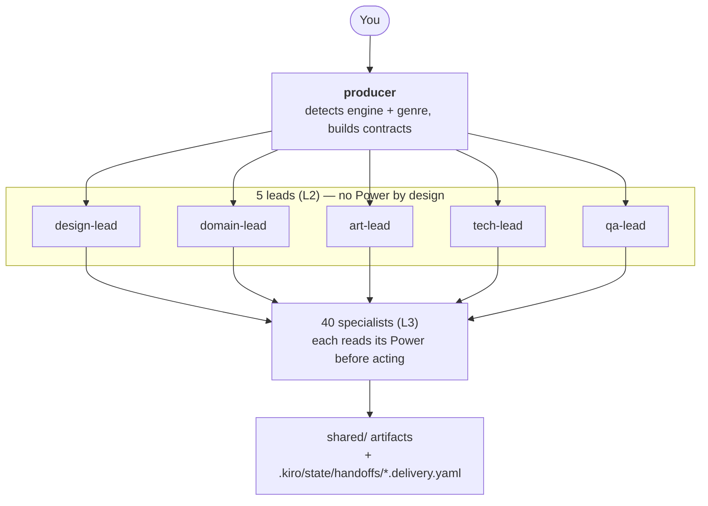
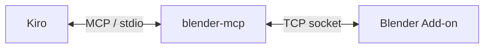
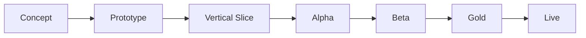
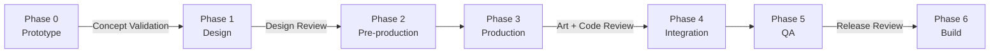

# Kiro Multi-Agent Game Studio

[English](README.md) | [繁體中文](README_ZH.md) | [简体中文](README_CN.md) | [日本語](README_JP.md) | [한국어](README_KR.md)

> **語言版本說明**：這份 README 是本專案唯一的正式文件，維護 5 種語言版本，讓你不必靠翻譯工具就能讀完整份內容。五個版本在結構上保持平行——一樣的章節、一樣的表格、一樣的數字。`.kiro/agents/` 底下的 Agent 定義與 `.kiro/steering/` 底下的 steering 檔案是用繁體中文寫的。這不會限制你：每個 Agent 都會用你書寫的語言回覆。如果你遇到語言障礙，請開一個 issue。

把你的 IDE 變成一支虛擬遊戲工作室。用白話描述你想做什麼遊戲，一支協調運作的 **48 個 AI Agent** 團隊——producer、五位 Lead、遊戲類型專家、美術、引擎 Team、QA 與發行——會替你規劃、實作，並透過明確的 Contract 把產出交接給彼此。

領域知識不放在這個 repo 裡，而是放在全機安裝的 **29 個 [Kiro Powers](https://kiro.dev/docs/powers/)**，每一個都獨立維護，並對真實工具連線驗證過。這個 repo 只放**組織層**：誰做什麼、什麼順序、交付什麼。

> **為什麼要分兩層**：手抄進 Agent prompt 的工具知識會過時。在做這個切分之前，`unity-team.md` 裡有 7 個已經不存在的 API 呼叫。Power 對真實連線驗證過，而且獨立更新，所以 Agent prompt 只需要承載角色定位與交接紀律。見 [Powers](#powers)。

> **關鍵概念**：這份文件通篇會用到的名詞（你不需要一開始就全部搞懂）：
> - **Agent**：一份角色定義（`.kiro/agents/*.md`），有自己的 system prompt、模型與工具權限
> - **Power**：一個 [Kiro Power](https://kiro.dev/docs/powers/)——打包好的領域知識層（steering 檔案）加上選用的 MCP server，全機安裝在 `~/.kiro/powers/` 底下
> - **MCP**（Model Context Protocol）：一套標準化協定，讓 AI 助理能用自然語言操作開發工具——Unity、Blender、ComfyUI、Figma 等等
> - **Steering**：Power 或專案注入 Agent context 的 markdown 知識檔案，可以是永遠載入，也可以是條件式載入
> - **Contract**：Agent 之間互相交接工作用的 YAML 格式（Task Contract / Asset Contract / Change Request）
> - **Subagent 委派**：producer 派工的方式——每個 Subagent 都跑在隔離的 context window 裡，所以完整的 Contract 必須寫進委派 prompt

## 功能特色

- **單一入口** — 找 `producer` 就好；它會偵測你的引擎與遊戲類型，再派給對的 Lead 與 Specialist。你不需要知道任何 Agent 的名字。
- **4 個引擎** — Unity、Godot、Unreal、Cocos Creator。producer 會派給對應的引擎 Team，不會預設只有一個。
- **13 種遊戲類型** — 老虎機、魚機、射擊、MMO、RPG、卡牌、三消、平台跳躍、roguelike、策略、模擬、節奏、敘事冒險。每一種都有專屬的 Domain Expert，背後掛著對應的 Power。
- **諮詢模式** — 說一句「我不懂遊戲」，Lead 就會給你建議、理由、取捨，還有一個可以直接往前走的預設值，而不是丟一串技術問題把你擋在門外。
- **外部化的知識** — 29 個 Power、323 個 steering 檔案、約 4.9 MB 的領域知識，全部在這個 repo 之外，可以獨立更新。
- **量化的領域知識** — Power 把設計問題變成數學：整數除法造成的 TTK 斷崖、掉落率的長尾（P90 = 平均值的 2.3×）、從高度與頂點時間反推的跳躍物理、MMO 的 scope 分級 T1–T4。
- **明確的 Contract** — 每一次交接都是一份帶驗收條件的 YAML Contract；每一次交付都會寫一份 manifest，讓下游知道產出了什麼、還有什麼是壞的。
- **誠實的能力邊界** — 每個 Power 都會宣告自己無法驗證什麼。Agent 會停下來回報知識缺口，而不是去猜工具 API。
- **信心等級** — 領域事實標記為 `HIGH`（可推導）、`MEDIUM`（慣例）或 `UNVERIFIED`（產業數字，需要你自己校準）。Agent 會照實轉述等級，不會把所有數字都當成同等可信。

## 架構



有三個結構上的決定值得先知道：

**Power 只在 Specialist 層讀取。** producer 與五位 Lead 都沒有 Power。Lead 的價值在於跨 Specialist 的取捨判斷——你不可能問 `unity-team` 該不該用 Unity，因為它必然說該。給 Lead 掛 Power 會讓它偏向那個領域，反而毀掉它存在的目的。

**Agent 之間透過檔案溝通，不是對話。** Subagent 跑在隔離的 context 裡，彼此之間沒有即時通道。設計真相在 `.kiro/steering/project/gdd.md`、交付物在 `shared/`、交接回執在 `.kiro/state/handoffs/`。

**producer 是路由器。** 它會讀上游的 delivery manifest，把內容寫進下一個 Agent 的委派 prompt。沒有任何東西被假設為隱性共享。

### 設計依據

團隊拆分依照遊戲產業通行的六大職能（設計、美術、工程、音訊、QA、製作），再結合迭代式 Agile 實務。AI 特有的機制——token 預算、MCP 整合、以 Contract 為基礎的交接——是本專案原創；明確標示哪些能力是真的、哪些只是願景，也是原創的做法。

| # | 參考文獻 | 作者 | 出版社 | ISBN |
|---|-----------|--------|-----------|------|
| 1 | *The Game Production Handbook*，第 3 版 | Heather Maxwell Chandler | Jones & Bartlett Learning, 2014 | 978-1-4496-8809-7 |
| 2 | *Agile Game Development: Build, Play, Repeat*，第 2 版 | Clinton Keith | Addison-Wesley (Pearson), 2020 | 978-0-1365-2781-7 |
| 3 | IGDA Curriculum Framework (2008) | IGDA Education SIG | IGDA | — |

## 前置需求

| 需求 | 說明 |
|-------------|-------|
| [Kiro IDE](https://kiro.dev/) | Agent、Power 與 steering 全部從 Kiro 載入 |
| Git + [Git LFS](https://git-lfs.com/) | 二進位資產透過 LFS 追蹤（`.gitattributes` 裡有 27 條規則） |
| [uv](https://docs.astral.sh/uv/) | Blender、ComfyUI、Unreal 與 Ableton 的 MCP server 都需要 |
| 你的目標引擎 | Unity / Godot / Unreal / Cocos Creator — 只裝你真的會用的那一個 |
| Node.js ≥ 18 | 只有在你使用 Godot 或 ComfyUI 的 MCP server 時才需要（透過 `npx` 安裝） |

依 pipeline 選用：Blender（3D）、ComfyUI（2D 生成）、Krita（手繪美術）、Ableton Live（音樂）、一個 Figma 帳號（UI）。

## 安裝

### 步驟一 — Clone 並啟用 LFS

```bash
git clone https://github.com/hoycdanny/kiro-multi-agent-game-studio.git
cd kiro-multi-agent-game-studio
git lfs install    # 每台機器做一次；沒裝的話先 brew install git-lfs
```

### 步驟二 — 在 Kiro 中開啟並信任這個 workspace

在 Kiro IDE 開啟這個資料夾。第一次開啟時它會問你是否信任這個 workspace——**選擇信任**，否則 Agent 與 steering 都不會載入。Agent Selector 接著就會列出全部 48 個 Agent。

### 步驟三 — 安裝你需要的 Power

Kiro → Powers 面板 → **Add custom power** → 來源 `https://github.com/hoycdanny/<power-name>`。

**你不需要全部 29 個。** 只裝這個專案會用到的——Power 缺件的 Agent 會誠實回報缺口，不會即興硬做。

任何遊戲都用得到的最小組合：

```
kiro-<your-engine>-accelerator    unity / godot / unreal / cocos — pick one
kiro-comfyui-accelerator          2D asset generation (almost always needed)
kiro-economy-balancing-expert     economy numbers + the simulation methodology balance-tester relies on
kiro-game-compliance-expert       needed the moment you plan to ship
```

依需要再加：

| 如果你要做 | 安裝 |
|------------------|---------|
| 3D 模型 / 動畫 | `kiro-blender-accelerator` |
| 手繪 UI 或 sprite | `kiro-krita-accelerator` |
| 原創音樂 | `kiro-ableton-accelerator` |
| Figma 設計 → 引擎 UI | `figma`（Kiro 官方推薦清單裡的，不是 `hoycdanny`） |
| 老虎機 / 魚機 | `kiro-slot-game-expert` / `kiro-fish-game-expert` |
| 錢包或金流後端 | `kiro-gaming-wallet-expert` |
| RPG / 射擊 / 卡牌 / 三消 / 平台跳躍 / 節奏 / 策略 / 模擬 / roguelike / 敘事 | 對應的 `kiro-<genre>-expert` |
| 多人連線 | `kiro-mmo-netcode-expert` — **先讀它的 T1–T4 scope 分級；大多數專案不需要真正的 MMO** |
| 存檔系統 / 資源管理 | `kiro-game-systems-expert` |
| 多語系 | `kiro-i18n-expert` |
| CI / 自動化建置 | `kiro-game-devops-expert` |
| 可用性評估 | `kiro-usability-expert` |

驗證：

```bash
ls ~/.kiro/powers/installed/                                        # 已安裝的 Power
ls ~/.kiro/powers/installed/kiro-blender-accelerator/steering/      # 它的 steering 檔案
ls ~/.kiro/powers/repos/kiro-blender-accelerator/templates/         # templates 在 repos/ 底下，不在 installed/
```

> `templates/` 與 `hooks/` **只**存在於 `~/.kiro/powers/repos/<power>/` 底下。`installed/` 那份只有 `POWER.md`、`steering/` 與 `mcp.json`。如果某個 `POWER.md` 叫 Agent 去載入範本，那個路徑要對著 `repos/` 解析。

### 步驟四 — 連上你的工具 MCP server

`.kiro/settings/mcp.json` 裡已經有 `blender-mcp`、`comfyui`、`unity-mcp`、`godot-mcp`、`unreal-engine`、`cocos-creator`、`figma` 與 `github` 的設定。

> ⚠️ **`ableton` 與 `krita` 不在 `mcp.json` 裡。** 那個檔案受 IDE 權限規則保護，Agent 寫不進去，所以你得自己貼上——確切的區塊在 [Ableton](#ableton) 與 [Krita](#krita)。在你貼上之前，`audio-team` 與 `krita-team` 會停在連線自檢並回報缺口；它們不會假裝已經產出音訊或美術。

接著啟動你真的會用到的工具：

| 工具 | 怎麼連 |
|------|----------------|
| Blender | 啟用 `blender_mcp` 外掛並啟動它的 server（預設 `localhost:9876`） |
| ComfyUI | 啟動本機服務（會自動偵測 8188，再試 8000） |
| Unity | Window → MCP for Unity → Start Server |
| Godot | `npx` 會自動安裝 `@coding-solo/godot-mcp`；設定 `GODOT_PATH` |
| Unreal | 安裝 UnrealMCP 外掛並在 Editor 裡啟用 |
| Cocos Creator | 安裝 `cocos-mcp-server`，然後 Extension → Cocos MCP Server → Start |
| Figma | 官方 Remote MCP Server；第一次使用時在 Kiro 完成 OAuth |
| GitHub | 把 `github-mcp-server` 執行檔放進 `PATH`，並提供一組 PAT |
| Ableton | 啟用監聽 `localhost:9877` 的 Remote Script 橋接 |
| Krita | 安裝 Krita 的 Python 外掛；它會服務在 `127.0.0.1:5678` |

各工具的前置需求、設定與失敗模式：[MCP Integrations](#mcp-integrations)。

## 使用方式

### 三種入口

| 你的狀況 | 找誰 | 為什麼 |
|----------------|---------|-----|
| 你有目標但沒有遊戲開發背景 | `producer` | 它會進入諮詢模式，委派 Lead 給建議，而不是拷問你 |
| 你懂這個領域，想要專業判斷 | 對應的 **Lead** | 少一層轉派；Lead 會直接回答選型問題 |
| 範圍明確、能自成一題的問題 | 對應的 **Specialist** | 例如問 `shooter-expert` TTK 怎麼算 |

每位 Lead 能替你決定什麼：

| Lead | 決定什麼 | 典型問題 |
|------|---------|------------------|
| `tech-lead` | **引擎選型**、架構取捨、效能預算、要不要上多人連線 | 「老虎機該用哪個引擎？」 |
| `domain-lead` | 這是哪個遊戲類型、該啟用哪位 Domain Expert、類型疊加時的主從關係 | 「這是 roguelike 還是 RPG？」 |
| `design-lead` | 核心循環該長什麼樣、範圍該切多小、先做哪個系統 | 「v1 該做到哪裡？」 |
| `art-lead` | 美術方向、2D 還是 3D、生成式與手繪的分工、聲音基調 | 「這個主題適合什麼風格？」 |
| `qa-lead` | 這個階段該測什麼、什麼程度算可以出貨 | 「現在可以出貨了嗎？」 |

**為什麼選型問題必須問 Lead 而不是 Specialist**：你不可能問 `unity-team` 該不該用 Unity——它必然說該。四個引擎 Team 各有立場，兩個 casino Domain Expert 也都想接案。Lead 在它管的範圍內沒有單一工具的包袱；那就是它存在的結構性理由。

當問題範圍明確、又不需要跨領域協調時，直接找 Specialist 最快：

| 問題 | 問誰 | 它會讀的 Power |
|----------|-----|----------------|
| 「HP 100、傷害 33，TTK 是多少？」 | `shooter-expert` | `kiro-shooter-expert` |
| 「抽卡機率 1%，要抽幾次才有 90% 信心？」 | `economy-designer` | `kiro-economy-balancing-expert` |
| 「40 張牌組放 3 張，開局 5 張抽到一張的機率？」 | `card-game-expert` | `kiro-card-game-expert` |
| 「這個 FBX 匯入 Unity 的 scale 不對」 | `blender-team` | `kiro-blender-accelerator` |
| 「跳 3 格高、0.35 秒到頂點，重力要設多少？」 | `platformer-expert` | `kiro-platformer-expert` |

Specialist 會給你規格，但不會協調下游工作。要把規格變成實作，還是得回頭走 producer。

### 範例指令

```
"Build a slot machine in Unity"
"I want to make a slot machine but I don't know anything about games"     → 諮詢模式
"Which engine should I use for a mobile match-3?"                        → 問 tech-lead
"HP is 100 and damage is 33 — what is the TTK?"                          → 問 shooter-expert
"40-card deck with 3 copies — odds of drawing one in the opening 5?"      → 問 card-game-expert
"Implement this skill tree in Unity, spec is in specs/skill-tree.md"      → 跳過諮詢模式
```

### 實例 A — 只用一句話的新手

> **你**：我想做一台老虎機，但我完全不懂遊戲開發。

1. **`producer`** 偵測到兩件事：類型是 casino，而且使用者宣告沒有背景 → 進入**諮詢模式**（`.kiro/steering/global/advisory-mode.md`）。

2. 它**不會**丟一串技術問題給你。它會委派 `tech-lead` 做引擎選型，委派 `domain-lead` 確認該啟用哪位專家。

3. **`tech-lead`** 用四段式諮詢格式回答：
   > **建議**：Cocos Creator。
   > **理由**：老虎機是 2D、要同時上網頁與行動平台，而且動畫與 UI 很重；這個組合下 Cocos 的 2D 管線最直接、網頁匯出也最成熟。
   > **取捨**：如果你之後想做 3D 版，或已經有 Unity 人力，那 Unity 更好；純網頁前端團隊可以考慮 PixiJS。
   > **預設值**：如果你不回覆，就以 Cocos Creator 往前走。

4. **`slot-game-expert`** 會讀 `kiro-slot-game-expert`，並**先問你的目標司法管轄區**——因為「最短轉軸間隔該設多少」在不同市場有不同的法律答案。如果你說還沒決定，它會用最保守的假設往前走（純娛樂原型、不涉及真實金錢），並明確標示這個假設。

5. producer 轉述這些建議，然後只問**一個**問題：「這樣可以開始嗎？」

6. 你同意之後，pipeline 就跑起來：

```
slot-game-expert   → math model (RTP / volatility / paytable)
balance-tester     → reads simulation-methodology.md, Monte Carlo verification of actual RTP
art-lead           → comfyui-team generates symbols and background
ui-ux-team         → reads the figma Power, produces layout + Design Tokens
cocos-team         → reads kiro-cocos-accelerator, assembles scene and logic
qa-lead            → functional-tester verifies flow
compliance-release → reads kiro-game-compliance-expert (if you intend to ship)
```

你總共只回答了一次「好」。這就是諮詢模式的意義。

### 實例 B — 你已經有規格了

> **你**：幫我在 Unity 實作這棵技能樹，規格在 `specs/skill-tree.md`。

1. producer **不會**進入諮詢模式。`advisory-mode.md` 明確禁止重新確認你已經做過的決定。
2. 它建立一份 Task Contract，委派 `tech-lead`，再轉給 `unity-team`。
3. `unity-team` 會讀相關的 `kiro-unity-accelerator` steering（場景組裝 / 腳本 / 建置），而不是去猜 MCP 工具名稱。
4. 完成後寫一份 delivery manifest 到 `.kiro/state/handoffs/TASK-xxx.delivery.yaml`。
5. `tech-lead` 做 code review；producer 回報給你。

如果規格本身有數值問題——例如技能點成長曲線不合理——`unity-team` 不會自己改。它會回報，producer 再把它轉給 `rpg-systems-expert`。

### 實例 C — 只做分析，不動工

> **你**：如果我做一款帶 PvP 的卡牌遊戲，最大的技術風險是什麼？

producer 判定這是分析型問題，並行委派幾位 Lead，回傳一份彙整後的風險清單。**不會建立任何 Task Contract，也不會產出任何檔案。**

- `tech-lead`：PvP 同步架構，拉 `mmo-expert` 進來，依 `kiro-mmo-netcode-expert` 的 scope 分級把它歸為 T1 或 T2
- `domain-lead` → `card-game-expert`：power creep 是長期的結構性風險
- `design-lead`：先手優勢在卡牌 PvP 裡是結構性的，必須量測，不能靠假設
- `qa-lead`：對戰模擬需要的樣本量（±1pp 精度大約需要 9,604 場）

只有你要求動工，工作才會開始。分析型問題不會默默生出一堆檔案。

### 專案狀態要去哪裡看

Agent 之間沒有即時通道，所以當前狀態都存在檔案裡：

| 你想知道 | 看這裡 |
|------------------|---------|
| 現在的遊戲設計是什麼 | `.kiro/steering/project/gdd.md` |
| 美術與聲音方向定案成什麼 | `.kiro/steering/project/style-guide.md` |
| 有哪些任務、狀態如何 | `.kiro/state/tasks.yaml` |
| 某個任務交付了什麼、還有什麼是壞的 | `.kiro/state/handoffs/<contract_id>.delivery.yaml` |
| 實際的資產檔案 | `shared/`（models / textures / sprites / audio / locales / sim） |
| 你現在在哪個 milestone | `.kiro/steering/project/milestones.md` |
| 哪個 Agent 掛哪個 Power | `.kiro/steering/global/powers-registry.md` |

交付紀錄是**只增不改**的：要更正就補一則新的，不要去改舊的，這樣歷程才追溯得到。

## 專案結構

```
.kiro/
├── agents/              48 agent definitions, grouped by layer
│   ├── orchestration/   creative-director, producer
│   ├── design/          5 core design roles + 13 genre domain experts + ui-ux + economy + localization
│   ├── art/             art-lead, blender, comfyui, krita, animator, audio, vfx, technical-artist
│   ├── engineering/     tech-lead + 4 engine teams + systems/ui programmer, devops, wallet
│   ├── qa/              qa-lead + functional / balance / performance / usability
│   └── publishing/      compliance-release, marketing-team
├── steering/
│   ├── global/          contracts, asset-standards, bug-severity, powers-registry, advisory-mode
│   └── project/         gdd, style-guide, milestones      ← your game's single source of truth
├── state/               tasks.yaml, handoffs/*.delivery.yaml
└── settings/mcp.json    MCP server configuration

shared/                  cross-agent artifact staging
├── concept/ textures/ sprites/ ui/     from comfyui-team
├── models/                             from blender-team
├── rigs/ animations/                   from animator
├── audio/{sfx,music,voice}/            from audio-team
├── locales/                            from localization-team
└── sim/                                from balance-tester
```

`~/.kiro/powers/` — 知識層，**在這個 repo 之外**，全機安裝。

每個 Agent 都有一份 `.md`（frontmatter + system prompt）與一份 `.json`。子目錄只是組織用途：Kiro 依 frontmatter 裡扁平的 `name` 註冊 Agent，所以你委派時寫 `Use the "blender-team" subagent to ...`，絕對不是 `"art/blender-team"`。

## Agent 分層

| 分層 | 數量 | 組成 |
|-------|:-----:|-------------|
| L0 戰略 | 2 | `creative-director`（願景守門）、`producer`（派工中樞） |
| L2 Lead | 5 | `design` / `domain` / `art` / `tech` / `qa` — 中介調度者與品質關卡，**刻意不掛 Power** |
| L3 設計與類型 | 20 | 7 個核心設計職能 + 13 位遊戲類型 Domain Expert |
| L3 美術與音訊 | 7 | Blender、ComfyUI、Krita、Animator、Audio、VFX、Technical Artist |
| L3 工程 | 8 | 4 個引擎 Team + Systems/UI Programmer、DevOps、Wallet |
| L3 QA | 4 | functional / balance / performance / usability |
| L3 發行 | 2 | compliance-release、marketing-team |

**48 個裡有 33 個掛了 Power**；另外 15 個是協調角色，它們的知識*就是*本專案的組織慣例。見 [Powers](#powers)。

### 13 位遊戲類型 Domain Expert

由 `domain-lead` 按需啟用，絕不會全部同時開。

| 專家 | 涵蓋範圍 |
|--------|--------|
| `slot-game-expert` | 老虎機：數學模型、RNG、認證、司法管轄區矩陣、負責任遊戲 |
| `fish-game-expert` | 魚機：捕獲判定 RNG、賠付、多人公平性、控分紅線 |
| `shooter-expert` | FPS/TPS：武器數值、彈道、命中判定、後座力、Bot AI、射擊手感 |
| `mmo-expert` | 多人連線：伺服器權威、狀態複寫、興趣管理、延遲補償 |
| `rpg-systems-expert` | 屬性、等級曲線、技能樹、掉落稀有度、傷害公式、狀態效果 |
| `card-game-expert` | Deckbuilder/TCG：抽牌機率、費用曲線、archetype、power creep 控制 |
| `puzzle-match3-expert` | board 生成、可解性、連鎖、難度曲線、步數經濟 |
| `platformer-expert` | 跳躍物理、輸入寬容、關卡節奏、metroidvania 能力 gating |
| `roguelike-expert` | 程序生成、run 內 build 與 synergy、meta 進度、難度縮放 |
| `strategy-expert` | RTS / 回合制 / 4X / 塔防：單位相剋、經濟、AI、波次曲線 |
| `simulation-expert` | 生產鏈、資源循環、自動化、生存需求、系統湧現 |
| `rhythm-expert` | 譜面、判定窗、audio/input offset 校正、計分 |
| `narrative-adventure-expert` | 分支結構、旗標與狀態、對話樹、結局與收斂 |

### Agent 定義格式

每個 Agent 都是 `.kiro/agents/` 底下的一個 markdown 檔案。YAML frontmatter 定義權限；正文就是 system prompt。

本專案每個 Agent 都貫徹兩個設計原則：

**「待機中」不是背景程序。** Kiro 的自訂 Agent 沒有常駐服務。Agent 只有在被選取時才「醒著」，而它的第一步永遠是判斷狀況——打招呼、具體請求，還是工具沒連上——再決定要不要動手。例如 `blender-team` 會用 `get_blendfile_summary_path_info` 做連線自檢，失敗就停下，而不是直接開始建模。

**承認做不到勝過演出做得到。** 沒有任何 Agent 會捏造別的 Team 的結果或進度。`producer` 只回報 Subagent 真正回傳的內容。

這裡刻意不貼 prompt 範例。以前貼過，重構之後那些節錄就和真正的檔案脫節了。要看就直接開檔案。

### 模型分配

每個 Agent 都在 frontmatter 裡指定模型。實際生效的是 `.json` 裡的值；`.md` 的 frontmatter 保持同步。實測 48 個 Agent 的分布：

| 模型 | 數量 | 指派給 | 理由 |
|-------|:-----:|-------------|-----------|
| `claude-sonnet-5` | 7 | `creative-director`、`producer`、五位 Lead | 派工與審查關卡：多步驟的 agentic 工作，一個錯誤會沿整條 pipeline 往下擴散 |
| `deepseek-3.2` | 9 | `slot-game-expert`、`fish-game-expert`、`rpg-systems-expert`、`shooter-expert`、`card-game-expert`、`strategy-expert`、`economy-designer`、`balance-tester`、`wallet-systems-expert` | 數值與機率推理：RTP、賠付、成長曲線、經濟收斂、帳務一致性 |
| `claude-sonnet-4` | 20 | 所有美術職能、一般設計、其餘類型專家、`ui-ux-team`、`compliance-release` | 通用能力就夠用；這是人數最多的一層 |
| `qwen3-coder-next` | 7 | 4 個引擎 Team、`systems-programmer`、`ui-programmer`、`devops-team` | 純寫程式與工具編排 |
| `claude-haiku-4.5` | 5 | `functional-tester`、`performance-tester`、`usability-tester`、`localization-team`、`marketing-team` | 呼叫量大，單次出錯的代價低 |

> 這個分配是依 Kiro 公開的模型定位，結合任務類型與成本推導出來的——**不是在本專案內做過 benchmark 的結果**。可以自己調：如果某個 Agent 的產出感覺太淺，就往上升一階，或提高 reasoning effort。

可調的槓桿：如果你希望算錯代價高的地方更安全，可以把 `slot-game-expert` / `fish-game-expert` / `wallet-systems-expert` 升到 `claude-opus-4.8`；如果你不想調，全部設成 `auto` 就好。你的 `/model` 清單裡不存在的模型 ID 會靜默退回預設值。要注意有些模型是 Experimental 且有區域限制，請在你自己的環境確認可用性。

## Powers

Agent 是**組織層**。[Kiro Powers](https://kiro.dev/docs/powers/) 是**領域知識層**。29 個全部已安裝且有內容：**323 個 steering 檔案，約 4.9 MB。**

權威對照表在 `.kiro/steering/global/powers-registry.md`，每個 Agent 都會自動載入。下面的表格是給人看的版本。

### 引擎與工具 Power（Accelerator — 12 個 Agent）

每一個背後都有真實的 MCP server，知識也對真實連線驗證過。

| Agent | Power | Steering | 解決什麼 |
|-------|-------|:--------:|----------------|
| `unity-team` | `kiro-unity-accelerator` | 15 | 場景 / 資產 / 建置 / 效能 / 架構 / 平台相容 |
| `godot-team` | `kiro-godot-accelerator` | 13 | 場景架構 / GDScript / signal / TileMap / 匯出 |
| `unreal-team` | `kiro-unreal-accelerator` | 11 | 關卡 / Blueprint / 材質 / GAS / UE5 功能 |
| `cocos-team` | `kiro-cocos-accelerator` | 14 | 場景 / 節點元件 / prefab / 跨平台建置 |
| `blender-team` | `kiro-blender-accelerator` | 15 | 建模 / UV / 材質 / 匯出。**軸向與色彩空間最常靜默出錯** |
| `animator` | 同上 | — | 讀 `rigging-and-skinning.md` / `animation-authoring.md` |
| `technical-artist` | 同上 | — | 讀 `collider-and-lod.md` / `performance-and-limits.md` |
| `comfyui-team` | `kiro-comfyui-accelerator` | 11 | 模型選型 / prompt / sampler / ControlNet / 放大 / VRAM |
| `vfx-artist` | 同上 | — | 特效素材，與 `comfyui-team` 共用同一個 Power |
| `krita-team` | `kiro-krita-accelerator` | 13 | 畫布 / 筆刷 / 圖層 / 遮罩 / 構圖 / 匯出 |
| `audio-team` | `kiro-ableton-accelerator` | 11 | 編曲 / 混音 / 樂理 / 鼓組律動 / 曲風 playbook |
| `ui-ux-team` | `figma` | 3 | 讀取版面 / 萃取 Design Token / Code Connect / design system 規則 |

> `figma` Power 預設的是 Figma → 網頁前端程式碼，而這個專案需要的是 Figma → 原生引擎 UI。讀版面與萃取 token 照它走，但要產出本專案的 handoff 規格，不是 HTML/CSS。

### 遊戲類型 Domain Expert（Knowledge Base — 13 個 Agent）

純知識，沒有 MCP server。它的價值在於把設計問題變成可計算的數學，而不是給一般性建議。

| Agent | Power | Steering | 技術核心 |
|-------|-------|:--------:|----------------|
| `slot-game-expert` | `kiro-slot-game-expert` | 12 | 數學模型 / RNG / 認證 / 司法管轄區矩陣 / 負責任遊戲 |
| `fish-game-expert` | `kiro-fish-game-expert` | 16 | 捕獲判定 RNG / 賠付 / 多人公平性 / 控分上限 / 認證 |
| `rpg-systems-expert` | `kiro-rpg-systems-expert` | 11 | 三類傷害公式的極端值行為、掉落長尾（P90 = 平均值的 2.3×）、技能樹 trap 判定 |
| `shooter-expert` | `kiro-shooter-expert` | 10 | **TTK 斷崖** — 100 HP 之下，34 傷害要 3 槍、33 傷害要 4 槍，差 1 點傷害就讓 TTK 跳 33%；後座力模型；武器支配性檢定 |
| `card-game-expert` | `kiro-card-game-expert` | 10 | 超幾何抽牌機率表、量化的 power creep 偵測、HHI meta 多樣性、`C(n,2)` 關鍵字交互 |
| `puzzle-match3-expert` | `kiro-puzzle-match3-expert` | 11 | 可解性三層（第三層在數學上無法證明）、board 生成拒絕率、通關率敏感度可差到 37× |
| `platformer-expert` | `kiro-platformer-expert` | 10 | 跳躍物理反推（`g = 2h/t²`）、三種輸入寬容機制、gating 死鎖圖偵測 |
| `rhythm-expert` | `kiro-rhythm-expert` | 10 | 以音訊時鐘為權威（用 frame 計時 3 分鐘會漂移約 1 秒）、audio 與 input offset 必須分開 |
| `strategy-expert` | `kiro-strategy-expert` | 10 | 四個子類型的核心約束、相剋矩陣失衡檢測、塔防波次與收入的耦合、AI 難度公平性 |
| `simulation-expert` | `kiro-simulation-expert` | 10 | 生產鏈與供需收斂、資源閉環、長期崩潰偵測 |
| `roguelike-expert` | `kiro-roguelike-expert` | 9 | 程序生成正確性、種子架構、build synergy 上限、meta 進度平衡 |
| `narrative-adventure-expert` | `kiro-narrative-adventure-expert` | 14 | 分支結構型態與各自的維護成本、旗標設計、可達性與死路驗證 |
| `mmo-expert` | `kiro-mmo-netcode-expert` | 11 | **scope 分級 T1–T4** — 大多數說要做 MMO 的專案其實只需要 T2；頻寬與容量模型；延遲補償的取捨 |

### 跨領域 Power（Knowledge Base — 8 個 Agent）

| Agent | Power | Steering | 技術核心 |
|-------|-------|:--------:|----------------|
| `economy-designer` | `kiro-economy-balancing-expert` | 13 | 貨幣分層 / sink-source 閉環 / 抽卡期望成本與保底數學 / 進度曲線 |
| `balance-tester` | 同上 | — | 讀 `simulation-methodology.md`：用 `n ≥ (1.96σ/ε)²` 算樣本量、收斂判斷、RNG 串流分離 |
| `compliance-release` | `kiro-game-compliance-expert` | 14 | 分級 / 隱私 / 送審 / 商店素材 / 揭露義務。**包含 45 類會過期的陳述** |
| `wallet-systems-expert` | `kiro-gaming-wallet-expert` | 10 | API / DB schema / 幂等與鎖 / 對帳 / 可觀測性 / 金流合規 |
| `systems-programmer` | `kiro-game-systems-expert` | 9 | 存檔封套與遷移鏈（逐步 `N-1` 對上捷徑 `N(N-1)/2`）、atomic write 的順序、`f^d` 規模的事件風暴 |
| `localization-team` | `kiro-i18n-expert` | 10 | 為什麼字串串接沒有通解 / CJK 斷行禁則 / RTL 鏡像 / 字型 subset 與豆腐塊 |
| `devops-team` | `kiro-game-devops-expert` | 9 | 四個引擎的 headless 建置 / **產物驗證八項**（exit code 0 有七種不同的失敗形態）/ 版本號 / Git LFS |
| `usability-tester` | `kiro-usability-expert` | 8 | 五級證據等級 / 新手引導審查 / 卡關點分析 / playtest 設計 |

### 為什麼有 15 個 Agent 刻意不掛 Power

這是設計上的決定，不是漏掉。

| Agent | 為什麼沒有 |
|-------|---------|
| `producer`、`creative-director` | 派工與願景是本專案的組織知識，不屬於任何單一領域 |
| 五位 Lead | **價值來自跨 Specialist 的取捨判斷。** Power 會讓 Lead 偏向那個領域，而選型時的中立正是它存在的理由——你不可能問 `unity-team` 該不該用 Unity |
| `game-designer` | GDD 整合角色；它的領域知識分散在 13 個類型 Power 裡 |
| `level-designer` | 關卡設計知識已經在 platformer / strategy / puzzle / roguelike 這幾個 Power 裡 |
| `ui-programmer` | UI 綁定由各引擎自己的 Power 覆蓋 |
| `functional-tester` | 功能測試的方法依專案而異；CI 執行那一側在 devops Power 裡 |
| `performance-tester` | 量測依各引擎的 profiler 而異；那份知識在各引擎 Power 的效能章節裡 |
| `narrative-designer` | 敘事的*系統結構*在 narrative-adventure Power 裡；這個角色產出的是*內容* |
| `combat-designer` | 戰鬥數值在 shooter / rpg Power 裡；這個角色服務沒有專屬 Power 的類型 |
| `marketing-team` | 純文字產出，不依賴工具 |

### 信心等級 — 引用任何數字前先看這裡

Knowledge Base 型的 Power 把內容標成三級，Agent 必須照實轉述等級：

| 等級 | 意義 | 怎麼轉述 |
|------|---------|--------------|
| `HIGH` | 可用數學推導，或有明文標準（公式、組合數學、Unicode/CLDR 規則、POSIX 語意） | 可以直接當結論用 |
| `MEDIUM` | 廣泛採用的慣例，不是唯一解 | 要說出什麼前提改了建議就會變 |
| `UNVERIFIED` | 來自訓練資料的產業數字，未查證且隨時間變動 | **必須明說需要用你自己的數據校準** |

`UNVERIFIED` 在總量裡佔了相當的比例，集中在四個地方：

- 所有「產業平均值」（留存、ARPPU、典型 TTK 區間、coyote time 的毫秒數、建議受測人數）
- 所有法規細節（分級問卷、平台政策、機率揭露義務——在 `kiro-game-compliance-expert` 裡，`UNVERIFIED` 刻意佔多數）
- 所有引擎端的行為（沒有任何 Power 有真實連線可以驗證匯入設定或 API）
- 所有平台延遲與硬體規格數字

如果你看到一個具體數字卻沒有標等級，就問它是可推導的、還是需要校準的。

### 知識庫在這個 repo 之外

| | 放什麼 | 位置 |
|---|---|---|
| **這個 repo** | **路由與組織**：哪個 Agent 對應哪個 Power、該讀哪份 steering、什麼時候讀、缺件時怎麼回報 | `.kiro/` |
| **Kiro Powers** | **知識本身** | `~/.kiro/powers/installed/`（全機安裝，在 repo 之外） |

可驗證的事實：323 個 Power steering 檔案全部在這個 repo 之外；在 repo 裡搜尋只有 Power 內容才有的字串，命中數為零（用 `Redlock`、`euler_ancestral`、`GPU Resident Drawer`、`krita_select_by_alpha` 測過）；repo 裡每一處提到 Power 都是路徑或檔名引用，不是複製過來的內容。對磁碟核對 48 個 Agent prompt 引用的**全部 376 個 steering 檔名，零虛構**。

**誠實說出代價**：這個 repo **不是自我完備的**。clone 下來之後，33 個 Agent 的知識層是空的，直到你從 Powers 面板把 Power 裝起來。沒有可機器檢查的 manifest，也沒有安裝腳本——只有這份文件與 `powers-registry.md` 裡的對照表。

### 覆蓋缺口分析

29 個 Power 全部至少被一個 Agent 引用（沒有孤兒）。有四個領域**完全沒有** Power 覆蓋。這不是待辦清單，而是誠實的盤點，一併列出現在由誰頂著、以及不補的代價：

| 缺口 | 受影響的 Agent | 現在由誰頂 | 不補的代價 |
|-----|---------------|-----------|------------------------|
| **跨引擎的 profiling 方法論** | `performance-tester` | 各引擎 Power 的效能章節（分散，而且是單一引擎視角） | 效能數字噪音大；沒有方法論很容易優化錯地方而且自己不知道。缺的是：該量什麼、frame 預算歸因、統計效力、平台特有的陷阱 |
| **格鬥／動作遊戲的近戰戰鬥** | `combat-designer` | 它自己的 prompt。shooter Power 只涵蓋射擊，rpg Power 只涵蓋數值 | frame data、hitbox/hurtbox、輸入緩衝與取消窗、連段設計、hitstop **沒有任何 Power** 覆蓋。格鬥不在那 13 種類型裡 |
| **敘事寫作的技藝與工具** | `narrative-designer` | 它自己的 prompt。narrative-adventure Power 涵蓋的是*系統結構*，不是內容 | Ink / Yarn / Twine 的語法與慣例、World Bible 結構、對話寫作的技藝，只能靠基礎模型的知識撐著 |
| **商店轉換率與預告片結構** | `marketing-team` | 它自己的 prompt | 商店頁的轉換要素、預告片 shot list 結構、press kit 組成，都是可以累積的技藝知識 |

那 13 種類型也還沒覆蓋**格鬥、賽車、運動、恐怖與派對遊戲**。格鬥的機制最獨特——frame data 本身就是一門學問——另外四種則有一部分由現有專家頂著。要不要補，取決於你真的要做什麼；**不要為了覆蓋率而加 Power**，因為 48 個 Agent 已經是需要小心管理的規模了。

### 新增一個 Power

Power 有兩種原型：**Accelerator**（包一個真實的 MCP server；知識對真實連線驗證過）與 **Knowledge Base**（純領域知識，沒有 server，標信心等級）。

判斷一個 Power 值不值得做，有三個測試：

1. **內容是否超過基礎模型已經知道的？** 如果語言模型本來就知道，那個 Power 的價值接近零——它只是把同一份知識搬個位置。價值來自具體數字與推導（一張 TTK 斷崖門檻表）、可驗證的 API 事實（Blender 5.x 移除了 `action.fcurves`），以及帶日期的現行法規。
2. **弄錯的代價有多高？** 存檔遷移出錯會毀掉玩家進度；合規出錯會被下架。優先做這些。
3. **這份知識會不會過時？** 會過期的東西（工具 API、法規）正好該放進 Power，因為 Power 是獨立更新的。不會過時的數學放哪裡都行。

做完一個 Power 之後：從 Powers 面板安裝它、把 Agent ↔ Power 那一列加進 `.kiro/steering/global/powers-registry.md`、加進上面的盤點表格，並確認你引用的每一個 steering 檔名在磁碟上真的存在。

## MCP Integrations

> **這一節講怎麼連上，不講怎麼用。** 確切的工具名稱、參數與正確的操作順序，權威在各 Power 的 `POWER.md` 與 `steering/`，它們對真實連線驗證過，而且獨立更新。這裡出現的任何工具清單都只是概念性的，可能落後。
>
> 如果呼叫回傳 `Unknown action` 或參數驗證錯誤，**錯誤訊息裡列出的合法值是最高權威**，勝過任何文件。

### Blender

`art/blender-team`、`animator` 與 `technical-artist` 透過一個輕量的 MCP server 驅動 Blender。



> ⚠️ **安全性**：這個 MCP server 會在 Blender 裡執行 LLM 產生的程式碼，沒有沙箱。請用虛擬機，或用一台沒有敏感資料的機器。

前置需求：[Blender 5.1+](https://www.blender.org/download/)、[uv](https://docs.astral.sh/uv/)、Kiro。

```json
"blender-mcp": {
  "command": "uv",
  "args": ["--directory", "/path/to/blender_mcp/mcp", "run", "blender-mcp"],
  "disabled": false,
  "autoApprove": []
}
```

1. 安裝 uv：`curl -LsSf https://astral.sh/uv/install.sh | sh`
2. `git clone https://projects.blender.org/lab/blender_mcp.git`
3. 安裝外掛——把 release 的 `.zip` 拖到 Blender 視窗上兩次（第一次會加入 Blender Lab 倉庫，第二次才安裝），或走 Edit → Preferences → Extensions → Install from Disk
4. 把 `--directory` 參數指向你自己 clone 的 `blender_mcp/mcp`

Kiro 會啟動並管理這個程序，你不需要開終端機。**在喚醒 `blender-team` 之前，先開 Blender 並確認外掛已啟用**——它會用 `get_blendfile_summary_path_info` 自檢連線，失敗就停下，不會盲目往前做。

工具涵蓋唯讀檢視（`get_objects_summary`、`get_object_detail_summary`、`get_blendfile_summary_*`）、截圖、viewport 渲染，以及用 `execute_blender_code` 做任意 `bpy` 操作。

參考：[Blender MCP](https://www.blender.org/lab/mcp-server/#llm-client) · [原始碼](https://projects.blender.org/lab/blender_mcp)

### ComfyUI

`art/comfyui-team` 與 `vfx-artist` 透過 [`artokun/comfyui-mcp`](https://github.com/artokun/comfyui-mcp)（108 個工具，MIT）產生影像。

Comfy 官方的選項因為具體理由被排除：Comfy Cloud MCP 需要訂閱與點數；第一方的 Comfy Local MCP 還在封閉測試、拿不到；Comfy CLI 是 shell 指令，不是 MCP 工具。

```json
"comfyui": {
  "command": "npx",
  "args": ["-y", "comfyui-mcp"],
  "env": {
    "CIVITAI_API_TOKEN": "",
    "HUGGINGFACE_TOKEN": ""
  },
  "disabled": false,
  "autoApprove": []
}
```

1. 在本機啟動 ComfyUI。server 會自動偵測——先試 8188（CLI 預設），再試 8000（桌面版 app）。
2. 不需要 `COMFY_URL`、workflow JSON 路徑或 node ID；高階工具會自己組 workflow。
3. `CIVITAI_API_TOKEN` 與 `HUGGINGFACE_TOKEN` 是選用的，只在要從那些平台下載模型時才需要。
4. 非標準安裝位置：把 `COMFYUI_PATH` 設成資料目錄。

工具分成高階生成（`generate_image`、`generate_with_controlnet`、`generate_with_ip_adapter`、`generate_audio`）、素材迭代、workflow 組裝、模型管理，以及診斷（`clear_vram`）。

> 安全性：這個 server 綁在本機。沒有額外認證就不要對外開放。如果你填了 API key，請用環境變數，不要 commit 進去。

### Unity

`engineering/unity-team` 透過 [CoplayDev/unity-mcp](https://github.com/CoplayDev/unity-mcp) 操作 Unity Editor。

```json
"unity-mcp": {
  "url": "http://127.0.0.1:8080/mcp",
  "transport": "http",
  "disabled": false,
  "autoApprove": []
}
```

1. Package Manager → Add package from git URL → `https://github.com/CoplayDev/unity-mcp.git?path=/MCPForUnity#main`
2. Window → MCP for Unity → Start Server
3. 如果視窗回報的 port 不是 8080，就把 `url` 改成一致

port 被占用或防火牆干擾時的退路：改用 stdio，`{ "command": "uvx", "args": ["unity-mcp"], "transport": "stdio" }`。

> 用 HTTP 是刻意的——這個 endpoint 只在 loopback 上和 Unity Editor 對話，流量不會離開本機，所以不需要 HTTPS。不要把它綁到對外位址。

**這裡刻意不列工具清單。** 它們在 `~/.kiro/powers/installed/kiro-unity-accelerator/POWER.md` 裡，每一項都標明對真實連線驗證過。這個位置以前放過一張手抄的表格，列了幾個不存在的 action——`manage_asset(list)` 實際上是 `search`、`manage_editor(action:"build")` 實際上是 `manage_build`、`manage_graphics(get_rendering_stats)` 實際上是 `stats_get`——再加上 `project_info` 與 `editor_state` 這兩個 Power 明確說不要假設存在的 resource。那就是本專案分兩層的起因。

### Godot

`engineering/godot-team` 使用 [Coding-Solo/godot-mcp](https://github.com/Coding-Solo/godot-mcp)（npm `@coding-solo/godot-mcp`）。

```json
"godot-mcp": {
  "command": "npx",
  "args": ["-y", "@coding-solo/godot-mcp"],
  "env": {
    "GODOT_PATH": "/Applications/Godot.app/Contents/MacOS/Godot",
    "DEBUG": "false"
  },
  "disabled": false,
  "autoApprove": []
}
```

1. 安裝 Node.js ≥ 18 與 Godot。
2. `npx` 會自動抓取並啟動 server——不需要手動 clone 或建置。
3. 把 `GODOT_PATH` 設成你的 Godot 執行檔。如果 Godot 已經在 `PATH` 上，可以省略。

工具涵蓋專案控制（`launch_editor`、`run_project`、`stop_project`、`get_project_info`）、場景編輯（`create_scene`、`add_node`、`edit_node`、`load_sprite`、`save_scene`）、debug 輸出，以及 Godot 4.4+ 的 UID 處理。

失敗模式：`run_project` 會一直阻塞到遊戲視窗關閉——用 `stop_project` 中斷它，不要把它當成要重試的錯誤；UID 工具需要 4.4+，更舊的版本用 `res://` 路徑。

### Unreal

`engineering/unreal-team` 使用 [flopperam/unreal-engine-mcp](https://github.com/flopperam/unreal-engine-mcp) 的開源本機 MCP——`Python/` server 加上 `UnrealMCP` C++ 外掛——不是付費的託管版本。託管的 Flop MCP 提供 50+ 工具，包含 Niagara 與 Sequencer，但需要付費 API key，還要繞一趟遠端。

```json
"unreal-engine": {
  "command": "uv",
  "args": [
    "--directory",
    "/ABSOLUTE/PATH/TO/unreal-engine-mcp/Python",
    "run",
    "unreal_mcp_server_advanced.py"
  ],
  "disabled": false,
  "autoApprove": []
}
```

1. 在你的 Unreal 專案之外 clone：`git clone https://github.com/flopperam/unreal-engine-mcp.git`
2. 把外掛複製進專案（在 `.uproject` 所在目錄執行）：`cp -r ~/path/unreal-engine-mcp/UnrealMCP Plugins/`
3. 右鍵點 `.uproject` → Generate project files → 建置 Development Editor
4. Editor → Edit → Plugins → 啟用 `UnrealMCP` → 重啟
5. 安裝 Python 3.12+ 與 uv，再把 `--directory` 指向你的絕對 `Python/` 路徑

工具涵蓋 Blueprint 腳本與分析、世界搭建、物理與材質，以及 actor 管理。

`unreal-team` 已經繞開的已知問題：**絕對不要下 `ce` console 指令**——透過 MCP 下這個指令會讓 Editor 立刻當掉；對 `OverrideMaterials` 用 `set_component_property` 不可靠，請改用驗證過的 Blueprint SCS 做法；避免長串的 Undo，寧可明確地重新套用一次。

### Cocos Creator

`engineering/cocos-team` 使用 [DaxianLee/cocos-mcp-server](https://github.com/DaxianLee/cocos-mcp-server)。很適合輕量的跨平台與 H5 遊戲，包含需要快速多平台上線的老虎機。

```json
"cocos-creator": {
  "url": "http://127.0.0.1:3000/mcp",
  "transport": "http",
  "disabled": false,
  "autoApprove": []
}
```

1. 下載 `cocos-mcp-server`，或從 [Cocos Store](https://store.cocos.com/app/detail/7941) 安裝
2. 把資料夾複製到 Cocos 專案的 `extensions/cocos-mcp-server/`
3. `cd extensions/cocos-mcp-server && npm install && npm run build`
4. 重啟 Cocos Creator 或重新整理擴充
5. Extension → Cocos MCP Server → 設定 port（預設 3000）→ Start
6. 如果 port 不同，就更新 `url`

工具按領域加前綴：`scene_*`、`node_*`、`component_*`、`prefab_*`、`project_*`、`debug_*`、`advancedAsset_*`。

`cocos-team` 會防範的失敗模式：`node_create_node` 沒給 `parentUuid` 會建在場景根節點；`component_set_component_property` 少了 `propertyType` 會**靜默失敗**；資產路徑必須用 `db://` 前綴，不能用檔案系統路徑；2D 節點用 x/y，3D 用 x/y/z。

### Figma

`design/ui-ux-team` 透過[官方 Figma MCP Server](https://developers.figma.com/docs/figma-mcp-server/)讀取版面與 Design Token。Kiro 是文件明列的支援客戶端。

Figma 只負責 UI/UX 這一層：UX 流程、UI 版面（HUD、選單、彈窗、商店；老虎機的轉軸框、Spin 按鈕、賠付表）、design system（顏色、字級、間距、按鈕狀態），以及 handoff（座標、尺寸、間距、顏色、切圖清單）。3D 模型與 PBR 貼圖交給 `blender-team` 與 `comfyui-team`；遊戲邏輯交給引擎 Team；像素素材交給 `comfyui-team`。Figma 決定版面、流程與 token——引擎 Team 再在 Unity UI Toolkit、Godot Theme、Unreal UMG 或 Cocos UI 裡重建。

```json
"figma": {
  "url": "https://mcp.figma.com/mcp",
  "transport": "http",
  "disabled": false,
  "autoApprove": []
}
```

1. 在 Kiro 第一次使用時完成 OAuth——`mcp.json` 裡不放 token
2. 在 Figma 選取要實作的 frame → 右鍵 → **Copy link to selection**
3. 切到 `ui-ux-team`，貼上連結，描述需求（node ID 會從 URL 解析出來）
4. 它會把版面與 token 萃取成一份 handoff 規格
5. 裝飾性素材需求交給 `comfyui-team`，再把規格交給引擎 Team

替代方案：官方桌面版（`http://127.0.0.1:3845/mcp`，需要付費的 Dev/Full 席次），或社群的 Framelink server（`npx -y figma-developer-mcp --figma-api-key=${FIGMA_TOKEN} --stdio`，走 REST 讀取）。如果用 Framelink，請把 token 放在環境變數裡。

### GitHub

`producer` 透過官方的 [GitHub MCP Server](https://github.com/github/github-mcp-server) 讀寫 issue、pull request 與 **Projects 看板**——這就是獨立任務追蹤系統的替代品，讓任務與程式碼待在同一個地方。

```json
"github": {
  "command": "github-mcp-server",
  "args": ["stdio"],
  "env": { "GITHUB_PERSONAL_ACCESS_TOKEN": "" },
  "disabled": false,
  "autoApprove": []
}
```

1. 從 [releases](https://github.com/github/github-mcp-server/releases) 下載執行檔，或 `go install github.com/github/github-mcp-server/cmd/github-mcp-server@latest`
2. 把它放進 `PATH`
3. 建立一組至少有 repo / issues / projects scope 的 PAT
4. 用環境變數提供，不要 commit 進去

替代方案：官方 Remote endpoint（`https://api.githubcopilot.com/mcp/`，零安裝，但需要 Copilot 權益），或本機 Docker。

> 這個 server 暴露的工具很多，會吃掉明顯的 context。需要的話用 `--toolsets`（遠端時用 `X-MCP-Toolsets` header）把它縮到只有 `issues` 與 `projects`。PAT 是高權限憑證——只給最小 scope。

### Ableton

`art/audio-team` 透過 Ableton Live 製作音樂——編曲、和聲、鼓組律動、混音。音效與配音留在 ComfyUI 那條路。

> ⚠️ **這段要你自己加進 `mcp.json`。** `.kiro/settings/mcp.json` 受 IDE 權限規則保護，Agent 寫不進去。

```json
"ableton": {
  "command": "uvx",
  "args": ["ableton-mcp"],
  "env": {
    "ABLETON_HOST": "localhost",
    "ABLETON_PORT": "9877",
    "ABLETON_MCP_DISABLE_TELEMETRY": "true"
  },
  "disabled": false,
  "autoApprove": []
}
```

1. 安裝 [Ableton Live](https://www.ableton.com/)
2. 安裝 [uv](https://docs.astral.sh/uv/)（`uvx` 隨它一起附帶）
3. 在 Ableton 裡啟用 MCP 橋接的 Remote Script，讓它監聽 `localhost:9877`
4. 喚醒 `audio-team` 之前先開好 Ableton Live

在設定好之前，`audio-team` 會停在自檢並回報缺口——**它不會假裝已經產出音訊檔案**。音效與配音走的 ComfyUI 那條路不受影響，照樣能用。

這個 Power 的 `POWER.md` 開頭有一張情境選擇表，`audio-team` 會先讀它再決定該讀哪份 steering。**在修改既有的 Ableton 專案之前，它必須先讀 `operation-safety.md`**——破壞性的 DAW 操作很難復原。

### Krita

`art/krita-team` 做數位繪圖與手繪精修：合成生成素材、遮罩、修正構圖與上色，或從零手繪 sprite、UI 與貼圖。

生成式 AI 很快，但不受控。`comfyui-team` 生成；`krita-team` 讓它變成可以交付的東西。那正是 AI 產出與可出貨遊戲美術之間常見的落差。

> ⚠️ **這段也要你自己加進 `mcp.json`**——和 Ableton 一樣的權限限制。

```json
"krita": {
  "command": "python3",
  "args": ["${HOME}/krita-mcp/server.py"],
  "transport": "stdio",
  "env": {
    "KRITA_URL": "http://127.0.0.1:5678"
  },
  "disabled": false
}
```

1. 安裝 [Krita](https://krita.org/)
2. 安裝 Krita 的 MCP 橋接（Python 外掛 + MCP server）。這個外掛會在 `127.0.0.1:5678` 開一個 HTTP server，並把每個指令排進 Krita 的主執行緒。
3. 把 server 放在 `${HOME}/krita-mcp/server.py`，或把 `args` 指向你實際的路徑
4. 喚醒 `krita-team` 之前先開好 Krita 並啟用外掛

這個 Power 評估過兩份 MIT 授權的橋接實作，兩者核心工具名稱與簽章相同，所以對哪一份都適用；用哪一份以 `POWER.md` 為權威。

它最有辨識度的 steering 檔案是 `iterative-review.md`：每一步之後把畫布匯出成圖片並實際看一眼，讓 AI **看見它真正畫出來的東西**，而不是假設操作記錄就代表圖是對的。`krita-team` 必須照著做。

## 開發流程

流程分兩個層級，不要搞混。

**遊戲生命週期**（整個專案）：



| Milestone | 目標 | 原則 |
|-----------|------|-----------|
| Concept | 確認方向 | 方向優先於細節 |
| Prototype | 驗證核心循環好不好玩 | 速度優先，品質不重要 |
| Vertical Slice | 用最終品質做出一小段 | 品質要代表成品的水準 |
| Alpha | 核心功能全部到位 | 功能完整優先 |
| Beta | 內容全部到位，修 bug | 穩定優先，功能凍結 |
| Gold | 可出貨 | 通過審查 |
| Live | 營運中 | 數據驅動迭代 |

每個 milestone 的 Exit Criteria 在 `.kiro/steering/project/milestones.md`，那也是 `producer` 與 `qa-lead` 在推進之前會去確認的地方。

**功能開發**（單一功能——一把劍、一套戰鬥系統、一個 UI 面板）：



一個 milestone 裡會有好幾個功能，各自獨立跑自己的 phase。

### Contract

每一次交接都是一份明確的 Contract。完整 schema 在 `.kiro/steering/global/contracts.md`，每個 Agent 都會自動載入，所以這裡只展示形狀：

```yaml
task:
  id: "TASK-042"
  title: "..."
  assigned_to: "unity-team"        # or godot-team / unreal-team / cocos-team
  engine: "Unity"
  input:  { design_spec: "...", dependencies: [...] }
  output: { code: "...", tests: "..." }
  acceptance_criteria: ["...", "..."]
  review_gate: "code_review"
```

一共有三種。**Task Contract** 用於程式與設計工作、**Asset Contract** 用於美術與音訊、**Change Request** 用於變更已核准工作的範疇。最後一種的存在是為了防止 feature creep：從 Alpha 之後——尤其在 Beta 功能凍結期間——任何會擴大範疇的請求，都需要一份你明確核准的 CR 才能執行。

每一份完成的 Contract 都會寫一份 **delivery manifest** 到 `.kiro/state/handoffs/<contract_id>.delivery.yaml`，記錄產出、驗收狀態、已知問題，以及接下來要做什麼。這些紀錄只增不改。

### 審查關卡與治理

| 關卡 | 審查者 | 檢查什麼 |
|------|----------|--------|
| Concept Validation | `creative-director` | 符合願景嗎？核心循環有趣嗎？ |
| Design Review | `design-lead` | 系統之間有矛盾嗎？數值合理嗎？ |
| Art Review | `art-lead` + `technical-artist` | 風格一致嗎？poly 與貼圖預算達標嗎？效能可接受嗎？ |
| Code Review | `tech-lead` | 命名規範？效能？測試覆蓋率？ |
| Release Review | `producer` | 沒有 critical bug 嗎？效能達標嗎？ |

衝突分三級上升：先由相關的 Lead 裁決，再由 producer 帶著 Lead 們處理，最後願景相關的判斷交給 `creative-director`。

> **誠實界定範圍**：在個人開發的規模下，這些關卡是 Agent 在 prompt 裡遵守的慣例，不是機制上強制的階段。沒有任何自動阻擋能防止某個 phase 往前推進。成本控制同樣只是建議性的——`producer` 會提醒你預算分配，但沒有 token 追蹤，也沒有硬性中止。

Bug 嚴重度透過 `.kiro/steering/global/bug-severity.md` 在四條 QA 線之間共用：**S1** 當機級直接阻擋 release、**S2** 重大級也會阻擋，除非你明確接受延後、**S3** 與 **S4** 會追蹤但不阻擋。

### 規模擴張

| 規模 | Agent | 工具 | 治理 |
|-------|:------:|---------|------------|
| Solo Dev | 約 10 個啟用 | ComfyUI、Figma、一個引擎、Git | 關閉 — 目前的設定 |
| Small Team（2–4 人） | 15–18 | + GitHub Projects | 基本審查關卡 |
| Studio（5–10 人） | 30+ | 全套 + 雲端 GPU | 完整治理 |

48 個 Agent 全部已定義；你只要啟用該規模需要的那一部分。注意幾個刻意偏離常規組織圖的地方：`comfyui-team` 與 `blender-team` 取代了更細分的概念／貼圖美術職能；原本一個 gameplay programmer 職能被拆成四個引擎專屬的 Team，因為引擎決定了語言、API 與編輯器工作流；獨立的 Audio Lead 被併進 `art-lead`，沒有另外開。

## 音訊 Pipeline

`audio-team` 有兩條產出路線，動工前必須先確定你走哪一條。

| | AI 生成 | 真人製作 |
|---|---------------|------------------|
| 誰執行 | `audio-team` | 配音員 / 作曲家，由你在線下協調 |
| 這個框架能自動化什麼 | 生成、命名、規格、落地到 `shared/audio/` | 什麼都不行——它只能幫你規劃 |
| 什麼時候適合 | 原型階段、預算緊、風格化需求、placeholder 音訊 | 出貨、角色演出、品牌基調 |

大多數專案會混用：早期先用 AI placeholder，上線前再決定哪些角色或曲子要重錄。

**這裡沒有任何工具能幫你找配音員、談授權或訂錄音室。** 那些仍然是人的工作。

### 配音

AI 路線：從 `narrative-designer` 或 `game-designer` 拿到台詞與語氣描述，用 `generate_audio` 生成，依 `asset-standards.md` 命名為 `voice_{character}_{line}_01`，落地到 `shared/audio/voice/`。情緒幅度與角色一致性通常比不上真人，所以長台詞或情緒複雜的台詞需要人工複核——不要假設生成結果可以不看就出貨。

真人路線——選角、合約與使用範圍、錄音場次與導演、後製、最終整合——背後沒有任何 Agent 或 MCP 工具。`audio-team` 能做的就是把計畫整理起來，並驗證交付的檔案符合命名與格式規則，僅此而已。

### 音樂

**路線 A，Ableton**（主要的音樂路線）：讀 `.kiro/steering/project/style-guide.md` 的「聲音基調」章節，讀這個 Power 的 `POWER.md` 與 `operation-safety.md`，再依序處理樂理、曲風 playbook、律動、編曲與混音。用這個 Power 的 `verification-policy.md` 驗證，不要假設操作記錄就代表結果是對的。無縫循環的 BGM 要標 loop point，命名為 `music_bgm_{scene}_01`，落地到 `shared/audio/music/`。

**路線 B，ComfyUI**：比較適合環境音與氛圍音樂，或 Ableton 不可用的時候。音效與配音一律走這條。

**授權**：AI 生成的音樂在著作權歸屬與訓練資料上有真實的法律不確定性。`compliance-release` 可以幫你把授權追蹤清單整理成格式，但**不提供法律意見**；商業出貨前請諮詢律師。每一首都要追蹤：來源（`ai_generated` / `commissioned` / `licensed_library` / `royalty_free`）、提供者、授權類型、使用範圍（含商用與串流權利、地區），以及購買證明。

## 成本與降級

以一款獨立遊戲從 Concept 到 Gold、約 26 週估算：

| 階段 | LLM token | ComfyUI 執行次數 | 估算 |
|-------|-----------|--------------|----------|
| Concept（2 週） | 2M | 50 | $30–50 |
| Prototype（4 週） | 5M | 100 | $80–120 |
| Vertical Slice（6 週） | 10M | 300 | $200–400 |
| Alpha（8 週） | 15M | 500 | $300–600 |
| Beta（4 週） | 5M | 50 | $80–150 |
| Gold（2 週） | 2M | 10 | $30–50 |
| **總計** | **~39M** | **~1010** | **$720–1370** |

> 改用本機 LLM 加本機 ComfyUI（SDXL）可以把這個數字壓到 $100–300，基本上就是電費。**本專案還沒有做出一款完整的遊戲，所以這些是原創估算，不是實測結果。**

省錢的方法：機械性的工作跑本機模型、用 12 GB VRAM 的 SDXL 在本機生圖、把貴的模型留給審查關卡，還有在 Prototype 階段就砍掉不好玩的設計，而不是事後才砍。

### 工具失敗時

失敗時的行為刻意做得簡單而誠實，而不是精巧：

| 工具 | 失敗時的行為 |
|------|--------------------|
| ComfyUI | 最多重試 2 次，然後停下並回報具體錯誤。不會靜默改去操作網頁 UI。 |
| Blender | 回報並停下。不自動重試，不匯出腳本。 |
| Unity | 依這個 Power 的 `unity-general.md` 做連線自檢；失敗立刻停下。如果只是 Editor 忙碌，重試一次。 |
| Godot | `get_project_info` 失敗就立刻停下。 |
| Unreal | 回報並停下。已知會當掉的 `ce` 指令絕不拿來當退路。 |
| Cocos | 連線失敗立刻停下。 |
| GitHub | 在執行檔與 PAT 就位之前，退回使用本機的 `.kiro/state/tasks.yaml`。 |

品質迭代上限是 `max_iterations: 3`。超過就停下並上報給你，而不是一直繞圈——`blender-team` 與 `functional-tester` 都會強制這一點。

## 疑難排解

| 症狀 | 原因 | 怎麼處理 |
|---------|-------|-----|
| Agent 回報找不到某個 Power 的 steering | Power 沒安裝 | Kiro → Powers 面板 → 安裝 `hoycdanny/<power-name>`；用 `ls ~/.kiro/powers/installed/` 驗證 |
| Agent 丟一連串技術問題 | 諮詢模式沒被觸發 | 明說：「我不懂這塊——給我一個建議和一個預設值」 |
| Agent 呼叫不存在的 MCP 工具 | 沒有遵守 Steering-First | 叫它在操作前先讀對應 Power 的 steering。**已知弱點——見下方** |
| 兩個 Specialist 給出互相矛盾的數字 | 少了 Lead 的整合 | 回頭找 producer，請它委派相關的 Lead 做整合審查 |
| 產出落在奇怪的地方 | 沒讀 `asset-standards.md` | 指出正確的目標目錄（`shared/<type>/`）與命名規則 |
| Beta 之後有人想加新功能 | 沒有走 Change Request | 請 producer 產一份 CR；你核准之後它才會執行 |
| Agent 說「應該沒問題」卻沒有證據 | 沒有遵守驗證紀律 | 要求可查核的數字——每個 Power 的 `verification-policy.md` 都規定了必須附上什麼 |
| 某個 Lead 回報它無法委派 | 巢狀委派的限制 | 請 producer 直接派那個 Specialist（文件記載的退化策略） |
| `POWER.md` 叫你載入範本但路徑失敗 | 範本不在 `installed/` 裡 | 去 `~/.kiro/powers/repos/<power>/templates/` 底下找 |

## 已知限制

這些是架構層面的，不是 bug。知道它們可以避免意外。

**Steering-First 沒有機制強制。** Power 內含 `hooks/pre-*-tool.json`（preToolUse 防護，用意是在任何工具呼叫前強迫先讀 steering），但依 Kiro 的文件，**Subagent 不會觸發 Hooks**——而本專案整條 pipeline 都跑在 Subagent 委派上。那道防護在這裡完全不生效。這正是當初讓 `unity-team` 累積出 7 個幽靈 API 的同一個根因。

**兩層委派尚未完整驗證。** Kiro 的文件對巢狀 Subagent 委派沒有任何保證。本專案採用 producer → Lead → Specialist；若某次巢狀派工失敗，退化策略是由 producer 直接派那個 Specialist。

**Subagent 讀不到 Specs，也不會觸發 Hooks。** `.kiro/specs/` 底下的任何東西在 Subagent 內都是看不到的。不要把關鍵規格只放在那裡——放進 `gdd.md`，或直接寫進委派 prompt。

**Power 內容有相當比例是 `UNVERIFIED`。** 產業平均值、法規細節、引擎端的匯入行為、平台延遲數字，全部標記為需要你自己校準。如果你看到一個具體數字卻沒有標等級，就問它是可推導的、還是需要校準的。

**這裡沒有任何人能告訴你這款遊戲好不好玩。** 每個 Power 都在自己的能力邊界裡寫明這一點。數值可以模擬、關卡可以驗證走得通、效能可以對著預算量測——但手感與樂趣需要真人實測。`usability-tester` 提供評估框架，**沒辦法真的把遊戲玩過一遍**；被要求執行可用性測試時，它會把交付標成 `blocked`，不是 `delivered`。

## 建議的第一步

不是把 48 個 Agent 全部跑起來。而是：**把一款極小的遊戲從頭做到尾，直到你手上有一個可執行的建置。**

這條 pipeline 有很多接縫——Contract 傳遞、產出落地、delivery manifest、引擎匯入、建置驗證——每一個都只能靠真正用過才能證明。用一個你兩天內做得完的東西把整條路驗一遍，比先寫一份詳盡的設計文件更有價值。

- [ ] producer 正確偵測出類型與引擎，派給對的 Lead
- [ ] Lead 轉發給 Specialist 並收回結果（這是在測那個尚未驗證的兩層委派）
- [ ] Specialist 真的讀了它的 Power steering（問它引用了哪個檔案）
- [ ] 產出落在正確的 `shared/` 目錄，命名符合規範
- [ ] 有寫出 delivery manifest，而且下游讀得到
- [ ] 引擎 Team 匯入上游產出，並做出一個可執行的建置
- [ ] QA 至少回報一個帶嚴重度標記的問題（驗證有遵守 `bug-severity.md`）

跑完一輪，你就會知道哪些接縫真的接上了，哪些只是在紙上看起來接上了。

## 發佈檢查清單

在封存某個版本時使用——出貨之前，或是要把專案交給別人的時候。不是每次小更新都要跑一遍；自然的時機點是 Gold milestone。

**程式碼**

- [ ] 引擎專案可以從乾淨的 clone 開起來
- [ ] 所有 Agent 定義與 steering 檔案都已 commit
- [ ] 沒有殘留重要的未 commit 變更
- [ ] 已知技術債列在某個追蹤得到的地方

**資產**

- [ ] `shared/` 裡的所有東西都被 Git LFS 追蹤
- [ ] 沒有任何關鍵資產只存在於某一台機器上
- [ ] 命名符合 `asset-standards.md`

**文件**

- [ ] `gdd.md` 反映的是遊戲現在真正的樣子，不是舊版本
- [ ] `style-guide.md` 反映的是實際採用的美術與聲音方向
- [ ] `milestones.md` 標記的是實際到達的階段
- [ ] 重大的 Change Request 已記進 `gdd.md` 的變更紀錄
- [ ] 該寫的 postmortem 都寫了

**工具**

- [ ] `mcp.json` 裡的 MCP server 清單與版本都有記錄下來，環境重建得回來
- [ ] 需要的環境變數與 API key **名稱**都列出來了，也寫了從哪裡取得——絕對不要寫值
- [ ] 這份 README 的安裝步驟仍然可行（親自走一遍）

**合規（若適用）**

- [ ] `compliance-release` 的分級、隱私與送審清單都是最新的
- [ ] casino 專案要確認認證與牌照文件的狀態

> **這些都沒有任何自動化在檢查。** 沒有工具會掃過去然後幫你打勾；是你或 `producer` 手動走一遍。這份清單刻意比完整的多團隊交接輕，因為在個人規模下，那些儀式大多沒有讀者。

## 共用規範

所有 Agent 都會自動載入這些：

| 檔案 | 用途 |
|------|---------|
| `.kiro/steering/global/contracts.md` | Task Contract / Asset Contract / Change Request 格式、委派命名、delivery manifest |
| `.kiro/steering/global/powers-registry.md` | Agent ↔ Power 對照、磁碟路徑、使用紀律、信心等級的轉述規則 |
| `.kiro/steering/global/advisory-mode.md` | 你缺乏領域知識時 Lead 該有的行為；決定的緊急分級 |
| `.kiro/steering/global/asset-standards.md` | 命名、poly 預算、音訊格式、產出落地目錄 |
| `.kiro/steering/global/bug-severity.md` | 四條 QA 線共用的 S1–S4 嚴重度定義 |
| `.kiro/steering/project/gdd.md` | **你的遊戲的單一真相來源** — 概念、核心循環、系統規格、數值 |
| `.kiro/steering/project/style-guide.md` | 美術與聲音方向 |
| `.kiro/steering/project/milestones.md` | 從 Prototype 到 Gold 的 Exit Criteria |

## 參與貢獻

見 [CONTRIBUTING.md](CONTRIBUTING.md)。這個專案歡迎新的 Agent、新的 Power，以及對過時事實的更正——特別是最後一項，因為過時正是這套架構要對抗的失效模式。

## 安全性

絕對不要 commit 憑證、簽章金鑰、keystore 或 API token。`.gitignore` 已涵蓋常見情況，但 commit 前還是要看一下 diff。這裡每個 MCP server 都只和 localhost 對話；不要把任何一個對外開放。如果你發現安全問題，請開 issue，不要開公開的 pull request。

## 授權條款

MIT — 見 [LICENSE](LICENSE)。
