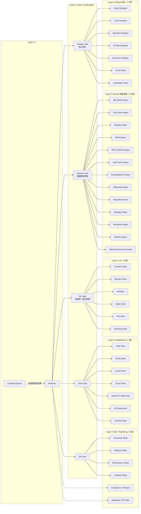
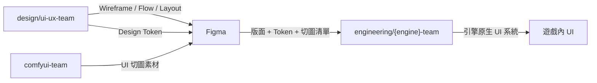
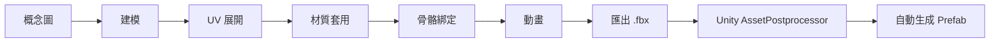
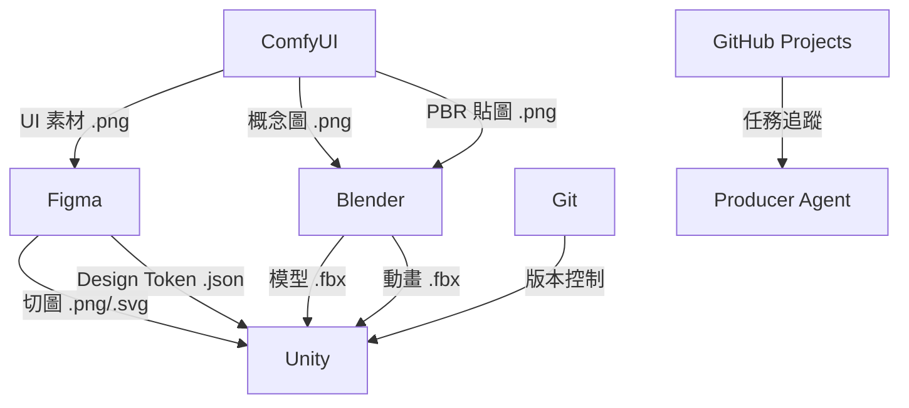
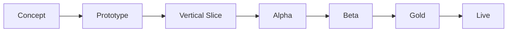
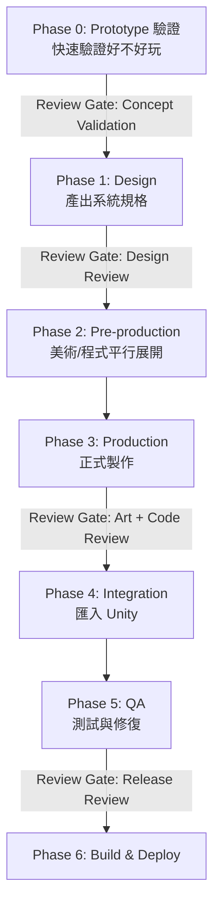
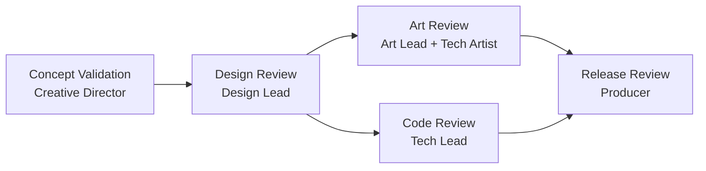
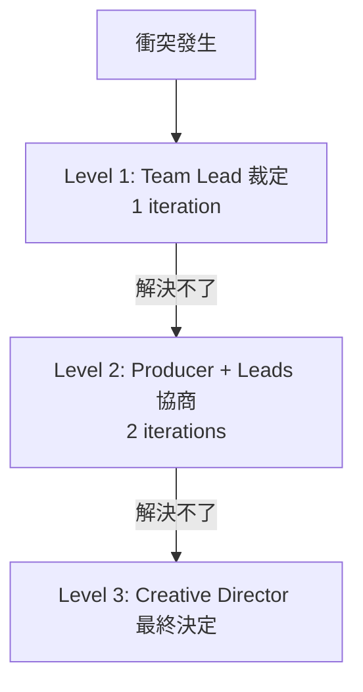
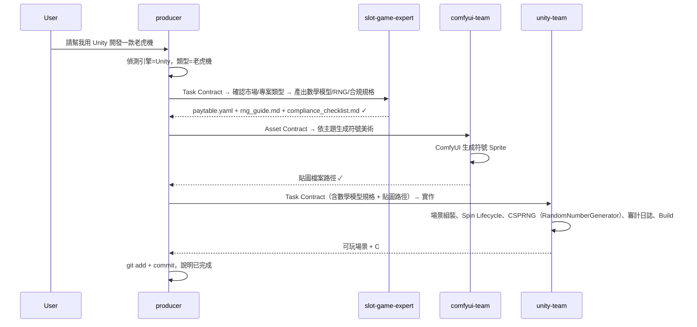

# 架構與流程

> 這是 [Kiro Multi-Agent Game Studio](../README.md) 的深入文件之一。完整索引見 README 的「深入文件（Reference）」。

## 完整系統架構圖

README 的「架構總覽」只放了簡化的 5-Layer 關係圖；這裡是**完整的 46 個 Agent 節點圖**，依 Layer 3 的職能再拆成 5 個子群組（避免單張圖過寬）。Design 端拆成 **Design Lead**（核心設計，7 個常駐職能）與 **Domain Lead**（13 類遊戲類型專家，按偵測到的類型按需啟用）兩條線，避免單一 Lead 管太多互斥角色。



> 46 個已建立節點分組：Layer 0-1（2）＋ Layer 2 Lead（5，含新建的 `Domain Lead`）＋ Layer 3 Design 核心（7）＋ Domain 類型專家（13）＋ Art（6）＋ Engineering（7）＋ QA/Publishing（6，含新建的 `Marketing / PR Team`）＝ 46。原願景清單裡的 `Audio Lead` 已刻意不獨立建立——`audio-team` 是唯一的音訊 Team，沒有需要協調的多個下屬，其一致性把關已併入 `Art Lead` 的職責（見上方 Layer 2 節點標注）。目前沒有仍為願景、尚未建立的 Layer 3 角色。MCP 連線狀態見 README「已串接的元件」表。

## 工具鏈與 MCP 整合


### 工具總覽與本專案現況

| 工具 | 用途 | 本專案狀態 | 若 MCP 不可用 |
|------|------|-----------|--------------|
| **Blender** | 3D 建模、動畫、渲染 | 已連線（`blender-mcp`） | Python Script + CLI |
| **ComfyUI** | 圖像生成（概念圖、貼圖、Sprite、UI Icon） | 已連線（[`artokun/comfyui-mcp`](https://github.com/artokun/comfyui-mcp)） | REST API |
| **Figma** | UI/UX 設計、版面、規格匯出、Design Token | 已連線（[官方 Figma MCP Server](https://developers.figma.com/docs/figma-mcp-server/)） | REST API |
| **Unity** | 遊戲引擎（場景組裝、Build） | 已連線（[CoplayDev/unity-mcp](https://github.com/CoplayDev/unity-mcp)） | CLI Batch Mode |
| **Godot** | 遊戲引擎（場景組裝、Export） | 已連線（[Coding-Solo/godot-mcp](https://github.com/Coding-Solo/godot-mcp)） | CLI headless export |
| **Unreal Engine** | 遊戲引擎（關卡組裝、Blueprint） | 已連線（local MCP from [flopperam/unreal-engine-mcp](https://github.com/flopperam/unreal-engine-mcp)） | UBT/UAT CLI |
| **Cocos Creator** | 遊戲引擎（場景組裝、跨平台/H5 Build） | 已連線（[DaxianLee/cocos-mcp-server](https://github.com/DaxianLee/cocos-mcp-server)） | CLI Build |
| **Git（本機）** | 版本控制（本機 repo commit/diff） | 未透過 MCP，Producer 用 shell 直接操作 | shell CLI |
| **GitHub Projects** | 任務追蹤、Sprint 看板（issues + Projects） | 已設定（`github`，原生 binary、**免 Docker**，需 PAT）；本地 `tasks.yaml` 為 fallback | GitHub MCP Server（REST/GraphQL） |

### 現有 MCP 配置（`.kiro/settings/mcp.json`，本專案實際內容）

```json
{
  "mcpServers": {
    "blender-mcp": {
      "command": "uv",
      "args": ["--directory", "/Users/dayho/Documents/blender_mcp/mcp", "run", "blender-mcp"],
      "disabled": false,
      "autoApprove": []
    },
    "comfyui": {
      "command": "npx",
      "args": ["-y", "comfyui-mcp"],
      "env": {
        "CIVITAI_API_TOKEN": "",
        "HUGGINGFACE_TOKEN": ""
      },
      "disabled": false,
      "autoApprove": []
    },
    "unity-mcp": {
      "url": "http://127.0.0.1:8080/mcp",
      "transport": "http",
      "disabled": false,
      "autoApprove": []
    },
    "godot-mcp": {
      "command": "npx",
      "args": ["-y", "@coding-solo/godot-mcp"],
      "env": {
        "GODOT_PATH": "/Applications/Godot.app/Contents/MacOS/Godot",
        "DEBUG": "false"
      },
      "disabled": false,
      "autoApprove": []
    },
    "unreal-engine": {
      "command": "uv",
      "args": [
        "--directory",
        "/ABSOLUTE/PATH/TO/unreal-engine-mcp/Python",
        "run",
        "unreal_mcp_server_advanced.py"
      ],
      "disabled": false,
      "autoApprove": []
    },
    "cocos-creator": {
      "url": "http://127.0.0.1:3000/mcp",
      "transport": "http",
      "disabled": false,
      "autoApprove": []
    },
    "figma": {
      "url": "https://mcp.figma.com/mcp",
      "transport": "http",
      "disabled": false,
      "autoApprove": []
    },
    "github": {
      "command": "github-mcp-server",
      "args": ["stdio"],
      "env": {
        "GITHUB_PERSONAL_ACCESS_TOKEN": ""
      },
      "disabled": false,
      "autoApprove": []
    }
  }
}
```

> `godot-mcp` 的 `GODOT_PATH`、`unreal-engine` 的路徑、`github` 的 `GITHUB_PERSONAL_ACCESS_TOKEN`，都需換成你實際環境的值，細節見對應的「XX MCP 整合詳解」章節。`figma` 用官方 Remote Server，首次使用需在 Kiro 完成 OAuth 授權，詳見「Figma MCP 整合詳解」。

### 敏感資訊提醒

> ⚠️ 設定 MCP Server 時，`GITHUB_PERSONAL_ACCESS_TOKEN`、`FIGMA_TOKEN` 等屬於敏感資訊，應使用環境變數或本機填入，**不要提交到版本控制**；`.gitignore` 已排除常見祕密檔。
>
> 分工：**本機** git（commit/diff）由 Producer 直接用 `shell` 操作，不另裝 MCP；**遠端** GitHub（issues/PR/Projects）走 `github`（官方 GitHub MCP Server）。

### 各工具的使用場景（願景設計，供未來擴充參考）

#### ComfyUI（圖像生成，已連線）

使用者（規劃）：concept-artist, texture-artist, ui-artist, vfx-artist

```yaml
comfyui_workflows:
  - name: "character_concept"
    params: [prompt, style, pose, background]
    output: 角色概念圖（正面、側面、背面）
  - name: "pbr_texture"
    params: [material_type, color_palette, tiling]
    output: Albedo + Normal + Roughness + AO
  - name: "sprite_sheet"
    params: [character_prompt, action, frame_count]
    output: Sprite Sheet PNG
  - name: "ui_icon_batch"
    params: [icon_descriptions, style, size]
    output: 一批 UI Icon
```

#### Figma（UI/UX 設計，已連線）

使用者：`design/ui-ux-team`（合併原願景 ux-designer + ui-artist）→ 產出 handoff 規格給對應引擎 Team 實作。完整說明見「Figma MCP 整合詳解」。



分工：`ui-ux-team` 用 Figma 管結構與精確控制（版面、流程、Design Token），`comfyui-team` 生成風格化像素素材（icon/按鈕/背景），引擎 Team 依 handoff 規格在原生 UI 系統（Unity UI Toolkit / Godot Theme / Unreal UMG / Cocos UI）實作。

#### Blender（3D，已連線）

使用者：`art/blender-team`（已建立），animator / technical-artist（規劃）



> 目前 `blender-team` 已實作到「建模 → UV 展開 → 匯出 .fbx」這段。骨骼綁定/動畫（animator）與 Unity 自動匯入（AssetPostprocessor）為願景，尚未實作。

產出的 `.fbx` 放入 Unity 專案 `Assets/Models/` 目錄，AssetPostprocessor（願景）應會自動：
- 設定 scale（0.01）、生成 Collider、自動 Rig
- 根據貼圖檔名自動對應材質（`_Albedo`, `_Normal`, `_Roughness`）
- 在指定路徑生成 Prefab，掛上對應的 Component

#### Unity（遊戲引擎，已連線）

使用者：unity-team（已建立）、ui-programmer, devops, level-designer（規劃中）

```yaml
asset_import:
  method: "File-based (AssetPostprocessor)"
  auto_settings:
    model: { scale: 0.01, generate_collider: true, rig_type: "auto" }
    texture: { max_size: "platform_dependent", compression: "auto" }
    audio: { load_type: "streaming_for_bgm, decompress_for_sfx" }

code_standard:
  namespace: "GameForge.{Module}"
  naming: "PascalCase public, _camelCase private"
  pattern: "Composition over Inheritance, ScriptableObject data-driven"

build:
  test: "Unity -batchmode -runTests -testResults results.xml"
  build: "Unity -batchmode -executeMethod BuildScript.Build"
```

> `unity-team.md` 已將上述 `code_standard` 寫入其職責章節。其場景搭建、資產批次設定、Build、效能分析、架構檢查、平台相容性檢查等工作流程細節，詳見「Unity MCP 整合詳解」與 `unity-team.md` 內文。

#### 工具之間的資料流（完整願景）



---

## 開發流程


本框架有兩個層級的流程，不要搞混：

1. **遊戲生命週期**（整個專案的大階段）
2. **功能開發流程**（單一功能從設計到交付的步驟）

### 遊戲生命週期（專案級，願景）



| 里程碑 | 目標 | 哪些 Agent 活躍（願景） | 原則 |
|--------|------|----------------|------|
| **Concept** | 確認遊戲方向 | creative-director, game-designer, narrative-designer | 方向確認 |
| **Prototype** | 驗證核心玩法是否好玩 | game-designer, unity-team | 速度優先，品質不重要 |
| **Vertical Slice** | 一小段最終品質體驗 | 全員 | 品質代表最終水準 |
| **Alpha** | 所有核心功能完成 | 全員 | 功能完整性優先 |
| **Beta** | 所有內容完成，除錯 | qa-lead, programmer, art-lead | 穩定性優先，凍結功能 |
| **Gold** | 可出貨版本 | qa-lead, devops | 通過審核 |
| **Live** | 上線營運 | producer, devops, balance-tester | 數據驅動迭代 |

> 本專案目前處於 **Concept 之前的「工具鏈搭建」階段**：先確認 Agent + Steering + MCP 三層架構能否運作，還沒有正式進入任何一款遊戲的 Concept 階段。

### 功能開發流程（單一功能級，願景）

每個功能（一把劍、一個戰鬥系統、一個 UI 面板）都走這個流程：



| Phase | 做什麼 | 誰做（願景） | 本專案現況 |
|-------|--------|------|-----------|
| 0: Prototype | 用最低成本驗證功能是否值得做 | unity-team（placeholder art） | 可用（若已有目標專案） |
| 1: Design | 產出系統規格、Wireframe、對話腳本 | game-designer, ux-designer, narrative-designer | 僅 game-designer 可用 |
| 2: Pre-production | 概念圖、UI Layout、核心邏輯（平行） | concept-artist, ui-artist, programmer | 僅程式部分可用（無概念圖能力） |
| 3: Production | PBR 貼圖、3D 模型、動畫、完整 C# | texture-artist, blender-team, animator, programmer | 3D 模型 + 程式可用，貼圖/動畫不可用 |
| 4: Integration | 匯入 Unity、生成 Prefab、組裝場景 | devops / unity import | `unity-team` 可用（透過 `unity-mcp`） |
| 5: QA | 功能/數值/效能測試、修 Bug（max 3 次） | functional-tester, balance-tester, performance-tester | 僅 functional-tester 可用 |
| 6: Build | 打包目標平台、CI/CD | devops | 尚未建立對應 Team |

### 兩個流程的關係

```
遊戲生命週期：  Concept ──── Prototype ──── Vertical Slice ──── Alpha ─── Beta ─── Gold
                                  │              │                  │
功能開發流程：              功能 A 走 Phase 0-6    功能 B 走 Phase 0-6   功能 C 修 Bug
```

> 生命週期是「整個專案在哪個大階段」，功能開發流程是「單一功能怎麼從 0 做到完」。
> 一個里程碑內會有多個功能同時各自走自己的 Phase。

---

## Agent 間通訊協定


Agent 之間不是隨意對話，而是透過標準化的 **Contract** 傳遞需求和交付物。這套機制已實作於 `.kiro/steering/global/contracts.md`（`inclusion: always`，所有 Agent 對話都會自動載入）。

### 檔案共享與交接（精簡協作規範，已實作）

因為 subagent 彼此隔離、沒有即時對話，agent 之間的「溝通」一律**透過讀寫共享檔案 + Producer 轉述**。46 個 agent 全都有 `read` 權限，可讀 repo 內任何檔案，重點只在於「約定去哪讀、交付後寫什麼」：

- **共享位置**（大家都讀得到）：`.kiro/steering/project/`（設計真相 gdd/style-guide）、`.kiro/steering/global/`（規範）、`.kiro/state/`（tasks.yaml + `handoffs/`）、`shared/`（Agent 檔案共享中轉站，各 Team 交付物落地處；命名避開 `assets` 以免與引擎內部 `Assets/`、`db://assets/` 混淆）
- **規則**：動工前先讀「上游的 Delivery Manifest + gdd/style-guide + Contract」；交付後寫一則 **Delivery Manifest**（交付回執）到 `handoffs/<contract_id>.delivery.yaml`，讓下游（含各引擎 team）讀得到你產出了什麼、在哪、有什麼已知問題；blocker/提問一句話記在 tasks.yaml 或 manifest 的 `notes`，由 Producer 轉述；紀錄 append-only。
- **為何這樣（業界對應）**：Contract = 工單（請求），Delivery Manifest = PR description + Definition of Done（回執）；兩者一來一回把交接閉環。完整格式見 `contracts.md`「檔案共享與交接」。

> 刻意精簡：不另建 message bus / ADR 目錄，決策直接記進 `gdd.md`「變更紀錄」。核心只有「共享位置 + Delivery Manifest」，確保所有引擎都讀得到彼此的檔案與資料。

### Asset Contract（美術/音效資產用，已實作，`blender-team` 會讀取此格式）

```yaml
asset_request:
  id: "weapon_sword_01"
  type: "3d_model"          # 3d_model | texture | sprite | audio | prefab
  spec:
    poly_budget: 5000
    texture_size: 1024
    style: "stylized_fantasy"
    reference_images: ["ref_sword_01.png"]
  engine_import:
    engine: "Unity"          # Unity | Godot | Unreal | Cocos Creator
    scale: 0.01
    generate_collider: true
    prefab_path: "Assets/Prefabs/Weapons/"
  metadata:
    priority: "high"
    assigned_to: "art/blender-team"
    depends_on: ["concept_art_sword_01"]
    deadline: "sprint_3"
  cost_budget:
    max_comfyui_generations: 10
    max_blender_operations: 20
```

### Task Contract（程式/設計任務用，已實作，`{engine}-team` / `functional-tester` 會讀取此格式）

```yaml
task:
  id: "TASK-042"
  title: "實作戰鬥傷害計算"
  assigned_to: "engineering/unity-team"   # 依目標引擎：unity-team | godot-team | unreal-team | cocos-team
  engine: "Unity"                          # Unity | Godot | Unreal | Cocos Creator
  input:
    - design_spec: "docs/combat_system_spec.yaml"
    - dependencies: ["health_system", "buff_system"]
  output:
    - code: "Assets/Scripts/Combat/DamageCalculator.cs"
    - tests: "Assets/Tests/Combat/DamageCalculatorTests.cs"
  acceptance_criteria:
    - "傷害公式符合 design_spec"
    - "所有 Unit Test 通過"
    - "處理 edge case（0 防禦、無敵狀態）"
  review_gate: "code_review"
  cost_budget:
    max_llm_tokens: 100000
```

### Contract 的流動方式

**本專案現況**（Kiro 原生 subagent 委派，兩層）：
```
User → Producer（建立 Contract，標明轉發對象）
      → Use the "<lead-name>" subagent（Kiro 啟動 Team Lead）
      → Lead 用 Use the "<specialist-name>" subagent 轉發給 Specialist
      → Specialist 執行並回傳 → Lead 做 review → 回傳給 Producer
      → 使用者確認交付
```

跟原本設想的「Specialist 先執行、Lead 事後補審查」略有不同：現在 Lead 是**委派路徑上的中介**（先轉發、收回產出、當場審查），而不是事後才介入。**⚠️ 此兩層委派模型尚未在真實 Kiro 環境完整驗證**（見 `contracts.md`「已知邊界」），若巢狀委派失敗，退化為 Producer 直接委派 Specialist（跳過 Lead 這一層 review）。

---

## 治理機制


> 本章節全部為**願景設計**。Solo Dev 規模（目前配置）下，README 原文建議治理機制為「不啟用」，因此以下機制目前均未實作，僅供未來擴充到 Small Team / Studio 規模時參考。

### Review Gate（品質關卡，尚未實作）



| Gate | 誰審 | 看什麼 |
|------|------|--------|
| Concept Validation | Creative Director | 符合願景嗎？核心循環有趣嗎？ |
| Design Review | Design Lead | 系統有矛盾嗎？數值合理嗎？ |
| Art Review | Art Lead + Technical Artist | 風格一致？面數/貼圖合規？效能OK？ |
| Code Review | Tech Lead | 命名規範？效能？測試覆蓋？ |
| Release Review | Producer | 無 Critical Bug？效能達標？ |

### 衝突升級（尚未實作）



常見衝突：美術效果超出效能預算 → Technical Artist 評估優化方案 → 若無法優化 → Producer 裁決。

### 成本控管 ⚠️ 僅有文字提醒，無實際監控

```yaml
budget:
  per_sprint:
    design: 15%
    art_generation: 35%     # ComfyUI 最耗資源
    programming: 25%
    qa: 15%
    other: 10%
  alerts:
    warning: 80%
    hard_stop: 100%
  overrun_action: "暫停 → Producer 決定追加/降級/人工接手"
```

> `producer.md` 目前只會在對話中「提醒」這個預算分配比例，沒有任何 token 用量的自動追蹤或強制暫停機制。

### 自動化等級（願景）

| Level | 描述 | 適用 |
|-------|------|------|
| 0 | Agent 建議 → 人工執行 | 平台審核提交 |
| 1 | Agent 執行 → 人工 Review | 3D 建模、程式碼、數值平衡 |
| 2 | Agent 執行 → 自動 Review → 人看例外 | 概念圖生成、Build |
| 3 | 全自動 | Unit Test、Icon 批量生成 |

> 本專案目前所有已建立的 Agent 實際運作在 **Level 1**：Agent 執行，人工（你）Review 每一步輸出。Producer 已採用 Kiro 原生 subagent 委派 Team Lead（Lead 再轉發給對應 Specialist）串接整條 Pipeline，但每一步產出仍由你把關；Level 2/3 的全自動情境尚未觸及。

### 版本控制

```yaml
version_control:
  tool: "Git + Git LFS"
  lfs_tracked: ["*.fbx", "*.glb", "*.png", "*.psd", "*.wav", "*.mp3"]
  branching:
    main: "可出貨版本"
    develop: "開發整合"
    feature/*: "功能開發"
    art/*: "美術資產"
  commit_format: "[team][type] description"
```

> 本專案目前沒有設定 Git LFS，且尚未產出任何 `.fbx` 等二進位資產。若之後開始大量產出 3D 模型/貼圖，建議在提交前先設定 LFS，避免 repo 體積暴增。

---

## 端到端 Demo：從「請幫我用 Unity 開發一款老虎機」到可玩原型


這是本文件開頭的核心情境：「請幫我用 Unity 開發一款老虎機」。這個範例同時展示**引擎偵測**（Unity）與**遊戲類型偵測**（老虎機 → 插入 Slot Game Expert）兩個機制。



**若換成「請幫我用 Cocos Creator 開發一款老虎機」**，流程完全相同，唯一差異是最後一步 Producer 會分派給 `engineering/cocos-team`（透過 `cocos-creator` MCP），且 Slot Game Expert 建議的 CSPRNG 會是 `crypto.getRandomValues()` 而非 C# 的 `RandomNumberGenerator`。這就是引擎偵測機制的核心價值：**同一套 Pipeline 邏輯，換一個關鍵字就能切換到完全不同的引擎與程式語言**。

**本專案目前能實測到哪一步：**

| Step | 動作 | 備註 |
|------|------|------|
| 1 | Producer 收到需求，偵測引擎與遊戲類型 | 可測試 |
| 2 | Producer → `design-lead` → 轉發 `slot-game-expert` 出數學模型/RNG/合規規格 | 兩層委派尚待實測；退化時 Producer 直接委派 `slot-game-expert` |
| 3 | Producer → `art-lead` → 轉發 `comfyui-team` 生成符號美術 | 兩層委派尚待實測；退化時 Producer 直接委派 `comfyui-team`（透過 `comfyui` / `artokun/comfyui-mcp`） |
| 4 | Producer → `tech-lead` → 轉發 `unity-team`（或 godot/unreal/cocos-team）組裝場景 + 寫遊戲邏輯 | 兩層委派尚待實測；退化時 Producer 直接委派對應引擎 Team（依引擎透過對應 MCP） |
| 5 | Producer 執行 git commit | 可測試 |

**實際操作流程：**
1. 跟 `orchestration/producer` 說「請幫我用 XX 開發一款老虎機」（或先不指定引擎，看它是否會問你）
2. Producer 偵測引擎與類型，拆解 Pipeline，產出 Contract，指示你切到對應 Agent
3. 切到 `design/slot-game-expert` 貼上 Contract，確認引擎/市場/專案類型，拿到數學模型規格
4. 切到 `art/comfyui-team` 貼上 Asset Contract，生成符號美術後回報路徑
5. 切到對應的引擎 Team（`engineering/unity-team` / `godot-team` / `unreal-team` / `cocos-team`）貼上 Task Contract，組裝場景、寫遊戲邏輯
6. 回到 `orchestration/producer`，它會列出目前變更，確認後執行 git commit

> 一般（非老虎機）需求的流程範例，見上方「目前專案實際狀態 → 端到端流程範例」。

---

## 漸進式擴展指南


| 規模 | Agent 數 | 需要工具 | 月成本 | 啟用治理機制 | 本專案現況 |
|------|---------|----------|--------|-------------|-----------|
| **Solo Dev**（1 人） | 10 | ComfyUI, Figma, 引擎（任一）, Git | $50-150 | 不啟用 | **目前配置**（Blender / ComfyUI / Unity / Godot / Unreal / Cocos / Figma / GitHub 皆走 MCP；本機 Git 用 shell） |
| **Small Team**（2-4 人） | 15-18 | + GitHub Projects | $200-500 | 基本 Review Gate | 規劃中 |
| **Studio**（5-10 人） | 30+ | 全套 + 雲端 GPU | $500-2000 | 完整治理 | 規劃中 |

### 啟用清單（共 46 個）

> 下方以「資料夾/檔名」列出檔案位置；實際委派 / 呼叫時用扁平 `name`（例如 `producer`、`blender-team`），不加資料夾前綴。

```
orchestration/creative-director, orchestration/producer,
design/design-lead, design/domain-lead, design/game-designer,
design/slot-game-expert, design/fish-game-expert, design/shooter-expert,
design/mmo-expert, design/rpg-systems-expert, design/card-game-expert,
design/puzzle-match3-expert, design/platformer-expert, design/roguelike-expert,
design/strategy-expert, design/simulation-expert, design/rhythm-expert,
design/narrative-adventure-expert, design/level-designer, design/narrative-designer, design/combat-designer,
design/ui-ux-team, design/economy-designer, design/localization-team,
art/art-lead, art/comfyui-team, art/blender-team, art/animator, art/audio-team, art/vfx-artist, art/technical-artist,
engineering/tech-lead, engineering/unity-team, engineering/godot-team,
engineering/unreal-team, engineering/cocos-team, engineering/systems-programmer, engineering/ui-programmer, engineering/devops-team,
qa/qa-lead, qa/functional-tester, qa/balance-tester, qa/performance-tester, qa/usability-tester,
publishing/compliance-release, publishing/marketing-team
```

> 注意：與原願景清單相比，本專案用 `art/comfyui-team`、`art/blender-team` 取代了原願景中拆得更細的 `concept-artist`/`texture-artist` 角色，並將原本單一的 `gameplay-programmer` 拆成 4 個引擎專屬 Team（`unity-team`/`godot-team`/`unreal-team`/`cocos-team`），因為引擎選擇會決定程式語言、API、Editor 操作方式，拆開才能各自套用對應的最佳實踐（例如 Godot 的靜態型別 GDScript 規範、Unreal 的 `ce` command 已知 crash 問題）。另外新增 `slot-game-expert` 這個特殊遊戲類型的 Domain Expert，以及參考《The Game Production Handbook》Ch24 新增 `publishing/marketing-team`（商店文案/預告片腳本/新聞稿/社群草稿，純文字產出，不執行實際發布/投放）；原願景的 `Audio Lead` 刻意不獨立建立，其一致性把關已併入 `art/art-lead`（見上方「完整系統架構圖」說明）。

### Small Team 追加（下一步可考慮的方向）

前提：需先接上 GitHub Projects（官方 GitHub MCP Server）（Figma MCP 已在前階段連線；原願景的 `ui-artist` 已併入 `design/ui-ux-team`；原願景的 `Audio Lead` 已併入 `art/art-lead`；`art/animator`、`art/audio-team`、`art/vfx-artist`、`qa/balance-tester`、`qa/usability-tester`、`engineering/devops-team`、`engineering/systems-programmer`、`engineering/ui-programmer`、`design/economy-designer`、`design/localization-team`、`design/level-designer`、`design/narrative-designer`、`design/combat-designer`、`publishing/compliance-release`、`publishing/marketing-team` 已於本階段建立）。

### Studio 追加（遠期）

目前 Studio 規模規劃的角色皆已建立完成，暫無追加項目。

---
